<h1 align="center">Strike</h1>

<p align="center">
  <b>Weekly options vaults for Robinhood Chain stock tokens, paid in USDG.</b><br>
  An AI agent proposes each week's strike. The contract checks it against the vault's immutable mandate, and a proposal that breaks the mandate is rejected and the agent's bond slashed to depositors.
</p>

<p align="center">
  <a href="https://github.com/Prashant-thakur77/Strike/actions/workflows/ci.yml"></a>
  <a href="https://github.com/Prashant-thakur77/Strike/actions/workflows/codeql.yml"></a>
  <a href="https://github.com/Prashant-thakur77/Strike/actions/workflows/gitleaks.yml"></a>
  <a href="#coverage"></a>
  <a href="https://github.com/Prashant-thakur77/Strike/tags"></a>
  <a href="https://www.npmjs.com/package/@strike-options/sdk"></a>
  <a href="https://www.npmjs.com/package/@strike-options/mcp"></a>
  <a href="LICENSE"></a>
  <br>
  <a href="#robinhood-chain-testnet-46630"></a>
  <a href="#arbitrum-sepolia-421614"></a>
  <a href="https://strike-options.vercel.app"></a>
  
</p>

<table align="center">
  <tr>
    <td align="right"><sub><b>Contracts</b></sub></td>
    <td>
      <a href="contracts/foundry.toml"></a>
      <a href="contracts/"></a>
      <a href="docs/decisions.md"></a>
      <a href="contracts/src/vaults/StrikeVault.sol"></a>
      <a href="contracts/src/tokens/OptionToken.sol"></a>
      <a href="contracts/src/interfaces/IStockToken.sol"></a>
      <a href="contracts/src/agents/AgentRegistry.sol"></a>
      <a href="https://github.com/Prashant-thakur77/Strike/blob/v3-contracts/contracts/src/agents/AgentRegistry.sol"></a>
      <a href="contracts/src/vaults/VaultFactory.sol"></a>
      <a href="docs/security/formal-verification.md"></a>
      <a href="docs/security/slither.md"></a>
    </td>
  </tr>
  <tr>
    <td align="right"><sub><b>Rust and Stylus</b></sub></td>
    <td>
      <a href="stylus/pricer/"></a>
      <a href="stylus/pricer/src/math.rs"></a>
      <a href="stylus/pricer/Cargo.toml"></a>
      <a href="docs/DEPLOYMENTS.md#stylus-pricer-verification"></a>
      <a href="docs/gas.md"></a>
      <a href="docs/DEPLOYMENTS.md#stylus-pricer-verification"></a>
    </td>
  </tr>
  <tr>
    <td align="right"><sub><b>Chains and assets</b></sub></td>
    <td>
      <a href="docs/DEPLOYMENTS.md"></a>
      <a href="docs/testnet-epochs/2026-09-30-arbitrum-sepolia.md"></a>
      <a href="contracts/src/libraries/SafeStockFeed.sol"></a>
      <a href="contracts/script/Deploy.s.sol"></a>
    </td>
  </tr>
  <tr>
    <td align="right"><sub><b>Agents and AI</b></sub></td>
    <td>
      <a href="mcp/"></a>
      <a href="agents/example/src/claudeCode.ts"></a>
      <a href="agents/example/src/llm.ts"></a>
      <a href="docs/STRIKE_SKILL.md"></a>
    </td>
  </tr>
  <tr>
    <td align="right"><sub><b>App and SDK</b></sub></td>
    <td>
      <a href="sdk/"></a>
      <a href="app/"></a>
      <a href="app/"></a>
      <a href="sdk/src/client.ts"></a>
      <a href="app/src/lib/wagmi.ts"></a>
      <a href="app/e2e"></a>
      <a href="sdk/test"></a>
    </td>
  </tr>
  <tr>
    <td align="right"><sub><b>Infra</b></sub></td>
    <td>
      <a href="subgraph/"></a>
      <a href="https://t.me/strike_options_bot"></a>
      <a href="app/vercel.json"></a>
      <a href="app/src/app/api/rpc/%5BchainId%5D/route.ts"></a>
      <a href=".github/workflows"></a>
      <a href="pnpm-workspace.yaml"></a>
      <a href="research/backtest.py"></a>
      <a href="video/three.html"></a>
    </td>
  </tr>
</table>

<p align="center">
  <a href="docs/JUDGES.md"><b>Judge's tour</b></a> ·
  <a href="https://strike-options.vercel.app"><b>Live app</b></a> ·
  <a href="docs/media/strike-demo.mp4"><b>Demo video</b></a> (5:59, <a href="docs/media/strike-demo-silent.mp4">captions only</a>) ·
  <a href="docs/media/strike-pitch.mp4"><b>Pitch</b></a> (2:12) ·
  <a href="docs/README.md"><b>Docs</b></a> ·
  <a href="docs/DEPLOYMENTS.md"><b>Deployments</b></a> ·
  <a href="docs/security/review-2026-09-29.md"><b>Security review</b></a> ·
  <a href="CHANGELOG.md"><b>Changelog</b></a>
</p>

<p align="center">
  <a href="docs/media/strike-demo.mp4"></a><br>
  <sub>Click for the narrated walkthrough (5:59) (<a href="docs/submission/demo-script.md#chapters">chapters</a>), or watch the <a href="docs/media/strike-demo-silent.mp4">captioned cut without voice</a>.</sub>
</p>

> **Status on 3 October: live on Robinhood Chain testnet (v2 and v3 side by side) and on Arbitrum Sepolia (v3), unaudited.** The three covered-call series of 2 October expired at 20:00 UTC and wait for their settlement price, the first mainnet TSLA print at or after expiry, expected after NYSE opens on Monday 5 October; agent #2's put runs to 9 October. Addresses and transactions: [Live on two chains](#live-on-two-chains). Built for the Arbitrum Open House Singapore buildathon; we are building Strike as a company, starting on these testnets ([plan](#building-strike-as-a-company)). Do not use real funds; any mainnet vault will be capped until an external audit ([milestone 3](docs/MILESTONES.md#3-external-audit-then-a-capped-mainnet-vault-weeks-618-17000), [Not built yet](#not-built-yet)).

## Contents

| Start here                                                                                                                                                                                                                                                                                               | How it works                                                                                                                                                                                                                                                                                                     | Evidence                                                                                                                                                                                                                                                                                                                                             | Use it                                                                                                                                                                                                                                 |
| -------------------------------------------------------------------------------------------------------------------------------------------------------------------------------------------------------------------------------------------------------------------------------------------------------- | ---------------------------------------------------------------------------------------------------------------------------------------------------------------------------------------------------------------------------------------------------------------------------------------------------------------- | ---------------------------------------------------------------------------------------------------------------------------------------------------------------------------------------------------------------------------------------------------------------------------------------------------------------------------------------------------- | -------------------------------------------------------------------------------------------------------------------------------------------------------------------------------------------------------------------------------------- |
| [Strike in 60 seconds](#strike-in-60-seconds)<br>[Live on two chains](#live-on-two-chains)<br>[Building Strike as a company](#building-strike-as-a-company)<br>[What works, what does not yet, what we cut](#what-works-what-does-not-yet-what-we-cut)<br>[Not built yet](#not-built-yet)<br>[Why](#why) | [How it works](#how-it-works)<br>[One epoch, step by step](#one-epoch-step-by-step)<br>[Architecture](#architecture)<br>[Tech used, and where](#tech-used-and-where)<br>[Sponsor technology](#sponsor-technology)<br>[Why only here](#why-only-here-robinhood-chain-and-arbitrum)<br>[Screenshots](#screenshots) | [Trust model](#trust-model)<br>[Evidence in numbers](#evidence-in-numbers)<br>[Claims and their tests](#claims-and-the-tests-that-check-them)<br>[The live epochs](#the-live-epochs)<br>[Backtest](#backtest)<br>[How Strike compares](#how-strike-compares)<br>[Competition](#competition)<br>[Versions and deployments](#versions-and-deployments) | [Try it](#try-it)<br>[Install from npm](#install-from-npm)<br>[Run your own agent](#run-your-own-agent)<br>[Quickstart](#quickstart)<br>[Repository](#repository)<br>[Contributing, security, license](#contributing-security-license) |

## Strike in 60 seconds

|                        |                                                                                                                                                                                                                                                                                                                                                                                                                                                                                                                                                                                                                                                                                                                                                                                                                                                                                                                                  |
| ---------------------- | -------------------------------------------------------------------------------------------------------------------------------------------------------------------------------------------------------------------------------------------------------------------------------------------------------------------------------------------------------------------------------------------------------------------------------------------------------------------------------------------------------------------------------------------------------------------------------------------------------------------------------------------------------------------------------------------------------------------------------------------------------------------------------------------------------------------------------------------------------------------------------------------------------------------------------- |
| The problem            | A tokenized TSLA on Robinhood Chain earns the stock's return and nothing else. Selling weekly options on it is the usual way to earn more, but someone has to pick the strike every week, and an agent that holds the keys to a vault can drain it. The tokens also have traps a generic protocol misses: a dividend multiplier already in the price, feeds that freeze on weekends, two pause flags ([Why](#why)).                                                                                                                                                                                                                                                                                                                                                                                                                                                                                                              |
| What Strike does       | Covered-call and cash-secured-put vaults (ERC-4626) that sell one option series a week and pay the premium in USDG. A bonded agent proposes the strike; the contract checks it against the vault's immutable mandate (delta band, premium, yield, size, tenor), solves and prices it in Rust on Stylus, and slashes 10 USDG of the agent's bond to depositors if it breaks the rules ([How it works](#how-it-works), [`MandateGuard`](contracts/src/libraries/MandateGuard.sol)).                                                                                                                                                                                                                                                                                                                                                                                                                                                |
| Who uses it            | Depositors who hold a stock token (covered call) or USDG (put). Agents, any wallet with a 50 USDG bond and no allow-list ([Run your own agent](#run-your-own-agent)), who propose through an [MCP server](mcp/). Buyers who want upside or a hedge, priced at oracle spot. Other Robinhood Chain protocols, through the [`SafeStockFeed`](docs/safestockfeed.md) library and its conformance suite.                                                                                                                                                                                                                                                                                                                                                                                                                                                                                                                              |
| Where it's live        | Robinhood Chain testnet (46630): v2 and v3 side by side. Arbitrum Sepolia (421614): v3. Each ran a live epoch; their call series expired on 2 October and wait for the settlement print, and agent #2's put on v2 runs to 9 October. The app at [strike-options.vercel.app](https://strike-options.vercel.app) reads both, plus a mainnet stock-token monitor. Addresses: [Live on two chains](#live-on-two-chains).                                                                                                                                                                                                                                                                                                                                                                                                                                                                                                             |
| The trade-off          | Covered calls give up upside for income. Over 403 weeks of backtest (2019 to 2026) the covered-call vault returned less than holding on every ticker (TSLA 23.1% a year against 44.0%) and cut volatility by 25 to 46%. The put vault earned less than lending USDG on most tickers; what it pays for is buying a stock token below today's price ([Backtest](#backtest), [How Strike compares](#how-strike-compares)).                                                                                                                                                                                                                                                                                                                                                                                                                                                                                                          |
| What's proven on-chain | Three agent-run epochs, each with an accepted proposal, an out-of-mandate proposal rejected with 10 USDG slashed, and a buyer. On v2 the slash was paid into the put vault and withdrawn by its depositor. In both v3 epochs (Arbitrum Sepolia and Robinhood Chain), Claude planned the accepted proposal and both decision records are anchored in a `DecisionLog`; on both chains the rejection also posted −10 feedback (tag `strike.mandate.rejection`) on the official ERC-8004 Reputation Registry, to identity #114 on Robinhood Chain and #253 on Arbitrum Sepolia. Agent #1 holds ERC-8004 identities #114 and #253. Agent #2, which joined from a fresh wallet, had its first proposal accepted on 2 October. The active pricer on both chains is the Stylus program, checked equal to Solidity on-chain ([transactions](#live-on-two-chains), [Stylus verification](docs/DEPLOYMENTS.md#stylus-pricer-verification)). |
| What's not done        | None of the three epochs has settled: the series expired on Friday 2 October at 20:00 UTC, after the last mainnet TSLA print of the day (19:55:31 UTC), and settle at the first print after expiry. No external audit, no mainnet vault, no outside users. Testnet prices come from a keeper-filled `MirrorFeed`. The app, SDK and MCP still default to v2 on Robinhood Chain. Details: [Not yet](#not-yet) and [Not built yet](#not-built-yet).                                                                                                                                                                                                                                                                                                                                                                                                                                                                                 |

## Live on two chains

The same contracts, built from one source, run on two Arbitrum chains. Every address below links to the explorer; [docs/DEPLOYMENTS.md](docs/DEPLOYMENTS.md) has the creation transaction, deploy block and verification status of each one and the commands to re-check them.

### Robinhood Chain testnet (46630)

v2 is the app's default and ran the first live epoch on 29 September; the app shows the vaults of both, each tagged with its version. v3 (the [`v3-contracts`](https://github.com/Prashant-thakur77/Strike/tree/v3-contracts) branch: fee high-water mark, EIP-712 signer consent, the Stylus risk engine) was deployed next to it on 30 September, shares its `MarketCalendar` and `MirrorFeed`s, and ran its own epoch on 1 October.

| Contract                        | v2 (block 125,880,607)                                                                                                                                                                                                             | v3 (block 126,713,718)                                                                                                                    | Verification                                          |
| ------------------------------- | ---------------------------------------------------------------------------------------------------------------------------------------------------------------------------------------------------------------------------------- | ----------------------------------------------------------------------------------------------------------------------------------------- | ----------------------------------------------------- |
| EpochManager                    | [`0x5A3b…9C99`](https://explorer.testnet.chain.robinhood.com/address/0x5A3b58DF27e4DD5E0fa6493D90fF653e0E199C99)                                                                                                                   | [`0x256D…929F`](https://explorer.testnet.chain.robinhood.com/address/0x256D4546486368dCb23E94758b4cb500c215929F)                          | Blockscout, fully verified, solc 0.8.30               |
| VaultFactory                    | [`0x5665…6beC`](https://explorer.testnet.chain.robinhood.com/address/0x5665E02878fA592513C1633af2F07b08cF606beC)                                                                                                                   | [`0x97ab…215e`](https://explorer.testnet.chain.robinhood.com/address/0x97ab9ed707758Fc23b4e59132d97Ab7cb9fb215e)                          | Blockscout, fully verified                            |
| AgentRegistry                   | [`0xE5b7…8D32`](https://explorer.testnet.chain.robinhood.com/address/0xE5b76249041e59C74Ee317fC2729f26249618D32)                                                                                                                   | [`0x1c42…052f`](https://explorer.testnet.chain.robinhood.com/address/0x1c42740145B245b2f894d8e989ca29dfd9A9052f)                          | Blockscout, fully verified                            |
| StockOracle (SafeStockFeed)     | [`0x7bb3…aB89`](https://explorer.testnet.chain.robinhood.com/address/0x7bb3cAb211E7Ce51e37693E0155C77f477F8aB89)                                                                                                                   | [`0x5BCd…989A`](https://explorer.testnet.chain.robinhood.com/address/0x5BCdBFaB940BFAEF821392d7f58c670c2064989A)                          | Blockscout, fully verified                            |
| Stylus pricer (Rust/WASM)       | [`0x60e9…d04c`](https://explorer.testnet.chain.robinhood.com/address/0x60e947b8d2c2c34b95d88d02f0a06aefb6ccd04c)                                                                                                                   | [`0x6115…a4ec`](https://explorer.testnet.chain.robinhood.com/address/0x61158d98c6c2b7ccb22755a098d0da2bbcf2a4ec) (pricer and risk engine) | `cargo stylus verify`: Verification successful (both) |
| OptionToken (ERC-1155)          | [`0x5570…c9DB`](https://explorer.testnet.chain.robinhood.com/address/0x557060266F4aE09ae723541AC8E7E27A99B0c9DB)                                                                                                                   | [`0xfbeb…46B6`](https://explorer.testnet.chain.robinhood.com/address/0xfbeb6cf8350C182c7895165A8Fdd3D9884aB46B6)                          | Blockscout, fully verified                            |
| FeeManager                      | [`0x6b23…B621`](https://explorer.testnet.chain.robinhood.com/address/0x6b23819bC44EEbE1BD004208c0F00f2ed002B621)                                                                                                                   | [`0x8DBE…2Fa7`](https://explorer.testnet.chain.robinhood.com/address/0x8DBE22eAa3CEFC367C435ce2b6F779fabe7D2Fa7) (high-water mark)        | Blockscout, fully verified                            |
| DecisionLog                     | [`0xbF94…5D93`](https://explorer.testnet.chain.robinhood.com/address/0xbF94f54fd0258ac59e2f54B70754dFAfFd245D93)                                                                                                                   | [`0xa981…03a4`](https://explorer.testnet.chain.robinhood.com/address/0xa98106db53519F8cfE4D7C56B34D4Fe0460403a4)                          | Blockscout, verified                                  |
| RiskLens                        | none in v2                                                                                                                                                                                                                         | [`0xFDb8…Cc6D`](https://explorer.testnet.chain.robinhood.com/address/0xFDb8Ba33f4aAF1A699f1D5877E8ee5b6eDeDCc6D)                          | Blockscout, fully verified                            |
| TSLA covered-call vault         | [`0xADFF…1D4e`](https://explorer.testnet.chain.robinhood.com/address/0xADFF7900dbe01E8170a750AB88e1f4eA8D9D1D4e)                                                                                                                   | [`0x478E…6285`](https://explorer.testnet.chain.robinhood.com/address/0x478E7BC3C3aB07fdd104e4765F178977adEe6285)                          | EIP-1167 clone of the verified `StrikeVault`          |
| TSLA cash-secured-put vault     | [`0xE33E…67d7`](https://explorer.testnet.chain.robinhood.com/address/0xE33EAD75Df1aF35cBA330f1fc7636926e31c67d7)                                                                                                                   | [`0x1bc7…3690`](https://explorer.testnet.chain.robinhood.com/address/0x1bc73c1B28F520E57982FAe6127477190FA53690)                          | EIP-1167 clone of the verified `StrikeVault`          |
| MarketCalendar, TSLA MirrorFeed | [`0x214d…95F4`](https://explorer.testnet.chain.robinhood.com/address/0x214d21F4fCA2226091AF009B9F1BF1D3C63f95F4), [`0x5476…1230`](https://explorer.testnet.chain.robinhood.com/address/0x5476cb08769f406dE95F6171AcC1F5FE88431230) | shared with v2                                                                                                                            | Blockscout, fully verified                            |
| USDG (Paxos), TSLA token        | [`0x7E95…802F`](https://explorer.testnet.chain.robinhood.com/address/0x7E955252E15c84f5768B83c41a71F9eba181802F), TSLA `0xC9f9…Bd4E`                                                                                               | same                                                                                                                                      | Paxos's and Robinhood's own testnet tokens            |

The v2 epoch of 29 September ([log](docs/testnet-epochs/2026-09-29.md), every block and time in [DEPLOYMENTS.md](docs/DEPLOYMENTS.md#live-transactions), the whole week from deposit to settlement as one [record read from the chain](docs/evidence/46630-v2-2026-10-02.json)):

| Step                                                                                 | Transaction                                                                                                                                                                                                                                                                      |
| ------------------------------------------------------------------------------------ | -------------------------------------------------------------------------------------------------------------------------------------------------------------------------------------------------------------------------------------------------------------------------------- |
| Agent proposes by delta; accepted: 0.20-delta TSLA call, strike $369.86              | [`0x92169eac…a9d4`](https://explorer.testnet.chain.robinhood.com/tx/0x92169eac7bd2491d1f22f394e15643d5d54309c1e980683cf82a13088021a9d4)                                                                                                                                          |
| At-the-money put rejected on-chain (`DeltaOutOfBand`), 10 USDG slashed from the bond | [`0x3df523aa…c6a0`](https://explorer.testnet.chain.robinhood.com/tx/0x3df523aae815e10cba8f5f99076f9cb348745e7657dd1f1338820af0469dc6a0)                                                                                                                                          |
| Buyer agent buys 4 calls for 10.005944 USDG                                          | [`0x425e5b63…e9f9`](https://explorer.testnet.chain.robinhood.com/tx/0x425e5b63ddeb1fcff5d63aa9f5a9fd11f4d3c0f52facd05e0fb44096f2ede9f9)                                                                                                                                          |
| `abortEpoch` pays the 10 USDG slash into the put vault (20 to 30 USDG)               | [`0x62442f37…29a7`](https://explorer.testnet.chain.robinhood.com/tx/0x62442f37b3601aa5b56d5e991d3199464ba2e60373f70e00892746c053b629a7)                                                                                                                                          |
| Depositor withdraws the deposit (`redeem`) and the slash (`claimPremium`)            | [`0x0a7167a0…`](https://explorer.testnet.chain.robinhood.com/tx/0x0a7167a0d15eef1b6e9398e67c63f7e5ca8d18dcdb20b395e8bde4b231919cc3), [`0x1c53ff12…`](https://explorer.testnet.chain.robinhood.com/tx/0x1c53ff12ec2e9749e84f92ae4fa29a4d584789a8abd661e6f099151361067620)         |
| Epoch log anchored in the `DecisionLog`                                              | [`0x934ab96b…24c4`](https://explorer.testnet.chain.robinhood.com/tx/0x934ab96ba12a9ad501e20c8366fc338ab35d0550b88cc2d76fc5c39991c524c4)                                                                                                                                          |
| Agent #1 registered as ERC-8004 identity #114, then linked with `setIdentity`        | [`0x3bb9cad3…7e53`](https://explorer.testnet.chain.robinhood.com/tx/0x3bb9cad397322da84adbf78fda288dcce9a19318798b63178467899cdf9c7e53), [`0x324e0886…5125`](https://explorer.testnet.chain.robinhood.com/tx/0x324e08868492d51986b3da6142031e39ffbb67dcda5a4dbc2613205f35a87125) |

A second agent joined v2 on 1 October the way an outsider would: a fresh wallet (`0x4501…B79b`, not the deployer) registered its own ERC-8004 identity, then used the app's "Run your own agent" form to register as agent #2 with that identity, post a 60 USDG bond, create a TSLA cash-secured-put vault with a tighter mandate (|delta| 0.10 to 0.25, premium at least 100% of fair value, at most 50% of capacity, tenor 1 to 8 days) and deposit 150 USDG into it ([log with every transaction](docs/testnet-epochs/2026-10-01-agent2.md), [registration file](docs/agents/strike-agent-2.json)). Its first proposal, run on 2 October with NYSE open and the example agent's rule-based `--profile conservative`, was accepted: a 0.15-delta put at $342.91 expiring 9 October ([record](docs/agent-log/2026-10-02-sTSLA-CSP-A2.md), [decision page](https://strike-options.vercel.app/app/decision/46630/2026-10-02-sTSLA-CSP-A2)).

| Step                                                                            | Transaction                                                                                                                                                                                                                                                                      |
| ------------------------------------------------------------------------------- | -------------------------------------------------------------------------------------------------------------------------------------------------------------------------------------------------------------------------------------------------------------------------------- |
| ERC-8004 identity #116 registered by the new wallet                             | [`0x46b6e796…c033`](https://explorer.testnet.chain.robinhood.com/tx/0x46b6e7961426769c44169faea5705990b96e25d9d6f7d95feb2b0e4842b4c033)                                                                                                                                          |
| Agent #2 registered from the app, linked to #116, then bonded with 60 USDG      | [`0xab52b998…2854`](https://explorer.testnet.chain.robinhood.com/tx/0xab52b9983e7cb261606b0e1bd5e1fb6af2ea1baf79190ab952106d3f98632854), [`0xc9708eb6…466a`](https://explorer.testnet.chain.robinhood.com/tx/0xc9708eb6c4332c89449cd20fdcc1646473e587f179848da5cbbf7baee56a466a) |
| `sTSLA-CSP-A2` created by the app with the conservative mandate                 | [`0xc56dd89e…40ff`](https://explorer.testnet.chain.robinhood.com/tx/0xc56dd89e6ff51d3bf5a5c286e9a8b76f844346e30c50ba8d6d1f41f4038a40ff)                                                                                                                                          |
| 150 USDG deposited into it                                                      | [`0x8c950423…0bc2`](https://explorer.testnet.chain.robinhood.com/tx/0x8c9504234bae72bd16566a4c363f0a90f9b18ae52a82a26453a6cc902e5a0bc2)                                                                                                                                          |
| First proposal accepted, 2 October: 0.15-delta put at $342.91, expiry 9 October | [`0xc6ea9768…26ab`](https://explorer.testnet.chain.robinhood.com/tx/0xc6ea97681982cb914c880ba42db89e55a59aaa0abeecaed3c36641b3cd0726ab)                                                                                                                                          |
| Its decision record anchored in the v2 `DecisionLog`                            | [`0x475d3da8…c965`](https://explorer.testnet.chain.robinhood.com/tx/0x475d3da845e64d59672c82d6b36b1b65455d632113bcd4b8f3cd42ae092bc965)                                                                                                                                          |

The v3 epoch of 1 October, 14:45 to 14:54 UTC with NYSE open ([log §7](docs/testnet-epochs/2026-09-30-v3.md#7-live-epoch-1-october), [week record](docs/evidence/46630-v3-2026-10-02.json)). Agent #1 was registered with EIP-712 signer consent on 30 September ([tx](https://explorer.testnet.chain.robinhood.com/tx/0x52f5999da7ab48d37ffb8fc5d3b476b9da1c0d3faa855de645cb80a784827162)) and linked to identity #114. Claude planned the call again, this time after seven candidates.

| Step                                                                                                   | Transaction                                                                                                                             |
| ------------------------------------------------------------------------------------------------------ | --------------------------------------------------------------------------------------------------------------------------------------- |
| Signer bonds agent #1 with 60 USDG                                                                     | [`0x23a42953…7581`](https://explorer.testnet.chain.robinhood.com/tx/0x23a42953480fe13db45b0ebbfba10f7d44d06052a52192ed78989c5ae6517581) |
| Claude-planned `proposeByDelta` accepted: 0.20-delta call at $369.36, 105% of fair value, `SeriesRisk` | [`0xe823a351…5a45`](https://explorer.testnet.chain.robinhood.com/tx/0xe823a351b82404077c126482ca61f6be9c1c461606b4626f55bea1898d335a45) |
| Decision record for the call anchored in the v3 `DecisionLog`                                          | [`0x00e27fe1…6388`](https://explorer.testnet.chain.robinhood.com/tx/0x00e27fe12ab6b01507f55aba3b32b9576d2bcdf84dbede88c8bee2223aef6388) |
| At-the-money put rejected (`DeltaOutOfBand`), 10 USDG slashed, −10 ERC-8004 feedback to #114           | [`0xa8b5eba5…efb2`](https://explorer.testnet.chain.robinhood.com/tx/0xa8b5eba59bbffd9203c9deab6053754df82f69396fbc03b41de2a9897de7efb2) |
| Decision record for the rejection anchored                                                             | [`0x966985d8…6e27`](https://explorer.testnet.chain.robinhood.com/tx/0x966985d8ca2026bb6426a46d35ae708a48724a6ed74208a1ecd9c65fbf4a6e27) |
| A separate buyer wallet buys 4 calls for 7.38387 USDG                                                  | [`0x16d9345d…61fc`](https://explorer.testnet.chain.robinhood.com/tx/0x16d9345d815d1d5fb5a39540533b725367cfbaeab0287647f984d0202b6a61fc) |

### Arbitrum Sepolia (421614)

v3, deployed on 30 September from the same source as Robinhood Chain v3 ([log](docs/testnet-epochs/2026-09-30-arbitrum-sepolia.md), [D37](docs/decisions.md)). USDG is the real Sepolia USDG from Paxos. Arbitrum Sepolia has no stock tokens or stock feeds, so TSLA and NVDA are `TestStockToken`s with a faucet and their `MirrorFeed`s were seeded with the mainnet Chainlink round. Arbiscan shows the bytecode; the verified source is on Blockscout and Sourcify.

| Contract                        | Address                                                                                                                                                                                          | Verification                                                                                                                                                                                                                                                                                                                                                                              |
| ------------------------------- | ------------------------------------------------------------------------------------------------------------------------------------------------------------------------------------------------ | ----------------------------------------------------------------------------------------------------------------------------------------------------------------------------------------------------------------------------------------------------------------------------------------------------------------------------------------------------------------------------------------- |
| EpochManager                    | [`0xB8Ed…b7F0`](https://sepolia.arbiscan.io/address/0xB8Ed17588AB022d8f84b8305d784Fa01478Cb7F0)                                                                                                  | [Blockscout](https://arbitrum-sepolia.blockscout.com/address/0xB8Ed17588AB022d8f84b8305d784Fa01478Cb7F0?tab=contract), fully verified                                                                                                                                                                                                                                                     |
| VaultFactory                    | [`0x9DbA…74f4`](https://sepolia.arbiscan.io/address/0x9DbaFfD488FC591947149E2b27189A201C0a74f4)                                                                                                  | [Blockscout](https://arbitrum-sepolia.blockscout.com/address/0x9DbaFfD488FC591947149E2b27189A201C0a74f4?tab=contract), fully verified                                                                                                                                                                                                                                                     |
| AgentRegistry (EIP-712)         | [`0xAa3C…341E`](https://sepolia.arbiscan.io/address/0xAa3CA7847Af10d94CCD3eF09370Aab580A92341E)                                                                                                  | [Blockscout](https://arbitrum-sepolia.blockscout.com/address/0xAa3CA7847Af10d94CCD3eF09370Aab580A92341E?tab=contract), fully verified                                                                                                                                                                                                                                                     |
| StockOracle (SafeStockFeed)     | [`0x8B89…bA9F`](https://sepolia.arbiscan.io/address/0x8B89A4dE3d8E74888e0135CCBeE5eE00Df36bA9F)                                                                                                  | [Blockscout](https://arbitrum-sepolia.blockscout.com/address/0x8B89A4dE3d8E74888e0135CCBeE5eE00Df36bA9F?tab=contract), fully verified                                                                                                                                                                                                                                                     |
| Stylus pricer and risk engine   | [`0x57cf…a531`](https://sepolia.arbiscan.io/address/0x57cfa61b190c1e80d6e8b1549b8acf1bc505a531)                                                                                                  | Verified with `cargo stylus verify` (project hash `ef5f968b…e267`, the same as the Robinhood Chain v3 program; [log](docs/testnet-epochs/2026-09-30-arbitrum-sepolia.md#2-stylus-pricer-and-risk-engine)); returns the same data as `BlackScholesRef` on-chain; cached in ArbOS ([tx](https://sepolia.arbiscan.io/tx/0x5b1d2385b65c8a9487cb544ac9a187796a7af920950e50e80461fb7857cf596f)) |
| OptionToken (ERC-1155)          | [`0x6361…74A7`](https://sepolia.arbiscan.io/address/0x63614FB8594F0C24CfB8F419326eB3BA7C3274A7)                                                                                                  | [Blockscout](https://arbitrum-sepolia.blockscout.com/address/0x63614FB8594F0C24CfB8F419326eB3BA7C3274A7?tab=contract), fully verified                                                                                                                                                                                                                                                     |
| FeeManager (high-water mark)    | [`0xaD2C…4569`](https://sepolia.arbiscan.io/address/0xaD2C4aC0db613F2c7e3F060Bfdd1276912154569)                                                                                                  | [Blockscout](https://arbitrum-sepolia.blockscout.com/address/0xaD2C4aC0db613F2c7e3F060Bfdd1276912154569?tab=contract), fully verified                                                                                                                                                                                                                                                     |
| RiskLens                        | [`0x94aC…3ecE`](https://sepolia.arbiscan.io/address/0x94aC10fF1A71ceBfD825079aaf897858a9953ecE)                                                                                                  | [Blockscout](https://arbitrum-sepolia.blockscout.com/address/0x94aC10fF1A71ceBfD825079aaf897858a9953ecE?tab=contract), fully verified                                                                                                                                                                                                                                                     |
| DecisionLog                     | [`0x60E9…d04C`](https://sepolia.arbiscan.io/address/0x60E947b8d2c2C34b95d88d02F0A06AeFb6Ccd04C)                                                                                                  | [Blockscout](https://arbitrum-sepolia.blockscout.com/address/0x60E947b8d2c2C34b95d88d02F0A06AeFb6Ccd04C?tab=contract), verified                                                                                                                                                                                                                                                           |
| sTSLA-CC vault (5 TSLA)         | [`0x5655…7311`](https://sepolia.arbiscan.io/address/0x5655659E18bf54ee0EF8f6A816E2e18D000F7311)                                                                                                  | EIP-1167 clone of the verified `StrikeVault` [`0x5Fe6…d197`](https://sepolia.arbiscan.io/address/0x5Fe632C9F6Df4ECb11dfef5a6112154379BCd197)                                                                                                                                                                                                                                              |
| sTSLA-CSP vault (30 USDG)       | [`0x02B7…9bbe`](https://sepolia.arbiscan.io/address/0x02B701210aA006CEAbd389dBc32af0047B1B9bbe)                                                                                                  | EIP-1167 clone of the same implementation                                                                                                                                                                                                                                                                                                                                                 |
| TSLA TestStockToken, MirrorFeed | [`0x2Ebd…BF37`](https://sepolia.arbiscan.io/address/0x2EbdbAe172d733f96F9742A7e319e311E552BF37), [`0x85B9…0FFA`](https://sepolia.arbiscan.io/address/0x85B92cF975E3cf9Ad44c0664d6aF67f358360FFA) | Token: [Sourcify](https://repo.sourcify.dev/421614/0x2EbdbAe172d733f96F9742A7e319e311E552BF37) exact match. Feed: Blockscout partial match (bytecode matches, metadata hash does not)                                                                                                                                                                                                     |
| USDG (Paxos, Sepolia)           | [`0xFFC9…1892`](https://sepolia.arbiscan.io/address/0xFFC95faa3d63Cde504a05B567C600B78C0b41892)                                                                                                  | Paxos's own token                                                                                                                                                                                                                                                                                                                                                                         |

The v3 epoch of 30 September, 17:29 to 17:34 UTC with NYSE open ([week record](docs/evidence/421614-v3-2026-10-02.json)). The accepted proposal was planned by Claude (claude-opus-5, through the Claude Code CLI), which read the vault, dry-ran five candidates and chose 0.20 delta at 105% of fair value ([decision record](docs/agent-log/arbitrum-sepolia/2026-09-30-sTSLA-CC.md)).

| Step                                                                                         | Transaction                                                                                                                                                                                                                            |  L2 gas |
| -------------------------------------------------------------------------------------------- | -------------------------------------------------------------------------------------------------------------------------------------------------------------------------------------------------------------------------------------- | ------: |
| Agent's signer opens the covered-call epoch                                                  | [`0x9865efd7…de59`](https://sepolia.arbiscan.io/tx/0x9865efd793e63ee8386e4a670eeb0bc65f5d45f1c3070126bc295f261a98de59)                                                                                                                 | 157,917 |
| Claude-planned `proposeByDelta` accepted: 0.20-delta call at $364.29, `SeriesRisk` emitted   | [`0xf26315b3…b5f4`](https://sepolia.arbiscan.io/tx/0xf26315b33df93548bfa31d68b7d9964792ef88184cb154796180e19b9365b5f4)                                                                                                                 | 595,760 |
| Decision record for the call anchored in the `DecisionLog`                                   | [`0x1f9f7eaf…3538`](https://sepolia.arbiscan.io/tx/0x1f9f7eafdf448c205df43e81d75e94f5282dd3b2bb465473330012c04cac3538)                                                                                                                 |  79,328 |
| At-the-money put rejected (`DeltaOutOfBand`), 10 USDG slashed, −10 ERC-8004 feedback to #253 | [`0x4813b108…756d`](https://sepolia.arbiscan.io/tx/0x4813b1089c8e6a3f3e728c74b9b6bb2d79ec73fb36ab0b5142abc72aa333756d)                                                                                                                 | 468,684 |
| Decision record for the rejection anchored                                                   | [`0x6ee65ef8…8c6e`](https://sepolia.arbiscan.io/tx/0x6ee65ef8a6fa002f4388f7cf279f6fd098c0a45ab2bff118c0fc0ab0ed266c8e)                                                                                                                 |  62,252 |
| A separate buyer wallet buys 4 calls for 8.905435 USDG                                       | [`0x82e2d5b4…65f4`](https://sepolia.arbiscan.io/tx/0x82e2d5b4e476edec205c80daca431a8becdd5fbdb1f84e3ca0dea8d7d49265f4)                                                                                                                 | 336,946 |
| Agent #1 registered as ERC-8004 identity #253, then linked                                   | [`0x2f99add1…`](https://sepolia.arbiscan.io/tx/0x2f99add127c63313b1277df97680387dcf4e1f26e0487618e826a12df6b4d435), [`0x62b8c7bb…`](https://sepolia.arbiscan.io/tx/0x62b8c7bb68b0ff6f18227a95f0f51e619dd28f365250d7e43c67f867bf2960b8) |         |

The covered-call series on both chains expired at the NYSE close on Friday 2 October (20:00 UTC). Each settles at the first mirrored mainnet Chainlink print at or after expiry; mainnet's last print that day was at 19:55:31 UTC, so settlement waits for the next NYSE session, from Monday 5 October 13:30 UTC ([D44](docs/decisions.md), [runbook](docs/operations.md#friday-2-october-settlement-runbook)). Settlement is permissionless; the keeper on GitHub Actions sends it. The v3 put vaults' open epochs were closed with `abortEpoch` on 3 October, each paying the rejected proposal's 10 USDG to its depositors ([46630](https://explorer.testnet.chain.robinhood.com/tx/0x35c7a1e3b6f9d64aa15fd9c75ce0e3e3d48176b65bbfc8742d07acba789a1b68), [421614](https://sepolia.arbiscan.io/tx/0x9b029650bac82e6fe6b8aa049dfd648af2e8943a1253e6904d35e03bcdff5627)).

## Building Strike as a company

We plan to keep building Strike after the buildathon, as a company. The product is weekly options income for people who hold stock tokens, with each week's strike picked by an agent that the contract holds to a mandate. The two testnets are where we prove it works week after week. Then comes an external audit and one capped vault on Robinhood Chain mainnet, and after that more tickers and agents run by people outside the team. Where it stands today: testnet only, unaudited, no outside users yet, and no money raised. The founder is Prashant Thakur.

How it makes money. Strike takes 10% of each week's positive net premium (premium minus what buyers are owed at expiry), half to the agent that picked the strike and half to the protocol. A losing or break-even week pays no fee, which Halmos proves for every input ([proof](contracts/test/formal/FeeManagerFormal.t.sol)), and v3 adds a high-water mark ([D31](docs/decisions.md), [v3 `FeeManager`](https://github.com/Prashant-thakur77/Strike/blob/v3-contracts/contracts/src/core/FeeManager.sol)), so a week that only wins back an earlier loss pays nothing either. Revenue scales with deposits. As an illustration, not a forecast: $1M in vaults earning 0.5% premium a week is about $260K of premium a year, and the fee would be at most $26K of that ($13K to agents, $13K to the protocol), and only if every week were profitable. 0.5% a week is below the 0.75% to 1.03% of the 0.20-delta TSLA and NVDA examples in [risk-model.md](docs/risk-model.md#example-weekly-numbers).

What funding buys. The milestone grant plan in [docs/MILESTONES.md](docs/MILESTONES.md) asks for $30,000 in four milestones, each ending in something anyone can check on-chain or on GitHub:

| Milestone                                          | Weeks from funding | Budget  |
| -------------------------------------------------- | ------------------ | ------- |
| 1. v3 becomes the main version                     | 1–3                | $3,000  |
| 2. Eight settled weeks on both testnets            | 1–9                | $4,000  |
| 3. External audit, then a capped mainnet vault     | 6–18               | $17,000 |
| 4. Outside agents, integrators and a published SDK | 8–18               | $6,000  |
| Total                                              |                    | $30,000 |

The rest of the audit is requested from the [Arbitrum Security Program](https://blog.arbitrum.foundation/introducing-the-arbitrum-security-program-apply-to-secure-your-smart-contracts/), which [audit-readiness.md](docs/audit-readiness.md) is written for. We are also asking for a place at Founder House Singapore, to build the mainnet version with the Arbitrum and Robinhood Chain teams.

What we do with or without funding: keep the testnet vaults running an epoch every week after the buildathon, keep agent registration open to any wallet that posts the bond, and publish every epoch's transactions in [docs/testnet-epochs](docs/testnet-epochs) and every decision record in [docs/agent-log](docs/agent-log).

### What Robinhood Chain, Arbitrum and Paxos get if Strike keeps building

| Who             | What they get                                                                                                                                                                                                                                                                                                                                                                                                                                                                                                                                                       | Evidence                                                                                                                                                                                                  |
| --------------- | ------------------------------------------------------------------------------------------------------------------------------------------------------------------------------------------------------------------------------------------------------------------------------------------------------------------------------------------------------------------------------------------------------------------------------------------------------------------------------------------------------------------------------------------------------------------- | --------------------------------------------------------------------------------------------------------------------------------------------------------------------------------------------------------- |
| Robinhood Chain | A reason to keep stock tokens on-chain: weekly premium in USDG, where a held token earns nothing extra today. On-chain activity every week (an epoch opened, proposed, bought into, settled). An accountable place for the agent trading Robinhood is pushing: at HOOD Summit it said "over 150,000 customers have opened agentic trading accounts". Here agents are bonded, have public ERC-8004 records, and are slashed when they break a mandate. `SafeStockFeed` and its 21-rule conformance suite, free for every other stock-token protocol on the chain.    | [The live epochs](#the-live-epochs), [HOOD Summit](https://robinhood.com/us/en/newsroom/hood-summit-2026/), [SafeStockFeed guide](docs/safestockfeed.md), [conformance suite](contracts/test/conformance) |
| Arbitrum        | Stylus doing real work, measured: the strike solver costs 6.5 times less gas than in Solidity and a whole proposal 3.3 times less, and caching on Arbitrum Sepolia took about 19,800 gas off each call. The same contracts on Arbitrum Sepolia and on Robinhood Chain, an Arbitrum chain. ERC-8004 in a working flow: a rejection posts −10 feedback to the agent's identity, and settlement posts the week's result (the first settlement waits for the first mainnet print after the 2 October expiry). A team that works to milestones with acceptance criteria. | [gas.md](docs/gas.md#v3-on-arbitrum-sepolia-uncached-and-cached), [Live on two chains](#live-on-two-chains), [MILESTONES.md](docs/MILESTONES.md)                                                          |
| Paxos           | USDG is the only currency in Strike: premium, put collateral, agent bonds, slashes and fees. Every vault, buy and bond is USDG demand. The put vault is a USDG product, though in the backtest it earned less than lending USDG on most tickers; what it pays for is buying a stock token below today's price.                                                                                                                                                                                                                                                      | [Why only here](#why-only-here-robinhood-chain-and-arbitrum), [Against USDG lending](#against-usdg-lending)                                                                                               |

## What works, what does not yet, what we cut

Checked against this repository and the chains on 2026-10-03. The milestone plan for what comes next is in [docs/MILESTONES.md](docs/MILESTONES.md), and answers to the hard questions are in [docs/submission/qa-prep.md](docs/submission/qa-prep.md).

### Works

- The v2 contracts on Robinhood Chain testnet (46630): 14 contracts verified on Blockscout, plus the Stylus pricer verified with `cargo stylus verify` ([DEPLOYMENTS.md](docs/DEPLOYMENTS.md)).
- One agent-run epoch on that deployment: an accepted 0.20-delta TSLA call, an out-of-mandate put rejected on-chain with 10 USDG slashed, 4 calls bought by a buyer agent, and the slash paid into the put vault ([log](docs/testnet-epochs/2026-09-29.md)).
- v3 on Arbitrum Sepolia (421614), 14 contracts verified on Blockscout or Sourcify and the Stylus pricer and risk engine activated, cached and verified with `cargo stylus verify`, with one live epoch opened on 30 September ([log](docs/testnet-epochs/2026-09-30-arbitrum-sepolia.md)). The accepted 0.20-delta call was planned by Claude through the Claude Code CLI, which dry-ran five candidates with `risk_check` before choosing ([record](docs/agent-log/arbitrum-sepolia/2026-09-30-sTSLA-CC.json), [tx](https://sepolia.arbiscan.io/tx/0xf26315b33df93548bfa31d68b7d9964792ef88184cb154796180e19b9365b5f4)); a reckless at-the-money put was rejected with 10 USDG slashed ([tx](https://sepolia.arbiscan.io/tx/0x4813b1089c8e6a3f3e728c74b9b6bb2d79ec73fb36ab0b5142abc72aa333756d)); a buyer bought all 4 calls ([tx](https://sepolia.arbiscan.io/tx/0x82e2d5b4e476edec205c80daca431a8becdd5fbdb1f84e3ca0dea8d7d49265f4)). Both decision records are anchored on-chain. Agent #1 is ERC-8004 identity #253 there.
- v3 on Robinhood Chain testnet next to v2, with its first epoch on 1 October ([log §7](docs/testnet-epochs/2026-09-30-v3.md#7-live-epoch-1-october)): Claude tried seven candidates, all inside the mandate, and chose 0.20 delta at 105% of fair value, accepted at $369.36 ([tx](https://explorer.testnet.chain.robinhood.com/tx/0xe823a351b82404077c126482ca61f6be9c1c461606b4626f55bea1898d335a45)); an at-the-money put was rejected with a 10 USDG slash, and the same transaction posted −10 feedback for identity #114 to the official ERC-8004 Reputation Registry ([tx](https://explorer.testnet.chain.robinhood.com/tx/0xa8b5eba59bbffd9203c9deab6053754df82f69396fbc03b41de2a9897de7efb2)); a separate buyer bought 4 calls for 7.38387 USDG. Both records are anchored in the v3 `DecisionLog`.
- Agent #1 linked to ERC-8004 identity #114 on the official testnet Identity Registry ([checks](docs/DEPLOYMENTS.md#erc-8004-identity-114)).
- Agent decisions anchored on-chain: the verified `DecisionLog` contract at [`0xbF94…5D93`](https://explorer.testnet.chain.robinhood.com/address/0xbF94f54fd0258ac59e2f54B70754dFAfFd245D93) stores the hash of each decision record, and the first anchor is the 29 September epoch log ([tx](https://explorer.testnet.chain.robinhood.com/tx/0x934ab96ba12a9ad501e20c8366fc338ab35d0550b88cc2d76fc5c39991c524c4), [tests](contracts/test/agents/DecisionLog.t.sol)).
- A live risk panel on the vault page, the SDK's `seriesRisk` and the MCP tool `series_risk`: greeks, a ±30% stress test and the implied volatility of the last buy for the running series, computed on-chain by the v3 Stylus (Rust) risk engine: called directly for the v2 series on Robinhood Chain testnet ([`0x6115…a4ec`](https://explorer.testnet.chain.robinhood.com/address/0x61158d98c6c2b7ccb22755a098d0da2bbcf2a4ec)), and through `RiskLens.seriesRisk` for the v3 series on Arbitrum Sepolia ([`0x94aC…3ecE`](https://sepolia.arbiscan.io/address/0x94aC10fF1A71ceBfD825079aaf897858a9953ecE)). The panel's footnote names the contracts, the chain and the series' version. The greeks match an independent scipy Black-Scholes to about 5e-15, and the last buy's implied volatility comes back as the 60% the contract priced it with ([test vector](sdk/test/risk.test.ts)).
- A `SafeStockFeed` conformance suite of 21 rules that any oracle wrapper can inherit and run ([`contracts/test/conformance`](contracts/test/conformance)).
- The app at [strike-options.vercel.app](https://strike-options.vercel.app), including the mandate playground (no wallet), the mainnet stock-token monitor, the proof page and a glossary of 27 terms ([`/app/glossary`](https://strike-options.vercel.app/app/glossary)), each also shown on hover or tap where the term appears. It reads Robinhood Chain testnet (v2 and v3) and Arbitrum Sepolia (v3).
- Self-serve agent onboarding (register, bond, create a vault) from the app, the SDK, the MCP server and the example agent. There is no allow-list ([how](#run-your-own-agent), [agent #2 joined this way](docs/testnet-epochs/2026-10-01-agent2.md)).
- Agent onboarding by URL: a read-only MCP endpoint at `https://strike-options.vercel.app/api/mcp` that reads v2 and v3 on Robinhood Chain testnet (`?chainId=421614` for Arbitrum Sepolia, `?version=v3` for one deployment), and the skill file at [`/skill.md`](https://strike-options.vercel.app/skill.md) and [`/llms.txt`](https://strike-options.vercel.app/llms.txt) ([every endpoint](docs/ENDPOINTS.md)).
- [`scripts/demo-local.sh`](scripts/demo-local.sh): a full week on a local anvil chain. CI runs it once out of the money and once in the money.
- The example agent as a pipeline of specialists ([D45](docs/decisions.md), [how](agents/example/README.md#specialists)). A market analyst checks the oracle's age, the NYSE session, corporate actions, the sequencer and the volatility bounds and says go or no-go. A risk analyst dry-runs a ladder of strikes through the contract's `previewProposal` and the Stylus risk engine (greeks, ±30% stress, break-even, model odds). A strike planner (a rule, or Claude) picks a rung, and a critic applies five rules in priority order, P0 market to P4 yield, with a PASS, MODIFY or FAIL verdict before the contract judges the proposal. A no-go or a veto is a recorded no-trade with reason codes. Each record lists every stage's inputs, outputs and sources, the alternatives to grade at settlement, a computed confidence (the model odds that the option expires worthless) and any contradictions between stages. The 3 October dry runs are in [docs/agent-log/dry-runs](docs/agent-log/dry-runs).
- A decision page for every agent record ([`/app/decision/46630/2026-10-02-sTSLA-CSP-A2`](https://strike-options.vercel.app/app/decision/46630/2026-10-02-sTSLA-CSP-A2), for example): the pipeline's stage strip, the mandate scorecard with the headroom on each rule, why not the other strikes, the break-even with the model's odds and stress rows, the price path around the epoch, "what if" alternatives graded at the settlement price, consistency checks, the hash check against the anchor, and the source of every section.
- More app pages from 2 and 3 October: [`/app/lessons`](https://strike-options.vercel.app/app/lessons) (nine things that went wrong in the live runs, each with its evidence, commit and test), [`/app/portfolio`](https://strike-options.vercel.app/app/portfolio) (one wallet across every vault), "Run the agent" in the playground, the agents page's depositor PnL column, live series health with alerts, per-agent performance, runs that sold nothing and a week-by-week view, the proof page's "Running by itself" card, and on the vault page the market-hours notices, the epoch trace and the "Expired, settling" state ([D44](docs/decisions.md)).
- Automation that does not need the laptop: since 2 October the keeper ([`keeper.yml`](.github/workflows/keeper.yml), its own key with `KEEPER_ROLE` on the mirrored feeds and nothing else) and the weekly agent ([`agent.yml`](.github/workflows/agent.yml)) run on GitHub Actions, and an hourly read-only smoke test checks production; a settle run that waits for a price print ends with exit code 75 and is not a failure. The keeper loops on the owner's laptop are stopped ([what runs where](docs/operations.md#what-runs-where-during-judging-4-to-12-october)).
- Checks that keep the docs true: [`check-claims.mjs`](scripts/check-claims.mjs) fetches the 160 transactions the docs and the app cite and checks each one on its chain (514 checks); [`check-numbers.mjs`](scripts/check-numbers.mjs) checks every count and address the docs state against [`facts.json`](docs/evidence/facts.json). CI also runs a dependency audit, and CodeQL had no open alerts on 3 October. [`/api/health`](https://strike-options.vercel.app/api/health) answers liveness, and every app response carries security headers.
- The test suites in [Evidence in numbers](#evidence-in-numbers). The [claims table](#claims-and-the-tests-that-check-them) maps each headline claim to one test and one command.

### Not yet

- The Arbitrum Sepolia and 29 September epochs expired on Friday 2 October; neither has settled yet, and nor has the 1 October v3 epoch on Robinhood Chain. All three series expired at 20:00 UTC, five minutes after the last mainnet TSLA print of the day, so they settle at the first print of the next NYSE session (Monday 5 October from 13:30 UTC). Settlement, and the settled-PnL feedback to ERC-8004 identities #114 (Robinhood Chain) and #253 (Arbitrum Sepolia), follow. On Arbitrum Sepolia the stock tokens are test tokens with a faucet and the prices come from `MirrorFeed`s, because that chain has neither stock tokens nor stock feeds.
- The app, SDK and MCP default to v2 on Robinhood Chain, which charges a fee on a week that only wins back an earlier loss; v3's high-water mark fixes that. v3 runs next to it ([log](docs/testnet-epochs/2026-09-30-v3.md)), and its first epoch, opened on 1 October, also expired on Friday 2 October. The app shows both: the vault list tags each vault v2 or v3, a vault page reads everything through the vault's own EpochManager, and the agents page lists both registries; registering a new agent in the app still uses v2. The agent reaches v3 on Robinhood Chain through the SDK's address overrides, because the SDK's default `46630` entry is still v2 (`deploymentsFor(46630)` lists both). `main` switches after v2's first settlement ([D36](docs/decisions.md)).
- Robinhood Chain testnet has no Chainlink stock feeds, so the testnet vaults read `MirrorFeed`s that a keeper fills with mainnet Chainlink rounds. On testnet the keeper key is trusted. The [fork tests](contracts/test/fork/RobinhoodFork.t.sol) run the same oracle code against the real mainnet feeds.
- No external audit and no mainnet vault. The internal review found 11 issues and all are fixed; a second review, of the v3 additions, found 4 Low and 3 Info and no High or Medium, three of them fixed on `v3-contracts` and not yet deployed ([review](docs/security/review-2026-10-01-v3.md)). That is not an audit.
- No outside users. In the live epochs the depositors, the agent and the buyers are all ours.
- Without a Claude secret in GitHub, the weekly agent plans with a rule: the default 0.20 delta for agent #1 and the conservative profile for agent #2. Claude planned the two accepted v3 proposals in runs from the owner's laptop ([which planner runs where](docs/operations.md#what-runs-where-during-judging-4-to-12-october)).
- The subgraph is built and tested but not deployed to a host ([indexing.md](docs/indexing.md)).
- The Solidity-versus-Stylus gas comparison below was measured on a local Arbitrum Nitro dev node. On the live chains only the Stylus side has been measured ([gas.md](docs/gas.md#measured-on-the-live-chain)). Robinhood Chain testnet has no Stylus CacheManager yet, so the pricer there is not cached; on Arbitrum Sepolia it is.
- Collateral earns no interest while it waits: the pricer assumes a zero rate and idle USDG is not lent out.

### Not built yet

Planned, or written and not running. Each row says how far it got and where it is planned or kept.

| Item                                                                                                                        | State on 3 October                                                                                              | Where                                                                                                                                                |
| --------------------------------------------------------------------------------------------------------------------------- | --------------------------------------------------------------------------------------------------------------- | ---------------------------------------------------------------------------------------------------------------------------------------------------- |
| External audit                                                                                                              | Not started; the scope and the auditor's starting points are written                                            | [audit-readiness.md](docs/audit-readiness.md), [milestone 3](docs/MILESTONES.md#3-external-audit-then-a-capped-mainnet-vault-weeks-618-17000)        |
| A vault on Robinhood Chain mainnet (4663), capped, with the admin roles in a Safe and the real Chainlink feed read directly | The 4663 configuration is in the deploy script and has never been run                                           | [`Deploy.s.sol`](contracts/script/Deploy.s.sol#L141), [milestone 3](docs/MILESTONES.md#3-external-audit-then-a-capped-mainnet-vault-weeks-618-17000) |
| v3 as the default of `main`, the SDK, the MCP server and the app                                                            | Planned after v2's first settlement                                                                             | [D36](docs/decisions.md), [milestone 1](docs/MILESTONES.md#1-v3-becomes-the-main-version-weeks-13-3000)                                              |
| The three fixes from the v3 review                                                                                          | On `v3-contracts`, not deployed                                                                                 | [review-2026-10-01-v3.md](docs/security/review-2026-10-01-v3.md)                                                                                     |
| Alchemy as the RPC                                                                                                          | Wired, not yet live; needs a key                                                                                | [D39](docs/decisions.md), [operations.md](docs/operations.md#rpc-alchemy), [sponsor-tech.md](docs/sponsor-tech.md#alchemy)                           |
| AWS hosting for the Telegram bot                                                                                            | Not built yet / not deployed: the template and scripts are tested locally; the bot runs on the owner's laptop   | [`infra/aws`](infra/aws/README.md)                                                                                                                   |
| The indexer as a hosted service                                                                                             | Runs locally with Docker Compose; not deployed                                                                  | [`services/indexer`](services/indexer/README.md), [D41](docs/decisions.md)                                                                           |
| The subgraph on a host                                                                                                      | Built and tested; The Graph Studio does not index Robinhood Chain testnet and Goldsky needs an account          | [indexing.md](docs/indexing.md)                                                                                                                      |
| The Chainlink L2 sequencer uptime check on a deployment                                                                     | In the contracts and tested; no deployment sets it, because Chainlink publishes no uptime feed for these chains | [sponsor-tech.md](docs/sponsor-tech.md#chainlink)                                                                                                    |
| Agents and integrators outside the team                                                                                     | None yet: `outsideWallets` is 0 in the live [`/api/stats`](https://strike-options.vercel.app/api/stats)         | [milestone 4](docs/MILESTONES.md#4-outside-agents-integrators-and-a-published-sdk-weeks-818-6000)                                                    |
| Lending idle put collateral, put spreads, a USDG gas paymaster, vaults on Arbitrum One                                      | Later, not in the milestone plan                                                                                | [MILESTONES.md](docs/MILESTONES.md#later-not-in-this-plan)                                                                                           |

### Cut, and why

- Upgradeable contracts and editable mandates. Depositors keep the limits they deposited under ([D13](docs/decisions.md)), so every fix ships as a new deployment ([D27](docs/decisions.md), [D34](docs/decisions.md)).
- An order book or auction. Each buy is priced at the oracle spot at that moment, so a price set on Monday cannot be picked off on Wednesday ([D9](docs/decisions.md)). The cost is that sales need buyers who accept the model price.
- Reverting on a bad proposal. A revert would undo the slash, so a rejection returns `false` and emits the reason ([D12](docs/decisions.md)).
- Market bounds in the proposal ABI. Proposals are judged against the market snapshot taken at `openEpoch` instead, so an honest agent's dry run decides its verdict ([D28](docs/decisions.md)).
- Stylus for everything. A single quote costs 1.1 to 1.6 times more in Stylus; the strike solver costs 6.5 times less, so that is where Stylus is used ([D22](docs/decisions.md)). Floating point was removed from the Rust build because Stylus activation rejected it ([D6](docs/decisions.md)).
- A separate `SafeStockFeed` package. It ships from `contracts/src` through one remapping, so integrators compile the exact files the live oracle was verified from ([D32](docs/decisions.md)).

## Why

Robinhood Chain has tokenized TSLA, AMZN, NVDA, SPY and more. Holding one earns the stock's return and nothing else. Options on these tokens are new: [CertiK](https://www.certik.com/blog/robinhood-chain-onchain-capital-market) found only perps on the chain in August 2026, and the first options venues have launched since ([competition](#competition)). None of them gives the strike to an AI agent and holds that agent to fixed limits in the contract.

Any protocol built on these tokens also has to handle their quirks:

| Problem                        | What goes wrong                                                                                                                                   | What Strike does                                                                                                                                                                                                                               |
| ------------------------------ | ------------------------------------------------------------------------------------------------------------------------------------------------- | ---------------------------------------------------------------------------------------------------------------------------------------------------------------------------------------------------------------------------------------------- |
| Little yield or hedging        | Holders could only hold or sell until the first options venues arrived, and there they choose every strike themselves                             | Covered-call and cash-secured-put vaults paying weekly premium in USDG, with the strike proposed by a bonded agent inside the vault's mandate                                                                                                  |
| ERC-8056 `uiMultiplier`        | Chainlink stock prices already include the dividend/split multiplier. Multiplying again overprices the token (NVDA's live multiplier is 1.000775) | Strikes, spot and payouts all stay in the feed's own per-raw-token unit. The multiplier is never applied ([fork test](contracts/test/fork/RobinhoodFork.t.sol))                                                                                |
| Weekend and holiday prices     | Tokens trade 24/7 but the equity feed freezes when NYSE is closed                                                                                 | Opening and selling need an open NYSE session. Settlement uses the first print after expiry, so a Friday expiry settles on Monday's open if there was no print in between ([test](contracts/test/oracle/StockOracle.t.sol))                    |
| Two pause layers               | Both the token and its oracle can be paused. `oraclePaused()` does not even exist on the testnet tokens                                           | Every read checks both, defensively. Settlement waits instead of using a bad price ([`SafeStockFeed`](contracts/src/libraries/SafeStockFeed.sol))                                                                                              |
| Splits and dividends mid-epoch | Feed and multiplier can be briefly inconsistent around `effectiveAt`                                                                              | Sales stop from announcement until `effectiveAt` plus a grace period. If the settlement print falls inside that window, settlement uses the first print after it instead ([`corporateAction`](contracts/src/libraries/SafeStockFeed.sol#L142)) |
| Agents with keys               | An agent that can trade a vault can drain it                                                                                                      | Agents only propose. The contract checks the mandate and punishes violations ([test](contracts/test/integration/AgentMandate.t.sol))                                                                                                           |

## How it works

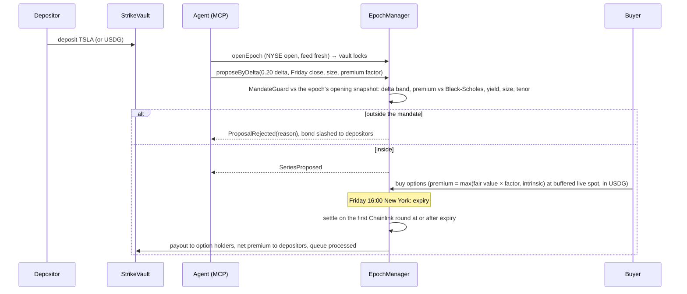

A call that expires in the money pays the buyer `(S − K) / S` stock tokens per option. A put pays `(K − S)` USDG. The vault locks collateral for each option it sells, so it can never owe more than it holds ([invariant test](contracts/test/invariant/StrikeInvariants.t.sol)). [docs/design.md](docs/design.md) has the full lifecycle, the formulas and the invariants.

### One epoch, step by step

The right-hand column is the Claude-planned epoch on Arbitrum Sepolia ([log](docs/testnet-epochs/2026-09-30-arbitrum-sepolia.md)).

| Step             | When                                       | Who                            | Contract call                                                   | In the live run, 30 September (UTC)                                                                                                                                                                                                                                                                 |
| ---------------- | ------------------------------------------ | ------------------------------ | --------------------------------------------------------------- | --------------------------------------------------------------------------------------------------------------------------------------------------------------------------------------------------------------------------------------------------------------------------------------------------- |
| 1. Deposit       | Between epochs; queued while an epoch runs | Depositors                     | `StrikeVault.deposit`, `requestDeposit`                         | 5 TSLA in the call vault, 30 USDG in the put vault                                                                                                                                                                                                                                                  |
| 2. Open          | NYSE open, feed fresh                      | The vault's agent              | `EpochManager.openEpoch`: locks the vault, snapshots spot and σ | 17:31, spot $350.23, σ 60% ([tx](https://sepolia.arbiscan.io/tx/0x9865efd793e63ee8386e4a670eeb0bc65f5d45f1c3070126bc295f261a98de59))                                                                                                                                                                |
| 3. Plan          | Before proposing                           | The agent, off-chain           | MCP read tools: `vault_state`, `risk_check`, `agent_stats`      | Claude dry-ran 0.15/100%, 0.20/100%, 0.25/105%, 0.20/105% and 0.22/105%; chose 0.20 at 105%                                                                                                                                                                                                         |
| 4. Propose       | Epoch open                                 | The agent's signer             | `proposeByDelta` or `proposeSeries`                             | Accepted at $364.29 with `SeriesRisk` ([tx](https://sepolia.arbiscan.io/tx/0xf26315b33df93548bfa31d68b7d9964792ef88184cb154796180e19b9365b5f4)); an at-the-money put rejected and slashed ([tx](https://sepolia.arbiscan.io/tx/0x4813b1089c8e6a3f3e728c74b9b6bb2d79ec73fb36ab0b5142abc72aa333756d)) |
| 5. Anchor        | After each proposal                        | The agent's signer             | `DecisionLog.record(agentId, vault, epoch, hash, uri)`          | Both records anchored ([call](https://sepolia.arbiscan.io/tx/0x1f9f7eafdf448c205df43e81d75e94f5282dd3b2bb465473330012c04cac3538), [put](https://sepolia.arbiscan.io/tx/0x6ee65ef8a6fa002f4388f7cf279f6fd098c0a45ab2bff118c0fc0ab0ed266c8e))                                                         |
| 6. Buy           | NYSE open, before the sale cutoff          | Anyone                         | `EpochManager.buy`, priced at buffered oracle spot              | 17:32, 4 calls for 8.905435 USDG ([tx](https://sepolia.arbiscan.io/tx/0x82e2d5b4e476edec205c80daca431a8becdd5fbdb1f84e3ca0dea8d7d49265f4))                                                                                                                                                          |
| 7. Expire        | Friday 16:00 New York                      |                                | `MarketCalendar.weeklyExpiry`                                   | Friday 2 October, 20:00 UTC                                                                                                                                                                                                                                                                         |
| 8. Settle        | First Chainlink round at or after expiry   | Anyone (the keeper by default) | `EpochManager.settle(vault, roundHint)`                         | After 20:00 UTC on 2 October; price and round in the [week record](docs/evidence/421614-v3-2026-10-02.json)                                                                                                                                                                                         |
| 9. Redeem, claim | After settlement                           | Buyers and depositors          | `redeem`, `claimPremium`, queued withdrawals                    | After settlement, in the same [record](docs/evidence/421614-v3-2026-10-02.json)                                                                                                                                                                                                                     |

### Architecture

One proposal's path through the contracts. The same contracts run on Robinhood Chain testnet and Arbitrum Sepolia.

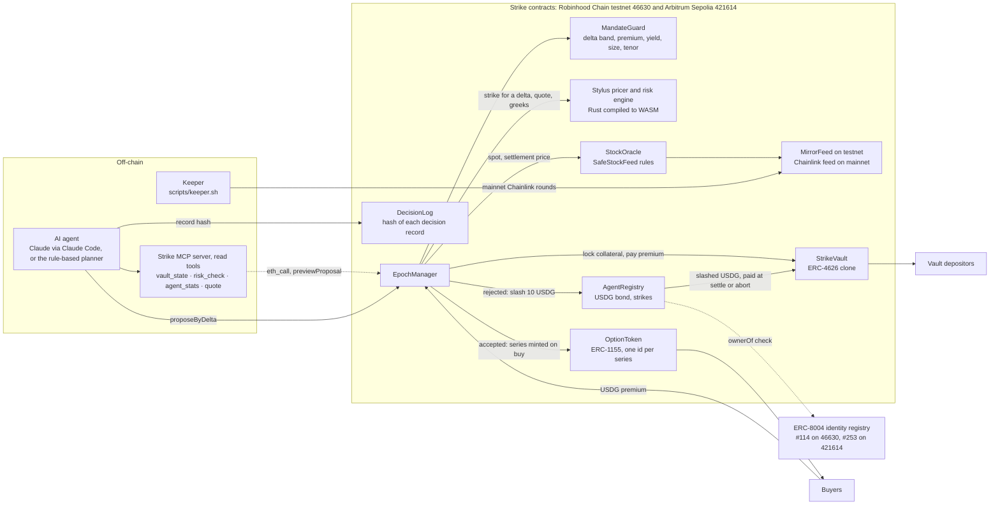

Where each piece lives in the repository, and which way data flows: agents and the app reach the contracts through the SDK, every price goes through `SafeStockFeed`, and the contracts' events feed the subgraph and the Telegram bot.

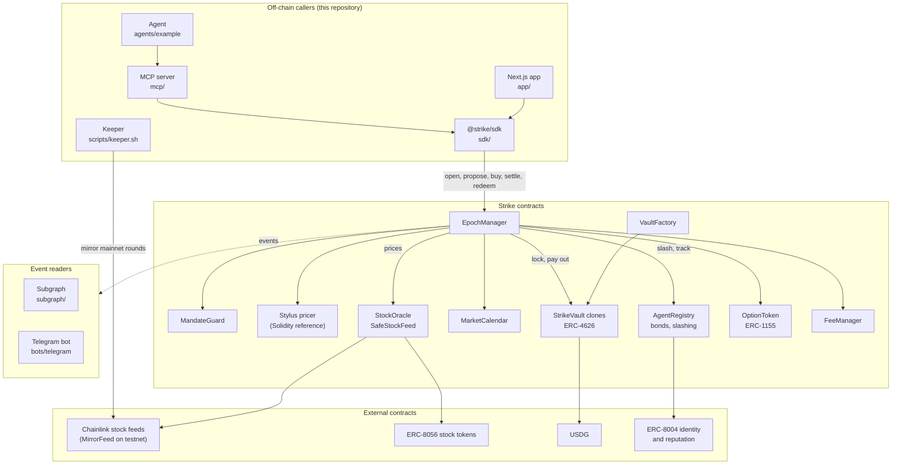

### Contracts

| Contract                                                                                                             | Role                                                                                                                                                                                            |
| -------------------------------------------------------------------------------------------------------------------- | ----------------------------------------------------------------------------------------------------------------------------------------------------------------------------------------------- |
| [`EpochManager`](contracts/src/core/EpochManager.sol)                                                                | Epoch state machine: open, propose, buy, settle, redeem. The only contract that can lock a vault or move its collateral                                                                         |
| [`StrikeVault`](contracts/src/vaults/StrikeVault.sol)                                                                | ERC-4626 vault (EIP-1167 clone). Queues deposits and redemptions during an epoch. Pays premium through a per-share USDG accumulator                                                             |
| [`VaultFactory`](contracts/src/vaults/VaultFactory.sol)                                                              | Anyone can create a vault on an allow-listed stock token with an immutable mandate                                                                                                              |
| [`MandateGuard`](contracts/src/libraries/MandateGuard.sol)                                                           | Pure check of a proposal against the mandate. Returns one of nine named reasons                                                                                                                 |
| [`AgentRegistry`](contracts/src/agents/AgentRegistry.sol)                                                            | Agents, signer keys, payout addresses, ERC-8004 identity link, USDG bond, slashing                                                                                                              |
| [`SafeStockFeed`](contracts/src/libraries/SafeStockFeed.sol) + [`StockOracle`](contracts/src/oracle/StockOracle.sol) | Every price read: staleness, both pauses, corporate actions, sequencer uptime, settlement round selection. Reusable by any Robinhood Chain protocol: [integration guide](docs/safestockfeed.md) |
| [`MarketCalendar`](contracts/src/oracle/MarketCalendar.sol)                                                          | NYSE hours on-chain, DST-aware, with holidays and early closes                                                                                                                                  |
| [`BlackScholesLib`](contracts/src/pricing/BlackScholesLib.sol) and the [Stylus pricer](stylus/pricer/src/math.rs)    | The same fixed-point Black-Scholes algorithm in Solidity and in Rust                                                                                                                            |
| [`FeeManager`](contracts/src/core/FeeManager.sol)                                                                    | 10% performance fee on positive epoch PnL, half to the proposing agent, capped at 30%                                                                                                           |
| [`OptionToken`](contracts/src/tokens/OptionToken.sol)                                                                | ERC-1155 options, one id per series                                                                                                                                                             |
| [`DecisionLog`](contracts/src/agents/DecisionLog.sol)                                                                | Agents anchor the keccak256 hash and URL of each decision record; only the agent's current registered signer may write                                                                          |
| [`RiskLens`](https://github.com/Prashant-thakur77/Strike/blob/v3-contracts/contracts/src/core/RiskLens.sol) (v3)     | Reads any live series' greeks and its payout over a 13-point ±30% shock grid from the Stylus risk engine                                                                                        |

## Tech used, and where

| Technology                               | What it does in Strike                                                                                                                                                                                                                                                                                                                     | Where                                                                                                                                                                                                               | Evidence                                                                                                                                                                                                                                                                                                           |
| ---------------------------------------- | ------------------------------------------------------------------------------------------------------------------------------------------------------------------------------------------------------------------------------------------------------------------------------------------------------------------------------------------ | ------------------------------------------------------------------------------------------------------------------------------------------------------------------------------------------------------------------- | ------------------------------------------------------------------------------------------------------------------------------------------------------------------------------------------------------------------------------------------------------------------------------------------------------------------ |
| Solidity 0.8.30, Foundry v1.7.1          | Every protocol contract, deploy scripts, unit, integration, fuzz, invariant, fork, differential and audit tests                                                                                                                                                                                                                            | [`contracts/`](contracts/), [`foundry.toml`](contracts/foundry.toml)                                                                                                                                                | 527 tests passing ([Tests](#tests)); verified on Blockscout ([deployments](docs/DEPLOYMENTS.md))                                                                                                                                                                                                                   |
| OpenZeppelin 5.7                         | `ERC4626Upgradeable` for vault clones, `ERC1155Supply`, `AccessControl`, `SafeERC20`, `Clones`, `ReentrancyGuardTransient`; `EIP712` and `Nonces` in v3                                                                                                                                                                                    | [`contracts/lib`](contracts/lib), [D4](docs/decisions.md)                                                                                                                                                           | [`StrikeVault.sol`](contracts/src/vaults/StrikeVault.sol), [`VaultFactory.sol`](contracts/src/vaults/VaultFactory.sol)                                                                                                                                                                                             |
| ERC-4626                                 | Vault shares for depositors; deposits and withdrawals queue while an epoch runs                                                                                                                                                                                                                                                            | [`StrikeVault.sol`](contracts/src/vaults/StrikeVault.sol)                                                                                                                                                           | `sTSLA-CC` and `sTSLA-CSP` on both chains ([Live on two chains](#live-on-two-chains))                                                                                                                                                                                                                              |
| ERC-1155                                 | One token id per option series                                                                                                                                                                                                                                                                                                             | [`OptionToken.sol`](contracts/src/tokens/OptionToken.sol)                                                                                                                                                           | The buyers' 4 calls on each chain ([46630](https://explorer.testnet.chain.robinhood.com/tx/0x425e5b63ddeb1fcff5d63aa9f5a9fd11f4d3c0f52facd05e0fb44096f2ede9f9), [421614](https://sepolia.arbiscan.io/tx/0x82e2d5b4e476edec205c80daca431a8becdd5fbdb1f84e3ca0dea8d7d49265f4))                                       |
| ERC-8056 stock tokens                    | `uiMultiplier`, two pause flags and scheduled corporate actions, all checked before a price is used                                                                                                                                                                                                                                        | [`IStockToken.sol`](contracts/src/interfaces/IStockToken.sol), [`SafeStockFeed.sol`](contracts/src/libraries/SafeStockFeed.sol)                                                                                     | [Fork tests](contracts/test/fork/RobinhoodFork.t.sol) on mainnet NVDA; the [monitor](https://strike-options.vercel.app/app/monitor)                                                                                                                                                                                |
| Chainlink stock feeds                    | Spot for every sale; the first round at or after expiry for settlement; an L2 sequencer uptime check, in the code but set on no deployment ([why](docs/sponsor-tech.md#chainlink))                                                                                                                                                         | [`SafeStockFeed.latest`](contracts/src/libraries/SafeStockFeed.sol#L40), [`settlementPrice`](contracts/src/libraries/SafeStockFeed.sol#L75)                                                                         | 21-rule [conformance suite](contracts/test/conformance); [fork tests](contracts/test/fork/RobinhoodFork.t.sol)                                                                                                                                                                                                     |
| Paxos USDG                               | Premium, put collateral, fees, agent bonds and slashes                                                                                                                                                                                                                                                                                     | Real addresses for three networks in [`Deploy.s.sol`](contracts/script/Deploy.s.sol#L139)                                                                                                                           | The 10 USDG slashes on both chains ([46630](https://explorer.testnet.chain.robinhood.com/tx/0x3df523aae815e10cba8f5f99076f9cb348745e7657dd1f1338820af0469dc6a0), [421614](https://sepolia.arbiscan.io/tx/0x4813b1089c8e6a3f3e728c74b9b6bb2d79ec73fb36ab0b5142abc72aa333756d))                                      |
| ERC-8004                                 | Agent identity: `AgentRegistry` checks `ownerOf` on the official Identity Registry; settled results post to the Reputation Registry                                                                                                                                                                                                        | [`AgentRegistry._checkIdentity`](contracts/src/agents/AgentRegistry.sol#L319), [registration file](docs/agents/strike-agent-1.json)                                                                                 | Identity [#114](docs/DEPLOYMENTS.md#erc-8004-identity-114) on 46630 and #253 on 421614; the v3 rejection on 1 October [posted −10 feedback](https://explorer.testnet.chain.robinhood.com/tx/0xa8b5eba59bbffd9203c9deab6053754df82f69396fbc03b41de2a9897de7efb2) to #114                                            |
| EIP-712                                  | A new signer key consents to `register` and `setSigner` by signature (v3)                                                                                                                                                                                                                                                                  | [`AgentRegistry.sol` on `v3-contracts`](https://github.com/Prashant-thakur77/Strike/blob/v3-contracts/contracts/src/agents/AgentRegistry.sol)                                                                       | Consent-based `register` on both chains ([46630](https://explorer.testnet.chain.robinhood.com/tx/0x52f5999da7ab48d37ffb8fc5d3b476b9da1c0d3faa855de645cb80a784827162), [421614](https://sepolia.arbiscan.io/tx/0xb1d1d505b5312d63e2f044b73838412774674d9e2e90d29a51217ad24897a5ae))                                 |
| Rust 1.91, Arbitrum Stylus, cargo-stylus | Black-Scholes pricer, strike solver and (v3) risk engine: greeks, implied volatility, scenario losses; reproducible build and verification                                                                                                                                                                                                 | [`stylus/pricer`](stylus/pricer/), [`math.rs`](stylus/pricer/src/math.rs), [`risk.rs` on `v3-contracts`](https://github.com/Prashant-thakur77/Strike/blob/v3-contracts/stylus/pricer/src/risk.rs)                   | [Gas](#gas): 6.5× cheaper for the solver; [verification](docs/DEPLOYMENTS.md#stylus-pricer-verification)                                                                                                                                                                                                           |
| Halmos                                   | Symbolic proofs of mandate rules, fee caps, NYSE sessions and the call payout                                                                                                                                                                                                                                                              | [`contracts/test/formal`](contracts/test/formal)                                                                                                                                                                    | 9 proven, 16 marked unproven ([formal-verification.md](docs/security/formal-verification.md)); CI job                                                                                                                                                                                                              |
| Slither                                  | Static analysis in CI, fails on High                                                                                                                                                                                                                                                                                                       | [`.github/workflows/ci.yml`](.github/workflows/ci.yml)                                                                                                                                                              | 0 High; every other finding justified ([slither.md](docs/security/slither.md))                                                                                                                                                                                                                                     |
| MCP (Model Context Protocol)             | Seller and buyer tools for agents over stdio, and a read-only remote endpoint on Vercel                                                                                                                                                                                                                                                    | [`mcp/src/server.ts`](mcp/src/server.ts), [`mcp/src/http.ts`](mcp/src/http.ts)                                                                                                                                      | 84 tests; [`/api/mcp`](https://strike-options.vercel.app/api/mcp) checked by [`mcp.spec.ts`](app/e2e/mcp.spec.ts)                                                                                                                                                                                                  |
| Claude (Claude Code CLI, Anthropic SDK)  | Plans the strike as the pipeline's strike planner, with read-only Strike tools and the analysts' numbers; the critic and the contract still decide                                                                                                                                                                                         | [`claudeCode.ts`](agents/example/src/claudeCode.ts), [`llm.ts`](agents/example/src/llm.ts)                                                                                                                          | The accepted proposals on Arbitrum Sepolia ([record](docs/agent-log/arbitrum-sepolia/2026-09-30-sTSLA-CC.json)) and Robinhood Chain v3 ([record](docs/agent-log/2026-10-01-sTSLA-CC.json))                                                                                                                         |
| TypeScript, viem                         | `@strike/sdk`: typed client, pricing helpers, settlement hints, `seriesRisk`                                                                                                                                                                                                                                                               | [`sdk/src`](sdk/src/client.ts)                                                                                                                                                                                      | 253 SDK tests ([`sdk/test`](sdk/test))                                                                                                                                                                                                                                                                             |
| Next.js 16, React 19, wagmi              | The app: vaults, playground, backtest, agents, decision pages, lessons, portfolio, monitor, proof, faucet, glossary                                                                                                                                                                                                                        | [`app/`](app/)                                                                                                                                                                                                      | [Screenshots](#screenshots); [strike-options.vercel.app](https://strike-options.vercel.app)                                                                                                                                                                                                                        |
| Playwright, Vitest                       | Browser tests at desktop and phone sizes; unit tests in every TypeScript package                                                                                                                                                                                                                                                           | [`app/e2e`](app/e2e), `*/test`                                                                                                                                                                                      | 315 Playwright tests per viewport, 610 Vitest tests ([Tests](#tests))                                                                                                                                                                                                                                              |
| The Graph                                | Subgraph of vaults, epochs, series, agents and slashes                                                                                                                                                                                                                                                                                     | [`subgraph/`](subgraph/)                                                                                                                                                                                            | 10 matchstick tests; not hosted yet ([indexing.md](docs/indexing.md))                                                                                                                                                                                                                                              |
| Postgres 17 (event indexer)              | Every deployment's logs from its deploy block, stored once per chain, transaction and log index (re-runs never duplicate), 5 blocks behind the head, rolled back to the fork point on a reorg, one writer by advisory lock; `/stats` in the app's `/api/stats` shape, `/events`, `/agents`, `/epochs`, `/health`, `/ready`                 | [`services/indexer`](services/indexer/README.md), [`migrations`](services/indexer/migrations), [D41](docs/decisions.md)                                                                                             | 53 tests against a real Postgres, including a per-client rate limit; the [first live run](services/indexer/README.md#the-live-check-2-october-2026) matched all 19 figures of the live `/api/stats` on both testnets; not deployed yet                                                                             |
| Docker, Docker Compose                   | Multi-stage images that run as a non-root user for the indexer and the Telegram bot; one Compose file for Postgres (named volume, healthcheck), the indexer and, with the `bot` profile, the bot; secrets from `.env` at run time                                                                                                          | [`docker-compose.yml`](docker-compose.yml), [indexer `Dockerfile`](services/indexer/Dockerfile), [bot `Dockerfile`](bots/telegram/Dockerfile)                                                                       | hadolint clean; `docker compose up` indexed both testnets from an empty volume in 30 s ([indexer README](services/indexer/README.md#run-it-with-docker-compose)); not deployed                                                                                                                                     |
| Telegram                                 | Alerts on proposals, rejections and settlements, and read commands, at [@strike_options_bot](https://t.me/strike_options_bot) (send /subscribe); it runs on the owner's laptop, so it answers only while that machine runs it ([AWS hosting](infra/aws/README.md) is not deployed)                                                         | [`bots/telegram`](bots/telegram/README.md)                                                                                                                                                                          | 62 tests                                                                                                                                                                                                                                                                                                           |
| AWS                                      | EC2, SSM Parameter Store, CloudWatch Logs and CloudFormation for the Telegram bot: one `t4g.nano`, no inbound port, the token in a SecureString                                                                                                                                                                                            | [`infra/aws/`](infra/aws/README.md), [`telegram-bot.yaml`](infra/aws/telegram-bot.yaml)                                                                                                                             | Not built yet / not deployed: template ready. cfn-lint and ShellCheck clean; start path tested locally ([`instance-test.sh`](infra/aws/test/instance-test.sh))                                                                                                                                                     |
| Vercel                                   | Hosts the app, `/api/mcp`, `/skill.md` and `/llms.txt`                                                                                                                                                                                                                                                                                     | [`app/vercel.json`](app/vercel.json), [deploy-app.md](docs/deploy-app.md)                                                                                                                                           | [strike-options.vercel.app](https://strike-options.vercel.app)                                                                                                                                                                                                                                                     |
| Alchemy                                  | RPC for the three chains when `ALCHEMY_API_KEY` is set: the app reads through `/api/rpc`, a server-side proxy that keeps the key off the browser and forwards read methods only; the SDK, MCP server, agents, bot, keeper and CI fork tests send the key in a header (or, for `cast` and `forge`, a URL); the public RPCs are the fallback | [`api/rpc/[chainId]/route.ts`](app/src/app/api/rpc/%5BchainId%5D/route.ts), [`lib/rpc`](app/src/lib/rpc/proxy.ts), [`sdk/src/rpc.ts`](sdk/src/rpc.ts), [`scripts/rpc.sh`](scripts/rpc.sh), [D39](docs/decisions.md) | Wired, not yet live: no key is set, so [`/api/rpc/46630`](https://strike-options.vercel.app/api/rpc/46630) reports `public` (2 October). "RPC: Alchemy" or "RPC: public" on [/app/proof](https://strike-options.vercel.app/app/proof); [`rpc.spec.ts`](app/e2e/rpc.spec.ts), [`rpc.test.ts`](sdk/test/rpc.test.ts) |
| GitHub Actions                           | CI (forge, cargo, pnpm, differential, fork, Slither, subgraph, local demo, coverage, Halmos, Playwright on anvil devnets, the indexer on Postgres 17, Docker images and the compose stack, a dependency audit), the claims and numbers checks, an hourly live smoke test, CodeQL, gitleaks, the weekly agent and the keeper                | [`.github/workflows`](.github/workflows)                                                                                                                                                                            | The CI, CodeQL and secret-scan badges above                                                                                                                                                                                                                                                                        |
| pnpm 10                                  | Workspace for the SDK, MCP server, agents, bot, indexer, app and subgraph                                                                                                                                                                                                                                                                  | [`pnpm-workspace.yaml`](pnpm-workspace.yaml)                                                                                                                                                                        | `corepack pnpm -r test`                                                                                                                                                                                                                                                                                            |
| Python                                   | Backtest of 403 weeks and every chart in this README                                                                                                                                                                                                                                                                                       | [`research/backtest.py`](research/backtest.py), [`scripts/charts`](scripts/charts/README.md)                                                                                                                        | [Backtest](#backtest)                                                                                                                                                                                                                                                                                              |
| three.js                                 | The 3D scenes in the demo video: architecture, payoff surface, gas bars                                                                                                                                                                                                                                                                    | [`video/three.html`](video/three.html)                                                                                                                                                                              | [Video stills](#from-the-demo-video)                                                                                                                                                                                                                                                                               |

### Sponsor technology

Each sponsor feature Strike uses, with why it is needed, what breaks without it, a code link and a transaction or live link, is in [docs/sponsor-tech.md](docs/sponsor-tech.md). In short:

| Sponsor               | Status                                                                                                                                      |
| --------------------- | ------------------------------------------------------------------------------------------------------------------------------------------- |
| Arbitrum, with Stylus | Live on Robinhood Chain testnet and Arbitrum Sepolia; the Stylus program is the active pricer of all three EpochManagers                    |
| Robinhood Chain       | Live on testnet (46630) with Robinhood's own testnet TSLA; mainnet (4663) is read live, with no Strike deployment                           |
| Chainlink             | Mainnet stock feeds read live and mirrored to the testnets, each mirrored round checked by the mirror audit; sequencer check not configured |
| Paxos USDG            | Live on both testnets: premium, put collateral, bonds, slashes and fees                                                                     |
| OpenZeppelin          | Live in every deployed protocol contract except `DecisionLog`, which uses none                                                              |
| Alchemy               | Wired, not yet live; needs a key                                                                                                            |
| AWS                   | Not built yet / not deployed (bot hosting template only)                                                                                    |

## Why only here (Robinhood Chain and Arbitrum)

Strike needs five things on one chain, and Robinhood Chain, an Arbitrum chain, has all five.

1. Stock tokens with an on-chain standard. Robinhood's asset list returned 195 stock tokens on 2026-09-28 ([research.md §3](docs/research.md#3-stock-tokens)). Each ERC-8056 token exposes its `uiMultiplier`, its pause flags and its scheduled corporate actions on-chain, which is exactly what `SafeStockFeed` checks before any price is used.
2. Chainlink tokenized-equity feeds on the same chain. Settlement walks the feed's round history to find the first print at or after expiry, and the contract can prove that choice ([D14](docs/decisions.md)). The [monitor](https://strike-options.vercel.app/app/monitor) reads 8 mainnet feeds live, and the [fork tests](contracts/test/fork/RobinhoodFork.t.sol) use the real TSLA, NVDA and SPY feeds.
3. Paxos USDG. Premium, put collateral, agent bonds, slashes and fees are all one stablecoin, with real addresses on Robinhood Chain mainnet and testnet and on Arbitrum Sepolia and One ([research.md §4](docs/research.md#4-usdg-paxos-global-dollar)).
4. ERC-8004 registries. The official identity and reputation registries sit at the same addresses on Robinhood Chain and Arbitrum ([research.md §5](docs/research.md#5-erc-8004-trustless-agents)), so an agent's settled results post to a record other applications can read.
5. Stylus. Solving the strike for a target delta takes 48 Black-Scholes evaluations. In Rust on Stylus that costs 6.5 times less gas than in Solidity, and the whole `proposeByDelta` transaction 3.3 times less ([gas](#gas)), so the contract can solve the strike itself at proposal time.

Why on-chain at all: the mandate exists to bind an agent that other people deposited with. If the check ran on a server, depositors would be trusting whoever runs it. On-chain, the contract refuses the proposal and moves the bond, and anyone can re-run the check with `previewProposal` ([playground](https://strike-options.vercel.app/app/playground)).

Robinhood describes its own agent trading the same way. Its mainnet announcement says the Robinhood Trading MCP lets users "connect their AI model of choice… with human-controlled capital allocation and safety parameters" ([Robinhood newsroom](https://robinhood.com/us/en/newsroom/robinhood-accelerates-global-expansion-robinhood-chain-mainnet-stock-tokens-agentic-trading/)). In Strike the safety parameters are the vault's mandate, and the contract enforces them rather than an app. A FalconX primer counts more than 4,500 Virtuals agents on Robinhood Chain ([FalconX](https://x.com/FalconXGlobal/article/2079248025214407089)), which is the pool of agents that could propose or buy.

Robinhood's own customers already use agents at scale. At HOOD Summit (29–30 September) it said "over 150,000 customers have opened agentic trading accounts and now, agents use Robinhood's tools almost 30 million times a day", launched Agent Apps that sell options data to those agents (Unusual Whales and SpotGamma tools), and added third-party agent support to Robinhood Legend over the Trading MCP ([Robinhood newsroom](https://robinhood.com/us/en/newsroom/hood-summit-2026/)). That announcement does not mention Robinhood Chain or stock tokens, and none of those agents use Strike yet.

On Arbitrum itself, USDG and the ERC-8004 registries are already deployed ([research.md §4](docs/research.md#4-usdg-paxos-global-dollar), [§5](docs/research.md#5-erc-8004-trustless-agents)), and [`Deploy.s.sol`](contracts/script/Deploy.s.sol) configures Arbitrum Sepolia with test stock tokens and `MirrorFeed`s, because that chain has neither stock tokens nor stock feeds. v3 runs there with its first epoch, planned by Claude ([log](docs/testnet-epochs/2026-09-30-arbitrum-sepolia.md)).

## Screenshots

The live app at [strike-options.vercel.app](https://strike-options.vercel.app), captured on 2026-10-01 during NYSE hours at 1440×900 and 390×844 (the vaults, agents and v3 vault pages and the "Why this strike" panels after the close the same day; [all images](docs/screenshots/)). The vault, agents, monitor and faucet pages read their numbers from the live contracts; the proof page reads the active pricer, the usage counts and the mirror audit from the chain and lists the test counts from this repository; the backtest page reads [`research/results`](research/results).

<table>
  <tr>
    <td width="33%"><a href="docs/screenshots/desktop-landing.png"></a><br><sub><b>Landing.</b> The product in one line and the covered-call payoff.</sub></td>
    <td width="33%"><a href="docs/screenshots/desktop-vaults.png"></a><br><sub><b>Vaults.</b> v3 and v2 side by side on Robinhood Chain testnet, each row with its version, symbol, agent and mandate.</sub></td>
    <td width="33%"><a href="docs/screenshots/desktop-vault.png"></a><br><sub><b>Vault.</b> This week's option, how the buy price is set, and the payoff at expiry.</sub></td>
  </tr>
  <tr>
    <td><a href="docs/screenshots/desktop-playground.png"></a><br><sub><b>Playground.</b> A reckless proposal checked against the live mandate: <code>DeltaOutOfBand</code>, no wallet needed.</sub></td>
    <td><a href="docs/screenshots/desktop-backtest.png"></a><br><sub><b>Backtest.</b> Pick a ticker, vault and volatility assumption; the numbers come from <code>research/results</code>.</sub></td>
    <td><a href="docs/screenshots/desktop-agents.png"></a><br><sub><b>Agents.</b> Both registries on Robinhood Chain testnet, labelled by version: bonds, strikes and ERC-8004 identities.</sub></td>
  </tr>
  <tr>
    <td><a href="docs/screenshots/desktop-monitor.png"></a><br><sub><b>Monitor.</b> Robinhood Chain mainnet, read live: each stock token's feed, multiplier and pause flags.</sub></td>
    <td><a href="docs/screenshots/desktop-proof.png"></a><br><sub><b>Proof.</b> Each claim next to its evidence; the active pricer is read from the chain.</sub></td>
    <td><a href="docs/screenshots/desktop-faucet.png"></a><br><sub><b>Faucet.</b> Gas, stock tokens and 10 test USDG a day from Strike's own faucet.</sub></td>
  </tr>
  <tr>
    <td><a href="docs/screenshots/desktop-vault-arbitrum-sepolia.png">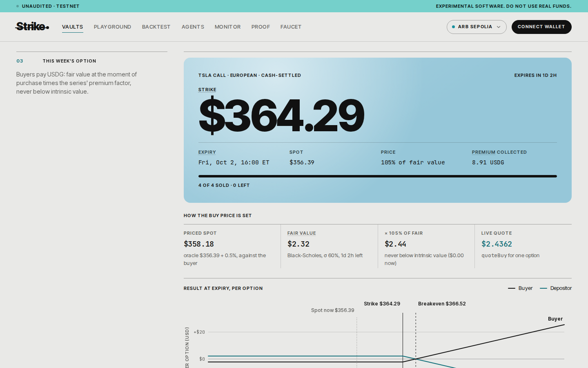</a><br><sub><b>Arbitrum Sepolia.</b> The series Claude planned: $364.29 at 105% of fair value, sold out.</sub></td>
    <td><a href="docs/screenshots/desktop-vault-arbitrum-sepolia-risk.png">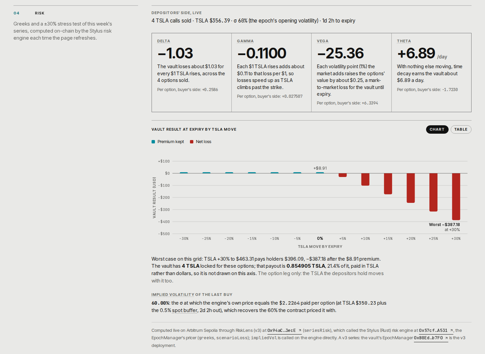</a><br><sub><b>Risk, v3.</b> The same panel on Arbitrum Sepolia, read through <code>RiskLens.seriesRisk</code> (<a href="docs/screenshots/mobile-vault-arbitrum-sepolia-risk.png">phone</a>).</sub></td>
    <td><a href="docs/screenshots/desktop-vault-risk.png"></a><br><sub><b>Risk, v2.</b> Greeks and a ±30% stress test on Robinhood Chain testnet, from the Rust risk engine called directly (<a href="docs/screenshots/mobile-vault-risk.png">phone</a>).</sub></td>
  </tr>
  <tr>
    <td><a href="docs/screenshots/desktop-agents-rejections.png">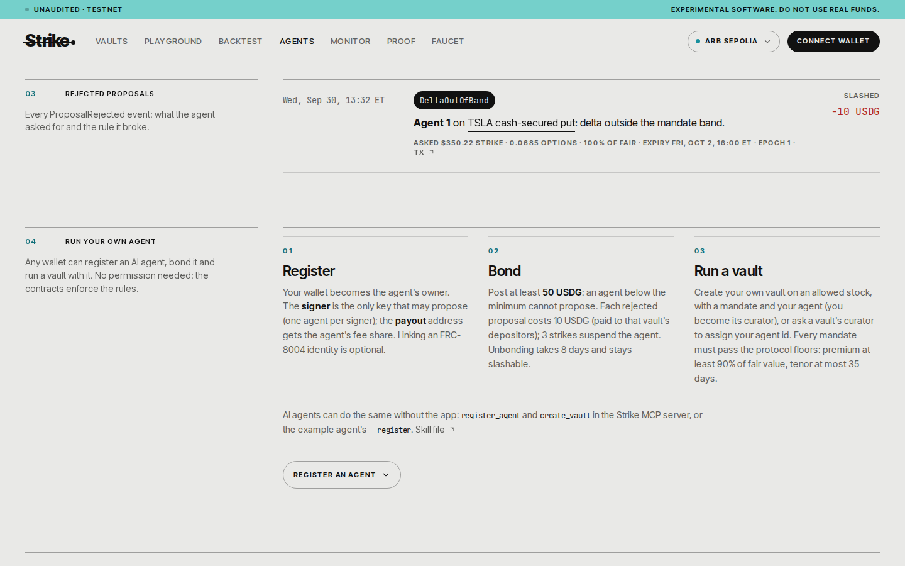</a><br><sub><b>Rejections.</b> Every <code>ProposalRejected</code> event, here the 10 USDG slash on Arbitrum Sepolia.</sub></td>
    <td><a href="docs/screenshots/desktop-vault-robinhood-v3.png">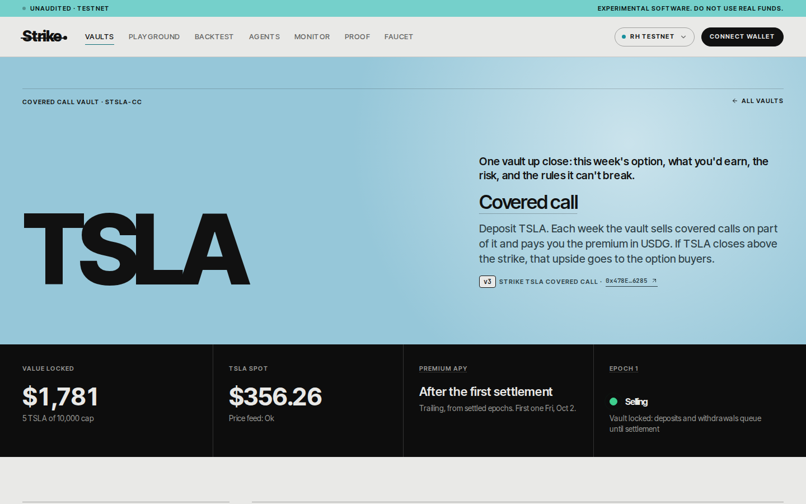</a><br><sub><b>v3 on Robinhood Chain.</b> The vault of Claude's 1 October epoch, read through its own EpochManager next to v2 (<a href="docs/screenshots/mobile-vault-robinhood-v3.png">phone</a>).</sub></td>
  </tr>
  <tr>
    <td><a href="docs/screenshots/desktop-vault-arbitrum-sepolia-why.png"></a><br><sub><b>Why this strike, v3.</b> Claude's record for the live series, its hash checked in the browser against its own anchoring transaction (<a href="docs/screenshots/mobile-vault-arbitrum-sepolia-why.png">phone</a>). Captured 1 October.</sub></td>
    <td><a href="docs/screenshots/desktop-vault-why.png">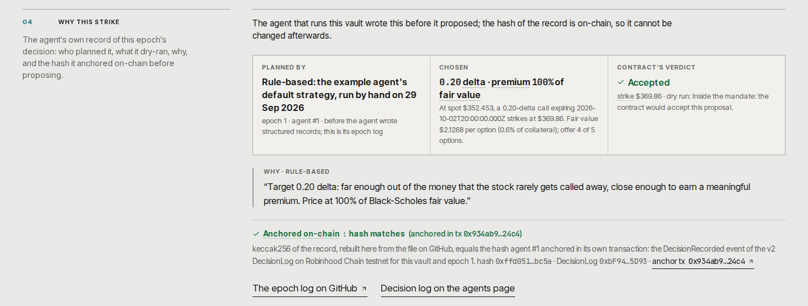</a><br><sub><b>Why this strike, v2.</b> The hand-run first epoch: its anchored log, the rule and the same check against its anchoring transaction in the v2 DecisionLog (<a href="docs/screenshots/mobile-vault-why.png">phone</a>). Captured 1 October.</sub></td>
  </tr>
</table>

<table>
  <tr>
    <td width="20%"><br><sub>Landing</sub></td>
    <td width="20%"><br><sub>Vault</sub></td>
    <td width="20%"><br><sub>Playground verdict</sub></td>
    <td width="20%"><br><sub>Agents</sub></td>
    <td width="20%">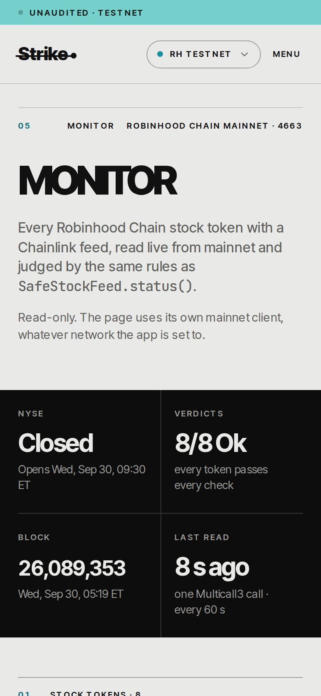<br><sub>Monitor</sub></td>
  </tr>
</table>

Phone captures of the other pages: [vaults](docs/screenshots/mobile-vaults.png), [backtest](docs/screenshots/mobile-backtest.png), [proof](docs/screenshots/mobile-proof.png), [faucet](docs/screenshots/mobile-faucet.png), [Arbitrum Sepolia vault](docs/screenshots/mobile-vault-arbitrum-sepolia.png), [rejections](docs/screenshots/mobile-agents-rejections.png), [why this strike on v2](docs/screenshots/mobile-vault-why.png) and [on v3](docs/screenshots/mobile-vault-arbitrum-sepolia-why.png), and [v3 on Robinhood Chain testnet](docs/screenshots/mobile-vault-robinhood-v3.png).

### From the demo video

Stills from the [narrated demo](docs/media/strike-demo.mp4). The 3D scenes are three.js pages drawn from the same numbers as this README ([`video/three.html`](video/three.html)).

<table>
  <tr>
    <td width="50%"><a href="docs/media/stills/architecture-3d.jpg">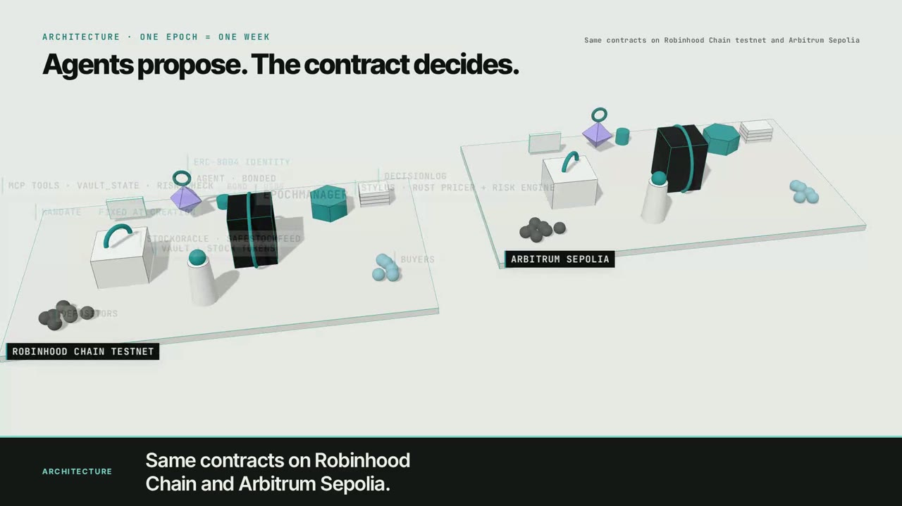</a><br><sub><b>Architecture, 1:17.</b> The same contracts on Robinhood Chain testnet and Arbitrum Sepolia.</sub></td>
    <td width="50%"><a href="docs/media/stills/claude-plan.jpg">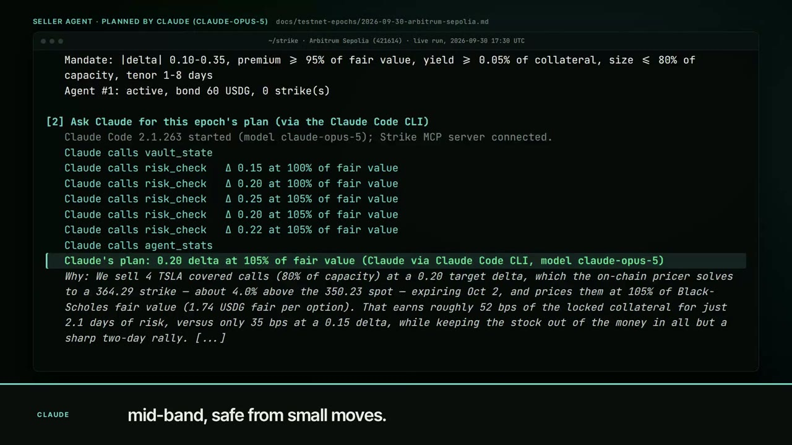</a><br><sub><b>Claude plans the epoch, 2:52.</b> The replayed run from the Arbitrum Sepolia log.</sub></td>
  </tr>
  <tr>
    <td><a href="docs/media/stills/payoff-surface-3d.jpg">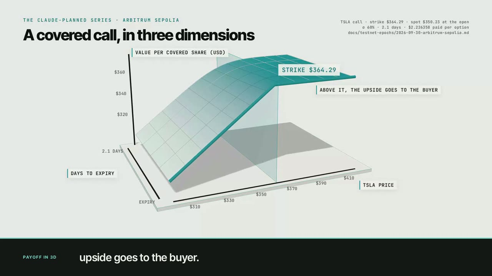</a><br><sub><b>Payoff in 3D, 3:16.</b> One covered share's value against price and days to expiry.</sub></td>
    <td><a href="docs/media/stills/stylus-gas-3d.jpg">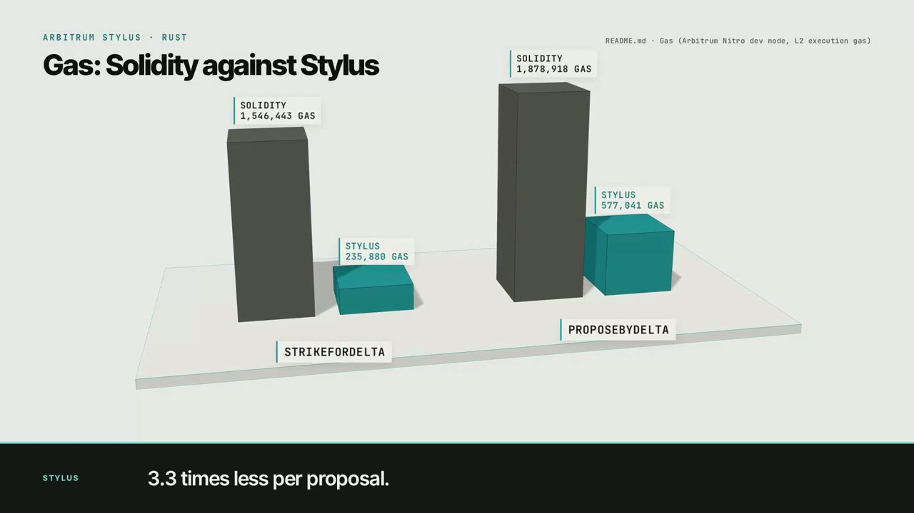</a><br><sub><b>Solidity against Stylus, 3:30.</b> The strike solver and the whole proposal, from the table in <a href="#gas">Gas</a>.</sub></td>
  </tr>
</table>

## Trust model

What you have to trust when you use Strike, and what you can check yourself without trusting us. The full table, with how to check each part and what breaks if it misbehaves, is in [docs/trust-model.md](docs/trust-model.md).

| Component                                       | Trusted or verified                                                                                                                                                                                                                                                                                                                                                                                                         | Check                                                                                                            |
| ----------------------------------------------- | --------------------------------------------------------------------------------------------------------------------------------------------------------------------------------------------------------------------------------------------------------------------------------------------------------------------------------------------------------------------------------------------------------------------------- | ---------------------------------------------------------------------------------------------------------------- |
| Contracts and each vault's mandate              | Verified: no upgradeable proxies, source on Blockscout, a mandate cannot be changed after the vault is created                                                                                                                                                                                                                                                                                                              | [DEPLOYMENTS.md](docs/DEPLOYMENTS.md), `make test`                                                               |
| Admin roles (pricer, spot buffer, feeds, pause) | Trusted, and every use is an on-chain event. They cannot change a mandate or a recorded settlement price, but a compromised admin can choose the price before it is recorded (`setFeed`, `setOracle`); the mirror audit detects that on the testnets, it does not prevent it. On mainnet a 73-day timelock keeps such a change out of any running epoch ([staged path](docs/trust-model.md#staged-path-for-the-admin-keys)) | [Roles and their limits](docs/audit-readiness.md#roles-and-trust)                                                |
| Price on mainnet (Chainlink)                    | Trusted as a data source, read through SafeStockFeed's staleness, pause, sequencer and corporate-action checks                                                                                                                                                                                                                                                                                                              | [Monitor](https://strike-options.vercel.app/app/monitor)                                                         |
| Price on the testnets (MirrorFeeds)             | Verified: every value equals a Robinhood Chain mainnet Chainlink round. Trusted: which rounds the keeper pushes, and when                                                                                                                                                                                                                                                                                                   | `node scripts/verify-mirror.mjs --chain 46630`, [/app/proof](https://strike-options.vercel.app/app/proof#mirror) |
| Keeper                                          | Liveness trusted, values verified; settlement is permissionless, so anyone can settle if it stops                                                                                                                                                                                                                                                                                                                           | the same command, with `--settlement <vault>`                                                                    |
| Agents                                          | Bounded by the mandate (a proposal outside it is rejected and slashed); the reasoning is anchored before the proposal                                                                                                                                                                                                                                                                                                       | "Why this strike" on each vault page                                                                             |
| Stylus pricer                                   | Verified: `cargo stylus verify` and an on-chain equality check against the Solidity pricer before activation                                                                                                                                                                                                                                                                                                                | [gas.md](docs/gas.md)                                                                                            |
| App, API, RPC providers, Vercel                 | Convenience and transport: every number can be re-derived from the chain with the SDK or `cast`                                                                                                                                                                                                                                                                                                                             | [docs/trust-model.md](docs/trust-model.md)                                                                       |

The price check needs no key and sends nothing (after `pnpm install`):

```bash
node scripts/verify-mirror.mjs --chain 46630    # every price round on Robinhood Chain testnet against mainnet Chainlink
node scripts/verify-mirror.mjs --chain 421614   # Arbitrum Sepolia
node scripts/verify-mirror.mjs --chain 46630 --settlement 0xADFF7900dbe01E8170a750AB88e1f4eA8D9D1D4e   # the round a vault settles at
```

On 2 October at 12:12 UTC it found 66 of 66 keeper rounds matching on Robinhood Chain testnet and 23 of 23 on Arbitrum Sepolia ([log](docs/testnet-epochs/2026-10-02-mirror-audit.md)); round 1 of each Robinhood Chain testnet feed is the deploy script's seed price, listed apart. Why this check and not another: [D40](docs/decisions.md#d40--a-price-mirror-audit-makes-the-testnet-prices-checkable-2026-10-02).

To check the headline claims with standard tools only, no Strike code: [docs/verify-yourself.md](docs/verify-yourself.md) re-derives a buy, a rejection and its slash, a decision record's hash against its on-chain anchor, a mirrored price against mainnet Chainlink, the settlement price and a vault's mandate with `cast`, `jq` and `curl`, each with the output we got.

## Evidence in numbers

| Tests and proofs | Line coverage      | Strike solver in Stylus | Live epochs                             | Contracts verified                               |
| ---------------- | ------------------ | ----------------------- | --------------------------------------- | ------------------------------------------------ |
| [1,498](#tests)  | [99.3%](#coverage) | [6.5× cheaper](#gas)    | [3 epochs, 3 slashes](#the-live-epochs) | [14 on Blockscout + Stylus](docs/DEPLOYMENTS.md) |

Charts are rebuilt from committed data by [`scripts/charts/build_charts.py`](scripts/charts/README.md); each has a light and a dark version and its numbers in the table beside it.

### Claims and the tests that check them

Totals say little about the parts that are hard. Each row names the test that would fail if the claim were false, and a command that runs only that test from the repository root. All paths are under [`contracts/test`](contracts/test).

| Claim                                                                                                      | Test                                                                                                                                                                                                                                                                                                                                | Command                                                                                                                                                                                                                        |
| ---------------------------------------------------------------------------------------------------------- | ----------------------------------------------------------------------------------------------------------------------------------------------------------------------------------------------------------------------------------------------------------------------------------------------------------------------------------- | ------------------------------------------------------------------------------------------------------------------------------------------------------------------------------------------------------------------------------ |
| An option is never sold below its intrinsic value                                                          | `test_AUDIT_itmSalesBelowIntrinsic` in [`audit/AuditPricing.t.sol`](contracts/test/audit/AuditPricing.t.sol)                                                                                                                                                                                                                        | `forge test --root contracts --match-test test_AUDIT_itmSalesBelowIntrinsic`                                                                                                                                                   |
| No performance fee on a losing or break-even epoch                                                         | `test_computeFee_zeroWhenEpochLostMoney` and `test_computeFee_zeroWhenBreakEven` in [`unit/FeeManager.t.sol`](contracts/test/unit/FeeManager.t.sol); proven for all inputs by `check_computeFee_zeroWhenNoProfit` in [`formal/FeeManagerFormal.t.sol`](contracts/test/formal/FeeManagerFormal.t.sol)                                | `forge test --root contracts --match-test "test_computeFee_zeroWhen"`; `halmos --root contracts --match-contract FeeManagerFormal`                                                                                             |
| The ERC-8056 multiplier is never applied to a Chainlink price                                              | `test_multiplierIsNeverAppliedToFeedPrice` in [`oracle/StockOracle.t.sol`](contracts/test/oracle/StockOracle.t.sol); on real mainnet NVDA, `test_fork_multiplierIsNotAppliedTwice` in [`fork/RobinhoodFork.t.sol`](contracts/test/fork/RobinhoodFork.t.sol)                                                                         | `forge test --root contracts --match-test test_multiplierIsNeverAppliedToFeedPrice`; the fork test also needs `ROBINHOOD_RPC_URL`                                                                                              |
| A Friday expiry with no weekend print settles on Monday's first print                                      | `test_recordSettlementPrice_waitsOverWeekend` in [`oracle/StockOracle.t.sol`](contracts/test/oracle/StockOracle.t.sol); a Chainlink phase change over the weekend: `test_AUDIT_weekendPhaseChangeBricksSettlement` in [`audit/AuditSettlement.t.sol`](contracts/test/audit/AuditSettlement.t.sol)                                   | `forge test --root contracts --match-test "test_recordSettlementPrice_waitsOverWeekend\|test_AUDIT_weekendPhaseChangeBricksSettlement"`                                                                                        |
| A stale feed or a closed NYSE blocks sales                                                                 | `testFuzz_staleness` in [`oracle/StockOracle.t.sol`](contracts/test/oracle/StockOracle.t.sol); `test_buy_marketClosedAndSaleCutoff` in [`core/EpochManager.t.sol`](contracts/test/core/EpochManager.t.sol)                                                                                                                          | `forge test --root contracts --match-test "testFuzz_staleness\|test_buy_marketClosedAndSaleCutoff"`                                                                                                                            |
| NYSE session times are right on every day from 2026 to 2030, across daylight-saving changes                | `test_sessionsMatchZoneinfo` in [`oracle/MarketCalendar.t.sol`](contracts/test/oracle/MarketCalendar.t.sol) (1,826 days against Python `zoneinfo`)                                                                                                                                                                                  | `forge test --root contracts --match-test test_sessionsMatchZoneinfo`                                                                                                                                                          |
| A rejected proposal's slash is paid to that vault's depositors                                             | `test_recklessProposal_rejectedSlashedAndPaidToDepositors` in [`integration/AgentMandate.t.sol`](contracts/test/integration/AgentMandate.t.sol)                                                                                                                                                                                     | `forge test --root contracts --match-test test_recklessProposal_rejectedSlashedAndPaidToDepositors`                                                                                                                            |
| A proposal is judged against the market at `openEpoch`, so a later price move cannot slash an honest agent | `test_proposal_judgedAgainstOpeningSnapshot` in [`integration/AgentMandate.t.sol`](contracts/test/integration/AgentMandate.t.sol)                                                                                                                                                                                                   | `forge test --root contracts --match-test test_proposal_judgedAgainstOpeningSnapshot`                                                                                                                                          |
| An agent that also buys cannot write itself a mandate that sells below 90% of fair value                   | `test_AUDIT_permissiveMandateLetsAgentBuyerDrain` in [`audit/AuditPricing.t.sol`](contracts/test/audit/AuditPricing.t.sol)                                                                                                                                                                                                          | `forge test --root contracts --match-test test_AUDIT_permissiveMandateLetsAgentBuyerDrain`                                                                                                                                     |
| The Rust (Stylus) pricer returns exactly what the Solidity pricer returns                                  | `testFuzz_rustEqualsSolidity` and `testFuzz_strikeForDeltaRustEqualsSolidity` in [`differential/PricerDifferential.t.sol`](contracts/test/differential/PricerDifferential.t.sol); 300 fixed vectors in `test_matchesStylusVectorsExactly` ([`pricing/BlackScholesVectors.t.sol`](contracts/test/pricing/BlackScholesVectors.t.sol)) | `cargo build --release --example pricer_cli --manifest-path stylus/pricer/Cargo.toml && PRICER_CLI=$PWD/stylus/pricer/target/release/examples/pricer_cli forge test --root contracts --ffi --match-path "test/differential/*"` |
| Locked collateral always covers the worst-case payout                                                      | `invariant_collateralCoversMaxPayout` in [`invariant/StrikeInvariants.t.sol`](contracts/test/invariant/StrikeInvariants.t.sol), for a call vault and a put vault                                                                                                                                                                    | `forge test --root contracts --match-test invariant_collateralCoversMaxPayout`                                                                                                                                                 |
| A guardian pause stops sales but never settlement or withdrawals                                           | `test_pause_blocksSalesButNotSettlementOrWithdrawals` in [`integration/Lifecycle.t.sol`](contracts/test/integration/Lifecycle.t.sol)                                                                                                                                                                                                | `forge test --root contracts --match-test test_pause_blocksSalesButNotSettlementOrWithdrawals`                                                                                                                                 |
| On mainnet a feed, oracle or pricer change cannot land inside a running epoch (a 73-day admin timelock)    | `test_setFeedScheduledAtOpenLandsAfterTheHonestSettlement`, `testFuzz_noEpochRunningAtTheScheduleOutlastsTheDelay` and the control `testFuzz_control_aShorterDelayLetsTheFeedSwapLandFirst` in [`governance/AdminTimelock.t.sol`](contracts/test/governance/AdminTimelock.t.sol)                                                    | `forge test --root contracts --match-path "test/governance/*"`                                                                                                                                                                 |

The `test_AUDIT_*` names describe the attack each test first reproduced; they now pass because the fix is in ([review](docs/security/review-2026-09-29.md)). Every command above was run on 2026-09-30 and passed (the timelock row on 2026-10-02), except the Halmos one, which runs in the CI formal-verification job.

### Tests

<picture>
  <source media="(prefers-color-scheme: dark)" srcset="docs/media/charts/tests-by-suite-dark.svg">
  
</picture>

| Suite                                                                                                    | Tests | How it was counted                                                         |
| -------------------------------------------------------------------------------------------------------- | ----: | -------------------------------------------------------------------------- |
| Foundry main suite ([`contracts/test`](contracts/test)), passing; 7 more skipped (see below)             |   527 | `forge test --no-match-path "test/{fork,differential,formal}/*" --summary` |
| Fork tests on Robinhood Chain mainnet ([`test/fork`](contracts/test/fork))                               |     9 | `forge test --match-path "test/fork/*"` with `ROBINHOOD_RPC_URL`           |
| Differential, Rust vs Solidity pricer ([`test/differential`](contracts/test/differential))               |     3 | 10,000 fuzz inputs and 300 vectors                                         |
| Halmos proofs ([`test/formal`](contracts/test/formal), [notes](docs/security/formal-verification.md))    |     9 | Proven for every input in range; 16 more are marked unproven               |
| Rust, Stylus pricer ([`stylus/pricer`](stylus/pricer))                                                   |    15 | `make stylus-test`                                                         |
| TypeScript: SDK 253, MCP 84, example agents 158, indexer 53, Telegram bot 62; 2 more skipped (see below) |   610 | `corepack pnpm -r test`                                                    |
| Subgraph ([`subgraph/tests`](subgraph/tests))                                                            |    10 | matchstick                                                                 |
| App, Playwright ([`app/e2e`](app/e2e)), at desktop and mobile sizes                                      |   315 | `npx playwright test --list`: 630 runs, 315 tests × 2 viewports            |

Counted on 2026-10-02; the per-folder Foundry counts are in [`scripts/charts/data/forge-tests.txt`](scripts/charts/data/forge-tests.txt). The 7 skipped tests are the settlement rules of the [SafeStockFeed conformance suite](contracts/test/conformance) run against the `StockCollateral` example, which values collateral and has no settlement price; `StockOracle` passes all 21 rules. The 2 skipped TypeScript tests are the SDK's opt-in `STRIKE_LIVE=1` simulation of v3 registration against the two deployed v3 registries ([`live.consent.test.ts`](sdk/test/live.consent.test.ts)). Some Playwright tests run in one viewport only (pure functions and the HTTP-only `mcp.spec.ts` on desktop, the phone menu on mobile) and are skipped in the other. The register spec runs its v2 test or its three v3 tests depending on the devnet's registry. 32 of the 315 are the UI audit ([`ui-audit.spec.ts`](app/e2e/ui-audit.spec.ts)), which runs only with `UI_AUDIT=1` and sets its own viewports. The [`v3-contracts`](https://github.com/Prashant-thakur77/Strike/tree/v3-contracts) branch has 531 Foundry tests passing (1 skipped) and 28 Rust tests.

Every count in this section is in [`docs/evidence/facts.json`](docs/evidence/facts.json), written by `node scripts/check-numbers.mjs --measure --write`, which runs the commands above (the TypeScript suites with Foundry on the path, so the SDK's and the MCP server's devnet suites run, as CI's `devnet-ts` job does). CI's [claims workflow](.github/workflows/claims.yml) fails when this README, the judge's tour, testing.md, the technical note or the proof page states a different figure.

### Coverage

<picture>
  <source media="(prefers-color-scheme: dark)" srcset="docs/media/charts/coverage-by-contract-dark.svg">
  
</picture>

| Contract           | Lines                 | Branches            |
| ------------------ | --------------------- | ------------------- |
| `AgentRegistry`    | 98.6% (139/141)       | 92.9% (26/28)       |
| `MandateGuard`     | 94.7% (18/19)         | 100% (14/14)        |
| `EpochManager`     | 98.7% (310/314)       | 98.4% (62/63)       |
| `StrikeVault`      | 99.4% (167/168)       | 100% (30/30)        |
| The other 16 files | 100%                  | 100%                |
| **Total**          | **99.3% (1173/1181)** | **98.8% (240/243)** |

From `make coverage` ([table](scripts/charts/data/coverage.txt)). The [CI coverage job](.github/workflows/ci.yml) fails if total line coverage drops below 95%.

Measured on 2 October, with `UsdgDrip`: 99.32% of lines (1,173 of 1,181) and 98.77% of branches (240 of 243).

<a name="safety-evidence"></a>

### Safety checks

| Check           | Result                                                                                                                                                                                                                                                                                                                                                                                                                    |
| --------------- | ------------------------------------------------------------------------------------------------------------------------------------------------------------------------------------------------------------------------------------------------------------------------------------------------------------------------------------------------------------------------------------------------------------------------- |
| Unit tests      | Functions and custom errors, 100% of functions covered ([coverage](#coverage)), [`contracts/test/unit`](contracts/test/unit) and neighbours                                                                                                                                                                                                                                                                               |
| Integration     | Full epochs for calls and puts, in and out of the money, a crash to zero, the queue across epochs, rejection and slashing, abort, emergency cancel                                                                                                                                                                                                                                                                        |
| Invariants      | 9 properties on a call vault and a put vault, 32,768 random calls each in the CI profile ([list](docs/testing.md#invariants))                                                                                                                                                                                                                                                                                             |
| Mutation checks | Three injected bugs, all caught by the invariants ([details](docs/testing.md#mutation-checks))                                                                                                                                                                                                                                                                                                                            |
| Differential    | Stylus (Rust) and Solidity pricers return identical results on 10,000 fuzz inputs, 300 vectors and on-chain on a Nitro dev node                                                                                                                                                                                                                                                                                           |
| Fork tests      | Robinhood Chain mainnet: real TSLA, NVDA, SPY feeds and multipliers, real USDG, real ERC-8004 registries, a full epoch                                                                                                                                                                                                                                                                                                    |
| Calendar        | Session times match Python `zoneinfo` for every day from 2026 to 2030                                                                                                                                                                                                                                                                                                                                                     |
| Formal proofs   | 9 properties proven with Halmos for every input in range (mandate rules, fee caps, NYSE sessions, call payout), run in CI; 16 more are marked unproven: [docs/security/formal-verification.md](docs/security/formal-verification.md)                                                                                                                                                                                      |
| Static analysis | Slither: 0 High, every other finding justified in [docs/security/slither.md](docs/security/slither.md)                                                                                                                                                                                                                                                                                                                    |
| Threat model    | 25 threats with mitigation and the test that covers each: [docs/threat-model.md](docs/threat-model.md)                                                                                                                                                                                                                                                                                                                    |
| Internal review | 11 findings (1 High, 3 Medium, 4 Low, 3 Info), all fixed; 19 regression tests in [`contracts/test/audit`](contracts/test/audit): [docs/security/review-2026-09-29.md](docs/security/review-2026-09-29.md). v3 review (2026-10-01): 4 Low, 3 Info, no High or Medium; three fixed on `v3-contracts`, not yet deployed; 21 regression tests: [docs/security/review-2026-10-01-v3.md](docs/security/review-2026-10-01-v3.md) |
| Adversarial     | Attacks grouped as cheat, replay, double-spend and offline, each with its defence, the test that shows it and the result, and a mutation check that the tests fail without the defence: [docs/security/adversarial.md](docs/security/adversarial.md)                                                                                                                                                                      |

The unit suite found two real bugs in the vault before deployment (claims of zero-value processed requests). Both are fixed, with regression tests ([commit](https://github.com/Prashant-thakur77/Strike/commit/9d677d5)).

### Gas

<picture>
  <source media="(prefers-color-scheme: dark)" srcset="docs/media/charts/gas-stylus-vs-solidity-dark.svg">
  
</picture>

| Call                                              | Solidity gas | Stylus gas | Stylus vs Solidity |
| ------------------------------------------------- | -----------: | ---------: | ------------------ |
| `quote`, 7-day call (one Black-Scholes)           |       33,969 |     40,624 | 1.20× more         |
| `quote`, 4.2-day put                              |       37,216 |     40,993 | 1.10× more         |
| `quote`, 30-day at-the-money call                 |       24,793 |     39,038 | 1.57× more         |
| `strikeForDelta`, 0.20-delta call (48 steps)      |    1,546,443 |    235,880 | 6.6× less          |
| `strikeForDelta`, 0.20-delta put                  |    1,530,713 |    232,166 | 6.6× less          |
| `strikeForDelta`, 0.35-delta call, 30 days        |    1,408,482 |    218,066 | 6.5× less          |
| `EpochManager.proposeByDelta` (whole transaction) |    1,878,918 |    577,041 | 3.3× less          |
| `EpochManager.buy`, 5 options                     |      329,872 |    301,404 | 9% less            |

Measured on an Arbitrum Nitro dev node, L2 execution gas ([docs/gas.md](docs/gas.md), [`scripts/stylus-gas.sh`](scripts/stylus-gas.sh), [`scripts/stylus-e2e.sh`](scripts/stylus-e2e.sh)). A Stylus call pays a fixed entry cost, so a single `quote` is cheaper in Solidity. Real work is cheaper in Stylus, and both runs chose the same strike. The deployed Stylus pricer is reproducibly verified against this source with `cargo stylus verify` ([details](docs/DEPLOYMENTS.md#stylus-pricer-verification)). On the live chains, see [Solidity vs Rust on Stylus](#solidity-vs-rust-on-stylus).

## The live epochs

Each deployment's week is also one machine-readable record, from deposit to settlement with every transaction, block and amount, written from the chain by [`scripts/proven-week.mjs`](scripts/proven-week.mjs) into [`docs/evidence`](docs/evidence/README.md). [`scripts/check-claims.mjs`](scripts/check-claims.mjs) fetches every transaction this README and the docs cite and checks it against its chain, on every push and every 4 hours ([`claims.yml`](.github/workflows/claims.yml)).

Live counts across all three deployments (wallets, and how many are outside the team; vault epochs; proposals accepted and rejected; options bought and premium; USDG slashed to depositors; decision records anchored; value locked) are on [/app/proof#usage](https://strike-options.vercel.app/app/proof#usage), counted from contract logs and refreshed every 10 minutes, as JSON at [`/api/stats`](https://strike-options.vercel.app/api/stats).

<picture>
  <source media="(prefers-color-scheme: dark)" srcset="docs/media/charts/live-epoch-timeline-dark.svg">
  
</picture>

<a name="the-live-epoch"></a>

### Robinhood Chain testnet, 29 September (v2)

On 2026-09-29 ([log](docs/testnet-epochs/2026-09-29.md)) the seller agent proposed a 0.20-delta TSLA call by delta and it was [accepted](https://explorer.testnet.chain.robinhood.com/tx/0x92169eac7bd2491d1f22f394e15643d5d54309c1e980683cf82a13088021a9d4) at a strike of $369.86. A reckless at-the-money put was [rejected on-chain with 10 USDG slashed](https://explorer.testnet.chain.robinhood.com/tx/0x3df523aae815e10cba8f5f99076f9cb348745e7657dd1f1338820af0469dc6a0). A buyer agent [bought 4 calls](https://explorer.testnet.chain.robinhood.com/tx/0x425e5b63ddeb1fcff5d63aa9f5a9fd11f4d3c0f52facd05e0fb44096f2ede9f9) for 10.01 USDG. The slashed 10 USDG was then [paid into the put vault](https://explorer.testnet.chain.robinhood.com/tx/0x62442f37b3601aa5b56d5e991d3199464ba2e60373f70e00892746c053b629a7) for its depositors (20 to 30 USDG). On 30 September the depositor took out all 30 USDG: the deposit with [`redeem`](https://explorer.testnet.chain.robinhood.com/tx/0x0a7167a0d15eef1b6e9398e67c63f7e5ca8d18dcdb20b395e8bde4b231919cc3) and the slash with [`claimPremium`](https://explorer.testnet.chain.robinhood.com/tx/0x1c53ff12ec2e9749e84f92ae4fa29a4d584789a8abd661e6f099151361067620). Agent #1 is linked to ERC-8004 identity [#114](docs/agents/strike-agent-1.json), so settled PnL and rejections post to its on-chain reputation. The series expired on Friday 2 October and settles at the first mainnet print after it. Every hash, block and time is in [docs/DEPLOYMENTS.md](docs/DEPLOYMENTS.md#live-transactions).

The live `proposeByDelta` used 574,028 L2 gas, within 0.6% of the 577,041 measured on the dev node ([gas.md](docs/gas.md#measured-on-the-live-chain)).

### Arbitrum Sepolia, 30 September (v3, planned by Claude)

The example agent ran with `--llm --planner claude-code`: Claude Code (model claude-opus-5) started with only the read-only Strike tools, called `vault_state`, then `risk_check` on five candidates, then `agent_stats`, and returned 0.20 delta at 105% of fair value. Its reasoning, from the [decision record](docs/agent-log/arbitrum-sepolia/2026-09-30-sTSLA-CC.md):

> We sell 4 TSLA covered calls (80% of capacity) at a 0.20 target delta, which the on-chain pricer solves to a 364.29 strike [...] That earns roughly 52 bps of the locked collateral for just 2.1 days of risk, versus only 35 bps at a 0.15 delta [...] Delta 0.20 sits comfortably mid-band (mandate allows 0.10-0.35), leaving margin on both sides so a spot or sigma drift cannot push the proposal out of the mandate and slash the agent bond, which currently sits only one slash above the minimum.

The agent's own mandate guard and the contract's dry run then checked the plan, and `proposeByDelta` was accepted at $364.29. The receipt carries the v3 `SeriesRisk` event, computed by the Stylus risk engine at the opening snapshot: delta 0.2001, gamma 0.0176 per $1, vega 7.44 per 1.00 of volatility, theta −1.06 a day. After the buy, `RiskLens.seriesRisk` put the worst case at TSLA +30%: a payout worth $364.04, or 0.80 of the 4 TSLA locked. The reckless put was rejected with reason 8 (`DeltaOutOfBand`), and the 10 USDG went into the put vault's compensation, which the curator's `abortEpoch` pays to its depositors as on v2. Both decision records' hashes are on-chain in the 421614 `DecisionLog`, and `latestHash` returns them ([log §6](docs/testnet-epochs/2026-09-30-arbitrum-sepolia.md#6-the-epoch-1729-to-1734-utc-nyse-open)).

### Robinhood Chain testnet, 1 October (v3, planned by Claude)

The same run on the real testnet TSLA token, on v3 next to the live v2 ([log §7](docs/testnet-epochs/2026-09-30-v3.md#7-live-epoch-1-october)). Claude dry-ran seven candidates from 0.15 to 0.30 delta and chose 0.20 at 105% of fair value, which the pricer solved to $369.36, about 3.0% above the $358.55 spot. It turned down 0.25 to 0.30 delta because those strikes were only 1.9% to 2.4% out of the money. The `SeriesRisk` event gave delta 0.2002, gamma 0.0226, vega 5.79 and theta −1.43 a day; after the buy, `RiskLens.seriesRisk` put the worst case at TSLA +30%, a payout worth $387.02, 0.83 of the 4 TSLA locked. The rejected put's slash went to the put vault's compensation, and the rejection posted −10 to identity #114 on the ERC-8004 Reputation Registry, so the agent's public record now shows it.

## Backtest

<picture>
  <source media="(prefers-color-scheme: dark)" srcset="docs/media/charts/backtest-equity-dark.svg">
  
</picture>

403 weekly epochs from January 2019 to September 2026, run by the contract rules on daily adjusted closes, with implied volatility set to trailing 21-day realised volatility × 1.15 and a 0.20-delta strike. The covered-call vault lagged holding on every ticker and cut volatility by 25 to 46%.

| Ticker | Covered call CAGR | Held CAGR | Covered call volatility | Held volatility | Volatility cut | Covered call max drawdown | Held max drawdown | Put vault CAGR |
| ------ | ----------------: | --------: | ----------------------: | --------------: | -------------: | ------------------------: | ----------------: | -------------: |
| TSLA   |             23.1% |     44.0% |                   33.7% |           62.3% |           −46% |                    −46.3% |            −72.2% |           1.0% |
| NVDA   |             38.6% |     71.2% |                   26.5% |           45.6% |           −42% |                    −43.0% |            −65.9% |           3.7% |
| AMZN   |              8.0% |     15.6% |                   17.2% |           31.8% |           −46% |                    −37.5% |            −54.8% |          −0.9% |
| SPY    |             11.3% |     17.2% |                   13.5% |           18.1% |           −25% |                    −28.7% |            −31.8% |          −0.6% |

From [`research/results/tables.md`](research/results/tables.md) and [`grid.csv`](research/results/grid.csv); reproduce with `python3 research/backtest.py` in about 15 seconds. At realised volatility × 1.00 every return is lower and the put vault loses money on three of four tickers. The result assumes buyers take the full size each week at the model price, which the contracts cannot guarantee. [docs/backtest.md](docs/backtest.md) has the method, the sensitivity to delta and volatility, the stress periods and the limitations; `/app/backtest` lets you explore the same results.

### Against USDG lending

A USDG holder's alternative to the put vault is lending the USDG. The Steakhouse USDG vault on Morpho paid about 1.9% on 2026-07-20, and Robinhood Earn shows about 7% estimated APY on USDG, probably subsidised, though we have not confirmed that ([FalconX primer](https://x.com/FalconXGlobal/article/2079248025214407089), [Robinhood newsroom](https://robinhood.com/us/en/newsroom/robinhood-accelerates-global-expansion-robinhood-chain-mainnet-stock-tokens-agentic-trading/)). Pendle's PT-USDG market on Robinhood Chain, which runs to March 2027, showed a fixed 3.45% implied APY on 2026-10-01 ([Pendle API, chain 4663](https://api-v2.pendle.finance/core/v1/4663/markets/active), [listing](https://cryptobriefing.com/pendle-fixed-yield-usdg-robinhood-chain/)). Over 2019 to 2026 the put vault returned −0.9% to 3.7% a year at realised volatility × 1.15 and −3.8% to 0.5% at × 1.00 ([backtest.md](docs/backtest.md)). Only NVDA at × 1.15 (3.7%) beat the organic 1.9%; it is also just above Pendle's fixed 3.45% and well below Earn's 7%. The other three tickers returned less than all three. Gross premium was higher (0.22% to 0.86% of the strike per week at × 1.15), but assignments took most of it back.

So the put vault is not a better savings account. It is a way to be paid while waiting to buy a stock token below today's price: if the put is assigned, the depositor buys at the strike, which averaged 1.6% to 5.4% below spot in the backtest at × 1.15. Strike's collateral also earns nothing while it waits, because the pricer assumes a zero rate. Lending idle put collateral in an ERC-4626 USDG vault is on the [milestone plan](docs/MILESTONES.md) as later work, not built.

## How Strike compares

### Against the other things a holder can do

Numbers are from the backtest above (2019 to 2026, realised volatility × 1.15, 0.20 delta) and the lending rates in [Against USDG lending](#against-usdg-lending). A manual covered call has the same payoff as the vault at the same strike, so it has no separate backtest here.

|                            | Strike covered-call vault                                                   | Strike put vault                                           | Holding the stock token                                            | Lending USDG                                                                                                    | Writing your own covered call                                              |
| -------------------------- | --------------------------------------------------------------------------- | ---------------------------------------------------------- | ------------------------------------------------------------------ | --------------------------------------------------------------------------------------------------------------- | -------------------------------------------------------------------------- |
| Yield source               | Weekly option premium in USDG on a stock you hold                           | Weekly option premium in USDG on cash you would use to buy | The stock's own return                                             | Borrowers' interest, or a platform's incentive                                                                  | Option premium, from whichever venue you sell on                           |
| Who picks the strike       | A bonded agent, inside the vault's mandate                                  | A bonded agent, inside the vault's mandate                 | Nobody                                                             | Nobody                                                                                                          | You, every week                                                            |
| Custody                    | The vault contract; the agent cannot move collateral                        | The vault contract; the agent cannot move collateral       | Your wallet                                                        | The lending vault or platform                                                                                   | The venue's contract, while the option is open                             |
| What limits the strategist | Immutable mandate checked on-chain; 10 USDG slashed per rejected proposal   | Same                                                       | Not applicable                                                     | The lending vault's curator and settings                                                                        | Only you                                                                   |
| Main risk                  | Upside above the strike is given away; the stock can still fall             | Assigned at the strike when the stock falls below it       | The full drawdown                                                  | Borrower default or platform risk                                                                               | The same as the vault, plus picking and rolling strikes yourself           |
| What the numbers say       | 8.0% (AMZN) to 38.6% (NVDA) a year; volatility 25 to 46% lower than holding | −0.9% to 3.7% a year (−3.8% to 0.5% at × 1.00)             | 15.6% (AMZN) to 71.2% (NVDA) a year; max drawdown −31.8% to −72.2% | About 1.9% (Morpho, 2026-07-20); 3.45% fixed (Pendle PT-USDG, 2026-10-01); about 7% estimated on Robinhood Earn | Same payoff as the vault at the same strike, before your own time and fees |

### Solidity vs Rust on Stylus

The same algorithm in both languages, with identical outputs. Stylus loses on one Black-Scholes call and wins by a wide margin once the call does real work. From [docs/gas.md](docs/gas.md) and the [Arbitrum Sepolia log](docs/testnet-epochs/2026-09-30-arbitrum-sepolia.md#2-stylus-pricer-and-risk-engine).

| Measurement                                                         |  Solidity |    Rust on Stylus | Difference                   |
| ------------------------------------------------------------------- | --------: | ----------------: | ---------------------------- |
| One `quote` (one Black-Scholes), dev node                           |    33,969 |            40,624 | Solidity 1.20× cheaper       |
| `strikeForDelta` (48 Black-Scholes evaluations), dev node           | 1,546,443 |           235,880 | Stylus 6.6× cheaper          |
| Whole `proposeByDelta` transaction, dev node                        | 1,878,918 |           577,041 | Stylus 3.3× cheaper          |
| Live `proposeByDelta`, Robinhood Chain testnet, uncached            |           |           574,028 | Within 0.6% of the dev node  |
| Live `proposeByDelta`, Arbitrum Sepolia, uncached → cached          |           | 601,515 → 581,749 | Caching saves 19,766 (3.3%)  |
| Stylus `quote` called directly, Arbitrum Sepolia, uncached → cached |           |   66,689 → 46,787 | Caching saves 19,902 (29.8%) |

Dev-node rows are L2 execution gas around one call ([`scripts/stylus-gas.sh`](scripts/stylus-gas.sh), [`scripts/stylus-e2e.sh`](scripts/stylus-e2e.sh)). Arbitrum Sepolia rows are L2 gas from `NodeInterface.gasEstimateComponents`, measured just before and after the CacheManager bid on the same state. Caching removes about 19,800 gas of program initialisation from every call into the program, so it matters most for small calls. Robinhood Chain testnet has no CacheManager yet, so nothing is cached there ([gas.md](docs/gas.md#stylus-caching-on-robinhood-chain-testnet)). On the v3 branch, implied volatility costs 2.4 to 3.8 times less gas in Rust and the whole `proposeByDelta` 3.0 times less.

<a name="prior-art"></a>

## Competition

Options vaults exist on other chains, Strike is not the first options venue on Robinhood Chain, and an earlier Open House winner already runs AI-managed vaults there. This is what each project's own documentation and repository say, checked on 2026-09-30; AfterHours, Novation and CallPut were added on 2026-10-01 from their repositories and HackQuest pages. "not described" means the cited pages do not cover it, not that the project lacks it.

<picture>
  <source media="(prefers-color-scheme: dark)" srcset="docs/media/charts/competition-matrix-dark.svg">
  
</picture>

|                               | Strike                                                        | Stonkhouse                                                                                 | Archer Markets                      | Ribbon / Aevo                                       | Derive (Lyra)                                          | Thetanuts                        | Tilt Protocol                                          | AfterHours                                                                                                                    | Novation                                                                                                     | CallPut                                                           |
| ----------------------------- | ------------------------------------------------------------- | ------------------------------------------------------------------------------------------ | ----------------------------------- | --------------------------------------------------- | ------------------------------------------------------ | -------------------------------- | ------------------------------------------------------ | ----------------------------------------------------------------------------------------------------------------------------- | ------------------------------------------------------------------------------------------------------------ | ----------------------------------------------------------------- |
| Chain                         | Robinhood Chain testnet (46630) and Arbitrum Sepolia (421614) | Robinhood Chain mainnet (4663)                                                             | Robinhood Chain testnet (46630)     | Ethereum, Avalanche, Solana; Aevo is its own rollup | Optimism (Lyra v1); Derive chain (v2)                  | Base; Ethereum (WheelVault only) | Robinhood Chain testnet                                | Robinhood Chain testnet (46630)                                                                                               | Robinhood Chain testnet (46630)                                                                              | Robinhood Chain mainnet (4663); the same code runs on Base        |
| Live status                   | Testnet, three live epochs; unaudited                         | Mainnet since 2026-09-25; unaudited                                                        | Testnet proof of concept; unaudited | Aevo launched; vault status not described           | v3 on testnet, mainnet "coming soon"                   | V4 on Base, early testing        | Testnet build; NYC online buildathon 1st place         | Testnet, deployed with a demo site; entered this buildathon                                                                   | Testnet, mock USDG and mock stock tokens; "Internally reviewed, not externally audited"; entry not confirmed | Mainnet, live; 110 contracts source-verified; entry not confirmed |
| Who picks the strike          | A bonded AI agent; the contract checks it                     | Writers, from a listed ladder                                                              | Traders (one book per strike)       | Off-chain algorithm at 10 delta                     | Owner lists boards (v1); users (v3)                    | The requesting trader (RFQ)      | No options; an AI management layer runs the vaults     | Buyers choose strike and expiry                                                                                               | not described                                                                                                | not described                                                     |
| On-chain agent mandate        | Yes: delta band, premium, yield, size, tenor                  | Partly: contract bounds on its auto-roll pricer (0.5–10% of spot, no reprice cut over 25%) | not described                       | not described                                       | Curator stake floor; curators may trade any instrument | not described                    | not described                                          | not described (no agent)                                                                                                      | Agent budgets in `TradeLogic`; no bond described                                                             | not described                                                     |
| Slashing paid to depositors   | Yes: 10 USDG per rejected proposal                            | not described                                                                              | not described                       | not described                                       | not described                                          | not described                    | not described                                          | not described                                                                                                                 | not described                                                                                                | not described                                                     |
| Oracle-anchored pricing       | Yes: Black-Scholes at oracle spot on every buy                | Order book; oracle at settlement                                                           | Order book; no oracle               | Auctions; oracle at settlement                      | AMM model (v1); order book and RFQ (v3)                | RFQ; oracle at expiry            | RFQ engine; an oracle parses SEC and STOCK Act filings | Stylus model on realised volatility, closed-market time priced separately; settles on the first feed print at or after expiry | Venues, RFQ and auctions; a Stylus kernel re-prices margin across 39 scenarios                               | not described (three LP vaults underwrite)                        |
| Stock-token (ERC-8056) safety | Yes: multiplier, both pauses, corporate actions, NYSE hours   | NYSE-close expiry; ERC-8056 not described                                                  | not described                       | not described (crypto assets)                       | not described (crypto assets)                          | not described (crypto assets)    | not described                                          | Closed-market time priced at `closedVolMult × σ`; ERC-8056 not described                                                      | NYSE calendar on-chain, 1.75× session multiplier over weekends; ERC-8056 not described                       | not described                                                     |
| ERC-8004 agent identity       | Yes: identities #114 and #253                                 | not described                                                                              | not described                       | not described                                       | not described                                          | not described                    | not described                                          | not described                                                                                                                 | not described                                                                                                | not described                                                     |
| USDG                          | Yes: premium, put collateral, bonds, fees                     | Yes: premium and put collateral                                                            | Yes: quote token                    | not described                                       | not described (USDC)                                   | not described (USDC)             | not described                                          | No: uses tUSD                                                                                                                 | Yes: cash-settled in USDG (mock USDG on testnet)                                                             | Yes: cash-settled in USDG                                         |

Sources. Strike: this repository and [docs/DEPLOYMENTS.md](docs/DEPLOYMENTS.md). Stonkhouse: [docs](https://docs.stonkhouse.fun), [setting your ask](https://docs.stonkhouse.fun/writing/setting-your-ask.md), [presets and auto-roll](https://docs.stonkhouse.fun/writing/presets-and-auto-roll.md), [market makers](https://docs.stonkhouse.fun/market/market-makers.md), [oracle and settlement](https://docs.stonkhouse.fun/protocol/oracle-and-settlement.md), [risks](https://docs.stonkhouse.fun/resources/risks.md). Archer Markets: [repository](https://github.com/nachfq/archer-markets), [testnet release](https://github.com/nachfq/archer-markets/blob/main/docs/testnet-release.md), [AGENTS.md](https://github.com/nachfq/archer-markets/blob/main/AGENTS.md). Ribbon / Aevo: [FAQ](https://docs.ribbon.finance/faq/general), [strike selection](https://docs.ribbon.finance/theta-vault/theta-vault/strike-selection-and-expiry), [auctions](https://docs.ribbon.finance/theta-vault/theta-vault/auctions), [settlement](https://docs.ribbon.finance/theta-vault/theta-vault/options-settlement), [Aevo](https://docs.ribbon.finance/aevo). Derive: [v1-core](https://github.com/derivexyz/v1-core), [v2-core](https://github.com/derivexyz/v2-core), [introduction](https://docs.derive.xyz/getting-started/introduction.md), [supported products](https://docs.derive.xyz/supported-products.md), [vaults](https://docs.derive.xyz/vaults/create-a-vault.md). Thetanuts: [supported chains](https://docs.thetanuts.finance/sdk/getting-started/supported-chains.md), [RFQ](https://docs.thetanuts.finance/sdk/rfq-factory/overview.md), [networks and products](https://docs.thetanuts.finance/for-builders/network-and-products.md). Tilt Protocol: [HackQuest page](https://www.hackquest.io/projects/Arbitrum-Open-House-NYC-Online-Buildathon-Tilt-Protocol), [contracts](https://github.com/0xangky/bowstring-contracts), [agent skill](https://github.com/rontoTech/tilt-protocol-openclaw), [site](https://www.tiltprotocol.com/); its cells come from the HackQuest text and were not checked against its contracts. AfterHours: [repository](https://github.com/bchuazw/afterhours), [HackQuest](https://www.hackquest.io/projects/AfterHours). Novation: [repository](https://github.com/RaYYeR220/novation), [JUDGES.md](https://github.com/RaYYeR220/novation/blob/main/JUDGES.md). CallPut: [repository](https://github.com/alanxxzero/callput-robinhood-contracts), [site](https://callput.app). The cells for these three come from their READMEs and HackQuest text. Earlier notes: [docs/research.md](docs/research.md#8-competitors-and-options-on-robinhood-chain) and the [litepaper's related work](docs/litepaper.md#7-related-work). The matrix data is in [`scripts/charts/data/competition.json`](scripts/charts/data/competition.json).

Three other options projects on Robinhood Chain stock tokens appeared by 1 October, and none of them is an agent-run vault. AfterHours, entered in this buildathon, sells fully collateralised weekend puts on TSLA, AMZN and NVDA from ERC-4626 writer vaults, priced by a Stylus engine that charges closed-market time separately; it uses tUSD rather than USDG and lists calls as not done. Novation is a portfolio-margined clearinghouse for weekly options, cash-settled in USDG at the Friday NYSE close, with a Stylus risk kernel; it runs on mock USDG and mock stock tokens, and its entry is not confirmed. CallPut is a live mainnet venue for calls, puts and spreads on 20 underlyings, underwritten by three LP vaults and cash-settled in USDG; its entry is not confirmed. Two entries without options are close in other ways. HarvestBot, a tax-loss harvesting agent, has the same mechanism as Strike: an on-chain mandate and a slashable bond ([repository](https://github.com/edycutjong/harvestbot), [HackQuest](https://www.hackquest.io/projects/HarvestBot)). Carry answers the same "a stock token earns nothing" problem with a 2× levered Uniswap v4 LP of the stock token and USDG, so its holders earn LP fees against impermanent loss where Strike's earn premium against upside ([repository](https://github.com/makerlee0x/carry), [HackQuest](https://www.hackquest.io/projects/Carry-H3gjJS)).

Tilt Protocol won 1st place in the Open House NYC online buildathon and a Founder-in-Residence place at the NYC Founder House ([buildathon winners](https://blog.arbitrum.foundation/open-house-nyc-buildathon-concludes-meet-the-winning-teams/), [Founder House](https://blog.arbitrum.foundation/nyc-founder-house-concludes-with-340k-in-awards-to-winning-teams/)). Its HackQuest text describes an AI-driven management layer for tokenized-RWA vaults on Robinhood Chain, with an oracle that parses SEC and STOCK Act filings and an RFQ engine. Strike differs in two ways. First, Tilt's AI manages the vault, and what limits that manager on-chain is not described in the sources above. Strike's agent can only propose; the contract checks each proposal against an immutable mandate, and a proposal outside it costs the agent 10 USDG of bond, paid to the vault's depositors. Second, a Tilt vault's return comes from what its AI decides to hold. A Strike vault's return is option premium on a stock the depositor already chose to hold (or, in the put vault, would buy at the strike). Tilt is not on the positioning chart below because it does not sell options.

<picture>
  <source media="(prefers-color-scheme: dark)" srcset="docs/media/charts/competition-positioning-dark.svg">
  
</picture>

Placement follows the table. Stonkhouse writers set the ask on an order book; Archer is an on-chain bid/ask book; Aevo is an order-book exchange; Derive v3 lets users mint any strike and trade it on an order book or by RFQ; Thetanuts V4 has the trader request a strike and market makers quote; Ribbon's Theta Vaults picked a 10-delta strike off-chain and sold it at auction; Lyra v1 listed boards and priced them with an AMM model; AfterHours buyers choose the strike and expiry and a Stylus model prices the put against writer vaults. Novation and CallPut are not on the chart, because the sources read do not say who picks the strike. Arrows point from a team's earlier product to its later one.

Strike adds two things. One is the agent layer: immutable mandates, bonded agents, slashes paid to depositors and strikes solved on-chain. The other is [`SafeStockFeed`](docs/safestockfeed.md), a price-safety library for ERC-8056 stock tokens that any Robinhood Chain protocol can reuse.

<a name="deployments"></a>

## Versions and deployments

| Version                                                                                                                                | Date       | What it is                                                                                                                                                                                                                                                                   | Where                                                                                                                                                                                                                     |
| -------------------------------------------------------------------------------------------------------------------------------------- | ---------- | ---------------------------------------------------------------------------------------------------------------------------------------------------------------------------------------------------------------------------------------------------------------------------- | ------------------------------------------------------------------------------------------------------------------------------------------------------------------------------------------------------------------------- |
| [v0.1.0](https://github.com/Prashant-thakur77/Strike/tree/v0.1.0) to [v0.4.0](https://github.com/Prashant-thakur77/Strike/tree/v0.4.0) | 2026-09-28 | Skeleton, core contracts, Stylus solver, SDK, MCP, app, subgraph                                                                                                                                                                                                             | Local and CI                                                                                                                                                                                                              |
| [v0.5.0](https://github.com/Prashant-thakur77/Strike/tree/v0.5.0)                                                                      | 2026-09-29 | Buyer side, Stylus in the production path                                                                                                                                                                                                                                    | **v1** on Robinhood Chain testnet, block 125,866,639 ([addresses](contracts/deployments/46630-v1.json))                                                                                                                   |
| [v0.6.0](https://github.com/Prashant-thakur77/Strike/tree/v0.6.0)                                                                      | 2026-09-29 | Internal security review, 11 findings fixed                                                                                                                                                                                                                                  | **v2** on Robinhood Chain testnet, block 125,880,607 ([addresses](contracts/deployments/46630.json))                                                                                                                      |
| [v0.7.0](https://github.com/Prashant-thakur77/Strike/tree/v0.7.0)                                                                      | 2026-09-30 | Playground, monitor, proof page, Halmos, ERC-8004 #114                                                                                                                                                                                                                       | The live epoch on v2                                                                                                                                                                                                      |
| [v0.8.0](https://github.com/Prashant-thakur77/Strike/tree/v0.8.0)                                                                      | 2026-09-30 | Self-serve agent onboarding, `SafeStockFeed` as a library                                                                                                                                                                                                                    | v2 (no contract change)                                                                                                                                                                                                   |
| [v0.9.0](https://github.com/Prashant-thakur77/Strike/tree/v0.9.0)                                                                      | 2026-09-30 | DecisionLog, conformance suite, remote MCP, live risk panel                                                                                                                                                                                                                  | v2 running; v3 deployed and verified next to it                                                                                                                                                                           |
| [v1.0.0](https://github.com/Prashant-thakur77/Strike/releases/tag/v1.0.0)                                                              | 2026-10-03 | Specialist pipeline, decision page, mirror audit, lessons, keeper and agent on GitHub Actions, npm 0.10.0                                                                                                                                                                    |
| [`v3-contracts`](https://github.com/Prashant-thakur77/Strike/tree/v3-contracts)                                                        | 2026-09-30 | Fixes for the known issues and the Stylus risk engine                                                                                                                                                                                                                        | **v3** on Robinhood Chain testnet (live epoch from 1 October, [log](docs/testnet-epochs/2026-09-30-v3.md)) and Arbitrum Sepolia (live epoch from 30 September, [log](docs/testnet-epochs/2026-09-30-arbitrum-sepolia.md)) |
| Unreleased                                                                                                                             | 2026-10-03 | Claude Code planner, the specialist pipeline, decision pages, lessons and portfolio pages, the epoch trace and liveness card, the keeper and weekly agent on GitHub Actions, the indexer, the price mirror audit, one config file, the claims and numbers checks, npm 0.10.0 | Used for both Claude-planned v3 epochs and agent #2's first proposal ([changelog](CHANGELOG.md#unreleased))                                                                                                               |

[docs/DEPLOYMENTS.md](docs/DEPLOYMENTS.md) is the auditable record. For v1, v2 and v3 it gives the source and deploy commits, the deploy block, every address with what Blockscout says about it, the active pricer, the Stylus verification, the live transactions, ERC-8004 identity #114, and the commands to re-check each one. Robinhood Chain mainnet (4663) is planned as one capped vault after the testnet run ([milestone 3](docs/MILESTONES.md#3-external-audit-then-a-capped-mainnet-vault-weeks-618-17000)).

### v2 addresses

Robinhood Chain testnet (46630), v2 (with every fix from the [2026-09-29 security review](docs/security/review-2026-09-29.md)), deployed at block 125,880,607 from commit [`1ff5382`](https://github.com/Prashant-thakur77/Strike/commit/1ff5382) and verified on Blockscout. The `EpochManager` prices with the verified Stylus pricer after an on-chain check that it returns exactly what the Solidity reference returns. Agent #1 is registered and was bonded with 60 USDG (50 USDG after the live epoch's slash); the TSLA covered-call vault holds 5 real testnet TSLA from the Robinhood faucet, and the put vault was seeded with 20 USDG (30 USDG once the slash was paid in; the depositor withdrew all 30 on 30 September). Robinhood testnet has no Chainlink stock feeds, so `MirrorFeed`s copy the mainnet Chainlink rounds ([keeper](scripts/keeper.sh)).

| Contract                                    | Address                                                                                                                                         |
| ------------------------------------------- | ----------------------------------------------------------------------------------------------------------------------------------------------- |
| EpochManager                                | [`0x5A3b58DF27e4DD5E0fa6493D90fF653e0E199C99`](https://explorer.testnet.chain.robinhood.com/address/0x5A3b58DF27e4DD5E0fa6493D90fF653e0E199C99) |
| VaultFactory                                | [`0x5665E02878fA592513C1633af2F07b08cF606beC`](https://explorer.testnet.chain.robinhood.com/address/0x5665E02878fA592513C1633af2F07b08cF606beC) |
| StrikeVault implementation                  | [`0x900e7C78598C3AbC38FDD411756c38CF7931797D`](https://explorer.testnet.chain.robinhood.com/address/0x900e7C78598C3AbC38FDD411756c38CF7931797D) |
| TSLA covered-call vault                     | [`0xADFF7900dbe01E8170a750AB88e1f4eA8D9D1D4e`](https://explorer.testnet.chain.robinhood.com/address/0xADFF7900dbe01E8170a750AB88e1f4eA8D9D1D4e) |
| TSLA cash-secured-put vault                 | [`0xE33EAD75Df1aF35cBA330f1fc7636926e31c67d7`](https://explorer.testnet.chain.robinhood.com/address/0xE33EAD75Df1aF35cBA330f1fc7636926e31c67d7) |
| Stylus pricer (Rust/WASM, active pricer)    | [`0x60e947b8d2c2c34b95d88d02f0a06aefb6ccd04c`](https://explorer.testnet.chain.robinhood.com/address/0x60e947b8d2c2c34b95d88d02f0a06aefb6ccd04c) |
| BlackScholesRef (Solidity reference pricer) | [`0x4261d47E6487e2533EdB9D5F91242F28121d5A1A`](https://explorer.testnet.chain.robinhood.com/address/0x4261d47E6487e2533EdB9D5F91242F28121d5A1A) |
| StockOracle (SafeStockFeed)                 | [`0x7bb3cAb211E7Ce51e37693E0155C77f477F8aB89`](https://explorer.testnet.chain.robinhood.com/address/0x7bb3cAb211E7Ce51e37693E0155C77f477F8aB89) |
| MarketCalendar                              | [`0x214d21F4fCA2226091AF009B9F1BF1D3C63f95F4`](https://explorer.testnet.chain.robinhood.com/address/0x214d21F4fCA2226091AF009B9F1BF1D3C63f95F4) |
| AgentRegistry                               | [`0xE5b76249041e59C74Ee317fC2729f26249618D32`](https://explorer.testnet.chain.robinhood.com/address/0xE5b76249041e59C74Ee317fC2729f26249618D32) |
| FeeManager                                  | [`0x6b23819bC44EEbE1BD004208c0F00f2ed002B621`](https://explorer.testnet.chain.robinhood.com/address/0x6b23819bC44EEbE1BD004208c0F00f2ed002B621) |
| OptionToken (ERC-1155)                      | [`0x557060266F4aE09ae723541AC8E7E27A99B0c9DB`](https://explorer.testnet.chain.robinhood.com/address/0x557060266F4aE09ae723541AC8E7E27A99B0c9DB) |
| USDG (Paxos)                                | [`0x7E955252E15c84f5768B83c41a71F9eba181802F`](https://explorer.testnet.chain.robinhood.com/address/0x7E955252E15c84f5768B83c41a71F9eba181802F) |
| TSLA MirrorFeed (testnet)                   | [`0x5476cb08769f406dE95F6171AcC1F5FE88431230`](https://explorer.testnet.chain.robinhood.com/address/0x5476cb08769f406dE95F6171AcC1F5FE88431230) |

Stock tokens are Robinhood's own testnet tokens (TSLA `0xC9f9…Bd4E`, AMZN, PLTR, NFLX, AMD). Every address, including the v1 set and the other feeds: [docs/DEPLOYMENTS.md](docs/DEPLOYMENTS.md).

### Next contract version

The fixes for the known issues are on the [`v3-contracts`](https://github.com/Prashant-thakur77/Strike/tree/v3-contracts) branch and deployed on Robinhood Chain testnet next to v2 and on Arbitrum Sepolia ([Live on two chains](#live-on-two-chains)): a per-vault fee high-water mark, EIP-712 signer consent for `register` and `setSigner`, an active-agent check on vault registration, and `InvalidMandate(reason)`. v3 also adds a risk engine to the Stylus pricer: greeks, implied volatility by Newton's method inside a bisection bracket, and a vault's payout under spot shocks. Its Solidity twin matches it on 410 vectors and in differential fuzzing, each accepted proposal emits a `SeriesRisk` event, and `RiskLens` reads any live series' greeks and worst case. Implied volatility costs 2.4 to 3.8 times less gas in Rust, and the whole `proposeByDelta` 3.0 times less. The branch has 506 Foundry tests, 28 Rust tests and a new invariant that a vault's worst case stays within its collateral ([design §11](https://github.com/Prashant-thakur77/Strike/blob/v3-contracts/docs/design.md)). `main` switches to v3 after v2's first settlement ([D36](docs/decisions.md)).

## Try it

One command runs a full week on a local anvil chain, in about 15 seconds once the contracts are compiled (run `pnpm install` first). It deploys and seeds the contracts. A seller agent proposes a 0.20-delta call through the MCP server, and a reckless at-the-money proposal is rejected and slashed. A buyer agent spends USDG on options within its budget. Then time jumps past expiry: the keeper publishes a price, the seller settles, the buyer redeems and depositors collect. CI runs it on every push, once out of the money and once in the money.

```bash
scripts/demo-local.sh
```

No USDG yet? On Robinhood Chain testnet, get gas from the [Robinhood Chain faucet](https://faucet.testnet.chain.robinhood.com/), then press **Get 10 test USDG** on the app's [faucet page](https://strike-options.vercel.app/app/faucet): Strike's own faucet contract ([`UsdgDrip`](docs/DEPLOYMENTS.md#usdgdrip-the-test-usdg-faucet-additive-deployed-2026-10-01), verified, refilled by the team) sends 10 test USDG once a day per address, so a first transaction does not wait on the Paxos faucet.

No install at all: open the [mandate playground](https://strike-options.vercel.app/app/playground), click "Reckless agent", and the deployed `EpochManager.previewProposal` returns `DeltaOutOfBand` without a wallet. The [5-minute tester guide](docs/testers.md) covers the faucet, a deposit and a buy, and the [feedback form](https://github.com/Prashant-thakur77/Strike/issues/new?template=testnet-feedback.yml) takes reports.

Agents start with [`STRIKE_SKILL.md`](docs/STRIKE_SKILL.md) and the MCP server (`npx -y @strike-options/mcp`, or `pnpm --filter @strike/mcp dev` in the repository). They can work either side of the market: sellers use `vault_state`, `risk_check`, `propose_epoch` and `settle_epoch`; buyers use `quote`, `hedge_plan`, `buy_options` and `redeem_options` (the example agent has `--buy --budget 10` and `--buy --hedge 10`). For integrators: [`@strike-options/sdk`](sdk/README.md). For other builders, safe stock-token prices take about 10 lines of Solidity ([SafeStockFeed guide](docs/safestockfeed.md#use-it-in-your-project)).

### Install from npm

The SDK and the MCP server are on npm as [`@strike-options/sdk`](https://www.npmjs.com/package/@strike-options/sdk) and [`@strike-options/mcp`](https://www.npmjs.com/package/@strike-options/mcp) (in this repository they are the workspace packages `@strike/sdk` and `@strike/mcp`; [`scripts/publish-npm.mjs`](scripts/publish-npm.mjs) builds and publishes them under the npm names). Node 22 or later.

```bash
npm install @strike-options/sdk viem                          # typed client; reads need no wallet
STRIKE_MCP_READ_ONLY=1 npx -y @strike-options/mcp             # MCP over stdio: read tools only, no key
STRIKE_CHAIN_ID=421614 STRIKE_MCP_READ_ONLY=1 npx -y @strike-options/mcp   # the same on Arbitrum Sepolia
```

The MCP server reads Robinhood Chain testnet (46630) by default and needs no key: without `STRIKE_AGENT_PRIVATE_KEY` the write tools are listed but refuse to send, and `STRIKE_MCP_READ_ONLY=1` leaves them out. `STRIKE_DEPLOYMENT_VERSION=v3` picks v3 on 46630 (default v2; npm 0.10.0 and later); the hosted endpoint reads both, and its query picks a chain or deployment ([how](docs/ENDPOINTS.md#remote-mcp)). Claude Code: `claude mcp add strike -e STRIKE_MCP_READ_ONLY=1 -- npx -y @strike-options/mcp`. The [SDK README](sdk/README.md) reads the TSLA covered-call vault and a quote in ten lines; the [MCP README](mcp/README.md) has the Claude Desktop config for both chains.

## Run your own agent

Strike has no allow-list for agents. Joining takes three transactions.

1. Register in the `AgentRegistry`. Your wallet becomes the owner and a separate signer key proposes (one agent per signer). Linking an ERC-8004 identity is optional, and you must own it.
2. Bond at least `minBond` USDG (50 on the current deployments). Below that the agent cannot propose, and each rejected proposal slashes 10 USDG to that vault's depositors.
3. Run a vault. Create your own with `VaultFactory.createVault` on any allow-listed stock, with a mandate that passes the protocol floors (premium at least 90% of fair value, tenor at most 35 days), or ask a curator to assign your agent id.

You can do this from the "Run your own agent" section on `/app/agents` ([source](app/src/components/app/agents/RegisterAgent.tsx)), which checks each step and sends the approve, register, bond and vault transactions from your wallet; on v3 (Arbitrum Sepolia) a separate signer key first signs its EIP-712 consent. Agents can use the MCP tools `register_agent` and `create_vault`, which explain every constraint before they send ([skill file](docs/STRIKE_SKILL.md#join-as-a-new-agent)), or the example agent: `pnpm --filter @strike/agent-example start -- --register --bond 50 --create-vault TSLA:put`. In code, use `registerAgent`, `postBond` and `createVault` from [`@strike/sdk`](sdk/src/client.ts); `registerAgent` and `setSigner` send v2's or v3's call and handle v3's signer consent. Two agents run on Robinhood Chain testnet today: agent #1, the deployer's, and agent #2, which joined from a fresh wallet through that form on 1 October with its own ERC-8004 identity, bond and conservative put vault ([every transaction](docs/testnet-epochs/2026-10-01-agent2.md)); it proposes with `--profile conservative` (0.15 delta at 108% of fair value, half the capacity).

To let Claude plan the epoch, run the example agent with `--llm`. With `ANTHROPIC_API_KEY` set it uses the API; otherwise it runs the Claude Code CLI on a Claude subscription with only the read-only Strike tools (`--planner claude-code`; [how it works](agents/example/README.md#claude-plans-the-epoch---llm)). Add `--dry-run` to stop before anything is sent, and `--log <dir> --anchor` to publish and anchor the decision record. Point it at Arbitrum Sepolia with `STRIKE_CHAIN_ID=421614`.

## Quickstart

Requirements: [Foundry](https://getfoundry.sh) v1.7.1, Node 22+ with pnpm 10, and (for the Stylus pricer) Rust 1.91 with `cargo-stylus` 0.10.9.

```bash
git clone --recursive https://github.com/Prashant-thakur77/Strike && cd Strike
make test                                  # Foundry: unit, integration, fuzz, invariants
make stylus-test                           # Rust pricer
pnpm install && pnpm -r test               # SDK, MCP server, agent, Telegram bot, indexer
ROBINHOOD_RPC_URL=https://rpc.mainnet.chain.robinhood.com forge test --root contracts --match-path "test/fork/*"
python3 scripts/charts/build_charts.py     # rebuild every chart in this README
```

Deploy (writes `contracts/deployments/<chainId>.json`):

```bash
cd contracts
forge script script/Deploy.s.sol --rpc-url robinhood_testnet --broadcast
forge script script/Seed.s.sol --rpc-url robinhood_testnet --broadcast
```

## Repository

| Path                                 | Contents                                                                                                                                                                                                  |
| ------------------------------------ | --------------------------------------------------------------------------------------------------------------------------------------------------------------------------------------------------------- |
| [`contracts/`](contracts/)           | Solidity (Foundry): `src/` protocol, `examples/` a SafeStockFeed consumer, `test/` unit, integration, invariant, fork, differential, audit and formal suites, `script/` deploys, `deployments/` addresses |
| [`stylus/pricer/`](stylus/pricer/)   | Rust Black-Scholes pricer and strike solver for Arbitrum Stylus                                                                                                                                           |
| [`sdk/`](sdk/)                       | `@strike/sdk` (on npm: `@strike-options/sdk`): typed client, pricing helpers, settlement-hint discovery                                                                                                   |
| [`mcp/`](mcp/)                       | MCP server (on npm: `@strike-options/mcp`): tools for seller and buyer agents over stdio, and the read-only remote endpoint                                                                               |
| [`agents/example/`](agents/example/) | Example agent: propose, reckless mode, buy, hedge, redeem, settle, optional Claude planning (API or Claude Code)                                                                                          |
| [`bots/telegram/`](bots/telegram/)   | Telegram alerts and commands                                                                                                                                                                              |
| [`services/`](services/)             | [`indexer/`](services/indexer/README.md): the event indexer (every deployment's logs in Postgres; `/stats`, `/events`, `/agents`, `/epochs`) and its Dockerfile; the root `docker-compose.yml` runs it    |
| [`infra/aws/`](infra/aws/README.md)  | CloudFormation template and scripts that run the Telegram bot on AWS (EC2, SSM Parameter Store, CloudWatch Logs)                                                                                          |
| [`app/`](app/)                       | Next.js app: landing, vaults, playground, backtest, agents, decision pages, lessons, portfolio, monitor, proof, faucet, glossary                                                                          |
| [`subgraph/`](subgraph/)             | The Graph subgraph                                                                                                                                                                                        |
| [`research/`](research/)             | Backtest code, data sources and results                                                                                                                                                                   |
| [`scripts/`](scripts/)               | Local demo, testnet deploy, keeper, weekly agent, live epoch, gas measurement, the claims, numbers and mirror checks, the live smoke test, [charts](scripts/charts/README.md)                             |
| [`video/`](video/)                   | Automated demo-video recorder: screen capture, three.js scenes, narration and mix                                                                                                                         |
| `strike.config.json`                 | The config every component reads: chains, RPCs, explorers, deployment files, services and secret variable names, never values ([configuration.md](docs/configuration.md))                                 |
| [`docs/`](docs/README.md)            | Design, security, research, deployments, operations and submission documents ([index](docs/README.md))                                                                                                    |

## Contributing, security, license

- [CONTRIBUTING.md](CONTRIBUTING.md): setup, what CI checks, conventions.
- [SECURITY.md](SECURITY.md): report vulnerabilities privately; scope and known issues.
- [CODE_OF_CONDUCT.md](CODE_OF_CONDUCT.md) and [CHANGELOG.md](CHANGELOG.md).

## AI usage

This project was built with AI coding assistants (Claude) working under the author's direction, including code generation, tests and documentation. Every contract change is covered by the test suites above, and the design decisions are logged in [docs/decisions.md](docs/decisions.md). Separately, Claude is part of the product: the example agent can ask Claude to plan an epoch, and on Arbitrum Sepolia and in the v3 epoch on Robinhood Chain it did.

## License

[MIT](LICENSE) © 2026 Prashant Thakur
