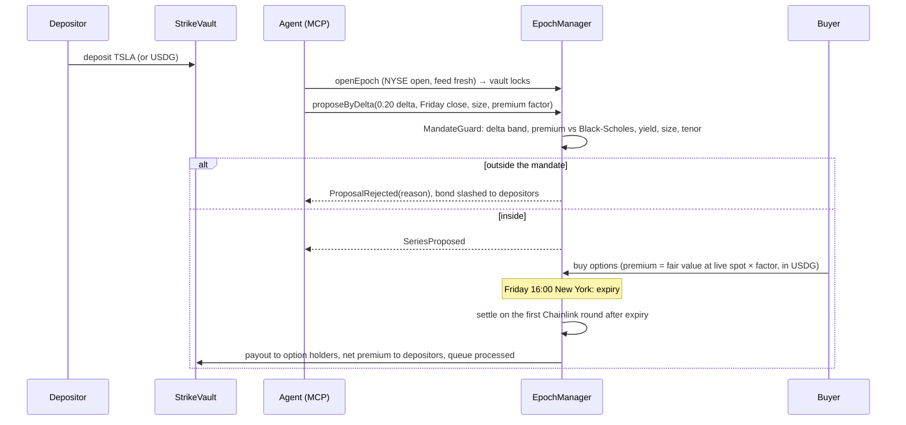

# Strike

[](https://github.com/Prashant-thakur77/Strike/actions/workflows/ci.yml) [](LICENSE)  

Weekly options vaults for Robinhood Chain stock tokens. Depositors earn premium in USDG. An AI agent picks each week's strike, and the contract rejects any proposal outside the vault's mandate and slashes the agent's bond.

Built for the Arbitrum Open House Singapore buildathon. Unaudited: testnet first, and any mainnet vault is capped.

|                  |                                              |
| ---------------- | -------------------------------------------- |
| Live app         | pending deployment (see [status](#status))   |
| Demo video       | pending                                      |
| Agent skill file | [docs/STRIKE_SKILL.md](docs/STRIKE_SKILL.md) |
| Design spec      | [docs/design.md](docs/design.md)             |
| Threat model     | [docs/threat-model.md](docs/threat-model.md) |

## Why

Robinhood Chain has tokenized TSLA, NVDA, SPY and others, but holding them earns nothing. There are perps on the chain and no options (CertiK, Aug 2026). Stock-token market cap is about $14M while roughly $400M of stablecoins sit idle.

Building anything on these tokens also means handling their quirks correctly:

| Problem                        | What goes wrong                                                                                                                                   | What Strike does                                                                                                                                                          |
| ------------------------------ | ------------------------------------------------------------------------------------------------------------------------------------------------- | ------------------------------------------------------------------------------------------------------------------------------------------------------------------------- |
| No yield, no hedging           | Holders can only hold or sell                                                                                                                     | Covered-call and cash-secured-put vaults paying weekly premium in USDG                                                                                                    |
| ERC-8056 `uiMultiplier`        | Chainlink stock prices already include the dividend/split multiplier. Multiplying again overprices the token (NVDA's live multiplier is 1.000775) | Strikes, spot and payouts all stay in the feed's own per-raw-token unit. The multiplier is never applied ([fork test](contracts/test/fork/RobinhoodFork.t.sol))           |
| Weekend and holiday prices     | Tokens trade 24/7 but the equity feed freezes when NYSE is closed                                                                                 | Opening and selling need an open NYSE session. Settlement uses the first print after expiry, so a Friday expiry settles on Monday's open if there was no print in between |
| Two pause layers               | Both the token and its oracle can be paused. `oraclePaused()` does not even exist on the testnet tokens                                           | Every read checks both, defensively. Settlement waits instead of using a bad price                                                                                        |
| Splits and dividends mid-epoch | Feed and multiplier can be briefly inconsistent around `effectiveAt`                                                                              | Sales stop from announcement until `effectiveAt` plus a grace period. A settlement print inside that window is refused                                                    |
| Agents with keys               | An agent that can trade a vault can drain it                                                                                                      | Agents only propose. The contract checks the mandate and punishes violations                                                                                              |

## How it works



A covered call pays the buyer `(S − K) / S` stock tokens per option when it expires in the money. A put pays `(K − S)` USDG. Collateral is locked per option sold, so the vault can never owe more than it holds. The full lifecycle, formulas and invariants are in [docs/design.md](docs/design.md).

### Contracts

| Contract                                                                                                             | Role                                                                                                                                |
| -------------------------------------------------------------------------------------------------------------------- | ----------------------------------------------------------------------------------------------------------------------------------- |
| [`EpochManager`](contracts/src/core/EpochManager.sol)                                                                | Epoch state machine: open, propose, buy, settle, redeem. The only contract that can lock a vault or move its collateral             |
| [`StrikeVault`](contracts/src/vaults/StrikeVault.sol)                                                                | ERC-4626 vault (EIP-1167 clone). Queues deposits and redemptions during an epoch. Pays premium through a per-share USDG accumulator |
| [`VaultFactory`](contracts/src/vaults/VaultFactory.sol)                                                              | Anyone can create a vault on an allow-listed stock token with an immutable mandate                                                  |
| [`MandateGuard`](contracts/src/libraries/MandateGuard.sol)                                                           | Pure check of a proposal against the mandate. Returns one of nine named reasons                                                     |
| [`AgentRegistry`](contracts/src/agents/AgentRegistry.sol)                                                            | Agents, signer keys, payout addresses, ERC-8004 identity link, USDG bond, slashing                                                  |
| [`SafeStockFeed`](contracts/src/libraries/SafeStockFeed.sol) + [`StockOracle`](contracts/src/oracle/StockOracle.sol) | Every price read: staleness, both pauses, corporate actions, sequencer uptime, settlement round selection                           |
| [`MarketCalendar`](contracts/src/oracle/MarketCalendar.sol)                                                          | NYSE hours on-chain, DST-aware, with holidays and early closes                                                                      |
| [`BlackScholesLib`](contracts/src/pricing/BlackScholesLib.sol) and the [Stylus pricer](stylus/pricer/src/math.rs)    | The same fixed-point Black-Scholes algorithm in Solidity and in Rust                                                                |
| [`FeeManager`](contracts/src/core/FeeManager.sol)                                                                    | 10% performance fee on positive epoch PnL, half to the proposing agent, capped at 30%                                               |
| [`OptionToken`](contracts/src/tokens/OptionToken.sol)                                                                | ERC-1155 options, one id per series                                                                                                 |

## How Strike uses the stack

| Technology                              | Where                                                                                                                                                                                                                                       |
| --------------------------------------- | ------------------------------------------------------------------------------------------------------------------------------------------------------------------------------------------------------------------------------------------- |
| Robinhood Chain stock tokens (ERC-8056) | [`IStockToken`](contracts/src/interfaces/IStockToken.sol), the corporate-action gate in [`SafeStockFeed.corporateAction`](contracts/src/libraries/SafeStockFeed.sol#L105), real-token [fork tests](contracts/test/fork/RobinhoodFork.t.sol) |
| Chainlink stock feeds                   | [`SafeStockFeed.latest`](contracts/src/libraries/SafeStockFeed.sol#L39) and first-round-after-expiry [`settlementPrice`](contracts/src/libraries/SafeStockFeed.sol#L70)                                                                     |
| Paxos USDG                              | Premium, put collateral, fees and agent bonds. Real addresses on all four networks in [`Deploy.s.sol`](contracts/script/Deploy.s.sol#L135)                                                                                                  |
| Arbitrum Stylus                         | [`strike_for_delta`](stylus/pricer/src/math.rs#L258), used on-chain by [`proposeByDelta`](contracts/src/core/EpochManager.sol#L337). 6.5× cheaper than Solidity for this call ([gas table](docs/gas.md))                                    |
| ERC-8004 agent identity                 | [`AgentRegistry._checkIdentity`](contracts/src/agents/AgentRegistry.sol#L261) verifies `ownerOf` on the official identity registry                                                                                                          |
| MCP                                     | [`mcp/`](mcp/) server and [`agents/example`](agents/example/)                                                                                                                                                                               |

## Safety evidence

373 Foundry tests and 15 Rust tests, all in CI.

| Check           | Result                                                                                                                                             |
| --------------- | -------------------------------------------------------------------------------------------------------------------------------------------------- |
| Unit tests      | Every function and custom error, [`contracts/test/unit`](contracts/test/unit) and neighbours                                                       |
| Coverage        | 99.2% of lines, 98.8% of statements, 95.8% of branches, 100% of functions across `src/` (`make coverage`)                                          |
| Integration     | Full epochs for calls and puts, in and out of the money, a crash to zero, the queue across epochs, rejection and slashing, abort, emergency cancel |
| Invariants      | 9 properties on a call vault and a put vault, 32,768 random calls each in the CI profile ([list](docs/testing.md#invariants))                      |
| Mutation checks | Three injected bugs, all caught by the invariants ([details](docs/testing.md#mutation-checks))                                                     |
| Differential    | Stylus (Rust) and Solidity pricers return identical results on 10,000 fuzz inputs, 300 vectors and on-chain on a Nitro dev node                    |
| Fork tests      | Robinhood Chain mainnet: real TSLA, NVDA, SPY feeds and multipliers, real USDG, real ERC-8004 registries, a full epoch                             |
| Calendar        | Session times match Python `zoneinfo` for every day from 2026 to 2030                                                                              |
| Static analysis | Slither: 0 High, every other finding justified in [docs/security/slither.md](docs/security/slither.md)                                             |
| Threat model    | 18 threats with mitigation and the test that covers each: [docs/threat-model.md](docs/threat-model.md)                                             |

The unit suite found two real bugs in the vault before deployment (claims of zero-value processed requests). Both are fixed, with regression tests ([commit](https://github.com/Prashant-thakur77/Strike/commit/9d677d5)).

## Gas: Stylus vs Solidity

| Call                                   |  Solidity |  Stylus |
| -------------------------------------- | --------: | ------: |
| `quote` (one Black-Scholes evaluation) |    33,969 |  40,624 |
| `strikeForDelta` (48 evaluations)      | 1,546,443 | 235,880 |

A Stylus call pays a fixed entry cost, so for a single quote Solidity is cheaper. For real work Stylus is 6.5× cheaper, and that is where Strike uses it. Method and more rows in [docs/gas.md](docs/gas.md).

## Status

| Network                         | Status                                                                           |
| ------------------------------- | -------------------------------------------------------------------------------- |
| Robinhood Chain testnet (46630) | Deploy script rehearsed on a fork of the live testnet; waiting for testnet funds |
| Arbitrum Sepolia (421614)       | Ready; waiting for testnet funds                                                 |
| Robinhood Chain mainnet (4663)  | Planned: one capped vault after testnet                                          |

Deployed addresses will be listed here with explorer links.

## Quickstart

```bash
git clone --recursive https://github.com/Prashant-thakur77/Strike && cd Strike
make test                                  # Foundry: unit, integration, fuzz, invariants
make stylus-test                           # Rust pricer
pnpm install && pnpm -r test               # SDK, MCP server, agent
ROBINHOOD_RPC_URL=https://rpc.mainnet.chain.robinhood.com forge test --root contracts --match-path "test/fork/*"
```

Deploy (writes `contracts/deployments/<chainId>.json`):

```bash
cd contracts
forge script script/Deploy.s.sol --rpc-url robinhood_testnet --broadcast
forge script script/Seed.s.sol --rpc-url robinhood_testnet --broadcast
```

## Prior art

Options vaults exist on other chains (Ribbon, now Aevo; Lyra, now Derive; Thetanuts), and a daily-options product has recently launched on Robinhood Chain. What Strike adds is the agent layer (immutable mandates, bonded agents, slashing paid to depositors, on-chain strike solving) and a price-safety layer written for ERC-8056 stock tokens that any Robinhood Chain protocol can reuse.

## Repository

| Folder            | Contents                                            |
| ----------------- | --------------------------------------------------- |
| `contracts/`      | Solidity (Foundry)                                  |
| `stylus/pricer/`  | Rust Stylus pricer                                  |
| `sdk/`            | `@strike/sdk` TypeScript client                     |
| `mcp/`            | MCP server for agents                               |
| `agents/example/` | Example strike-picking agent                        |
| `app/`            | Next.js app                                         |
| `subgraph/`       | Indexer                                             |
| `docs/`           | Plan, design, threat model, testing, gas, decisions |

## AI usage

This project was built with AI coding assistants (Claude) working under the author's direction, including code generation, tests and documentation. Every contract change is covered by the test suites above, and the design decisions are logged in [docs/decisions.md](docs/decisions.md).

## License

[MIT](LICENSE)
