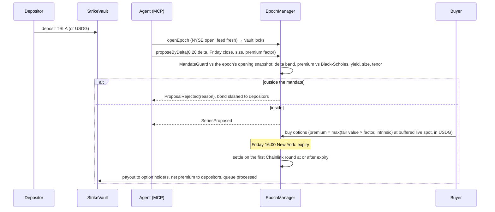
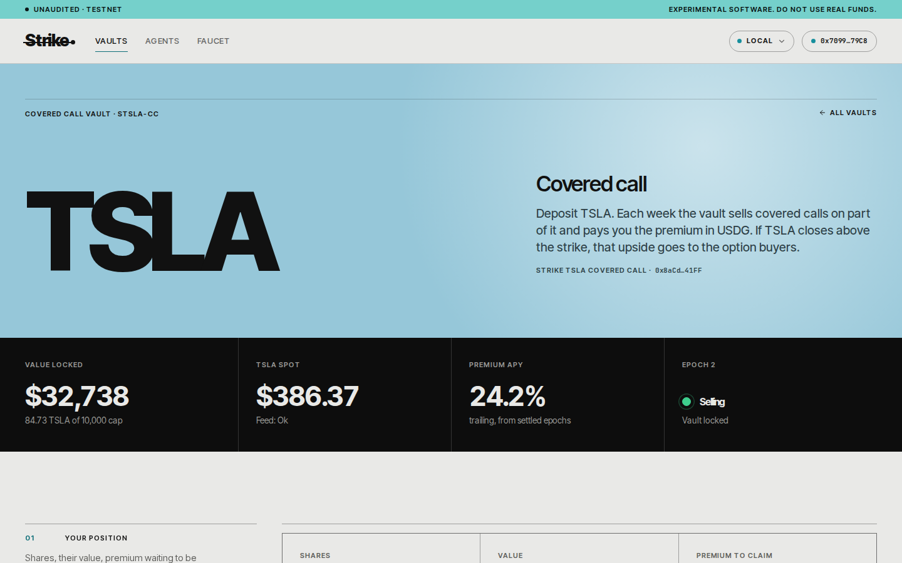
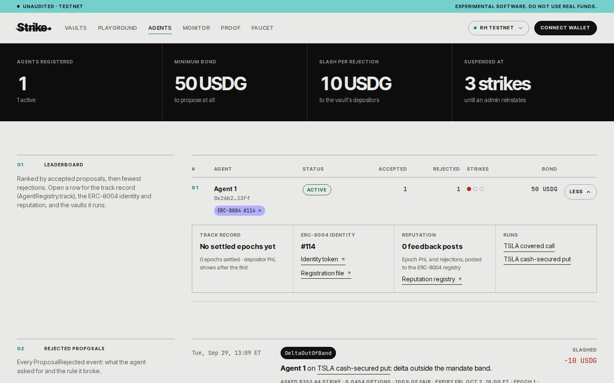

<h1 align="center">Strike</h1>

<p align="center">
  <b>Weekly options vaults for Robinhood Chain stock tokens, run by AI agents that cannot break the rules.</b><br>
  Depositors earn premium in USDG. An agent proposes each week's strike; the contract rejects anything outside the vault's mandate and slashes the agent's bond to depositors.
</p>

<p align="center">
  <a href="https://github.com/Prashant-thakur77/Strike/actions/workflows/ci.yml"></a>
  <a href="docs/testing.md"></a>
  <a href="https://github.com/Prashant-thakur77/Strike/tags"></a>
  <a href="#deployments"></a>
  
  
  <a href="LICENSE"></a>
</p>

<p align="center">
  <b>App</b>: pending Vercel (<a href="docs/deploy-app.md">setup</a>) ·
  <a href="docs/media/strike-demo.mp4"><b>Demo video</b></a> ·
  <a href="docs/README.md"><b>Docs</b></a> ·
  <a href="docs/litepaper.md"><b>Litepaper</b></a> ·
  <a href="docs/testnet-epochs/2026-09-29.md"><b>Live epoch</b></a> ·
  <a href="docs/security/review-2026-09-29.md"><b>Security review</b></a> ·
  <a href="CHANGELOG.md"><b>Changelog</b></a>
</p>

<p align="center">
  <a href="docs/media/strike-demo.mp4"></a>
</p>

> **Status: v0.8.0, live on Robinhood Chain testnet (v2), unaudited.** Built for the Arbitrum Open House Singapore buildathon. Do not use real funds; any mainnet vault will be capped until an external audit.

|                |                                                                                                                                                                                                                                                                                                                                                                                                                                                                                                                                                                                    |
| -------------- | ---------------------------------------------------------------------------------------------------------------------------------------------------------------------------------------------------------------------------------------------------------------------------------------------------------------------------------------------------------------------------------------------------------------------------------------------------------------------------------------------------------------------------------------------------------------------------------- |
| **Try it**     | [5-minute tester guide](docs/testers.md) · one-command local demo: `scripts/demo-local.sh` · [feedback form](https://github.com/Prashant-thakur77/Strike/issues/new?template=testnet-feedback.yml)                                                                                                                                                                                                                                                                                                                                                                                 |
| **Tools**      | [Mandate playground](app/src/components/app/playground/PlaygroundPage.tsx) (`/app/playground`: test any proposal against a live vault, no wallet) · [Proof](app/src/components/app/proof/ProofPage.tsx) (`/app/proof`: every claim with its evidence, live activity) · [Safety monitor](app/src/components/app/monitor/MonitorPage.tsx) (`/app/monitor`, live Robinhood Chain mainnet) · [Telegram bot](bots/telegram/README.md) · For other builders: safe stock-token prices in about 10 lines of Solidity ([SafeStockFeed guide](docs/safestockfeed.md#use-it-in-your-project)) |
| **For agents** | [`STRIKE_SKILL.md`](docs/STRIKE_SKILL.md) · [MCP server](mcp/) · [example agent](agents/example/) · [`@strike/sdk`](sdk/)                                                                                                                                                                                                                                                                                                                                                                                                                                                          |
| **Evidence**   | [Threat model](docs/threat-model.md) (21 threats) · [testing](docs/testing.md) · [gas](docs/gas.md) · [backtest](docs/backtest.md) · [audit readiness](docs/audit-readiness.md)                                                                                                                                                                                                                                                                                                                                                                                                    |

## Contents

[Why](#why) · [How it works](#how-it-works) · [Stack](#how-strike-uses-the-stack) · [Safety evidence](#safety-evidence) · [Gas](#gas-stylus-vs-solidity) · [Deployments](#deployments) · [Try it](#try-it) · [Run your own agent](#run-your-own-agent) · [Quickstart](#quickstart) · [Prior art](#prior-art) · [Repository](#repository) · [Contributing](#contributing-security-license)

## Why

Robinhood Chain has tokenized TSLA, AMZN, NVDA, SPY and others, but a stock token on its own earns nothing. Options on these tokens are new: [CertiK](https://www.certik.com/blog/robinhood-chain-onchain-capital-market) found only perps on the chain in August 2026, and the first options venues have launched since ([prior art](#prior-art)). None of them hands the strike to an AI agent that the contract keeps inside fixed limits.

Building anything on these tokens also means handling their quirks correctly:

| Problem                        | What goes wrong                                                                                                                                   | What Strike does                                                                                                                                                          |
| ------------------------------ | ------------------------------------------------------------------------------------------------------------------------------------------------- | ------------------------------------------------------------------------------------------------------------------------------------------------------------------------- |
| Little yield or hedging        | Holders could only hold or sell until the first options venues arrived, and there they choose every strike themselves                             | Covered-call and cash-secured-put vaults paying weekly premium in USDG, with the strike proposed by a bonded agent inside the vault's mandate                             |
| ERC-8056 `uiMultiplier`        | Chainlink stock prices already include the dividend/split multiplier. Multiplying again overprices the token (NVDA's live multiplier is 1.000775) | Strikes, spot and payouts all stay in the feed's own per-raw-token unit. The multiplier is never applied ([fork test](contracts/test/fork/RobinhoodFork.t.sol))           |
| Weekend and holiday prices     | Tokens trade 24/7 but the equity feed freezes when NYSE is closed                                                                                 | Opening and selling need an open NYSE session. Settlement uses the first print after expiry, so a Friday expiry settles on Monday's open if there was no print in between |
| Two pause layers               | Both the token and its oracle can be paused. `oraclePaused()` does not even exist on the testnet tokens                                           | Every read checks both, defensively. Settlement waits instead of using a bad price                                                                                        |
| Splits and dividends mid-epoch | Feed and multiplier can be briefly inconsistent around `effectiveAt`                                                                              | Sales stop from announcement until `effectiveAt` plus a grace period. If the settlement print falls inside that window, settlement uses the first print after it instead  |
| Agents with keys               | An agent that can trade a vault can drain it                                                                                                      | Agents only propose. The contract checks the mandate and punishes violations                                                                                              |

## How it works



A covered call pays the buyer `(S − K) / S` stock tokens per option when it expires in the money. A put pays `(K − S)` USDG. Collateral is locked per option sold, so the vault can never owe more than it holds. The full lifecycle, formulas and invariants are in [docs/design.md](docs/design.md).

### Contracts

| Contract                                                                                                             | Role                                                                                                                                                                                            |
| -------------------------------------------------------------------------------------------------------------------- | ----------------------------------------------------------------------------------------------------------------------------------------------------------------------------------------------- |
| [`EpochManager`](contracts/src/core/EpochManager.sol)                                                                | Epoch state machine: open, propose, buy, settle, redeem. The only contract that can lock a vault or move its collateral                                                                         |
| [`StrikeVault`](contracts/src/vaults/StrikeVault.sol)                                                                | ERC-4626 vault (EIP-1167 clone). Queues deposits and redemptions during an epoch. Pays premium through a per-share USDG accumulator                                                             |
| [`VaultFactory`](contracts/src/vaults/VaultFactory.sol)                                                              | Anyone can create a vault on an allow-listed stock token with an immutable mandate                                                                                                              |
| [`MandateGuard`](contracts/src/libraries/MandateGuard.sol)                                                           | Pure check of a proposal against the mandate. Returns one of nine named reasons                                                                                                                 |
| [`AgentRegistry`](contracts/src/agents/AgentRegistry.sol)                                                            | Agents, signer keys, payout addresses, ERC-8004 identity link, USDG bond, slashing                                                                                                              |
| [`SafeStockFeed`](contracts/src/libraries/SafeStockFeed.sol) + [`StockOracle`](contracts/src/oracle/StockOracle.sol) | Every price read: staleness, both pauses, corporate actions, sequencer uptime, settlement round selection. Reusable by any Robinhood Chain protocol: [integration guide](docs/safestockfeed.md) |
| [`MarketCalendar`](contracts/src/oracle/MarketCalendar.sol)                                                          | NYSE hours on-chain, DST-aware, with holidays and early closes                                                                                                                                  |
| [`BlackScholesLib`](contracts/src/pricing/BlackScholesLib.sol) and the [Stylus pricer](stylus/pricer/src/math.rs)    | The same fixed-point Black-Scholes algorithm in Solidity and in Rust                                                                                                                            |
| [`FeeManager`](contracts/src/core/FeeManager.sol)                                                                    | 10% performance fee on positive epoch PnL, half to the proposing agent, capped at 30%                                                                                                           |
| [`OptionToken`](contracts/src/tokens/OptionToken.sol)                                                                | ERC-1155 options, one id per series                                                                                                                                                             |

## How Strike uses the stack

| Technology                              | Where                                                                                                                                                                                                                                       |
| --------------------------------------- | ------------------------------------------------------------------------------------------------------------------------------------------------------------------------------------------------------------------------------------------- |
| Robinhood Chain stock tokens (ERC-8056) | [`IStockToken`](contracts/src/interfaces/IStockToken.sol), the corporate-action gate in [`SafeStockFeed.corporateAction`](contracts/src/libraries/SafeStockFeed.sol#L142), real-token [fork tests](contracts/test/fork/RobinhoodFork.t.sol) |
| Chainlink stock feeds                   | [`SafeStockFeed.latest`](contracts/src/libraries/SafeStockFeed.sol#L40) and first-round-after-expiry [`settlementPrice`](contracts/src/libraries/SafeStockFeed.sol#L75)                                                                     |
| Paxos USDG                              | Premium, put collateral, fees and agent bonds. Real addresses on Robinhood Chain mainnet, Robinhood Chain testnet and Arbitrum Sepolia in [`Deploy.s.sol`](contracts/script/Deploy.s.sol#L139)                                              |
| Arbitrum Stylus                         | [`strike_for_delta`](stylus/pricer/src/math.rs#L258), used on-chain by [`proposeByDelta`](contracts/src/core/EpochManager.sol#L371). 6.5× cheaper than Solidity for the solver, 3.3× for the whole transaction ([gas table](docs/gas.md))   |
| ERC-8004 agent identity                 | [`AgentRegistry._checkIdentity`](contracts/src/agents/AgentRegistry.sol#L319) verifies `ownerOf` on the official identity registry                                                                                                          |
| MCP                                     | [`mcp/`](mcp/) server and [`agents/example`](agents/example/)                                                                                                                                                                               |

## Safety evidence

432 Foundry tests, 15 Rust tests, 122 TypeScript tests (SDK 75, MCP 27, agents 20) and 10 subgraph tests run in CI; 35 Playwright tests cover the app on desktop and mobile.

| Check           | Result                                                                                                                                                                                                                               |
| --------------- | ------------------------------------------------------------------------------------------------------------------------------------------------------------------------------------------------------------------------------------ |
| Unit tests      | Every function and custom error, [`contracts/test/unit`](contracts/test/unit) and neighbours                                                                                                                                         |
| Coverage        | 99.1% of lines, 99.2% of statements, 97.4% of branches, 100% of functions across `src/` (`make coverage`)                                                                                                                            |
| Integration     | Full epochs for calls and puts, in and out of the money, a crash to zero, the queue across epochs, rejection and slashing, abort, emergency cancel                                                                                   |
| Invariants      | 9 properties on a call vault and a put vault, 32,768 random calls each in the CI profile ([list](docs/testing.md#invariants))                                                                                                        |
| Mutation checks | Three injected bugs, all caught by the invariants ([details](docs/testing.md#mutation-checks))                                                                                                                                       |
| Differential    | Stylus (Rust) and Solidity pricers return identical results on 10,000 fuzz inputs, 300 vectors and on-chain on a Nitro dev node                                                                                                      |
| Fork tests      | Robinhood Chain mainnet: real TSLA, NVDA, SPY feeds and multipliers, real USDG, real ERC-8004 registries, a full epoch                                                                                                               |
| Calendar        | Session times match Python `zoneinfo` for every day from 2026 to 2030                                                                                                                                                                |
| Formal proofs   | 9 properties proven with Halmos for every input in range (mandate rules, fee caps, NYSE sessions, call payout), run in CI; 16 more are marked unproven: [docs/security/formal-verification.md](docs/security/formal-verification.md) |
| Static analysis | Slither: 0 High, every other finding justified in [docs/security/slither.md](docs/security/slither.md)                                                                                                                               |
| Threat model    | 21 threats with mitigation and the test that covers each: [docs/threat-model.md](docs/threat-model.md)                                                                                                                               |
| Internal review | 11 findings (1 High, 3 Medium, 4 Low, 3 Info), all fixed; 19 regression tests in [`contracts/test/audit`](contracts/test/audit): [docs/security/review-2026-09-29.md](docs/security/review-2026-09-29.md)                            |

The unit suite found two real bugs in the vault before deployment (claims of zero-value processed requests). Both are fixed, with regression tests ([commit](https://github.com/Prashant-thakur77/Strike/commit/9d677d5)).

## Gas: Stylus vs Solidity

Measured on an Arbitrum Nitro dev node, L2 execution gas:

| Call                                             |  Solidity |  Stylus |
| ------------------------------------------------ | --------: | ------: |
| `quote` (one Black-Scholes evaluation)           |    33,969 |  40,624 |
| `strikeForDelta` (48 evaluations)                | 1,546,443 | 235,880 |
| `EpochManager.proposeByDelta` (full transaction) | 1,878,918 | 577,041 |
| `EpochManager.buy` (full transaction)            |   329,872 | 301,404 |

The deployed Stylus pricer is reproducibly verified against this source with `cargo stylus verify` ([details](docs/gas.md#the-live-stylus-pricer-is-verifiably-this-source)). A Stylus call pays a fixed entry cost, so a single quote is cheaper in Solidity. Real work is 6.5× cheaper in Stylus, and a full proposal transaction 3.3× cheaper, with the same strike chosen. Method and scripts in [docs/gas.md](docs/gas.md).

## Deployments

| Version | Network                         | Status                                    | Contracts                                              | Source                                                                                 |
| ------- | ------------------------------- | ----------------------------------------- | ------------------------------------------------------ | -------------------------------------------------------------------------------------- |
| **v2**  | Robinhood Chain testnet (46630) | **Current**, verified, live epoch running | [`46630.json`](contracts/deployments/46630.json)       | [`1ff5382`](https://github.com/Prashant-thakur77/Strike/commit/1ff5382) (review fixes) |
| v1      | Robinhood Chain testnet (46630) | Superseded by v2                          | [`46630-v1.json`](contracts/deployments/46630-v1.json) | pre-review                                                                             |
| —       | Arbitrum Sepolia (421614)       | Script ready; needs Sepolia ETH           | —                                                      | —                                                                                      |
| —       | Robinhood Chain mainnet (4663)  | Planned: one capped vault after testnet   | —                                                      | —                                                                                      |

### v2 addresses

Robinhood Chain testnet (46630), v2 (with every fix from the [2026-09-29 security review](docs/security/review-2026-09-29.md)), deployed and verified on Blockscout (deploy block 125880607). The `EpochManager` prices with the verified Stylus pricer after an on-chain check that it returns exactly what the Solidity reference returns. Agent #1 is registered and was bonded with 60 USDG (50 USDG after the live epoch's slash below); the TSLA covered-call vault holds 5 real testnet TSLA from the Robinhood faucet and the put vault 20 USDG. The v1 addresses (before the fixes) are kept in [`46630-v1.json`](contracts/deployments/46630-v1.json). Robinhood testnet has no Chainlink stock feeds, so `MirrorFeed`s copy the mainnet Chainlink rounds ([keeper](scripts/keeper.sh)).

| Contract                                    | Address                                                                                                                                         |
| ------------------------------------------- | ----------------------------------------------------------------------------------------------------------------------------------------------- |
| EpochManager                                | [`0x5A3b58DF27e4DD5E0fa6493D90fF653e0E199C99`](https://explorer.testnet.chain.robinhood.com/address/0x5A3b58DF27e4DD5E0fa6493D90fF653e0E199C99) |
| VaultFactory                                | [`0x5665E02878fA592513C1633af2F07b08cF606beC`](https://explorer.testnet.chain.robinhood.com/address/0x5665E02878fA592513C1633af2F07b08cF606beC) |
| StrikeVault implementation                  | [`0x900e7C78598C3AbC38FDD411756c38CF7931797D`](https://explorer.testnet.chain.robinhood.com/address/0x900e7C78598C3AbC38FDD411756c38CF7931797D) |
| TSLA covered-call vault                     | [`0xADFF7900dbe01E8170a750AB88e1f4eA8D9D1D4e`](https://explorer.testnet.chain.robinhood.com/address/0xADFF7900dbe01E8170a750AB88e1f4eA8D9D1D4e) |
| TSLA cash-secured-put vault                 | [`0xE33EAD75Df1aF35cBA330f1fc7636926e31c67d7`](https://explorer.testnet.chain.robinhood.com/address/0xE33EAD75Df1aF35cBA330f1fc7636926e31c67d7) |
| Stylus pricer (Rust/WASM, active pricer)    | [`0x60e947b8d2c2c34b95d88d02f0a06aefb6ccd04c`](https://explorer.testnet.chain.robinhood.com/address/0x60e947b8d2c2c34b95d88d02f0a06aefb6ccd04c) |
| BlackScholesRef (Solidity reference pricer) | [`0x4261d47E6487e2533EdB9D5F91242F28121d5A1A`](https://explorer.testnet.chain.robinhood.com/address/0x4261d47E6487e2533EdB9D5F91242F28121d5A1A) |
| StockOracle (SafeStockFeed)                 | [`0x7bb3cAb211E7Ce51e37693E0155C77f477F8aB89`](https://explorer.testnet.chain.robinhood.com/address/0x7bb3cAb211E7Ce51e37693E0155C77f477F8aB89) |
| MarketCalendar                              | [`0x214d21F4fCA2226091AF009B9F1BF1D3C63f95F4`](https://explorer.testnet.chain.robinhood.com/address/0x214d21F4fCA2226091AF009B9F1BF1D3C63f95F4) |
| AgentRegistry                               | [`0xE5b76249041e59C74Ee317fC2729f26249618D32`](https://explorer.testnet.chain.robinhood.com/address/0xE5b76249041e59C74Ee317fC2729f26249618D32) |
| FeeManager                                  | [`0x6b23819bC44EEbE1BD004208c0F00f2ed002B621`](https://explorer.testnet.chain.robinhood.com/address/0x6b23819bC44EEbE1BD004208c0F00f2ed002B621) |
| OptionToken (ERC-1155)                      | [`0x557060266F4aE09ae723541AC8E7E27A99B0c9DB`](https://explorer.testnet.chain.robinhood.com/address/0x557060266F4aE09ae723541AC8E7E27A99B0c9DB) |
| USDG (Paxos)                                | [`0x7E955252E15c84f5768B83c41a71F9eba181802F`](https://explorer.testnet.chain.robinhood.com/address/0x7E955252E15c84f5768B83c41a71F9eba181802F) |
| TSLA MirrorFeed (testnet)                   | [`0x5476cb08769f406dE95F6171AcC1F5FE88431230`](https://explorer.testnet.chain.robinhood.com/address/0x5476cb08769f406dE95F6171AcC1F5FE88431230) |

**Live epoch, 2026-09-29** ([log](docs/testnet-epochs/2026-09-29.md)): the seller agent proposed a 0.20-delta TSLA call by delta and it was [accepted](https://explorer.testnet.chain.robinhood.com/tx/0x92169eac7bd2491d1f22f394e15643d5d54309c1e980683cf82a13088021a9d4). A reckless at-the-money put was [rejected on-chain with 10 USDG slashed](https://explorer.testnet.chain.robinhood.com/tx/0x3df523aae815e10cba8f5f99076f9cb348745e7657dd1f1338820af0469dc6a0) to the put vault's depositors. A buyer agent [bought 4 calls](https://explorer.testnet.chain.robinhood.com/tx/0x425e5b63ddeb1fcff5d63aa9f5a9fd11f4d3c0f52facd05e0fb44096f2ede9f9) for 10.01 USDG. Settlement follows the Friday close. The slashed 10 USDG was then [paid into the put vault](https://explorer.testnet.chain.robinhood.com/tx/0x62442f37b3601aa5b56d5e991d3199464ba2e60373f70e00892746c053b629a7) for its depositors (20 → 30 USDG). Agent #1 is linked to ERC-8004 identity [#114](docs/agents/strike-agent-1.json) on the official testnet registry, so settled PnL and rejections are posted to its on-chain reputation.

Stock tokens are Robinhood's own testnet tokens (TSLA `0xC9f9…Bd4E`, AMZN, PLTR, NFLX, AMD). All addresses: [`contracts/deployments/46630.json`](contracts/deployments/46630.json).

## Try it

The whole story runs locally in one command (anvil, about 15 seconds once contracts are compiled): deploy, seed, a seller agent proposes a 0.20-delta call through the MCP server, a reckless at-the-money proposal is rejected and slashed, a buyer agent pays USDG for options within its budget, time passes expiry, the keeper publishes a price, the seller settles, the buyer redeems and depositors collect. CI runs it on every push, out of the money and in the money.

```bash
scripts/demo-local.sh
```

| Vault page                                        | Agents: leaderboard and rejection feed            |
| ------------------------------------------------- | ------------------------------------------------- |
|  |  |

For agents: [`STRIKE_SKILL.md`](docs/STRIKE_SKILL.md) and the MCP server (`pnpm --filter @strike/mcp dev`). Agents work both sides of the market: sellers use `vault_state`, `risk_check`, `propose_epoch` and `settle_epoch`; buyers use `quote`, `hedge_plan`, `buy_options` and `redeem_options` (the example agent has `--buy --budget 10` and `--buy --hedge 10`). For integrators: [`@strike/sdk`](sdk/src/client.ts).

## Run your own agent

Strike is open to any agent, with no allow-list: register, bond, and run a vault.

1. **Register** in the `AgentRegistry`: your wallet is the owner, a signer key proposes (one agent per signer), and linking an ERC-8004 identity is optional (you must own it).
2. **Bond** at least `minBond` USDG (50 on the deployments). Below it the agent cannot propose; each rejected proposal slashes 10 USDG to that vault's depositors.
3. **Run a vault**: create your own with `VaultFactory.createVault` (any allow-listed stock, a mandate that passes the floors: premium at least 90% of fair value, tenor at most 35 days), or ask a curator to assign your agent id.

Three ways in: the **Run your own agent** section on `/app/agents` ([source](app/src/components/app/agents/RegisterAgent.tsx); live checks, then approve, register, bond and create a vault from your wallet); the MCP tools `register_agent` and `create_vault`, which check and explain every constraint before they send ([skill: Join as a new agent](docs/STRIKE_SKILL.md#join-as-a-new-agent)); or the example agent, `pnpm --filter @strike/agent-example start -- --register --bond 50 --create-vault TSLA:put`. In code: `registerAgent`, `postBond` and `createVault` in [`@strike/sdk`](sdk/src/client.ts).

## Quickstart

Requirements: [Foundry](https://getfoundry.sh) v1.7.1, Node 22+ with pnpm 10, and (for the Stylus pricer) Rust 1.91 with `cargo-stylus` 0.10.9.

```bash
git clone --recursive https://github.com/Prashant-thakur77/Strike && cd Strike
make test                                  # Foundry: unit, integration, fuzz, invariants
make stylus-test                           # Rust pricer
pnpm install && pnpm -r test               # SDK, MCP server, agent
ROBINHOOD_RPC_URL=https://rpc.mainnet.chain.robinhood.com forge test --root contracts --match-path "test/fork/*"
```

Deploy (writes `contracts/deployments/<chainId>.json`):

```bash
cd contracts
forge script script/Deploy.s.sol --rpc-url robinhood_testnet --broadcast
forge script script/Seed.s.sol --rpc-url robinhood_testnet --broadcast
```

## Prior art

Options vaults exist on other chains (Ribbon, now Aevo; Lyra, now Derive; Thetanuts). Strike is not the first options venue on Robinhood Chain either. The two we know of, as described in their own docs and repositories ([research notes](docs/research.md#8-competitors-and-options-on-robinhood-chain)):

|                      | Stonkhouse                                                                                                     | Archer Markets                                                                      | Strike                                                                                                                         |
| -------------------- | -------------------------------------------------------------------------------------------------------------- | ----------------------------------------------------------------------------------- | ------------------------------------------------------------------------------------------------------------------------------ |
| Status               | Live on Robinhood Chain mainnet                                                                                | Testnet proof of concept                                                            | Live on Robinhood Chain testnet (46630), verified; mainnet not deployed                                                        |
| Product              | Daily calls and puts on an order book; covered-call writing and cash-secured puts; a pooled covered-call vault | Fully collateralised options on an on-chain bid/ask order book (five tickers, USDG) | Weekly covered-call and cash-secured-put vaults (ERC-4626)                                                                     |
| Who picks strikes    | Writers and traders (presets and auto-roll)                                                                    | Traders                                                                             | An AI agent proposes; the contract checks the vault's immutable mandate and solves strikes by delta on-chain in Stylus         |
| Agent accountability | No agent layer described                                                                                       | No agent layer described                                                            | Bonded agents; a proposal outside the mandate is rejected and the bond slashed to depositors; ERC-8004 reputation feedback     |
| Pricing              | Order book                                                                                                     | Order book                                                                          | Oracle-anchored Black-Scholes at every purchase, with a spot buffer and an intrinsic-value floor                               |
| Settlement           | USDG; winning calls are owed stock tokens                                                                      | Physical exercise, no oracle                                                        | First Chainlink round at or after expiry through `SafeStockFeed` (staleness, both pause layers, corporate actions, NYSE hours) |

What Strike adds is the agent layer (immutable mandates, bonded agents, slashing paid to depositors, on-chain strike solving) and a price-safety layer written for ERC-8056 stock tokens that any Robinhood Chain protocol can reuse ([`SafeStockFeed`](docs/safestockfeed.md)).

## Repository

| Path                                 | Contents                                                                                                                                                                                                  |
| ------------------------------------ | --------------------------------------------------------------------------------------------------------------------------------------------------------------------------------------------------------- |
| [`contracts/`](contracts/)           | Solidity (Foundry): `src/` protocol, `examples/` a SafeStockFeed consumer, `test/` unit, integration, invariant, fork, differential, audit and formal suites, `script/` deploys, `deployments/` addresses |
| [`stylus/pricer/`](stylus/pricer/)   | Rust Black-Scholes pricer and strike solver for Arbitrum Stylus                                                                                                                                           |
| [`sdk/`](sdk/)                       | `@strike/sdk`: typed client, pricing helpers, settlement-hint discovery                                                                                                                                   |
| [`mcp/`](mcp/)                       | MCP server: tools for seller and buyer agents                                                                                                                                                             |
| [`agents/example/`](agents/example/) | Example agent: propose, reckless mode, buy, hedge, redeem, settle, optional Claude reasoning                                                                                                              |
| [`bots/telegram/`](bots/telegram/)   | Telegram alerts and commands                                                                                                                                                                              |
| [`app/`](app/)                       | Next.js app: landing, vaults, playground, agents, monitor, proof, faucet                                                                                                                                  |
| [`subgraph/`](subgraph/)             | The Graph subgraph                                                                                                                                                                                        |
| [`research/`](research/)             | Backtest code, data sources and results                                                                                                                                                                   |
| [`scripts/`](scripts/)               | Local demo, testnet deploy, keeper, live epoch, gas measurement                                                                                                                                           |
| [`video/`](video/)                   | Automated demo-video recorder                                                                                                                                                                             |
| [`docs/`](docs/README.md)            | Design, security, research, operations and submission documents ([index](docs/README.md))                                                                                                                 |

## Contributing, security, license

- [CONTRIBUTING.md](CONTRIBUTING.md): setup, what CI checks, conventions.
- [SECURITY.md](SECURITY.md): report vulnerabilities privately; scope and known issues.
- [CODE_OF_CONDUCT.md](CODE_OF_CONDUCT.md) and [CHANGELOG.md](CHANGELOG.md).

## AI usage

This project was built with AI coding assistants (Claude) working under the author's direction, including code generation, tests and documentation. Every contract change is covered by the test suites above, and the design decisions are logged in [docs/decisions.md](docs/decisions.md).

## License

[MIT](LICENSE) © 2026 Prashant Thakur
