<h1 align="center">Strike</h1>

<p align="center">
  <b>Weekly options vaults for Robinhood Chain stock tokens, paid in USDG.</b><br>
  An AI agent proposes each week's strike. The contract checks it against the vault's immutable mandate, and a proposal that breaks the mandate is rejected and the agent's bond slashed to depositors.
</p>

<p align="center">
  <a href="https://github.com/Prashant-thakur77/Strike/actions/workflows/ci.yml"></a>
  <a href="https://github.com/Prashant-thakur77/Strike/actions/workflows/codeql.yml"></a>
  <a href="https://github.com/Prashant-thakur77/Strike/actions/workflows/gitleaks.yml"></a>
  <a href="#coverage"></a>
  <a href="https://github.com/Prashant-thakur77/Strike/tags"></a>
  <a href="docs/DEPLOYMENTS.md"></a>
  <a href="docs/testnet-epochs/2026-09-30-arbitrum-sepolia.md"></a>
  
  
  <a href="LICENSE"></a>
</p>

<p align="center">
  <a href="docs/JUDGES.md"><b>For judges</b></a> ·
  <a href="https://strike-options.vercel.app"><b>Live app</b></a> ·
  <a href="docs/media/strike-demo.mp4"><b>Demo video</b></a> ·
  <a href="docs/README.md"><b>Docs</b></a> ·
  <a href="docs/litepaper.md"><b>Litepaper</b></a> ·
  <a href="docs/testnet-epochs/2026-09-29.md"><b>Live epoch</b></a> ·
  <a href="docs/DEPLOYMENTS.md"><b>Deployments</b></a> ·
  <a href="docs/security/review-2026-09-29.md"><b>Security review</b></a> ·
  <a href="CHANGELOG.md"><b>Changelog</b></a>
</p>

<p align="center">
  <a href="docs/media/strike-demo.mp4">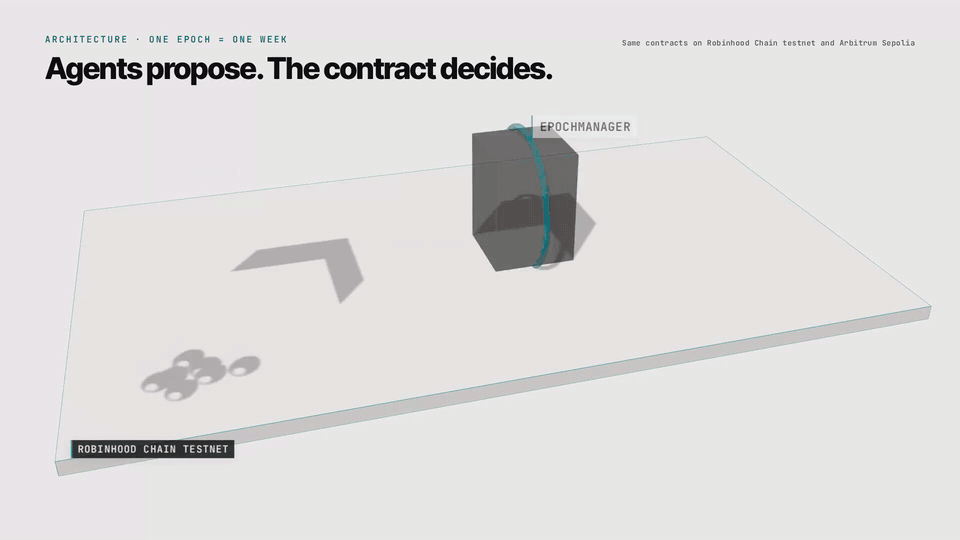</a>
</p>

> **Status: v0.9.0, live on Robinhood Chain testnet (v2 running its first epoch, v3 deployed next to it) and on Arbitrum Sepolia (v3, first epoch running), unaudited.** Built for the Arbitrum Open House Singapore buildathon. Do not use real funds; any mainnet vault will be capped until an external audit.

|                |                                                                                                                                                                                                                                                                                                                                                                                                                                                                                                                                                                                    |
| -------------- | ---------------------------------------------------------------------------------------------------------------------------------------------------------------------------------------------------------------------------------------------------------------------------------------------------------------------------------------------------------------------------------------------------------------------------------------------------------------------------------------------------------------------------------------------------------------------------------- |
| **Watch**      | [Demo walkthrough, narrated](docs/media/strike-demo.mp4) (5:13, chapters in [demo-script.md](docs/submission/demo-script.md)) · [2-minute pitch](docs/media/strike-pitch.mp4) (2:02) · [captioned demo without voice](docs/media/strike-demo-silent.mp4) · narration: open-source [Chatterbox](https://github.com/resemble-ai/chatterbox) TTS; [media credits](docs/media/CREDITS.md)                                                                                                                                                                                              |
| **Try it**     | [5-minute tester guide](docs/testers.md) · one-command local demo: `scripts/demo-local.sh` · [feedback form](https://github.com/Prashant-thakur77/Strike/issues/new?template=testnet-feedback.yml)                                                                                                                                                                                                                                                                                                                                                                                 |
| **Tools**      | [Mandate playground](app/src/components/app/playground/PlaygroundPage.tsx) (`/app/playground`: test any proposal against a live vault, no wallet) · [Proof](app/src/components/app/proof/ProofPage.tsx) (`/app/proof`: every claim with its evidence, live activity) · [Safety monitor](app/src/components/app/monitor/MonitorPage.tsx) (`/app/monitor`, live Robinhood Chain mainnet) · [Telegram bot](bots/telegram/README.md) · For other builders: safe stock-token prices in about 10 lines of Solidity ([SafeStockFeed guide](docs/safestockfeed.md#use-it-in-your-project)) |
| **For agents** | [`STRIKE_SKILL.md`](docs/STRIKE_SKILL.md) · [MCP server](mcp/) · [example agent](agents/example/) · [`@strike/sdk`](sdk/)                                                                                                                                                                                                                                                                                                                                                                                                                                                          |
| **Evidence**   | [Evidence in numbers](#evidence-in-numbers) · [deployments record](docs/DEPLOYMENTS.md) · [threat model](docs/threat-model.md) (21 threats) · [testing](docs/testing.md) · [gas](docs/gas.md) · [backtest](docs/backtest.md) · [audit readiness](docs/audit-readiness.md)                                                                                                                                                                                                                                                                                                          |

## Contents

[What works, what does not yet, what we cut](#what-works-what-does-not-yet-what-we-cut) · [Why](#why) · [How it works](#how-it-works) · [Architecture](#architecture) · [Stack](#how-strike-uses-the-stack) · [Why only here](#why-only-here-robinhood-chain-and-arbitrum) · [Screenshots](#screenshots) · [Evidence in numbers](#evidence-in-numbers) · [Claims and their tests](#claims-and-the-tests-that-check-them) · [Live epoch](#the-live-epoch) · [Backtest](#backtest) · [Competition](#competition) · [Versions and deployments](#versions-and-deployments) · [Try it](#try-it) · [Run your own agent](#run-your-own-agent) · [Quickstart](#quickstart) · [Repository](#repository) · [Contributing](#contributing-security-license)

## What works, what does not yet, what we cut

Checked against this repository and the chain on 2026-09-30. The milestone plan for what comes next is in [docs/MILESTONES.md](docs/MILESTONES.md), and answers to the hard questions are in [docs/submission/qa-prep.md](docs/submission/qa-prep.md).

### Works

- The v2 contracts on Robinhood Chain testnet (46630): 14 contracts verified on Blockscout, plus the Stylus pricer verified with `cargo stylus verify` ([DEPLOYMENTS.md](docs/DEPLOYMENTS.md)).
- One agent-run epoch on that deployment: an accepted 0.20-delta TSLA call, an out-of-mandate put rejected on-chain with 10 USDG slashed, 4 calls bought by a buyer agent, and the slash paid into the put vault ([log](docs/testnet-epochs/2026-09-29.md)).
- v3 on Arbitrum Sepolia (421614), 14 contracts verified on Blockscout or Sourcify and the Stylus pricer and risk engine verified and cached, with one live epoch opened on 30 September ([log](docs/testnet-epochs/2026-09-30-arbitrum-sepolia.md)). The accepted 0.20-delta call was planned by Claude through the Claude Code CLI, which dry-ran five candidates with `risk_check` before choosing ([record](docs/agent-log/arbitrum-sepolia/2026-09-30-sTSLA-CC.json), [tx](https://sepolia.arbiscan.io/tx/0xf26315b33df93548bfa31d68b7d9964792ef88184cb154796180e19b9365b5f4)); a reckless at-the-money put was rejected with 10 USDG slashed ([tx](https://sepolia.arbiscan.io/tx/0x4813b1089c8e6a3f3e728c74b9b6bb2d79ec73fb36ab0b5142abc72aa333756d)); a buyer bought all 4 calls ([tx](https://sepolia.arbiscan.io/tx/0x82e2d5b4e476edec205c80daca431a8becdd5fbdb1f84e3ca0dea8d7d49265f4)). Both decision records are anchored on-chain. Agent #1 is ERC-8004 identity #253 there.
- Agent #1 linked to ERC-8004 identity #114 on the official testnet Identity Registry.
- Agent decisions anchored on-chain: the verified `DecisionLog` contract at [`0xbF94…5D93`](https://explorer.testnet.chain.robinhood.com/address/0xbF94f54fd0258ac59e2f54B70754dFAfFd245D93) stores the hash of each decision record, and the first anchor is the 29 September epoch log ([tx](https://explorer.testnet.chain.robinhood.com/tx/0x934ab96ba12a9ad501e20c8366fc338ab35d0550b88cc2d76fc5c39991c524c4), [tests](contracts/test/agents/DecisionLog.t.sol)).
- A live risk panel on the vault page, the SDK's `seriesRisk` and the MCP tool `series_risk`: greeks, a ±30% stress test and the implied volatility of the last buy for the running series, computed on-chain by the v3 Stylus (Rust) risk engine ([`0x6115…a4ec`](https://explorer.testnet.chain.robinhood.com/address/0x61158d98c6c2b7ccb22755a098d0da2bbcf2a4ec)). The greeks match an independent scipy Black-Scholes to about 5e-15, and the last buy's implied volatility comes back as the 60% the contract priced it with ([test vector](sdk/test/risk.test.ts)).
- A `SafeStockFeed` conformance suite of 21 rules that any oracle wrapper can inherit and run ([`contracts/test/conformance`](contracts/test/conformance)).
- The app at [strike-options.vercel.app](https://strike-options.vercel.app), including the mandate playground (no wallet), the mainnet stock-token monitor and the proof page.
- Self-serve agent onboarding (register, bond, create a vault) from the app, the SDK, the MCP server and the example agent. There is no allow-list.
- Agent onboarding by URL: a read-only MCP endpoint at `https://strike-options.vercel.app/api/mcp`, and the skill file at [`/skill.md`](https://strike-options.vercel.app/skill.md) and [`/llms.txt`](https://strike-options.vercel.app/llms.txt).
- `scripts/demo-local.sh`: a full week on a local anvil chain. CI runs it once out of the money and once in the money.
- The test suites in [Evidence in numbers](#evidence-in-numbers). The [claims table](#claims-and-the-tests-that-check-them) maps each headline claim to one test and one command.

### Not yet

- The first epoch has not settled. Expiry is Friday 2026-10-02 at 20:00 UTC; settlement and the ERC-8004 feedback for identity #114 follow it.
- The Arbitrum Sepolia and 29 September epochs expire on Friday 2 October; neither has settled yet. On Arbitrum Sepolia the stock tokens are test tokens with a faucet and the prices come from `MirrorFeed`s, because that chain has neither stock tokens nor stock feeds.
- v3 is deployed and verified on Robinhood Chain testnet next to v2 ([EpochManager](https://explorer.testnet.chain.robinhood.com/address/0x256D4546486368dCb23E94758b4cb500c215929F), [Stylus pricer and risk engine](https://explorer.testnet.chain.robinhood.com/address/0x61158d98c6c2b7ccb22755a098d0da2bbcf2a4ec), [RiskLens](https://explorer.testnet.chain.robinhood.com/address/0xFDb8Ba33f4aAF1A699f1D5877E8ee5b6eDeDCc6D); [log](docs/testnet-epochs/2026-09-30-v3.md)), and agent #1 is registered on it with EIP-712 signer consent and ERC-8004 identity #114. It has no vaults or epoch yet: a vault needs an agent with 50 USDG bonded, and the deployer is waiting on testnet USDG from the faucet. The app, SDK and MCP still point at v2, which charges a fee on a week that only wins back an earlier loss; v3's high-water mark fixes that.
- Robinhood Chain testnet has no Chainlink stock feeds, so the testnet vaults read `MirrorFeed`s that a keeper fills with mainnet Chainlink rounds. On testnet the keeper key is trusted. The [fork tests](contracts/test/fork/RobinhoodFork.t.sol) run the same oracle code against the real mainnet feeds.
- No external audit and no mainnet vault. The internal review found 11 issues and all are fixed; that is not an audit.
- No outside users. In the live epoch the depositors, the agent and the buyer are all ours.
- The scheduled keeper and the weekly autonomous agent (GitHub Actions) are written but stay off until the repository secrets are set ([operations.md](docs/operations.md)).
- The subgraph is built and tested but not deployed to a host ([indexing.md](docs/indexing.md)). `@strike/sdk` and the MCP server are not published to npm.
- The Solidity-versus-Stylus gas comparison below was measured on a local Arbitrum Nitro dev node. On the live chain only the Stylus side has been measured ([gas.md](docs/gas.md#measured-on-the-live-chain)), and the pricer is not cached because Robinhood Chain testnet has no Stylus CacheManager yet.
- Collateral earns no interest while it waits: the pricer assumes a zero rate and idle USDG is not lent out.

### Cut, and why

- Upgradeable contracts and editable mandates. Depositors keep the limits they deposited under ([D13](docs/decisions.md)), so every fix ships as a new deployment ([D27](docs/decisions.md), [D34](docs/decisions.md)).
- An order book or auction. Each buy is priced at the oracle spot at that moment, so a price set on Monday cannot be picked off on Wednesday ([D9](docs/decisions.md)). The cost is that sales need buyers who accept the model price.
- Reverting on a bad proposal. A revert would undo the slash, so a rejection returns `false` and emits the reason ([D12](docs/decisions.md)).
- Market bounds in the proposal ABI. Proposals are judged against the market snapshot taken at `openEpoch` instead, so an honest agent's dry run decides its verdict ([D28](docs/decisions.md)).
- Stylus for everything. A single quote costs 1.1 to 1.6 times more in Stylus; the strike solver costs 6.5 times less, so that is where Stylus is used ([D22](docs/decisions.md)). Floating point was removed from the Rust build because Stylus activation rejected it ([D6](docs/decisions.md)).
- A separate `SafeStockFeed` package. It ships from `contracts/src` through one remapping, so integrators compile the exact files the live oracle was verified from ([D32](docs/decisions.md)).

## Why

Robinhood Chain has tokenized TSLA, AMZN, NVDA, SPY and more. Holding one earns the stock's return and nothing else. Options on these tokens are new: [CertiK](https://www.certik.com/blog/robinhood-chain-onchain-capital-market) found only perps on the chain in August 2026, and the first options venues have launched since ([competition](#competition)). None of them gives the strike to an AI agent and holds that agent to fixed limits in the contract.

Any protocol built on these tokens also has to handle their quirks:

| Problem                        | What goes wrong                                                                                                                                   | What Strike does                                                                                                                                                          |
| ------------------------------ | ------------------------------------------------------------------------------------------------------------------------------------------------- | ------------------------------------------------------------------------------------------------------------------------------------------------------------------------- |
| Little yield or hedging        | Holders could only hold or sell until the first options venues arrived, and there they choose every strike themselves                             | Covered-call and cash-secured-put vaults paying weekly premium in USDG, with the strike proposed by a bonded agent inside the vault's mandate                             |
| ERC-8056 `uiMultiplier`        | Chainlink stock prices already include the dividend/split multiplier. Multiplying again overprices the token (NVDA's live multiplier is 1.000775) | Strikes, spot and payouts all stay in the feed's own per-raw-token unit. The multiplier is never applied ([fork test](contracts/test/fork/RobinhoodFork.t.sol))           |
| Weekend and holiday prices     | Tokens trade 24/7 but the equity feed freezes when NYSE is closed                                                                                 | Opening and selling need an open NYSE session. Settlement uses the first print after expiry, so a Friday expiry settles on Monday's open if there was no print in between |
| Two pause layers               | Both the token and its oracle can be paused. `oraclePaused()` does not even exist on the testnet tokens                                           | Every read checks both, defensively. Settlement waits instead of using a bad price                                                                                        |
| Splits and dividends mid-epoch | Feed and multiplier can be briefly inconsistent around `effectiveAt`                                                                              | Sales stop from announcement until `effectiveAt` plus a grace period. If the settlement print falls inside that window, settlement uses the first print after it instead  |
| Agents with keys               | An agent that can trade a vault can drain it                                                                                                      | Agents only propose. The contract checks the mandate and punishes violations                                                                                              |

## How it works

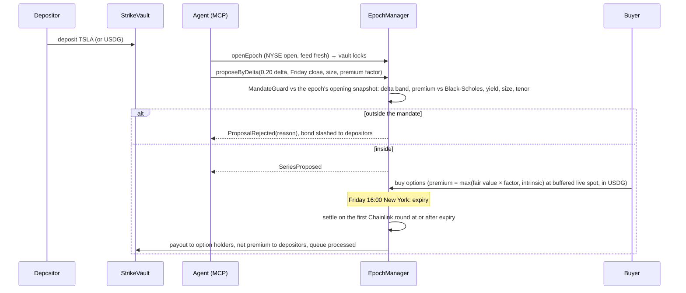
```mermaid
sequenceDiagram
    participant D as Depositor
    participant V as StrikeVault
    participant A as Agent (MCP)
    participant E as EpochManager
    participant B as Buyer
    D->>V: deposit TSLA (or USDG)
    A->>E: openEpoch (NYSE open, feed fresh) → vault locks
    A->>E: proposeByDelta(0.20 delta, Friday close, size, premium factor)
    E->>E: MandateGuard vs the epoch's opening snapshot: delta band, premium vs Black-Scholes, yield, size, tenor
    alt outside the mandate
        E-->>A: ProposalRejected(reason), bond slashed to depositors
    else inside
        E-->>A: SeriesProposed
        B->>E: buy options (premium = max(fair value × factor, intrinsic) at buffered live spot, in USDG)
        Note over E: Friday 16:00 New York: expiry
        E->>E: settle on the first Chainlink round at or after expiry
        E->>V: payout to option holders, net premium to depositors, queue processed
    end
```

A call that expires in the money pays the buyer `(S − K) / S` stock tokens per option. A put pays `(K − S)` USDG. The vault locks collateral for each option it sells, so it can never owe more than it holds. [docs/design.md](docs/design.md) has the full lifecycle, the formulas and the invariants.

### Architecture

The sequence above is one epoch. This is where each piece lives and which way data flows: agents and the app reach the contracts through the SDK, every price goes through `SafeStockFeed`, and the contracts' events feed the subgraph and the Telegram bot.

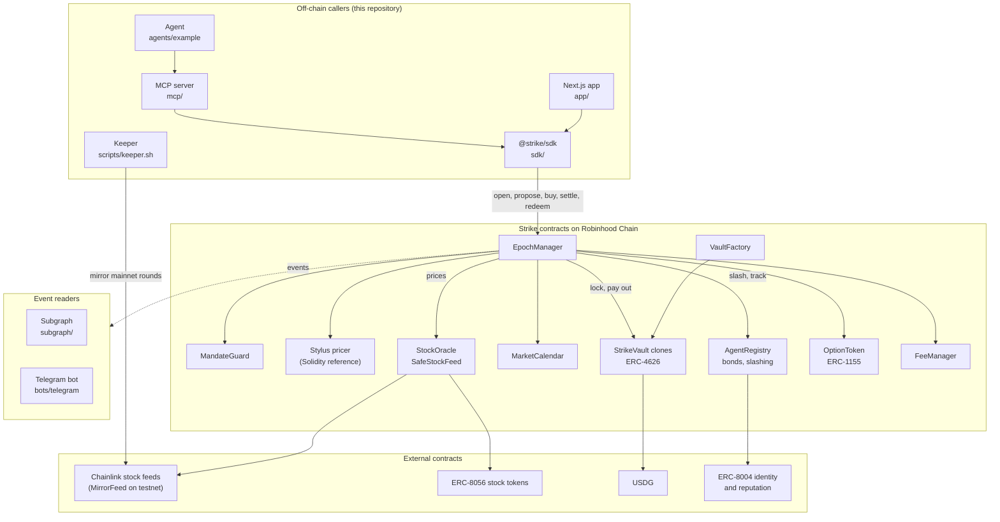
```mermaid
flowchart TB
    subgraph writers["Off-chain callers (this repository)"]
        agent["Agent<br/>agents/example"] --> mcp["MCP server<br/>mcp/"] --> sdk["@strike/sdk<br/>sdk/"]
        app["Next.js app<br/>app/"] --> sdk
        keeper["Keeper<br/>scripts/keeper.sh"]
    end
    subgraph chain["Strike contracts on Robinhood Chain"]
        em["EpochManager"]
        mg["MandateGuard"]
        pricer["Stylus pricer<br/>(Solidity reference)"]
        so["StockOracle<br/>SafeStockFeed"]
        cal["MarketCalendar"]
        ar["AgentRegistry<br/>bonds, slashing"]
        vault["StrikeVault clones<br/>ERC-4626"]
        vf["VaultFactory"]
        ot["OptionToken<br/>ERC-1155"]
        fm["FeeManager"]
    end
    subgraph ext["External contracts"]
        feeds["Chainlink stock feeds<br/>(MirrorFeed on testnet)"]
        tokens["ERC-8056 stock tokens"]
        usdg["USDG"]
        erc8004["ERC-8004 identity<br/>and reputation"]
    end
    subgraph readers["Event readers"]
        subg["Subgraph<br/>subgraph/"]
        bot["Telegram bot<br/>bots/telegram"]
    end
    sdk -- "open, propose, buy, settle, redeem" --> em
    keeper -- "mirror mainnet rounds" --> feeds
    em --> mg & pricer & cal & ot & fm
    em -- "prices" --> so
    em -- "lock, pay out" --> vault
    em -- "slash, track" --> ar
    vf --> vault
    so --> feeds & tokens
    vault --> usdg
    ar --> erc8004
    em -. events .-> readers
```

### Contracts

| Contract                                                                                                             | Role                                                                                                                                                                                            |
| -------------------------------------------------------------------------------------------------------------------- | ----------------------------------------------------------------------------------------------------------------------------------------------------------------------------------------------- |
| [`EpochManager`](contracts/src/core/EpochManager.sol)                                                                | Epoch state machine: open, propose, buy, settle, redeem. The only contract that can lock a vault or move its collateral                                                                         |
| [`StrikeVault`](contracts/src/vaults/StrikeVault.sol)                                                                | ERC-4626 vault (EIP-1167 clone). Queues deposits and redemptions during an epoch. Pays premium through a per-share USDG accumulator                                                             |
| [`VaultFactory`](contracts/src/vaults/VaultFactory.sol)                                                              | Anyone can create a vault on an allow-listed stock token with an immutable mandate                                                                                                              |
| [`MandateGuard`](contracts/src/libraries/MandateGuard.sol)                                                           | Pure check of a proposal against the mandate. Returns one of nine named reasons                                                                                                                 |
| [`AgentRegistry`](contracts/src/agents/AgentRegistry.sol)                                                            | Agents, signer keys, payout addresses, ERC-8004 identity link, USDG bond, slashing                                                                                                              |
| [`SafeStockFeed`](contracts/src/libraries/SafeStockFeed.sol) + [`StockOracle`](contracts/src/oracle/StockOracle.sol) | Every price read: staleness, both pauses, corporate actions, sequencer uptime, settlement round selection. Reusable by any Robinhood Chain protocol: [integration guide](docs/safestockfeed.md) |
| [`MarketCalendar`](contracts/src/oracle/MarketCalendar.sol)                                                          | NYSE hours on-chain, DST-aware, with holidays and early closes                                                                                                                                  |
| [`BlackScholesLib`](contracts/src/pricing/BlackScholesLib.sol) and the [Stylus pricer](stylus/pricer/src/math.rs)    | The same fixed-point Black-Scholes algorithm in Solidity and in Rust                                                                                                                            |
| [`FeeManager`](contracts/src/core/FeeManager.sol)                                                                    | 10% performance fee on positive epoch PnL, half to the proposing agent, capped at 30%                                                                                                           |
| [`OptionToken`](contracts/src/tokens/OptionToken.sol)                                                                | ERC-1155 options, one id per series                                                                                                                                                             |

## How Strike uses the stack

| Technology                              | Where                                                                                                                                                                                                                                       |
| --------------------------------------- | ------------------------------------------------------------------------------------------------------------------------------------------------------------------------------------------------------------------------------------------- |
| Robinhood Chain stock tokens (ERC-8056) | [`IStockToken`](contracts/src/interfaces/IStockToken.sol), the corporate-action gate in [`SafeStockFeed.corporateAction`](contracts/src/libraries/SafeStockFeed.sol#L142), real-token [fork tests](contracts/test/fork/RobinhoodFork.t.sol) |
| Chainlink stock feeds                   | [`SafeStockFeed.latest`](contracts/src/libraries/SafeStockFeed.sol#L40) and first-round-after-expiry [`settlementPrice`](contracts/src/libraries/SafeStockFeed.sol#L75)                                                                     |
| Paxos USDG                              | Premium, put collateral, fees and agent bonds. Real addresses on Robinhood Chain mainnet, Robinhood Chain testnet and Arbitrum Sepolia in [`Deploy.s.sol`](contracts/script/Deploy.s.sol#L139)                                              |
| Arbitrum Stylus                         | [`strike_for_delta`](stylus/pricer/src/math.rs#L258), used on-chain by [`proposeByDelta`](contracts/src/core/EpochManager.sol#L371). 6.5× cheaper than Solidity for the solver, 3.3× for the whole transaction ([gas](#gas))                |
| ERC-8004 agent identity                 | [`AgentRegistry._checkIdentity`](contracts/src/agents/AgentRegistry.sol#L319) verifies `ownerOf` on the official identity registry; agent #1 is identity [#114](docs/DEPLOYMENTS.md#erc-8004-identity-114)                                  |
| MCP                                     | [`mcp/`](mcp/) server and [`agents/example`](agents/example/)                                                                                                                                                                               |

## Why only here (Robinhood Chain and Arbitrum)

Strike needs five things on one chain, and Robinhood Chain, an Arbitrum chain, has all five.

1. Stock tokens with an on-chain standard. Robinhood's asset list returned 195 stock tokens on 2026-09-28 ([research.md §3](docs/research.md#3-stock-tokens)). Each ERC-8056 token exposes its `uiMultiplier`, its pause flags and its scheduled corporate actions on-chain, which is exactly what `SafeStockFeed` checks before any price is used.
2. Chainlink tokenized-equity feeds on the same chain. Settlement walks the feed's round history to find the first print at or after expiry, and the contract can prove that choice ([D14](docs/decisions.md)). The monitor reads 8 mainnet feeds live, and the fork tests use the real TSLA, NVDA and SPY feeds.
3. Paxos USDG. Premium, put collateral, agent bonds, slashes and fees are all one stablecoin, with real addresses on Robinhood Chain mainnet and testnet and on Arbitrum Sepolia and One ([research.md §4](docs/research.md#4-usdg-paxos-global-dollar)).
4. ERC-8004 registries. The official identity and reputation registries sit at the same addresses on Robinhood Chain and Arbitrum ([research.md §5](docs/research.md#5-erc-8004-trustless-agents)), so an agent's settled results post to a record other applications can read.
5. Stylus. Solving the strike for a target delta takes 48 Black-Scholes evaluations. In Rust on Stylus that costs 6.5 times less gas than in Solidity, and the whole `proposeByDelta` transaction 3.3 times less ([gas](#gas)), so the contract can solve the strike itself at proposal time.

Why on-chain at all: the mandate exists to bind an agent that other people deposited with. If the check ran on a server, depositors would be trusting whoever runs it. On-chain, the contract refuses the proposal and moves the bond, and anyone can re-run the check with `previewProposal`.

Robinhood describes its own agent trading the same way. Its mainnet announcement says the Robinhood Trading MCP lets users "connect their AI model of choice… with human-controlled capital allocation and safety parameters" ([Robinhood newsroom](https://robinhood.com/us/en/newsroom/robinhood-accelerates-global-expansion-robinhood-chain-mainnet-stock-tokens-agentic-trading/)). In Strike the safety parameters are the vault's mandate, and the contract enforces them rather than an app. A FalconX primer counts more than 4,500 Virtuals agents on Robinhood Chain ([FalconX](https://x.com/FalconXGlobal/article/2079248025214407089)), which is the pool of agents that could propose or buy.

On Arbitrum itself, USDG and the ERC-8004 registries are already deployed, and [`Deploy.s.sol`](contracts/script/Deploy.s.sol) configures Arbitrum Sepolia with test stock tokens and `MirrorFeed`s, because that chain has neither stock tokens nor stock feeds. v3 runs there with its first epoch, planned by Claude ([log](docs/testnet-epochs/2026-09-30-arbitrum-sepolia.md)).

## Screenshots

The app on the live Robinhood Chain testnet contracts, captured on 2026-09-30 at 1440×900 and 390×844 ([all images](docs/screenshots/)).

<table>
  <tr>
    <td width="33%"><a href="docs/screenshots/desktop-landing.png"></a><br><sub><b>Landing.</b> The product in one line and the covered-call payoff.</sub></td>
    <td width="33%"><a href="docs/screenshots/desktop-vaults.png">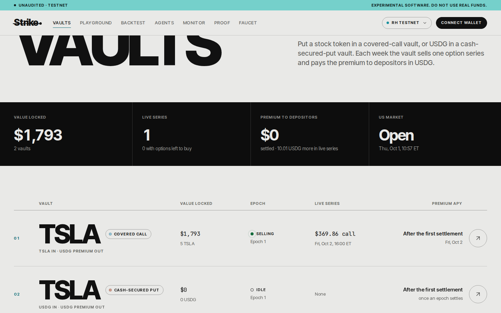</a><br><sub><b>Vaults.</b> Both v2 vaults, value locked and the live $369.86 call series.</sub></td>
    <td width="33%"><a href="docs/screenshots/desktop-vault.png">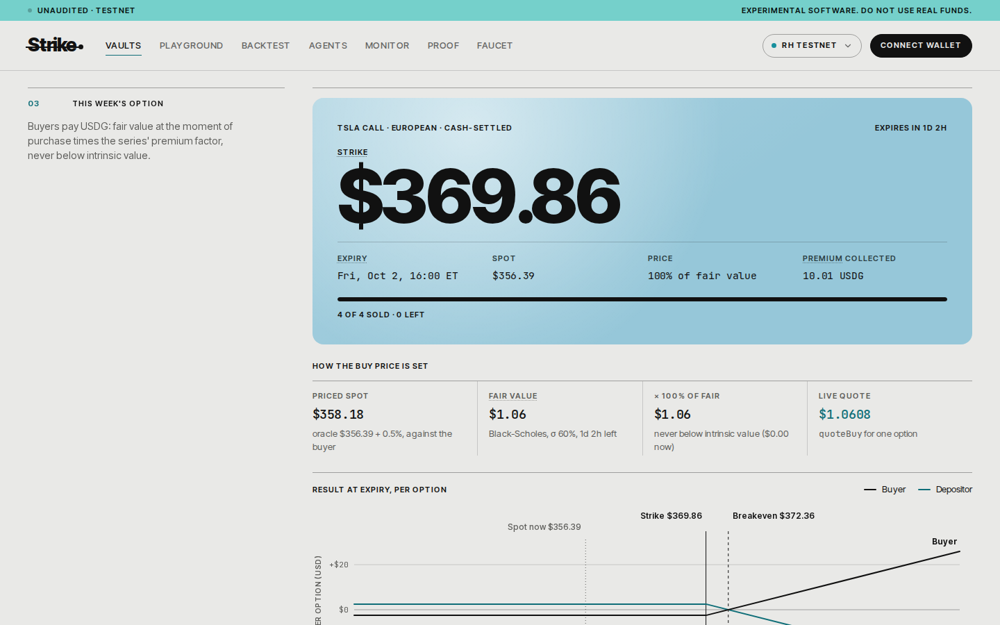</a><br><sub><b>Vault.</b> This week's option, how the buy price is set, and the payoff at expiry.</sub></td>
  </tr>
  <tr>
    <td><a href="docs/screenshots/desktop-playground.png">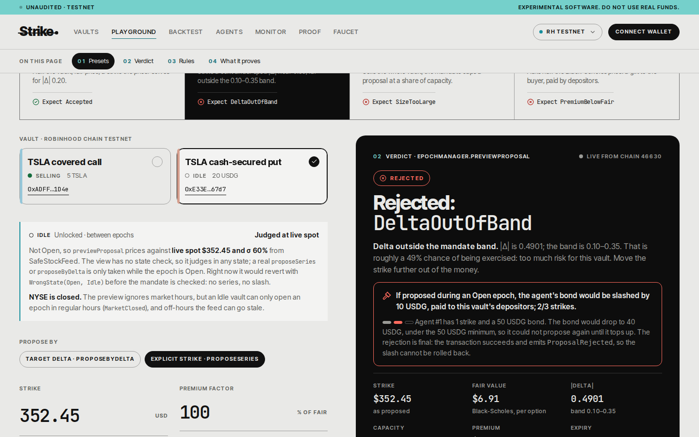</a><br><sub><b>Playground.</b> A reckless proposal checked against the live mandate: <code>DeltaOutOfBand</code>, no wallet needed.</sub></td>
    <td><a href="docs/screenshots/desktop-backtest.png">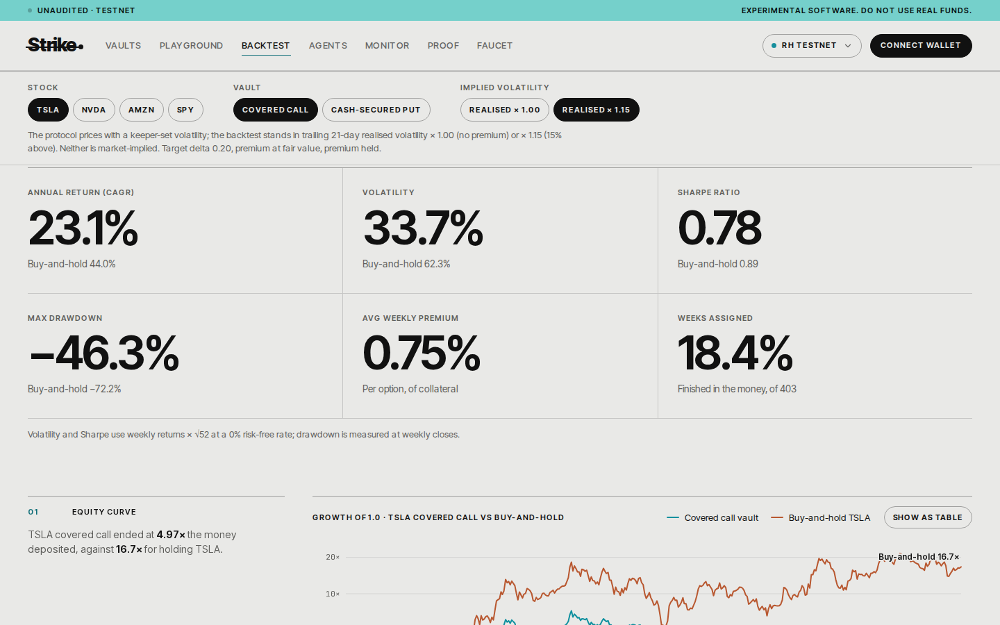</a><br><sub><b>Backtest.</b> Pick a ticker, vault and volatility assumption; the numbers come from <code>research/results</code>.</sub></td>
    <td><a href="docs/screenshots/desktop-agents.png">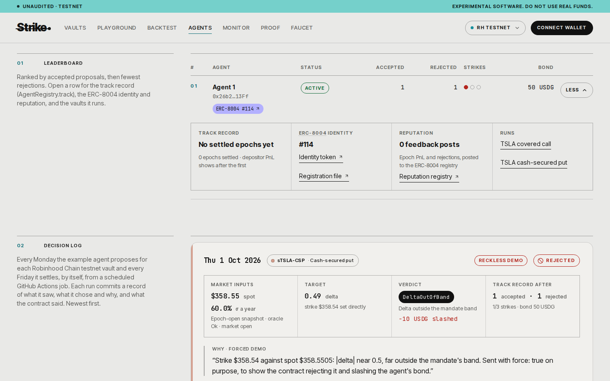</a><br><sub><b>Agents.</b> The leaderboard, bonds, strikes and ERC-8004 identity #114.</sub></td>
  </tr>
  <tr>
    <td><a href="docs/screenshots/desktop-monitor.png">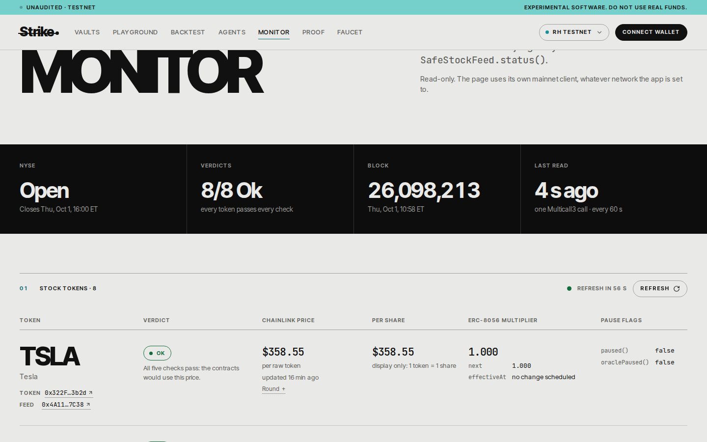</a><br><sub><b>Monitor.</b> Robinhood Chain mainnet, read live: each stock token's feed, multiplier and pause flags.</sub></td>
    <td><a href="docs/screenshots/desktop-proof.png">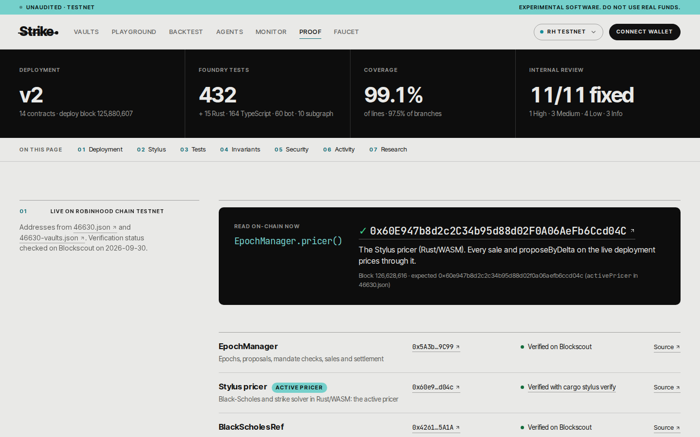</a><br><sub><b>Proof.</b> Each claim next to its evidence; the active pricer is read from the chain.</sub></td>
    <td><a href="docs/screenshots/desktop-faucet.png">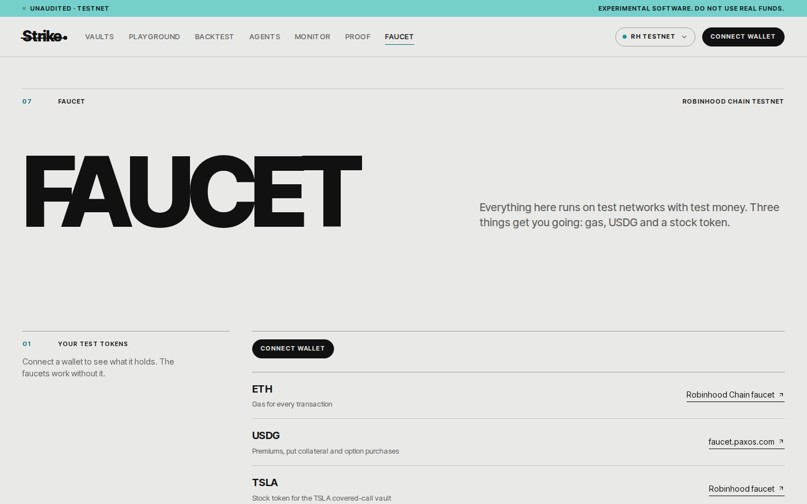</a><br><sub><b>Faucet.</b> Gas, USDG and a stock token for testing.</sub></td>
  </tr>
</table>

<table>
  <tr>
    <td width="20%">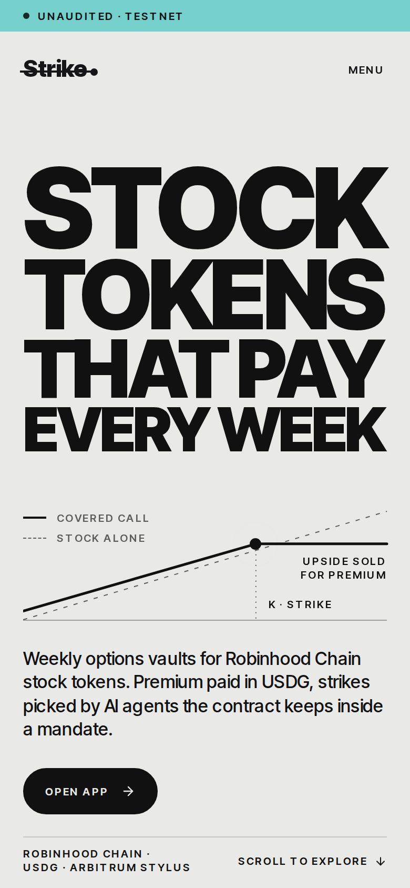<br><sub>Landing</sub></td>
    <td width="20%">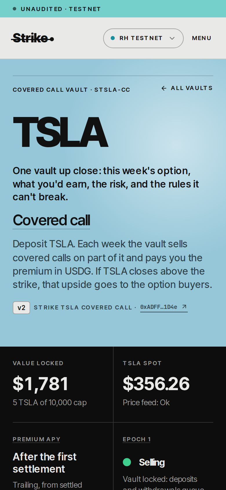<br><sub>Vault</sub></td>
    <td width="20%">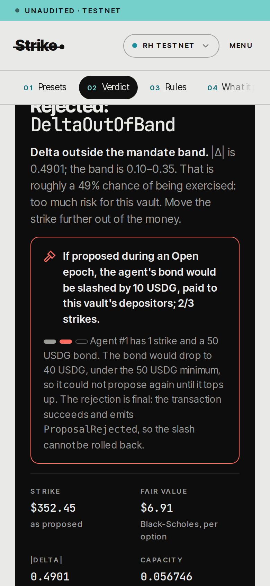<br><sub>Playground verdict</sub></td>
    <td width="20%">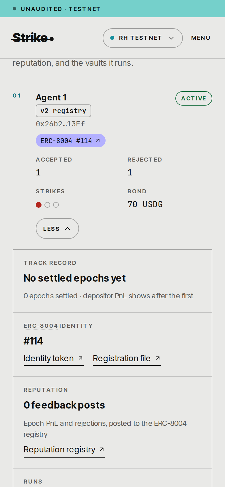<br><sub>Agents</sub></td>
    <td width="20%">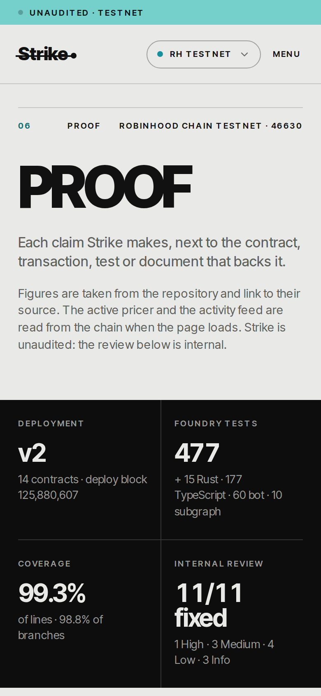<br><sub>Proof</sub></td>
  </tr>
</table>

<p align="center"><a href="docs/screenshots/desktop-vault-risk.png">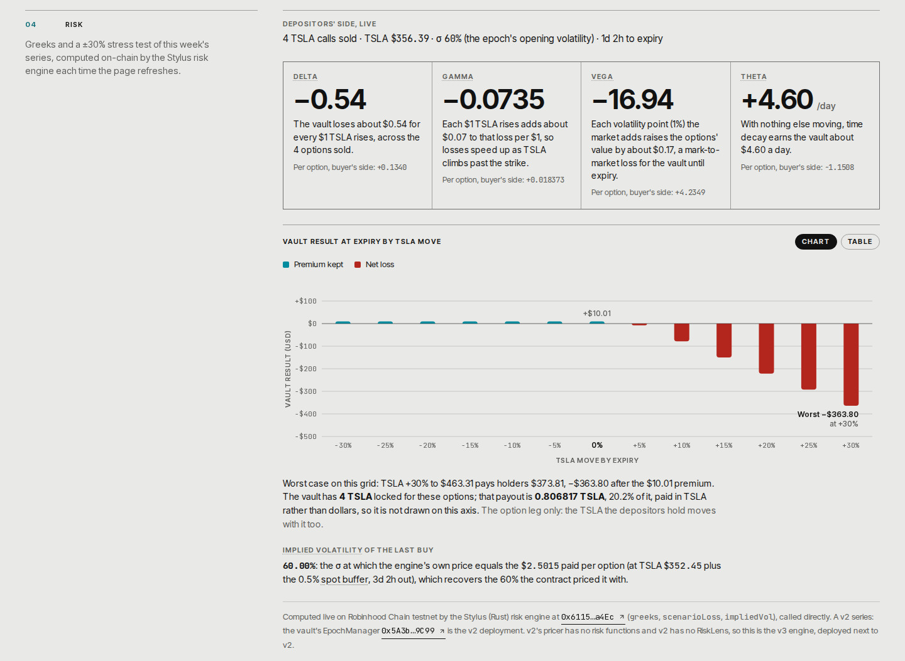</a><br><sub><b>Risk.</b> This week's series under a ±30% stress test, computed live by the Rust risk engine (<a href="docs/screenshots/mobile-vault-risk.png">phone</a>).</sub></p>

Mobile captures of the other pages: [vaults](docs/screenshots/mobile-vaults.png), [backtest](docs/screenshots/mobile-backtest.png), [monitor](docs/screenshots/mobile-monitor.png), [faucet](docs/screenshots/mobile-faucet.png).

## Evidence in numbers

| Tests and proofs | Line coverage      | Strike solver in Stylus | Live epoch                                 | Contracts verified                               |
| ---------------- | ------------------ | ----------------------- | ------------------------------------------ | ------------------------------------------------ |
| [891](#tests)    | [99.3%](#coverage) | [6.5× cheaper](#gas)    | [9 transactions, 1 slash](#the-live-epoch) | [14 on Blockscout + Stylus](docs/DEPLOYMENTS.md) |

Charts are rebuilt from committed data by [`scripts/charts/build_charts.py`](scripts/charts/README.md); each has a light and a dark version and its numbers in the table beside it.

### Claims and the tests that check them

Totals say little about the parts that are hard. Each row names the test that would fail if the claim were false, and a command that runs only that test from the repository root. All paths are under [`contracts/test`](contracts/test).

| Claim                                                                                                      | Test                                                                                                                                                                                                                                                                                                                                | Command                                                                                                                                                                                                                        |
| ---------------------------------------------------------------------------------------------------------- | ----------------------------------------------------------------------------------------------------------------------------------------------------------------------------------------------------------------------------------------------------------------------------------------------------------------------------------- | ------------------------------------------------------------------------------------------------------------------------------------------------------------------------------------------------------------------------------ |
| An option is never sold below its intrinsic value                                                          | `test_AUDIT_itmSalesBelowIntrinsic` in [`audit/AuditPricing.t.sol`](contracts/test/audit/AuditPricing.t.sol)                                                                                                                                                                                                                        | `forge test --root contracts --match-test test_AUDIT_itmSalesBelowIntrinsic`                                                                                                                                                   |
| No performance fee on a losing or break-even epoch                                                         | `test_computeFee_zeroWhenEpochLostMoney` and `test_computeFee_zeroWhenBreakEven` in [`unit/FeeManager.t.sol`](contracts/test/unit/FeeManager.t.sol); proven for all inputs by `check_computeFee_zeroWhenNoProfit` in [`formal/FeeManagerFormal.t.sol`](contracts/test/formal/FeeManagerFormal.t.sol)                                | `forge test --root contracts --match-test "test_computeFee_zeroWhen"`; `halmos --root contracts --match-contract FeeManagerFormal`                                                                                             |
| The ERC-8056 multiplier is never applied to a Chainlink price                                              | `test_multiplierIsNeverAppliedToFeedPrice` in [`oracle/StockOracle.t.sol`](contracts/test/oracle/StockOracle.t.sol); on real mainnet NVDA, `test_fork_multiplierIsNotAppliedTwice` in [`fork/RobinhoodFork.t.sol`](contracts/test/fork/RobinhoodFork.t.sol)                                                                         | `forge test --root contracts --match-test test_multiplierIsNeverAppliedToFeedPrice`; the fork test also needs `ROBINHOOD_RPC_URL`                                                                                              |
| A Friday expiry with no weekend print settles on Monday's first print                                      | `test_recordSettlementPrice_waitsOverWeekend` in [`oracle/StockOracle.t.sol`](contracts/test/oracle/StockOracle.t.sol); a Chainlink phase change over the weekend: `test_AUDIT_weekendPhaseChangeBricksSettlement` in [`audit/AuditSettlement.t.sol`](contracts/test/audit/AuditSettlement.t.sol)                                   | `forge test --root contracts --match-test "test_recordSettlementPrice_waitsOverWeekend\|test_AUDIT_weekendPhaseChangeBricksSettlement"`                                                                                        |
| A stale feed or a closed NYSE blocks sales                                                                 | `testFuzz_staleness` in [`oracle/StockOracle.t.sol`](contracts/test/oracle/StockOracle.t.sol); `test_buy_marketClosedAndSaleCutoff` in [`core/EpochManager.t.sol`](contracts/test/core/EpochManager.t.sol)                                                                                                                          | `forge test --root contracts --match-test "testFuzz_staleness\|test_buy_marketClosedAndSaleCutoff"`                                                                                                                            |
| NYSE session times are right on every day from 2026 to 2030, across daylight-saving changes                | `test_sessionsMatchZoneinfo` in [`oracle/MarketCalendar.t.sol`](contracts/test/oracle/MarketCalendar.t.sol) (1,826 days against Python `zoneinfo`)                                                                                                                                                                                  | `forge test --root contracts --match-test test_sessionsMatchZoneinfo`                                                                                                                                                          |
| A rejected proposal's slash is paid to that vault's depositors                                             | `test_recklessProposal_rejectedSlashedAndPaidToDepositors` in [`integration/AgentMandate.t.sol`](contracts/test/integration/AgentMandate.t.sol)                                                                                                                                                                                     | `forge test --root contracts --match-test test_recklessProposal_rejectedSlashedAndPaidToDepositors`                                                                                                                            |
| A proposal is judged against the market at `openEpoch`, so a later price move cannot slash an honest agent | `test_proposal_judgedAgainstOpeningSnapshot` in [`integration/AgentMandate.t.sol`](contracts/test/integration/AgentMandate.t.sol)                                                                                                                                                                                                   | `forge test --root contracts --match-test test_proposal_judgedAgainstOpeningSnapshot`                                                                                                                                          |
| An agent that also buys cannot write itself a mandate that sells below 90% of fair value                   | `test_AUDIT_permissiveMandateLetsAgentBuyerDrain` in [`audit/AuditPricing.t.sol`](contracts/test/audit/AuditPricing.t.sol)                                                                                                                                                                                                          | `forge test --root contracts --match-test test_AUDIT_permissiveMandateLetsAgentBuyerDrain`                                                                                                                                     |
| The Rust (Stylus) pricer returns exactly what the Solidity pricer returns                                  | `testFuzz_rustEqualsSolidity` and `testFuzz_strikeForDeltaRustEqualsSolidity` in [`differential/PricerDifferential.t.sol`](contracts/test/differential/PricerDifferential.t.sol); 300 fixed vectors in `test_matchesStylusVectorsExactly` ([`pricing/BlackScholesVectors.t.sol`](contracts/test/pricing/BlackScholesVectors.t.sol)) | `cargo build --release --example pricer_cli --manifest-path stylus/pricer/Cargo.toml && PRICER_CLI=$PWD/stylus/pricer/target/release/examples/pricer_cli forge test --root contracts --ffi --match-path "test/differential/*"` |
| Locked collateral always covers the worst-case payout                                                      | `invariant_collateralCoversMaxPayout` in [`invariant/StrikeInvariants.t.sol`](contracts/test/invariant/StrikeInvariants.t.sol), for a call vault and a put vault                                                                                                                                                                    | `forge test --root contracts --match-test invariant_collateralCoversMaxPayout`                                                                                                                                                 |
| A guardian pause stops sales but never settlement or withdrawals                                           | `test_pause_blocksSalesButNotSettlementOrWithdrawals` in [`integration/Lifecycle.t.sol`](contracts/test/integration/Lifecycle.t.sol)                                                                                                                                                                                                | `forge test --root contracts --match-test test_pause_blocksSalesButNotSettlementOrWithdrawals`                                                                                                                                 |

The `test_AUDIT_*` names describe the attack each test first reproduced; they now pass because the fix is in ([review](docs/security/review-2026-09-29.md)). Every command above was run on 2026-09-30 and passed, except the Halmos one, which runs in the CI formal-verification job.

### Tests

<picture>
  <source media="(prefers-color-scheme: dark)" srcset="docs/media/charts/tests-by-suite-dark.svg">
  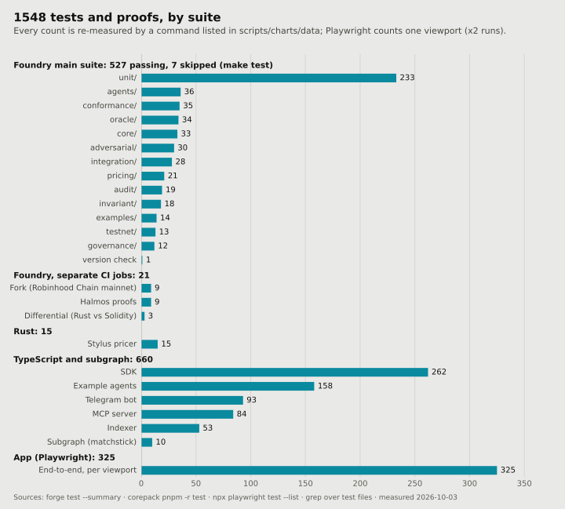
</picture>

| Suite                                                                                                 | Tests | How it was counted                                                         |
| ----------------------------------------------------------------------------------------------------- | ----: | -------------------------------------------------------------------------- |
| Foundry main suite ([`contracts/test`](contracts/test)), passing; 7 more skipped (see below)          |   477 | `forge test --no-match-path "test/{fork,differential,formal}/*" --summary` |
| Fork tests on Robinhood Chain mainnet ([`test/fork`](contracts/test/fork))                            |     9 | `forge test --match-path "test/fork/*"` with `ROBINHOOD_RPC_URL`           |
| Differential, Rust vs Solidity pricer ([`test/differential`](contracts/test/differential))            |     3 | 10,000 fuzz inputs and 300 vectors                                         |
| Halmos proofs ([`test/formal`](contracts/test/formal), [notes](docs/security/formal-verification.md)) |     9 | Proven for every input in range; 16 more are marked unproven               |
| Rust, Stylus pricer ([`stylus/pricer`](stylus/pricer))                                                |    15 | `make stylus-test`                                                         |
| TypeScript: SDK 109, Telegram bot 60, MCP 49, example agents 44                                       |   262 | `corepack pnpm -r test`                                                    |
| Subgraph ([`subgraph/tests`](subgraph/tests))                                                         |    10 | matchstick                                                                 |
| App, Playwright ([`app/e2e`](app/e2e)), at desktop and mobile sizes                                   |   106 | `npx playwright test --list`: 212 runs, 106 tests × 2 viewports            |

Counted on 2026-09-30; the per-folder Foundry counts are in [`scripts/charts/data/forge-tests.txt`](scripts/charts/data/forge-tests.txt). The 7 skipped tests are the settlement rules of the [SafeStockFeed conformance suite](contracts/test/conformance) run against the `StockCollateral` example, which values collateral and has no settlement price; `StockOracle` passes all 21 rules. Some Playwright tests run in one viewport only (pure functions and the HTTP-only `mcp.spec.ts` on desktop, the phone menu on mobile) and are skipped in the other.

### Coverage

<picture>
  <source media="(prefers-color-scheme: dark)" srcset="docs/media/charts/coverage-by-contract-dark.svg">
  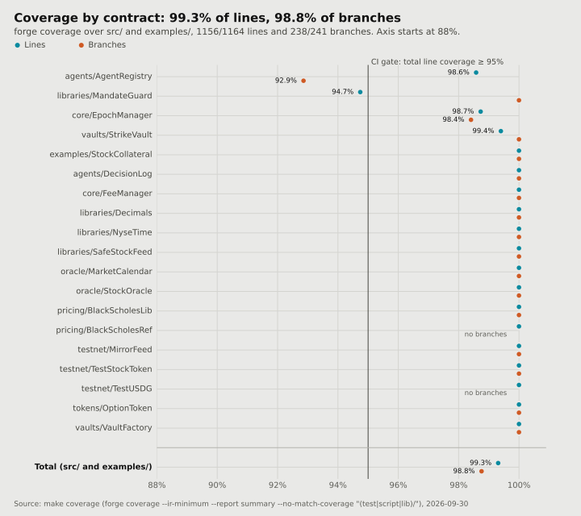
</picture>

| Contract           | Lines                 | Branches            |
| ------------------ | --------------------- | ------------------- |
| `AgentRegistry`    | 98.6% (139/141)       | 92.9% (26/28)       |
| `MandateGuard`     | 94.7% (18/19)         | 100% (14/14)        |
| `EpochManager`     | 98.7% (310/314)       | 98.4% (62/63)       |
| `StrikeVault`      | 99.4% (167/168)       | 100% (30/30)        |
| The other 15 files | 100%                  | 100%                |
| **Total**          | **99.3% (1156/1164)** | **98.8% (238/241)** |

From `make coverage` ([table](scripts/charts/data/coverage.txt)). The [CI coverage job](.github/workflows/ci.yml) fails if total line coverage drops below 95%.

<a name="safety-evidence"></a>

### Safety checks

| Check           | Result                                                                                                                                                                                                                               |
| --------------- | ------------------------------------------------------------------------------------------------------------------------------------------------------------------------------------------------------------------------------------ |
| Unit tests      | Every function and custom error, [`contracts/test/unit`](contracts/test/unit) and neighbours                                                                                                                                         |
| Integration     | Full epochs for calls and puts, in and out of the money, a crash to zero, the queue across epochs, rejection and slashing, abort, emergency cancel                                                                                   |
| Invariants      | 9 properties on a call vault and a put vault, 32,768 random calls each in the CI profile ([list](docs/testing.md#invariants))                                                                                                        |
| Mutation checks | Three injected bugs, all caught by the invariants ([details](docs/testing.md#mutation-checks))                                                                                                                                       |
| Differential    | Stylus (Rust) and Solidity pricers return identical results on 10,000 fuzz inputs, 300 vectors and on-chain on a Nitro dev node                                                                                                      |
| Fork tests      | Robinhood Chain mainnet: real TSLA, NVDA, SPY feeds and multipliers, real USDG, real ERC-8004 registries, a full epoch                                                                                                               |
| Calendar        | Session times match Python `zoneinfo` for every day from 2026 to 2030                                                                                                                                                                |
| Formal proofs   | 9 properties proven with Halmos for every input in range (mandate rules, fee caps, NYSE sessions, call payout), run in CI; 16 more are marked unproven: [docs/security/formal-verification.md](docs/security/formal-verification.md) |
| Static analysis | Slither: 0 High, every other finding justified in [docs/security/slither.md](docs/security/slither.md)                                                                                                                               |
| Threat model    | 21 threats with mitigation and the test that covers each: [docs/threat-model.md](docs/threat-model.md)                                                                                                                               |
| Internal review | 11 findings (1 High, 3 Medium, 4 Low, 3 Info), all fixed; 19 regression tests in [`contracts/test/audit`](contracts/test/audit): [docs/security/review-2026-09-29.md](docs/security/review-2026-09-29.md)                            |

The unit suite found two real bugs in the vault before deployment (claims of zero-value processed requests). Both are fixed, with regression tests ([commit](https://github.com/Prashant-thakur77/Strike/commit/9d677d5)).

### Gas

<picture>
  <source media="(prefers-color-scheme: dark)" srcset="docs/media/charts/gas-stylus-vs-solidity-dark.svg">
  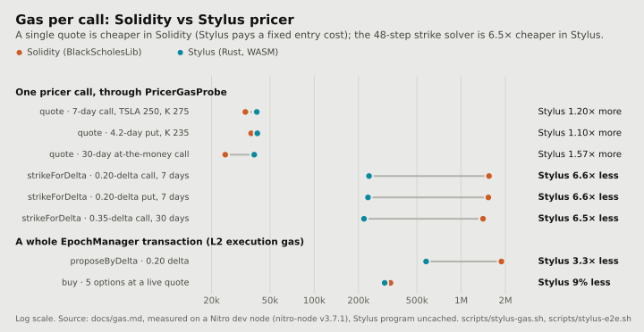
</picture>

| Call                                              | Solidity gas | Stylus gas | Stylus vs Solidity |
| ------------------------------------------------- | -----------: | ---------: | ------------------ |
| `quote`, 7-day call (one Black-Scholes)           |       33,969 |     40,624 | 1.20× more         |
| `quote`, 4.2-day put                              |       37,216 |     40,993 | 1.10× more         |
| `quote`, 30-day at-the-money call                 |       24,793 |     39,038 | 1.57× more         |
| `strikeForDelta`, 0.20-delta call (48 steps)      |    1,546,443 |    235,880 | 6.6× less          |
| `strikeForDelta`, 0.20-delta put                  |    1,530,713 |    232,166 | 6.6× less          |
| `strikeForDelta`, 0.35-delta call, 30 days        |    1,408,482 |    218,066 | 6.5× less          |
| `EpochManager.proposeByDelta` (whole transaction) |    1,878,918 |    577,041 | 3.3× less          |
| `EpochManager.buy`, 5 options                     |      329,872 |    301,404 | 9% less            |

Measured on an Arbitrum Nitro dev node, L2 execution gas ([docs/gas.md](docs/gas.md), [`scripts/stylus-gas.sh`](scripts/stylus-gas.sh), [`scripts/stylus-e2e.sh`](scripts/stylus-e2e.sh)). A Stylus call pays a fixed entry cost, so a single `quote` is cheaper in Solidity. Real work is cheaper in Stylus, and both runs chose the same strike. The deployed Stylus pricer is reproducibly verified against this source with `cargo stylus verify` ([details](docs/DEPLOYMENTS.md#stylus-pricer-verification)).

## The live epoch

<picture>
  <source media="(prefers-color-scheme: dark)" srcset="docs/media/charts/live-epoch-timeline-dark.svg">
  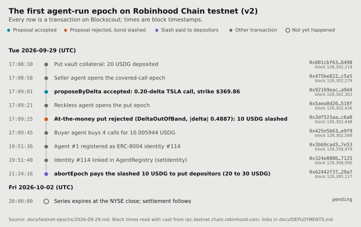
</picture>

On 2026-09-29 ([log](docs/testnet-epochs/2026-09-29.md)) the seller agent proposed a 0.20-delta TSLA call by delta and it was [accepted](https://explorer.testnet.chain.robinhood.com/tx/0x92169eac7bd2491d1f22f394e15643d5d54309c1e980683cf82a13088021a9d4) at a strike of $369.86. A reckless at-the-money put was [rejected on-chain with 10 USDG slashed](https://explorer.testnet.chain.robinhood.com/tx/0x3df523aae815e10cba8f5f99076f9cb348745e7657dd1f1338820af0469dc6a0). A buyer agent [bought 4 calls](https://explorer.testnet.chain.robinhood.com/tx/0x425e5b63ddeb1fcff5d63aa9f5a9fd11f4d3c0f52facd05e0fb44096f2ede9f9) for 10.01 USDG. The slashed 10 USDG was then [paid into the put vault](https://explorer.testnet.chain.robinhood.com/tx/0x62442f37b3601aa5b56d5e991d3199464ba2e60373f70e00892746c053b629a7) for its depositors (20 to 30 USDG). On 30 September the depositor took out all 30 USDG: the deposit with [`redeem`](https://explorer.testnet.chain.robinhood.com/tx/0x0a7167a0d15eef1b6e9398e67c63f7e5ca8d18dcdb20b395e8bde4b231919cc3) and the slash with [`claimPremium`](https://explorer.testnet.chain.robinhood.com/tx/0x1c53ff12ec2e9749e84f92ae4fa29a4d584789a8abd661e6f099151361067620). Agent #1 is linked to ERC-8004 identity [#114](docs/agents/strike-agent-1.json), so settled PnL and rejections post to its on-chain reputation. Settlement follows the Friday close. Every hash, block and time is in [docs/DEPLOYMENTS.md](docs/DEPLOYMENTS.md#live-transactions).

## Backtest

<picture>
  <source media="(prefers-color-scheme: dark)" srcset="docs/media/charts/backtest-equity-dark.svg">
  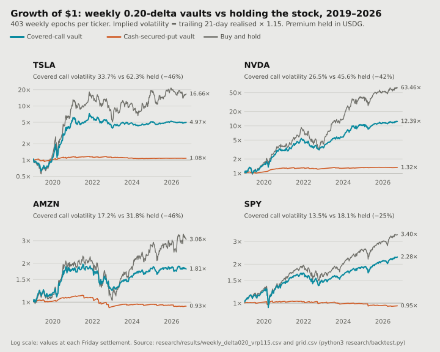
</picture>

403 weekly epochs from January 2019 to September 2026, run by the contract rules on daily adjusted closes, with implied volatility set to trailing 21-day realised volatility × 1.15 and a 0.20-delta strike. The covered-call vault lagged holding on every ticker and cut volatility by 25 to 46%.

| Ticker | Covered call CAGR | Held CAGR | Covered call volatility | Held volatility | Volatility cut | Covered call max drawdown | Held max drawdown | Put vault CAGR |
| ------ | ----------------: | --------: | ----------------------: | --------------: | -------------: | ------------------------: | ----------------: | -------------: |
| TSLA   |             23.1% |     44.0% |                   33.7% |           62.3% |           −46% |                    −46.3% |            −72.2% |           1.0% |
| NVDA   |             38.6% |     71.2% |                   26.5% |           45.6% |           −42% |                    −43.0% |            −65.9% |           3.7% |
| AMZN   |              8.0% |     15.6% |                   17.2% |           31.8% |           −46% |                    −37.5% |            −54.8% |          −0.9% |
| SPY    |             11.3% |     17.2% |                   13.5% |           18.1% |           −25% |                    −28.7% |            −31.8% |          −0.6% |

From [`research/results/tables.md`](research/results/tables.md) and [`grid.csv`](research/results/grid.csv); reproduce with `python3 research/backtest.py` in about 15 seconds. At realised volatility × 1.00 every return is lower and the put vault loses money on three of four tickers. The result assumes buyers take the full size each week at the model price, which the contracts cannot guarantee. [docs/backtest.md](docs/backtest.md) has the method, the sensitivity to delta and volatility, the stress periods and the limitations; `/app/backtest` lets you explore the same results.

### Against USDG lending

A USDG holder's alternative to the put vault is lending the USDG. The Steakhouse USDG vault on Morpho paid about 1.9% on 2026-07-20, and Robinhood Earn shows about 7% estimated APY on USDG, probably subsidised, though we have not confirmed that ([FalconX primer](https://x.com/FalconXGlobal/article/2079248025214407089), [Robinhood newsroom](https://robinhood.com/us/en/newsroom/robinhood-accelerates-global-expansion-robinhood-chain-mainnet-stock-tokens-agentic-trading/)). Over 2019 to 2026 the put vault returned −0.9% to 3.7% a year at realised volatility × 1.15 and −3.8% to 0.5% at × 1.00 ([backtest.md](docs/backtest.md)). Only NVDA at × 1.15 beat the organic 1.9%, and no case came near 7%. Gross premium was higher (0.22% to 0.86% of the strike per week at × 1.15), but assignments took most of it back.

So the put vault is not a better savings account. It is a way to be paid while waiting to buy a stock token below today's price: if the put is assigned, the depositor buys at the strike, which averaged 1.6% to 5.4% below spot in the backtest at × 1.15. Strike's collateral also earns nothing while it waits, because the pricer assumes a zero rate. Lending idle put collateral in an ERC-4626 USDG vault is on the [milestone plan](docs/MILESTONES.md) as later work, not built.

<a name="prior-art"></a>

## Competition

Options vaults exist on other chains, Strike is not the first options venue on Robinhood Chain, and an earlier Open House winner already runs AI-managed vaults there. This is what each project's own documentation and repository say, checked on 2026-09-30. "not described" means the cited pages do not cover it, not that the project lacks it.

<picture>
  <source media="(prefers-color-scheme: dark)" srcset="docs/media/charts/competition-matrix-dark.svg">
  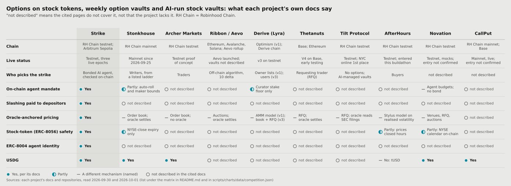
</picture>

|                               | Strike                                                      | Stonkhouse                                                                                 | Archer Markets                      | Ribbon / Aevo                                       | Derive (Lyra)                                          | Thetanuts                        | Tilt Protocol                                          |
| ----------------------------- | ----------------------------------------------------------- | ------------------------------------------------------------------------------------------ | ----------------------------------- | --------------------------------------------------- | ------------------------------------------------------ | -------------------------------- | ------------------------------------------------------ |
| Chain                         | Robinhood Chain testnet (46630)                             | Robinhood Chain mainnet (4663)                                                             | Robinhood Chain testnet (46630)     | Ethereum, Avalanche, Solana; Aevo is its own rollup | Optimism (Lyra v1); Derive chain (v2)                  | Base; Ethereum (WheelVault only) | Robinhood Chain testnet                                |
| Live status                   | Testnet, live epoch; unaudited                              | Mainnet since 2026-09-25; unaudited                                                        | Testnet proof of concept; unaudited | Aevo launched; vault status not described           | v3 on testnet, mainnet "coming soon"                   | V4 on Base, early testing        | Testnet build; NYC online buildathon 1st place         |
| Who picks the strike          | A bonded AI agent; the contract checks it                   | Writers, from a listed ladder                                                              | Traders (one book per strike)       | Off-chain algorithm at 10 delta                     | Owner lists boards (v1); users (v3)                    | The requesting trader (RFQ)      | No options; an AI management layer runs the vaults     |
| On-chain agent mandate        | Yes: delta band, premium, yield, size, tenor                | Partly: contract bounds on its auto-roll pricer (0.5–10% of spot, no reprice cut over 25%) | not described                       | not described                                       | Curator stake floor; curators may trade any instrument | not described                    | not described                                          |
| Slashing paid to depositors   | Yes: 10 USDG per rejected proposal                          | not described                                                                              | not described                       | not described                                       | not described                                          | not described                    | not described                                          |
| Oracle-anchored pricing       | Yes: Black-Scholes at oracle spot on every buy              | Order book; oracle at settlement                                                           | Order book; no oracle               | Auctions; oracle at settlement                      | AMM model (v1); order book and RFQ (v3)                | RFQ; oracle at expiry            | RFQ engine; an oracle parses SEC and STOCK Act filings |
| Stock-token (ERC-8056) safety | Yes: multiplier, both pauses, corporate actions, NYSE hours | NYSE-close expiry; ERC-8056 not described                                                  | not described                       | not described (crypto assets)                       | not described (crypto assets)                          | not described (crypto assets)    | not described                                          |
| ERC-8004 agent identity       | Yes: identity #114                                          | not described                                                                              | not described                       | not described                                       | not described                                          | not described                    | not described                                          |
| USDG                          | Yes: premium, put collateral, bonds, fees                   | Yes: premium and put collateral                                                            | Yes: quote token                    | not described                                       | not described (USDC)                                   | not described (USDC)             | not described                                          |

Sources. Strike: this repository and [docs/DEPLOYMENTS.md](docs/DEPLOYMENTS.md). Stonkhouse: [docs](https://docs.stonkhouse.fun), [setting your ask](https://docs.stonkhouse.fun/writing/setting-your-ask.md), [presets and auto-roll](https://docs.stonkhouse.fun/writing/presets-and-auto-roll.md), [market makers](https://docs.stonkhouse.fun/market/market-makers.md), [oracle and settlement](https://docs.stonkhouse.fun/protocol/oracle-and-settlement.md), [risks](https://docs.stonkhouse.fun/resources/risks.md). Archer Markets: [repository](https://github.com/nachfq/archer-markets), [testnet release](https://github.com/nachfq/archer-markets/blob/main/docs/testnet-release.md), [AGENTS.md](https://github.com/nachfq/archer-markets/blob/main/AGENTS.md). Ribbon / Aevo: [FAQ](https://docs.ribbon.finance/faq/general), [strike selection](https://docs.ribbon.finance/theta-vault/theta-vault/strike-selection-and-expiry), [auctions](https://docs.ribbon.finance/theta-vault/theta-vault/auctions), [settlement](https://docs.ribbon.finance/theta-vault/theta-vault/options-settlement), [Aevo](https://docs.ribbon.finance/aevo). Derive: [v1-core](https://github.com/derivexyz/v1-core), [v2-core](https://github.com/derivexyz/v2-core), [introduction](https://docs.derive.xyz/getting-started/introduction.md), [supported products](https://docs.derive.xyz/supported-products.md), [vaults](https://docs.derive.xyz/vaults/create-a-vault.md). Thetanuts: [supported chains](https://docs.thetanuts.finance/sdk/getting-started/supported-chains.md), [RFQ](https://docs.thetanuts.finance/sdk/rfq-factory/overview.md), [networks and products](https://docs.thetanuts.finance/for-builders/network-and-products.md). Tilt Protocol: [HackQuest page](https://www.hackquest.io/projects/Arbitrum-Open-House-NYC-Online-Buildathon-Tilt-Protocol), [contracts](https://github.com/0xangky/bowstring-contracts), [agent skill](https://github.com/rontoTech/tilt-protocol-openclaw), [site](https://www.tiltprotocol.com/); its cells come from the HackQuest text and were not checked against its contracts. Earlier notes: [docs/research.md](docs/research.md#8-competitors-and-options-on-robinhood-chain) and the [litepaper's related work](docs/litepaper.md#7-related-work). The matrix data is in [`scripts/charts/data/competition.json`](scripts/charts/data/competition.json).

Tilt Protocol won 1st place in the Open House NYC online buildathon and a Founder-in-Residence place at the NYC Founder House ([past winners](docs/research-winners.md)). Its HackQuest text describes an AI-driven management layer for tokenized-RWA vaults on Robinhood Chain, with an oracle that parses SEC and STOCK Act filings and an RFQ engine. Strike differs in two ways. First, Tilt's AI manages the vault, and what limits that manager on-chain is not described in the sources above. Strike's agent can only propose; the contract checks each proposal against an immutable mandate, and a proposal outside it costs the agent 10 USDG of bond, paid to the vault's depositors. Second, a Tilt vault's return comes from what its AI decides to hold. A Strike vault's return is option premium on a stock the depositor already chose to hold (or, in the put vault, would buy at the strike). Tilt is not on the positioning chart below because it does not sell options.

<picture>
  <source media="(prefers-color-scheme: dark)" srcset="docs/media/charts/competition-positioning-dark.svg">
  
</picture>

Placement follows the table. Stonkhouse writers set the ask on an order book; Archer is an on-chain bid/ask book; Aevo is an order-book exchange; Derive v3 lets users mint any strike and trade it on an order book or by RFQ; Thetanuts V4 has the trader request a strike and market makers quote; Ribbon's Theta Vaults picked a 10-delta strike off-chain and sold it at auction; Lyra v1 listed boards and priced them with an AMM model. Arrows point from a team's earlier product to its later one.

Strike adds two things. One is the agent layer: immutable mandates, bonded agents, slashes paid to depositors and strikes solved on-chain. The other is [`SafeStockFeed`](docs/safestockfeed.md), a price-safety library for ERC-8056 stock tokens that any Robinhood Chain protocol can reuse.

<a name="deployments"></a>

## Versions and deployments

| Version                                                                                                                                | Date       | What it is                                                       | Where                                                                                                                 |
| -------------------------------------------------------------------------------------------------------------------------------------- | ---------- | ---------------------------------------------------------------- | --------------------------------------------------------------------------------------------------------------------- |
| [v0.1.0](https://github.com/Prashant-thakur77/Strike/tree/v0.1.0) to [v0.4.0](https://github.com/Prashant-thakur77/Strike/tree/v0.4.0) | 2026-09-28 | Skeleton, core contracts, Stylus solver, SDK, MCP, app, subgraph | Local and CI                                                                                                          |
| [v0.5.0](https://github.com/Prashant-thakur77/Strike/tree/v0.5.0)                                                                      | 2026-09-29 | Buyer side, Stylus in the production path                        | **v1** on Robinhood Chain testnet, block 125,866,639 ([addresses](contracts/deployments/46630-v1.json))               |
| [v0.6.0](https://github.com/Prashant-thakur77/Strike/tree/v0.6.0)                                                                      | 2026-09-29 | Internal security review, 11 findings fixed                      | **v2** on Robinhood Chain testnet, block 125,880,607 ([addresses](contracts/deployments/46630.json))                  |
| [v0.7.0](https://github.com/Prashant-thakur77/Strike/tree/v0.7.0)                                                                      | 2026-09-30 | Playground, monitor, proof page, Halmos, ERC-8004 #114           | The live epoch on v2                                                                                                  |
| [v0.8.0](https://github.com/Prashant-thakur77/Strike/tree/v0.8.0)                                                                      | 2026-09-30 | Self-serve agent onboarding, `SafeStockFeed` as a library        | v2 (no contract change)                                                                                               |
| [v0.9.0](https://github.com/Prashant-thakur77/Strike/tree/v0.9.0)                                                                      | 2026-09-30 | DecisionLog, conformance suite, remote MCP, live risk panel      | v2 running; v3 deployed and verified next to it                                                                       |
| [`v3-contracts`](https://github.com/Prashant-thakur77/Strike/tree/v3-contracts)                                                        | 2026-09-30 | Fixes for the known issues and the Stylus risk engine            | Robinhood Chain testnet, deployed and verified 2026-09-30; no epoch yet ([log](docs/testnet-epochs/2026-09-30-v3.md)) |

[docs/DEPLOYMENTS.md](docs/DEPLOYMENTS.md) is the auditable record. For v1, v2 and v3 it gives the source and deploy commits, the deploy block, every address with what Blockscout says about it, the active pricer, the Stylus verification, the live transactions, ERC-8004 identity #114, and the commands to re-check each one. v3 is also live on Arbitrum Sepolia (421614, [log](docs/testnet-epochs/2026-09-30-arbitrum-sepolia.md)); Robinhood Chain mainnet (4663) is planned as one capped vault after the testnet run.

### v2 addresses

Robinhood Chain testnet (46630), v2 (with every fix from the [2026-09-29 security review](docs/security/review-2026-09-29.md)), deployed at block 125,880,607 from commit [`1ff5382`](https://github.com/Prashant-thakur77/Strike/commit/1ff5382) and verified on Blockscout. The `EpochManager` prices with the verified Stylus pricer after an on-chain check that it returns exactly what the Solidity reference returns. Agent #1 is registered and was bonded with 60 USDG (50 USDG after the live epoch's slash); the TSLA covered-call vault holds 5 real testnet TSLA from the Robinhood faucet, and the put vault was seeded with 20 USDG (30 USDG once the slash was paid in; the depositor withdrew all 30 on 30 September). Robinhood testnet has no Chainlink stock feeds, so `MirrorFeed`s copy the mainnet Chainlink rounds ([keeper](scripts/keeper.sh)).

| Contract                                    | Address                                                                                                                                         |
| ------------------------------------------- | ----------------------------------------------------------------------------------------------------------------------------------------------- |
| EpochManager                                | [`0x5A3b58DF27e4DD5E0fa6493D90fF653e0E199C99`](https://explorer.testnet.chain.robinhood.com/address/0x5A3b58DF27e4DD5E0fa6493D90fF653e0E199C99) |
| VaultFactory                                | [`0x5665E02878fA592513C1633af2F07b08cF606beC`](https://explorer.testnet.chain.robinhood.com/address/0x5665E02878fA592513C1633af2F07b08cF606beC) |
| StrikeVault implementation                  | [`0x900e7C78598C3AbC38FDD411756c38CF7931797D`](https://explorer.testnet.chain.robinhood.com/address/0x900e7C78598C3AbC38FDD411756c38CF7931797D) |
| TSLA covered-call vault                     | [`0xADFF7900dbe01E8170a750AB88e1f4eA8D9D1D4e`](https://explorer.testnet.chain.robinhood.com/address/0xADFF7900dbe01E8170a750AB88e1f4eA8D9D1D4e) |
| TSLA cash-secured-put vault                 | [`0xE33EAD75Df1aF35cBA330f1fc7636926e31c67d7`](https://explorer.testnet.chain.robinhood.com/address/0xE33EAD75Df1aF35cBA330f1fc7636926e31c67d7) |
| Stylus pricer (Rust/WASM, active pricer)    | [`0x60e947b8d2c2c34b95d88d02f0a06aefb6ccd04c`](https://explorer.testnet.chain.robinhood.com/address/0x60e947b8d2c2c34b95d88d02f0a06aefb6ccd04c) |
| BlackScholesRef (Solidity reference pricer) | [`0x4261d47E6487e2533EdB9D5F91242F28121d5A1A`](https://explorer.testnet.chain.robinhood.com/address/0x4261d47E6487e2533EdB9D5F91242F28121d5A1A) |
| StockOracle (SafeStockFeed)                 | [`0x7bb3cAb211E7Ce51e37693E0155C77f477F8aB89`](https://explorer.testnet.chain.robinhood.com/address/0x7bb3cAb211E7Ce51e37693E0155C77f477F8aB89) |
| MarketCalendar                              | [`0x214d21F4fCA2226091AF009B9F1BF1D3C63f95F4`](https://explorer.testnet.chain.robinhood.com/address/0x214d21F4fCA2226091AF009B9F1BF1D3C63f95F4) |
| AgentRegistry                               | [`0xE5b76249041e59C74Ee317fC2729f26249618D32`](https://explorer.testnet.chain.robinhood.com/address/0xE5b76249041e59C74Ee317fC2729f26249618D32) |
| FeeManager                                  | [`0x6b23819bC44EEbE1BD004208c0F00f2ed002B621`](https://explorer.testnet.chain.robinhood.com/address/0x6b23819bC44EEbE1BD004208c0F00f2ed002B621) |
| OptionToken (ERC-1155)                      | [`0x557060266F4aE09ae723541AC8E7E27A99B0c9DB`](https://explorer.testnet.chain.robinhood.com/address/0x557060266F4aE09ae723541AC8E7E27A99B0c9DB) |
| USDG (Paxos)                                | [`0x7E955252E15c84f5768B83c41a71F9eba181802F`](https://explorer.testnet.chain.robinhood.com/address/0x7E955252E15c84f5768B83c41a71F9eba181802F) |
| TSLA MirrorFeed (testnet)                   | [`0x5476cb08769f406dE95F6171AcC1F5FE88431230`](https://explorer.testnet.chain.robinhood.com/address/0x5476cb08769f406dE95F6171AcC1F5FE88431230) |

Stock tokens are Robinhood's own testnet tokens (TSLA `0xC9f9…Bd4E`, AMZN, PLTR, NFLX, AMD). Every address, including the v1 set and the other feeds: [docs/DEPLOYMENTS.md](docs/DEPLOYMENTS.md).

### Next contract version

The fixes for the known issues are on the [`v3-contracts`](https://github.com/Prashant-thakur77/Strike/tree/v3-contracts) branch and deployed on Robinhood Chain testnet next to v2 ([addresses](docs/DEPLOYMENTS.md), [log](docs/testnet-epochs/2026-09-30-v3.md)): a per-vault fee high-water mark, EIP-712 signer consent for `register` and `setSigner`, an active-agent check on vault registration, and `InvalidMandate(reason)`. v3 also adds a risk engine to the Stylus pricer: greeks, implied volatility by Newton's method inside a bisection bracket, and a vault's payout under spot shocks. Its Solidity twin matches it on 410 vectors and in differential fuzzing, each accepted proposal emits a `SeriesRisk` event, and `RiskLens` reads any live series' greeks and worst case. Implied volatility costs 2.4 to 3.8 times less gas in Rust, and the whole `proposeByDelta` 3.0 times less. The branch has 506 Foundry tests, 28 Rust tests and a new invariant that a vault's worst case stays within its collateral ([design §11](https://github.com/Prashant-thakur77/Strike/blob/v3-contracts/docs/design.md)).

## Try it

One command runs a full week on a local anvil chain, in about 15 seconds once the contracts are compiled (run `pnpm install` first). It deploys and seeds the contracts. A seller agent proposes a 0.20-delta call through the MCP server, and a reckless at-the-money proposal is rejected and slashed. A buyer agent spends USDG on options within its budget. Then time jumps past expiry: the keeper publishes a price, the seller settles, the buyer redeems and depositors collect. CI runs it on every push, once out of the money and once in the money.

```bash
scripts/demo-local.sh
```

Agents start with [`STRIKE_SKILL.md`](docs/STRIKE_SKILL.md) and the MCP server (`pnpm --filter @strike/mcp dev`). They can work either side of the market: sellers use `vault_state`, `risk_check`, `propose_epoch` and `settle_epoch`; buyers use `quote`, `hedge_plan`, `buy_options` and `redeem_options` (the example agent has `--buy --budget 10` and `--buy --hedge 10`). For integrators: [`@strike/sdk`](sdk/src/client.ts).

## Run your own agent

Strike has no allow-list for agents. Joining takes three transactions.

1. Register in the `AgentRegistry`. Your wallet becomes the owner and a separate signer key proposes (one agent per signer). Linking an ERC-8004 identity is optional, and you must own it.
2. Bond at least `minBond` USDG (50 on the current deployments). Below that the agent cannot propose, and each rejected proposal slashes 10 USDG to that vault's depositors.
3. Run a vault. Create your own with `VaultFactory.createVault` on any allow-listed stock, with a mandate that passes the protocol floors (premium at least 90% of fair value, tenor at most 35 days), or ask a curator to assign your agent id.

You can do this from the "Run your own agent" section on `/app/agents` ([source](app/src/components/app/agents/RegisterAgent.tsx)), which checks each step and sends the approve, register, bond and vault transactions from your wallet. Agents can use the MCP tools `register_agent` and `create_vault`, which explain every constraint before they send ([skill file](docs/STRIKE_SKILL.md#join-as-a-new-agent)), or the example agent: `pnpm --filter @strike/agent-example start -- --register --bond 50 --create-vault TSLA:put`. In code, use `registerAgent`, `postBond` and `createVault` from [`@strike/sdk`](sdk/src/client.ts).

## Quickstart

Requirements: [Foundry](https://getfoundry.sh) v1.7.1, Node 22+ with pnpm 10, and (for the Stylus pricer) Rust 1.91 with `cargo-stylus` 0.10.9.

```bash
git clone --recursive https://github.com/Prashant-thakur77/Strike && cd Strike
make test                                  # Foundry: unit, integration, fuzz, invariants
make stylus-test                           # Rust pricer
pnpm install && pnpm -r test               # SDK, MCP server, agent, Telegram bot
ROBINHOOD_RPC_URL=https://rpc.mainnet.chain.robinhood.com forge test --root contracts --match-path "test/fork/*"
python3 scripts/charts/build_charts.py     # rebuild every chart in this README
```

Deploy (writes `contracts/deployments/<chainId>.json`):

```bash
cd contracts
forge script script/Deploy.s.sol --rpc-url robinhood_testnet --broadcast
forge script script/Seed.s.sol --rpc-url robinhood_testnet --broadcast
```

## Repository

| Path                                 | Contents                                                                                                                                                                                                  |
| ------------------------------------ | --------------------------------------------------------------------------------------------------------------------------------------------------------------------------------------------------------- |
| [`contracts/`](contracts/)           | Solidity (Foundry): `src/` protocol, `examples/` a SafeStockFeed consumer, `test/` unit, integration, invariant, fork, differential, audit and formal suites, `script/` deploys, `deployments/` addresses |
| [`stylus/pricer/`](stylus/pricer/)   | Rust Black-Scholes pricer and strike solver for Arbitrum Stylus                                                                                                                                           |
| [`sdk/`](sdk/)                       | `@strike/sdk`: typed client, pricing helpers, settlement-hint discovery                                                                                                                                   |
| [`mcp/`](mcp/)                       | MCP server: tools for seller and buyer agents                                                                                                                                                             |
| [`agents/example/`](agents/example/) | Example agent: propose, reckless mode, buy, hedge, redeem, settle, optional Claude reasoning                                                                                                              |
| [`bots/telegram/`](bots/telegram/)   | Telegram alerts and commands                                                                                                                                                                              |
| [`app/`](app/)                       | Next.js app: landing, vaults, playground, backtest, agents, monitor, proof, faucet                                                                                                                        |
| [`subgraph/`](subgraph/)             | The Graph subgraph                                                                                                                                                                                        |
| [`research/`](research/)             | Backtest code, data sources and results                                                                                                                                                                   |
| [`scripts/`](scripts/)               | Local demo, testnet deploy, keeper, live epoch, gas measurement, [charts](scripts/charts/README.md)                                                                                                       |
| [`video/`](video/)                   | Automated demo-video recorder                                                                                                                                                                             |
| [`docs/`](docs/README.md)            | Design, security, research, deployments, operations and submission documents ([index](docs/README.md))                                                                                                    |

## Contributing, security, license

- [CONTRIBUTING.md](CONTRIBUTING.md): setup, what CI checks, conventions.
- [SECURITY.md](SECURITY.md): report vulnerabilities privately; scope and known issues.
- [CODE_OF_CONDUCT.md](CODE_OF_CONDUCT.md) and [CHANGELOG.md](CHANGELOG.md).

## AI usage

This project was built with AI coding assistants (Claude) working under the author's direction, including code generation, tests and documentation. Every contract change is covered by the test suites above, and the design decisions are logged in [docs/decisions.md](docs/decisions.md).

## License

[MIT](LICENSE) © 2026 Prashant Thakur
