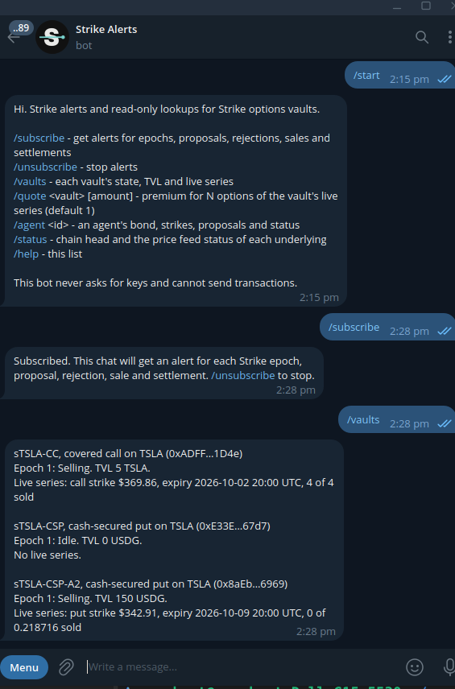

# @strike/telegram-bot

Live: [@strike_options_bot](https://t.me/strike_options_bot). Send `/subscribe` for alerts, or `/vaults`, `/quote sTSLA-CC`, `/agent 1`, `/status`.

<p align="center">
  
</p>

<p align="center"><sub>@strike_options_bot answering /start, /subscribe and /vaults live on 2 October, when /vaults listed only the three v2 vaults. It now lists every deployment.</sub></p>

A small, read-only Telegram bot for Strike. It watches the EpochManager's logs on every deployment (Robinhood Chain
testnet v2 and v3, Arbitrum Sepolia v3) and posts a short alert to every subscribed chat when an epoch opens, a
series is proposed, a proposal is rejected (with the slash), options are bought, or an epoch settles, aborts or
is cancelled. It also answers a few lookup commands, which cover the same deployments.

The bot holds no keys and sends no transactions. It only needs a Telegram bot token and an RPC endpoint.

## What it sends

Alerts are plain text: vault symbol, strike in USD, expiry in UTC, sizes and premiums in human units, the
mandate reason name for rejections, the deployment ("Robinhood Chain testnet · v3") and an explorer link (Blockscout on Robinhood Chain testnet, Arbiscan on
Arbitrum Sepolia). These are real alerts from Robinhood Chain testnet
(46630):

```
sTSLA-CC: new call series on sale (epoch 1)
Strike $369.86, expiry 2026-10-02 20:00 UTC
Size 4 TSLA calls at 100% of fair value ($2.1266 per option), |delta| 0.20
Deployment: Robinhood Chain testnet · v2
Tx: https://explorer.testnet.chain.robinhood.com/tx/0x92169eac7bd2491d1f22f394e15643d5d54309c1e980683cf82a13088021a9d4

sTSLA-CSP: agent 1 proposal rejected, DeltaOutOfBand (epoch 1)
Slashed 10 USDG from the agent's bond; it goes to the vault's depositors at epoch close.
Proposed 0.045397 TSLA puts, strike $352.44, expiry 2026-10-02 20:00 UTC, 100% of fair value
Why: The option's |delta| is outside the mandate's delta band.
Deployment: Robinhood Chain testnet · v2
Tx: https://explorer.testnet.chain.robinhood.com/tx/0x3df523aae815e10cba8f5f99076f9cb348745e7657dd1f1338820af0469dc6a0
```

Events: `EpochOpened`, `SeriesProposed`, `ProposalRejected`, `OptionsBought`, `EpochSettled`, `EpochAborted`,
`SeriesCancelled`.

## Commands

| Command                                 | Answer                                                                                                                      |
| --------------------------------------- | --------------------------------------------------------------------------------------------------------------------------- |
| `/start`, `/help`                       | The command list                                                                                                            |
| `/subscribe`                            | Send alerts from every deployment to this chat                                                                              |
| `/unsubscribe`                          | Stop alerts for this chat                                                                                                   |
| `/vaults [chain] [version]`             | Each vault's epoch state, TVL and series, grouped by chain and labelled with its version                                    |
| `/quote <vault> [amount] [chain] [ver]` | USDG premium for N options (default 1) of the vault's live series (SDK quote), on each deployment that has the vault        |
| `/agent <id> [chain] [version]`         | Bond, strikes, accepted and rejected proposals, status, on every registry where the id exists (agent ids are per registry)  |
| `/status [chain]`                       | Per chain: head block, NYSE session, each underlying's price feed status per deployment, and each deployment's alert cursor |

`<vault>` is the share symbol (`sTSLA-CC`, case does not matter) or the vault address. `[chain]` is a chain id
(`/vaults 421614`), a name (`/vaults arbitrum`) or both a chain and a version (`/vaults 46630 v3`); `[version]` is
`v2` or `v3` (`/vaults v3`). Without them a command covers every deployment. `/quote sTSLA-CC` quotes the vault
on each deployment that has it; `/quote sTSLA-CC 1 v3` or `/quote <address>` picks one. In groups, commands
addressed to another bot (`/status@OtherBot`) are ignored.

A Selling epoch stays Selling on chain until someone settles it. The bot reads the chain's own clock, not the
laptop's, and once a series is past its expiry it says what the app says:

```
Robinhood Chain testnet · v3 · epoch 1: Expired, settling. TVL 5 TSLA.
Series: call strike $369.36, 4 of 4 sold
Expired 2026-10-02 20:00 UTC, waiting for settlement: settles at the first mainnet Chainlink price at or after expiry
```

A vault with no series says "No live series" (and, once an epoch has settled, the settlement price and payout); an
open vault says it is waiting for the agent's proposal. Replies longer than Telegram's 4096 characters are split
between vaults.

## Create the bot (BotFather)

1. In Telegram, open a chat with [@BotFather](https://t.me/BotFather) and send `/newbot`.
2. Pick a display name (for example "Strike Alerts") and a username ending in `bot`.
3. BotFather replies with a token like `123456789:AA...`. Treat it as a password: put it in `.env`, never in
   git, a chat or a screenshot. `/revoke` in BotFather replaces a leaked token.
4. Optional: send `/setcommands` to BotFather, choose the bot, and paste:

   ```
   subscribe - get Strike alerts in this chat
   unsubscribe - stop alerts
   vaults - vault state, TVL and live series
   quote - premium for N options: /quote sTSLA-CC 2
   agent - agent bond, strikes and record: /agent 1
   status - chain head and price feed status
   help - command list
   ```

5. To use it in a group, add the bot to the group and send `/subscribe` there. The bot only reads commands, so
   privacy mode can stay on.

## Configuration

Copy `.env.example` to `.env` in this directory (the bot loads it on start; real environment variables win).

| Variable                | Default                    | Meaning                                                            |
| ----------------------- | -------------------------- | ------------------------------------------------------------------ |
| `TELEGRAM_BOT_TOKEN`    | none                       | BotFather token. Required to run the bot, not for the dry run.     |
| `STRIKE_CHAIN_ID`       | `46630`                    | The primary chain: its state file keeps the subscribers            |
| `STRIKE_CHAIN_IDS`      | every chain with a deploy  | Comma-separated chains to read (see [Chains](#chains))             |
| `STRIKE_RPC_URL`        | the chain's public RPC     | Your own RPC endpoint for the primary chain                        |
| `ALCHEMY_API_KEY`       | unset                      | Read through Alchemy first, with the public RPC as fallback        |
| `DATA_DIR`              | `./data`                   | Where `state-<chainId>.json` (subscribers, log cursor) is kept     |
| `POLL_INTERVAL_SECONDS` | `15`                       | How often to check for new logs                                    |
| `LOG_BLOCK_RANGE`       | `50000`                    | Largest `getLogs` range; halved automatically when the RPC refuses |
| `TELEGRAM_API_URL`      | `https://api.telegram.org` | A self-hosted Bot API server (or a mock in tests)                  |

## Chains

The bot reads every Strike deployment on the chains in `strike.config.json` that have one and are not `local`
(the SDK's `deploymentsFor(chainId)`, one read client per deployment, as the MCP server does):

| Chain                   | Chain id | Deployments read                                                        |
| ----------------------- | -------- | ----------------------------------------------------------------------- |
| Robinhood Chain testnet | `46630`  | v2 (the SDK's default entry) and v3, each with its own EpochManager     |
| Arbitrum Sepolia        | `421614` | v3                                                                      |
| Local devnet            | `31337`  | Only when `STRIKE_CHAIN_ID=31337` (`scripts/demo-local.sh`), read alone |
| Robinhood Chain mainnet | `4663`   | Once Strike is deployed there                                           |

`STRIKE_CHAIN_ID` (default `46630`) is the primary chain: the state file is named by it, and `STRIKE_RPC_URL`
applies to it. `STRIKE_CHAIN_IDS=46630` limits the bot to the listed chains. All deployments share one list of
subscribers; each has its own alert cursor. The old override variables (`STRIKE_EPOCH_MANAGER`, ...) are no longer
needed to read v3.

## Run it locally

From the repository root (Node 22, pnpm):

```sh
pnpm install
cp bots/telegram/.env.example bots/telegram/.env   # then set TELEGRAM_BOT_TOKEN

# Preview: print the alerts it would send for the whole on-chain history. No token needed, nothing is sent,
# no state is written. Extra arguments run commands and print the replies.
pnpm --filter @strike/telegram-bot dry-run
pnpm --filter @strike/telegram-bot dry-run "/vaults" "/quote sTSLA-CC 1" "/agent 1" "/status"

# Run the bot (long polling; Ctrl-C to stop).
pnpm --filter @strike/telegram-bot start
```

Then message the bot `/subscribe`.

On the first start (no state file) the bot scans each deployment from its deploy block (from
`contracts/deployments/`, via the SDK), so it catches up on history before new blocks. Chats that subscribe
during that first catch-up may receive a few older alerts. Starting a bot that already has a state file from the
one-deployment version keeps its subscribers and cursor for the first deployment, and starts the others at their
current head, so nobody gets their history replayed.

## How it works

- **Alerts.** Every `POLL_INTERVAL_SECONDS`, for each deployment in turn, the bot reads the chain head and
  fetches the seven EpochManager events with viem `getLogs` from that deployment's stored cursor, in chunks of up to `LOG_BLOCK_RANGE` blocks. A chunk the
  RPC refuses (range or result limits) is retried at half the size; other errors back off exponentially (1 s,
  2 s, 4 s, ... up to 30 s). Each chunk's logs are joined with vault and series data before any message goes
  out; the cursor is saved after the chunk is delivered. A crash can repeat at most one chunk of alerts, and
  never skips one.
- **Delivery.** Each alert goes to every subscribed chat in turn. A 429 waits out Telegram's `retry_after`; 5xx
  and network errors back off and retry. A chat that blocked the bot or no longer exists (403) is
  unsubscribed. One failing chat never holds up the others.
- **Commands.** Long polling with `getUpdates` over plain `fetch` (no framework). The update offset is stored,
  so a restart does not answer the same command twice.
- **State.** One JSON file in `DATA_DIR`, named by the primary chain (`state-46630.json`), written atomically
  (temporary file, then rename). `cursor` is the first deployment's, as before; `cursors` (added when the bot began
  reading every deployment, and absent until a second deployment is scanned) holds the others by chain id and
  EpochManager. A deployment that fails, or an RPC that is down for one chain, does not hold up the others, and
  an alert already sent by this process is not sent again if a cursor save is lost.

## Deploy

The bot is a single long-running process with outbound HTTPS only (no inbound port, no webhook). Keep
`DATA_DIR` on persistent storage and run one instance per token (two instances polling one token make Telegram
return 409 Conflict).

### AWS (EC2, CloudFormation)

[`infra/aws`](../../infra/aws/README.md) runs the bot on one `t4g.nano` instance: no SSH key and no inbound port
(Session Manager for access), the token and the optional `ALCHEMY_API_KEY` in SSM Parameter Store SecureStrings, logs
in CloudWatch Logs, `DATA_DIR` on the instance's disk, about $8.29 a month in ap-southeast-1. Template ready;
deployment pending. Stop the local bot first (it saves its state on SIGTERM), then from the repository root:

```sh
infra/aws/deploy-bot.sh --i-stopped-the-local-bot   # token from .env into SSM, state file carried over, waits for the bot
infra/aws/update-bot.sh                             # later: git pull on the instance and restart
aws logs tail /strike/telegram-bot --region ap-southeast-1 --follow
```

### Docker

[`Dockerfile`](Dockerfile) builds from the repository root and runs the bot the way the AWS unit does (node with
`tsx` on the sources), as the unprivileged `node` user, with `DATA_DIR=/data` on a volume. The token is never in
the image; it comes from the environment. The root `docker-compose.yml` has it behind the `bot` profile, reading
`TELEGRAM_BOT_TOKEN` (and the optional `ALCHEMY_API_KEY`, `STRIKE_CHAIN_ID`) from the root `.env`:

```sh
docker compose --profile bot up -d --build telegram-bot   # only where no other copy of the bot runs
docker compose logs -f telegram-bot
```

### Small VPS (systemd)

```sh
# as a normal user on the server
git clone https://github.com/Prashant-thakur77/Strike.git strike && cd strike
corepack enable && pnpm install --frozen-lockfile
cp bots/telegram/.env.example bots/telegram/.env && chmod 600 bots/telegram/.env   # set the token
```

`/etc/systemd/system/strike-bot.service`:

```ini
[Unit]
Description=Strike Telegram bot
After=network-online.target
Wants=network-online.target

[Service]
User=strike
WorkingDirectory=/home/strike/strike/bots/telegram
Environment=DATA_DIR=/home/strike/strike-bot-data
ExecStart=/usr/bin/env pnpm start
Restart=always
RestartSec=10

[Install]
WantedBy=multi-user.target
```

```sh
sudo systemctl daemon-reload && sudo systemctl enable --now strike-bot
journalctl -u strike-bot -f
```

`pnpm start` runs the TypeScript directly with `tsx`, against the SDK's source. To run the compiled output
instead, build the SDK first (`pnpm --filter @strike/sdk build && pnpm --filter @strike/telegram-bot build`)
and use `node dist/index.js`. An SDK build older than the current `contracts/deployments` scans the old
addresses.

### Fly.io or Render

Run it as a background worker (no HTTP service) with a persistent volume for `DATA_DIR`:

- **Fly.io:** a machine with a volume (`fly volumes create strike_bot_data --size 1`, mounted at `/data`), no
  `[http_service]` section, `DATA_DIR=/data`, and the token set with `fly secrets set TELEGRAM_BOT_TOKEN=...`.
- **Render:** a Background Worker with build command `corepack enable && pnpm install --frozen-lockfile`, start
  command `pnpm --filter @strike/telegram-bot start`, a persistent disk mounted at, say, `/var/data`, and
  `DATA_DIR=/var/data`. Set the token as a secret environment variable.

Without a persistent volume the bot still works, but it forgets its subscribers on every redeploy and re-scans
from the deploy block.

## Development

```sh
pnpm --filter @strike/telegram-bot test   # vitest: formatting, commands, store, log scanning, send loop
pnpm --filter @strike/telegram-bot lint   # tsc --noEmit
```

The tests use real Robinhood Chain testnet values and the real vault and registry addresses (the sTSLA-CC covered call at $369.86, the rejected put with
10 USDG slashed, 4 calls bought for 10.005944 USDG) and a fake `fetch` in place of the Telegram API.
