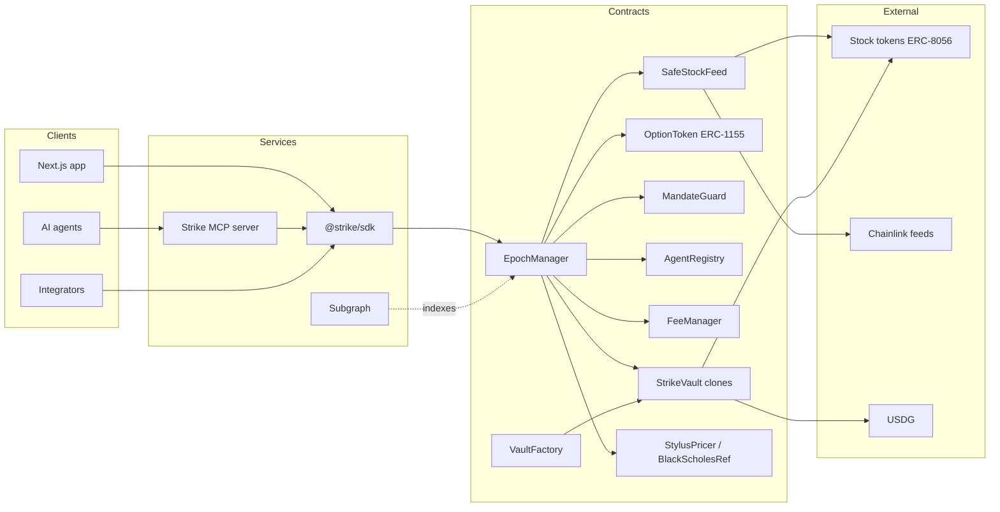
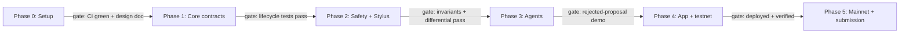

# Strike — Plan for Arbitrum Open House Singapore

Sep 28, 2026 · @Prashant Thakur

## The bet

**Build Strike: options vaults on Robinhood Chain stock tokens, paid in USDG, run by AI agents that must stay inside limits enforced by the contract.** Users deposit TSLA, NVDA or SPY tokens (or USDG). The vault sells weekly covered calls or cash-secured puts and pays the premium in USDG. Agents choose strikes, but only within an on-chain mandate fixed when the vault is created.

It targets every scoring lever this edition has:

- **Reserved Robinhood Chain podium spot, in both tracks.** It is deployed on chain 46630/4663 and built only for stock tokens.
- **USDG bonus.** USDG is the settlement and premium asset, not a mention.
- **Innovation.** CertiK says Robinhood Chain has perps but no options.
- **Real problem.** Stock-token holders earn nothing and can't hedge. The market cap is about $14M against about $400M of idle stablecoins.
- **Contract quality.** Fuzz and invariant tests, handling of stock-token edge cases, and a Stylus pricing engine.
- **Promising Products track.** The agent mandate layer and the MCP server are a new primitive for AI agents doing finance.

The options engine, the agent mandate layer and the stock-token safety library are all written from scratch for Strike.

## The real need on the platform

Robinhood Chain has users and stablecoins but almost no productive use for stock tokens. Every integrator also faces the same data problems. Strike fixes both.

| Gap / bug | Evidence | What Strike does |
| --- | --- | --- |
| No options or hedging on stock tokens | CertiK (Aug 2026): only perps exist | Covered-call and cash-secured-put vaults |
| Stock tokens earn no yield | Market cap is about $14M, vs Ondo at about $851M; Morpho Earn only takes USDG/USDe as collateral | Weekly premium income paid in USDG |
| Activity is mostly memecoins | FalconX: 75–80% of DEX volume is memecoins | Gives holders a reason to keep blue-chip stock tokens |
| Dividends/splits are applied twice by mistake | ERC-8056 `uiMultiplier`: Chainlink prices already include it, the REST API does not | `SafeStockFeed` library normalises this once |
| Weekend prices are frozen or stale | Trading is 24/7, but mint/burn stops Sat 02:00–Mon 02:00 CET and feeds may freeze | Settlement only runs on fresh, market-hours prices; otherwise it waits |
| Tokens and oracles can be paused | Two layers of pause (token and oracle pause), 13 roles, upgradeable proxies | Vault pauses safely and cannot be forced to settle at a bad price |
| USDG is barely used on Arbitrum | GMX listing pending; Aave supports it on Ethereum only | USDG becomes the premium and settlement asset on both chains |
| Agentic trading today is US-only and off-chain | Existing agent trading products are brokerage MCPs for eligible US users | An open on-chain alternative: agents act only inside a contract-enforced mandate |

**The platform-level contribution:** `SafeStockFeed`, a small open-source Solidity library any Robinhood Chain builder can use. It covers the multiplier, staleness, pause and market-hours checks in one call. That is a direct fix for the most common integration mistakes, and judges reward ecosystem tooling.

## Building blocks

| Component | What it does |
| --- | --- |
| `StrikeVault` + `VaultFactory` | ERC-4626 vault, one EIP-1167 clone per (underlying, strategy), token allow-list, staleness limit, fees in bps, epoch deposit/withdraw queue |
| `AgentRegistry` | Registers agents, links an ERC-8004 identity, sets a signer and payout address, holds a USDG bond that can be slashed |
| `EpochManager` | Opens epochs, checks proposals, sells options, settles at expiry. The only contract that can move vault collateral |
| `MandateGuard` | Per-vault mandate: delta band, minimum premium vs fair value, maximum share sold, tenor limits |
| `SafeStockFeed` | Price reads with age, pause, multiplier and market-hours checks |
| `StylusPricer` + `BlackScholesRef.sol` | Black-Scholes fair value and delta; Rust (Stylus) and Solidity versions tested against each other |
| `mcp/` server | Agent-facing interface: `list_vaults`, `quote`, `propose_epoch`, `vault_state`, `risk_check`, `agent_stats` |
| `agents/example` | Example strike-picking agent that uses the MCP server |
| `subgraph/` | Indexes epochs, premiums, PnL |
| `sdk/` | `@strike/sdk` typed client so integrators can embed Strike vaults |

## Design principles

| Principle | Where it lands in Strike |
| --- | --- |
| Vault-as-a-fund framing with a clear fee model | Performance fee on epoch premium; the proposing agent earns a share |
| A SKILL.md agents can read | `STRIKE_SKILL.md` for agents |
| Test discipline: fuzz, invariant, gas and property tests in CI | `test/invariant/`, CI badge, `docs/design.md`; deploy against Robinhood testnet stock tokens |
| Gasless UX later | USDG gas paymaster (roadmap) |
| Oracle-priced quotes for RWAs | Premium quotes anchored to the oracle price, not an AMM spot |
| Hybrid Stylus + Solidity with differential tests | `stylus/pricer` crate + a Solidity reference pricer, fuzzed against each other; gas table in README |
| Accountability for agents | Agents stake a USDG bond; a proposal rejected by the mandate is slashed |
| Heavy fixed-point math in Rust, grounded in literature | Black-Scholes in Stylus; cite the covered-call literature and the CBOE BXM index |
| One quantified mispricing, then the mechanism | Pitch line: "stock-token holders leave X% a year of premium on the table" |
| Agent track record as credit | Agent reputation from on-chain epoch PnL, fed back to ERC-8004 (roadmap) |
| A real business | Mainnet deploy on chain 4663 with a small cap; B2B angle (wallets embed Strike vaults) |
| Market hours and ERC-8056 handled in the oracle layer | `MarketHours` (NYSE calendar) and feed checks inside `SafeStockFeed`; fork tests against chain 4663 |
| Ship an SDK so other devs build on you | `@strike/sdk` on npm |

## Product spec

**Strike runs weekly, European-style, cash-settled options vaults. Every payment is USDG or the stock token itself, so no swap is needed at settlement.**

### Who uses it

| User | What they do | What they get |
| --- | --- | --- |
| Stock-token holder | Deposits TSLA / NVDA / SPY tokens into a covered-call vault | Weekly premium in USDG; keeps the upside up to the strike |
| USDG holder | Deposits USDG into a cash-secured-put vault | Weekly premium; may end up owning the stock below today's price |
| Option buyer (hedger or trader) | Buys a call or put for USDG | Hedge or leveraged exposure with a defined, capped loss |
| Strategy agent | Proposes each epoch's strike and size inside the vault mandate | A share of the performance fee; an on-chain track record |
| Integrator (wallet, app, other agent) | Uses `@strike/sdk` or the MCP server | Yield product for their users without building an options engine |

### Epoch lifecycle

1. **Open:** Monday, after US market open, once the price feed is fresh.
2. **Propose:** a registered agent proposes the strike (for example 0.20 delta, 7 days) and the size. The contract checks the proposal against the mandate and the Black-Scholes fair value.
3. **Sell:** buyers purchase ERC-1155 option tokens and pay the premium in USDG. Unsold size stays idle.
4. **Lock:** collateral for sold options is locked, and deposits and withdrawals queue for the next epoch.
5. **Expire:** Friday 16:00 New York time. The price is read through `SafeStockFeed`, which must be fresh, unpaused and multiplier-correct.
6. **Settle:**
   - Calls: in the money pays the buyer `(S − K) / S` stock tokens per option.
   - Puts: pays the buyer `(K − S)` USDG per option.
   - Anything left over rolls back into the vault.
7. **Fallback:** if the price is stale or paused at expiry, settlement waits for the next valid print. It never settles at a bad price.

### Features

- **Core:** covered-call vault, cash-secured-put vault, ERC-1155 option tokens, weekly epochs, a queue for deposits and withdrawals, a performance fee on premium (for example 10%).
- **Safety:** `SafeStockFeed`, a mandate for each vault (allowed tickers, delta band, minimum premium, maximum share of the vault sold), a guardian pause, a TVL cap.
- **Agents:** agent registry linked to ERC-8004, a USDG bond with slashing, MCP server, SKILL.md, an example agent.
- **Math:** a Stylus Black-Scholes pricer, a Solidity reference version, and a volatility input with bounds set by the admin.
- **UX:** Next.js app with a vault list, deposit and withdraw, epoch timeline, PnL, a buy-option page and a testnet faucet button.
- **Later:** buyers can exercise early by selling back to the vault, spreads, a USDG gas paymaster, stock-token-backed loans that pay for themselves out of premium.

## Architecture

Every write goes through `EpochManager`. It asks `MandateGuard` whether the proposal is allowed, the pricer whether the price is fair, and `SafeStockFeed` whether the market price can be trusted. Agents never hold vault funds.

### Folder layout

| Folder | Stack | Contents |
| --- | --- | --- |
| `contracts/` | Solidity 0.8.30, Foundry, OpenZeppelin 5 | Vaults, factory, EpochManager, OptionToken, MandateGuard, AgentRegistry, FeeManager, `SafeStockFeed` |
| `stylus/pricer/` | Rust, `stylus-sdk`, `cargo-stylus` | Black-Scholes with fixed-point `ln`, `exp`, `sqrt` and normal CDF; exposes `price(S, K, T, sigma, isCall)` and `delta(...)` |
| `mcp/` | TypeScript, MCP SDK, viem | Tools: `list_vaults`, `quote`, `propose_epoch`, `vault_state`, `risk_check`, `agent_stats` |
| `sdk/` | TypeScript, viem, published to npm | Typed client for vaults, options and quotes |
| `app/` | Next.js, wagmi, viem Robinhood Chain definitions | Vault list, deposit and withdraw, buy options, epoch timeline, faucet |
| `subgraph/` | The Graph | Epochs, premiums, settlements, agent PnL |
| `agents/example/` | TypeScript | A simple strike-picking agent that uses the MCP server; shows the mandate rejecting a bad proposal |
| `docs/` | Markdown + mermaid | Design, risk model, threat model, SKILL.md, FEEDBACK.md |

## Stock-token safety rules

**Almost every way to lose money here comes from how Robinhood stock tokens behave. So `SafeStockFeed` and `MandateGuard` refuse to act instead of guessing.** Each rule below gets a named custom error and at least one test.

| Edge case | Rule in code | Test |
| --- | --- | --- |
| Multiplier applied twice | Use the Chainlink price as-is (it already includes `uiMultiplier`). Never multiply the REST API price on-chain. | Fork test: compare the feed price with `balanceOfUI` math on real chain-4663 tokens |
| Stock split or dividend inside an epoch (`newUIMultiplier` + `effectiveAt`) | Strikes are stored per raw token, the same unit as the feed, so a multiplier change does not move them; block new sales and settlement between announcement and `effectiveAt` plus a grace period | Unit: simulate a 4:1 split mid-epoch; buyer and vault values stay unchanged |
| Stale price | Revert `StalePrice` if the price is older than `maxPriceAge` (e.g. 15 min in market hours) | Fuzz on timestamps |
| Market closed (weekend, holiday, overnight) | `MarketHours` (NYSE calendar) gates opening, selling and expiry; settlement waits for the next open print | Unit on a holiday calendar; fork test on a Saturday block |
| Oracle or token paused | Revert `FeedPaused` / `TokenPaused`; the guardian can pause the vault; withdrawals of idle funds still work | Mock pause at each lifecycle step |
| Fake token with the same ticker | Only addresses from the admin allow-list (taken from docs.robinhood.com/chain/contracts) | Unit: unknown token reverts |
| Price gap past the strike (overnight jump) | Cash settlement caps the payout at the collateral; the vault can never owe more than it locks | Invariant: `lockedCollateral >= maxPayout` |
| Agent proposes a reckless strike | `MandateGuard`: delta band, minimum premium vs fair value, maximum share of the vault sold, tickers allowed | Fuzz proposals; slashing test |
| Agent key compromised | Agent signs proposals only; funds move only through the vault; owner can revoke the agent at once | Unit: a revoked agent's proposal reverts |
| Rounding and decimals (18-decimal tokens, 8-decimal feeds, USDG decimals read on-chain) | One `Decimals` library; always round in the vault's favour | Invariant: share price never falls from rounding alone |
| Reentrancy and ERC-1155 callbacks | `nonReentrant` on all state changes, checks-effects-interactions, pull payments for settlement | Reentrancy attack test |
| Sequencer transaction filtering (ArbOS 61) | Document it; failed settlement can be retried and anyone may call `settle()` | Unit: retrying settlement is idempotent |

**Invariants that must always hold:** locked collateral ≥ maximum payout of sold options; total shares × share price = vault assets (to rounding); no transfer out during a locked epoch except settlement; a settled series cannot settle twice.

## Build phases

The phases run in order and each gate must pass before the next phase starts.

### Phase task lists

**Phase 0: Setup**

- [ ] Create the `strike` folder, `git init` and set up the pnpm workspace
- [ ] Create `contracts/` (Foundry), `stylus/pricer/`, `mcp/`, `sdk/`, `app/` (Next.js), `subgraph/`, `agents/example/`, `docs/`
- [ ] GitHub Actions: `forge test`, `cargo test`, `pnpm lint` on every push; add a CI badge
- [ ] Get test funds: Robinhood faucet (ETH plus TSLA/AMZN/PLTR/NFLX/AMD), faucet.paxos.com for USDG, Arbitrum Sepolia ETH
- [ ] Write `docs/design.md`: the epoch lifecycle, settlement formulas, the invariants list

**Phase 1: Core contracts**

- [ ] `StrikeVault` (ERC-4626; call variant holds the stock token, put variant holds USDG) with deposit/withdraw queues between epochs
- [ ] `VaultFactory` (EIP-1167 clones), `OptionToken` (ERC-1155, id = hash of vault, underlying, strike, expiry, type)
- [ ] `EpochManager`: `openEpoch`, `proposeSeries`, `buy`, `lock`, `settle` (anyone may call)
- [ ] `FeeManager`: performance fee on premium; `BlackScholesRef.sol` as the reference pricer

**Phase 2: Safety and Stylus**

- [ ] `SafeStockFeed`: staleness, pause, multiplier, `MarketHours` (NYSE calendar)
- [ ] `MandateGuard`: allowed tickers, delta band, minimum premium vs fair value, maximum share sold
- [ ] Invariant tests for the four invariants; fork tests against chain 4663 tokens and feeds
- [ ] Stylus pricer (fixed-point `ln`/`exp`/normal CDF); differential fuzz against `BlackScholesRef.sol`; gas comparison table

**Phase 3: Agents**

- [ ] `AgentRegistry`: register, link an ERC-8004 identity, set signer, post a USDG bond, slash, revoke
- [ ] MCP server tools: `list_vaults`, `quote`, `propose_epoch`, `vault_state`, `risk_check`, `agent_stats`
- [ ] `STRIKE_SKILL.md` and `@strike/sdk` on npm
- [ ] Example agent that proposes a strike; record it proposing a reckless one that the contract rejects

**Phase 4: App and testnet**

- [ ] Pages: vault list (APY from past premiums), deposit/withdraw, buy option, epoch timeline, my PnL, agent leaderboard
- [ ] Faucet button and a mock buyer pool (testnet has no stock-token AMM)
- [ ] Subgraph for epochs, premiums and PnL
- [ ] Deploy and verify on Robinhood testnet and Arbitrum Sepolia; put the addresses in the README

**Phase 5: Mainnet and submission**

- [ ] Capped mainnet vault on chain 4663 (small TVL cap, guardian pause, "unaudited" banner)
- [ ] README, a 3-minute demo video, a 2-minute pitch video, a 10-slide deck (see Submission kit)
- [ ] Submit on HackQuest; post a build thread on X; share in Arbitrum Discord #open-house; attend the feedback sessions

## Testing and security

**"Smart contract quality" is the first judging criterion. We win it by showing evidence in the README, not by claiming an audit:** CI badges, invariant suites, fork tests against live contracts, an honest "unaudited" label.

| Layer | Tool | What it proves |
| --- | --- | --- |
| Unit | Foundry `forge test` | Every function and every custom error path |
| Fuzz | Foundry fuzz, plus a CI profile with more runs | Pricing, rounding and epoch timing hold for random inputs |
| Invariant | Foundry invariant handlers | Collateral ≥ maximum payout; shares × price = assets; no double settlement; no withdrawal of locked funds |
| Differential | Foundry fuzz calling both pricers | Stylus and Solidity Black-Scholes agree within a stated tolerance |
| Fork | `forge test --fork-url` against Robinhood mainnet 4663 | Real stock tokens, real Chainlink feeds, real `uiMultiplier` and pause functions |
| Static analysis | Slither, plus `cargo clippy` for Stylus | No high findings left unexplained |
| Fuzzing (optional) | Medusa | Deeper stateful fuzzing of the vault |
| Gas | `forge snapshot`, `cargo stylus` gas report | A published Stylus-vs-Solidity gas table |
| Frontend and e2e | Playwright | Deposit → buy → settle works end to end on testnet |

**Security practices:**

- OpenZeppelin 5: `AccessControl` with separate `ADMIN`, `GUARDIAN` and `KEEPER` roles; `Pausable`; `ReentrancyGuard`; `SafeERC20`.
- No upgradeable proxies in v1. Immutable vault clones are simpler to reason about.
- A mainnet TVL cap and a guardian multisig (a Safe).
- `docs/threat-model.md`: oracle manipulation, stale weekend prices, a malicious agent, a compromised admin, sequencer filtering, rounding. Each threat has its mitigation and the test that covers it.
- An AI-usage disclosure file, since judges asked builders to be open about AI tools.
- After the buildathon: apply to the Arbitrum Audit Program for a real audit.

## Submission and pitch kit

**Each judging criterion gets a specific piece of evidence a judge can open in under a minute.**

| Criterion | Evidence we show | Where |
| --- | --- | --- |
| Smart contract quality | CI badge, invariant list, fork tests on 4663, Slither output, threat model, Stylus gas table | README top section, `docs/` |
| Product-market fit | Stock-token holders earn 0% today; covered calls on the BXM index have decades of history in TradFi; wallets can embed the vaults via the SDK | Pitch video, deck slides 2–4 |
| Innovation | First options vaults on Robinhood Chain; agents act only inside a contract-enforced mandate; Stylus pricing | Deck slide 5, demo |
| Real problem | The gap table from this plan (options, yield, multiplier and weekend bugs), each with its source | README "Why" section |
| Robinhood Chain reservation | Deployed on 46630 and mainnet 4663; uses stock tokens and their Chainlink feeds | README addresses table |
| USDG consideration | USDG is the premium and settlement asset; addresses on both chains | README, demo |
| Promising Products track | MCP server, SKILL.md, example agent, ERC-8004 link | Separate agent demo clip |

### README structure

1. One-line pitch, badges, links to the live demo and videos
2. Why: the problem in three numbers
3. How it works: the architecture diagram and the epoch sequence
4. Deployed contracts: a table of name, chain and verified explorer link
5. How we use Robinhood Chain, USDG, Stylus, Chainlink, ERC-8004: each links to the exact file and line
6. Safety: invariants, edge-case table, threat model, "unaudited" notice
7. Quickstart: one command to run tests, one to run the app
8. Prior art: what exists (Ribbon/Aevo, Lyra/Derive, Thetanuts on other chains) and what is new here
9. Roadmap, team, AI-usage disclosure, FEEDBACK.md for Arbitrum and Robinhood

### Videos and deck

- **Demo video (3 min):**
  - Faucet, deposit TSLA, the agent proposes a strike and the contract accepts it.
  - A reckless proposal gets rejected.
  - A buyer pays in USDG.
  - Expiry and settlement, including a paused-oracle case.
- **Pitch video (2 min):**
  - The problem, stated in numbers.
  - Why Robinhood Chain.
  - The business model (10% performance fee on premium).
  - The roadmap.
- **Deck (10 slides):** problem, users, product, demo screenshots, architecture, safety, traction or early users, business model, roadmap, team.

### Distribution

- A build-in-public thread on X during the build, tagging @arbitrum and @RobinhoodApp. Traction breaks ties.
- Attend the buildathon workshops and feedback sessions and post in Discord #open-house.
- Ask 10–20 people to test on testnet, and report the count and their feedback.

## After the buildathon

**The online buildathon is the entry ticket. The big money is at Founder House Singapore, Oct 23–25, up to $300K in USDG.**

- **Founders Eve, Oct 7 (Token2049 week).** A pitch competition whose prize is a Founder House spot. Pitch Strike there too.
- **Milestone payouts.** Open-category prizes pay 50% upfront and 50% on milestones. Pre-define milestones: mainnet TVL, number of vaults, SDK adopted by one wallet.
- **Grants.** Apply to the $30K buildathon grant pool, the Arbitrum Audit Program, and the Alchemy-Arbitrum infrastructure credits. Ask the Global Dollar Network about rewards for USDG held in Strike vaults, since members can earn up to 100% of reserve returns.
- **Product roadmap:**
  - v1.1: more tickers, and put spreads to lower collateral
  - v1.2: USDG gas paymaster
  - v2: agent reputation from on-chain PnL as credit
  - v2: stock-token-backed loans repaid by premium
  - v3: the same vaults on Arbitrum One for tokenized stocks from other issuers
- **Regulation.** The SEC innovation exemption (Sep 18, 2026) gives tokenized stocks an on-chain path in the US. Robinhood stock tokens are still non-US only, so geo-gate the app for US persons from day one.

## Risks and open questions

| Risk | Impact | Mitigation |
| --- | --- | --- |
| Another team ships stock-token options first | **Happened:** a daily-options product is live on Robinhood mainnet, and another team has a testnet order book ([research.md §8](research.md)) | Do not claim "first options". Lead with what nobody else has: contract-enforced agent mandates with bonds and slashing, `SafeStockFeed` (multiplier, pause, corporate-action and market-hours safety), Stylus pricing with exact differential tests, USDG income for depositors |
| Testnet has no stock-token AMM and no USDC | Buyers can't trade realistically | Mock buyer pool on testnet; real Uniswap stock/USDG pools on mainnet |
| Paxos USDG faucet not dispensing on Arbitrum Sepolia | Can't demo USDG on Sepolia | Use Robinhood testnet USDG `0x7E955252E15c84f5768B83c41a71F9eba181802F`, or a clearly labeled mock |
| Weekend or holiday oracle gaps | Settlement delayed | Settlement waits for a valid print, by design; UI shows "awaiting market open" |
| Fixed-point Black-Scholes errors in Rust | Mispriced premiums | Differential fuzz against Solidity; admin volatility bounds; minimum premium in the mandate |
| Stylus library version drift | Build breaks | Keep the Stylus crate pure math with no extra contract-library dependency; pin SDK versions |
| Stock tokens are non-US only | Legal exposure | Geo-gate the app; say so in the README |
| Scope too large for a solo builder | Unfinished features | Gates in the roadmap; cut Phase 3's bond and slashing before cutting tests or videos |

**Open questions to check first:**

- [x] Exact submission deadline and time zone: **2026-10-04 15:59 UTC** ([hackathon.md](hackathon.md))
- [x] USDG decimals on each chain: 6 everywhere; EIP-2612 permit works on all four ([research.md §4](research.md))
- [x] Testnet stock tokens exist (TSLA, AMZN, PLTR, NFLX, AMD) but **no testnet Chainlink feeds**: use Strike's mock feeds on testnet
- [x] Registration is required and closes 2026-10-02 17:01 UTC
- [x] Yes: see the risk table above

## Sources

- [Arbitrum Open House Singapore buildathon (HackQuest)](https://www.hackquest.io/hackathons/Arbitrum-Open-House-Singapore-Online-Buildathon)
- [Open House Singapore announcement (Arbitrum Foundation)](https://blog.arbitrum.foundation/open-house-singapore-applications-are-now-open/)
- [Builder's Block #025: how to stand out](https://blog.arbitrum.foundation/builders-block-025-arbitrums-buildathon-starts-next-week-heres-how-to-stand-out-in-open-house/)
- [Builder's Block #026: Founder House Singapore](https://blog.arbitrum.foundation/builders-block-026-300k-awaits-at-founder-house-singapore-what-great-startups-have-in-common/)
- [Robinhood Chain: building with stock tokens](https://docs.robinhood.com/chain/building-with-stock-tokens/) · [stock token APIs](https://docs.robinhood.com/chain/stock-token-apis/)
- [Paxos USDG mainnet addresses](https://docs.paxos.com/guides/stablecoin/usdg/mainnet) · [testnet addresses](https://docs.paxos.com/guides/stablecoin/usdg/testnet)
- [CertiK: Robinhood Chain on-chain capital markets](https://www.certik.com/blog/robinhood-chain-onchain-capital-market)
- [FalconX: Robinhood Chain primer](https://www.falconx.io/newsroom/robinhood-chain-primer-early-traction-and-protocols-to-watch)
- [Beosin: stock token contract analysis](https://beosin.com/resources/robinhood-chain-stock-token-practice-code-analysis-on-token-contract-and-blockchain-protocol)
- [Arbitrum grants](https://arbitrum.foundation/grants) · [Global Dollar Network](https://globaldollar.com/build-with-usdg)

## Cycle 1 (2026-09-28)

Top five improvements, ranked by effect on the weighted score:

1. Deploy and verify on Robinhood testnet and Arbitrum Sepolia (hard requirements; blocked on testnet funds, script ready).
2. Buyer side: MCP `buy_options`, `redeem_options` and `hedge_plan` tools and a buyer agent, so agents both sell and buy options.
3. Live app URL (Vercel) and the testnet feedback form linked from the app, to collect 10+ users.
4. Robinhood-specific UX: per-share display from `uiMultiplier` and a US-person acknowledgement gate.
5. Stylus pricer as the production pricer, deployed from a reproducible build so it can be verified.
