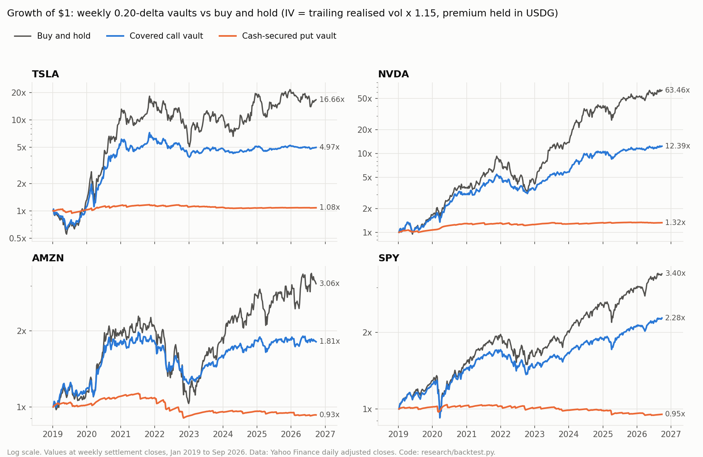
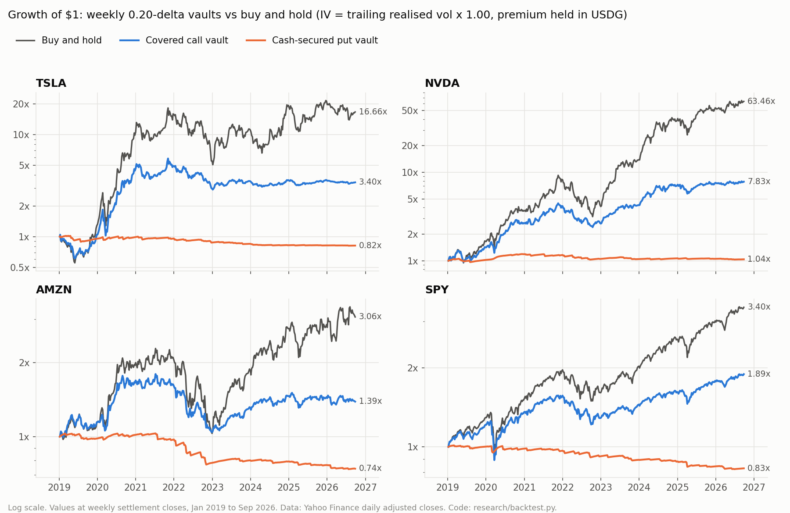
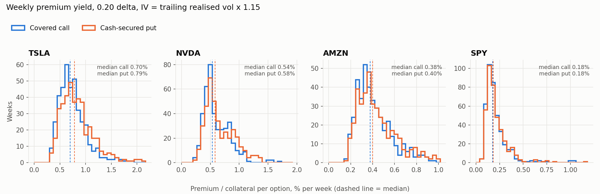
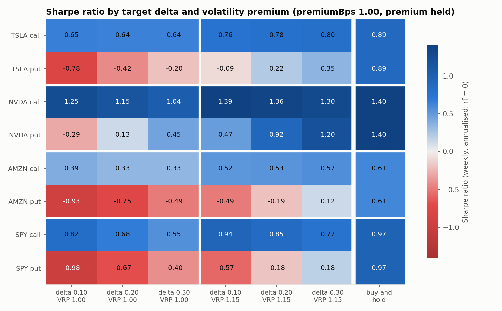

# Backtest: weekly Strike vaults on TSLA, NVDA, AMZN and SPY, 2019–2026

This is a historical simulation of Strike's two vault types, a weekly covered call and a weekly cash-secured put. It follows the contract rules in [design.md](design.md) and uses real daily prices from January 2019 to September 2026. It answers two questions: what a depositor would have earned compared with just holding the stock token, and how sensitive that result is to the strike delta and to the volatility the protocol prices with.

**The main result:** at the default 0.20 delta, the covered-call vault lagged buy-and-hold on every ticker. It did so with 25–46% less volatility and a smaller maximum drawdown. In the base cases its Sharpe ratio was below buy-and-hold's everywhere, and close to it (within 0.05) only for NVDA when premiums were priced 15% above realised volatility. The cash-secured-put vault earned between −3.8% and +3.7% a year, depending mainly on the volatility assumption. Every result here depends on assumptions the contracts cannot guarantee: that buyers purchase the full size each week, at the model price. See [Assumptions](#assumptions) and [Limitations](#limitations).

Reproduce everything (about 15 seconds; the price data is cached in the repository):

```
python3 research/backtest.py
```

`python3 research/fetch_data.py --refresh` downloads the prices again.

## Data

| Item            | Value                                                                                                                                                             |
| --------------- | ----------------------------------------------------------------------------------------------------------------------------------------------------------------- |
| Source          | Yahoo Finance chart API v8, daily bars (`https://query2.finance.yahoo.com/v8/finance/chart/<SYMBOL>?period1=1538352000&period2=…&interval=1d&events=div%2Csplit`) |
| Symbols         | TSLA, NVDA, AMZN, SPY, plus ^VIX as a check                                                                                                                       |
| Downloaded      | 2026-09-28 20:33 UTC; the exact URL and time for each file are in [`research/data/SOURCES.json`](../research/data/SOURCES.json)                                   |
| Range           | 2018-10-01 to 2026-09-28 (2,008 trading days). The extra months before 2019 warm up the volatility window.                                                        |
| Price used      | Split- and dividend-adjusted close (`adj_close`)                                                                                                                  |
| Weeks simulated | 403, from the week of 2019-01-07 to the week ending 2026-09-25. The week of 2026-09-28 was still in progress and is excluded.                                     |

**Why adjusted prices.** Robinhood stock tokens keep raw balances fixed and apply splits and dividends through the ERC-8056 `uiMultiplier`. The Chainlink feed prices one raw token with the multiplier already included ([design.md §2](design.md), [research.md §3](research.md)). So a raw token tracks a total-return price series, and the adjusted close is the closest historical stand-in. The tokens themselves did not exist before 2026. This is a simulation of the strategy on the underlying stocks, not a replay of token prices.

## Method

Each simulated week follows the contract lifecycle (`EpochManager`, `MandateGuard`, `FeeManager`):

| Step       | Contract rule                                                                                                    | In the simulation                                                                                                                                                                                                                    |
| ---------- | ---------------------------------------------------------------------------------------------------------------- | ------------------------------------------------------------------------------------------------------------------------------------------------------------------------------------------------------------------------------------ |
| Open       | `openEpoch` once the market is open                                                                              | Close of the week's first trading day (Monday, or Tuesday after a Monday holiday)                                                                                                                                                    |
| Expiry     | NYSE close; `MarketCalendar.weeklyExpiry` is Friday, or Thursday when Friday is a holiday                        | Close of the week's last trading day                                                                                                                                                                                                 |
| Tenor      | `expiry − now`, in seconds; year = 31,536,000 s                                                                  | Calendar days between the two closes × 86,400 (Monday to Friday = 4 days). The 13:00 early closes are ignored.                                                                                                                       |
| Strike     | `proposeByDelta`: `strikeForDelta` (48 bisection rounds over [S/10, 10S]), then rounded **down** to a whole cent | Same algorithm in float. The strike is solved at today's token price and applied as moneyness. Black-Scholes is scale-invariant, and this keeps the cent rounding at its real size instead of its size on back-adjusted 2019 prices. |
| Premium    | Black-Scholes fair value (r = 0) × `premiumBps`                                                                  | Same; `premiumBps` 1.00 (base) and 0.95 (the demo mandate's floor)                                                                                                                                                                   |
| Size       | ≤ capacity × `maxShareSoldBps`; capacity is one token per call, collateral / K per put                           | 80% of capacity, sold in full at the opening quote                                                                                                                                                                                   |
| Settlement | Calls pay (S − K)/S tokens per option; puts pay K − S USDG per option                                            | Same, at the expiry close                                                                                                                                                                                                            |
| Fee        | 10% of `premium − payoutValue` when positive (half to the agent, half to the treasury)                           | Same, charged per week                                                                                                                                                                                                               |
| Premium    | Paid in USDG to a per-share accumulator the depositor claims                                                     | **Held** as USDG beside the collateral (base case). **Reinvested** into collateral at the settlement price is shown as a variant.                                                                                                    |

Between Friday's settlement and Monday's open, the call vault holds its tokens unhedged and the put vault holds USDG. The float pricer was checked against the fixed-point Rust pricer before any simulation ran (see [Pricer cross-check](#pricer-cross-check)).

**Metrics.** They use the vault's value at each weekly settlement close (403 weekly returns):

- Annualised return (CAGR) uses calendar time.
- Volatility and Sharpe ratio use weekly returns × √52, with a risk-free rate of 0.
- Maximum drawdown is measured on the weekly series, so intra-week troughs are not seen. This understates both the vault's and buy-and-hold's drawdowns by a similar amount.
- "Assigned" is the share of weeks that finished in the money.
- "Avg premium/wk" is premium per option ÷ collateral per option (spot for calls, strike for puts). The vault earns 80% of this on its capital, because it sells 80% of capacity.

### Assumptions

These are the assumptions the contracts cannot enforce. The results rest on them.

1. **No demand risk.** The vault sells its full 80% every week. On-chain, options sell only if buyers want them at the oracle-anchored price. Unsold size earns nothing.
2. **No bid/ask and no timing.** Every option sells at Monday's closing quote. On-chain, each `buy` is priced from the live spot at the moment of purchase ([design.md §3](design.md)), and there is no order book.
3. **The implied volatility is a model.** The protocol prices with a keeper-set volatility inside admin bounds. The simulation sets that input to **trailing realised volatility × a volatility-risk-premium (VRP) factor**. Realised volatility is the annualised standard deviation of daily log returns over the last 21 trading days (about 30 calendar days), known at the open. It is reported at factors 1.00 (no premium over recent realised volatility) and 1.15 (15% above). Neither is market-implied volatility. For SPY, the VIX was used as a check (next section) and as an alternative input.
4. **Zero interest rate.** This matches the pricer. USDG collateral earns nothing. The Cboe PUT index, by contrast, holds Treasury bills.
5. **No gas costs, no claim delays, no corporate-action pauses.** Settlement always happens at the expiry close. On-chain it may wait for the first valid print ([design.md §10](design.md)).

### VIX check on the volatility assumption

Over 1,924 trading days from January 2019 (`research/results/vix_check.json`):

| Measure                                                          | Value |
| ---------------------------------------------------------------- | ----- |
| Mean VIX                                                         | 20.1% |
| Mean trailing 21-day SPY realised volatility                     | 16.3% |
| Mean next-21-day SPY realised volatility                         | 16.1% |
| Median VIX ÷ trailing realised volatility                        | 1.30  |
| Median VIX ÷ next-21-day realised volatility                     | 1.36  |
| Days on which VIX exceeded the next 21 days' realised volatility | 84%   |

For the S&P 500, implied volatility has run about 30% above trailing realised volatility. So the 1.15 factor is conservative for SPY. The data here says nothing about the implied-to-realised ratio for single stocks (TSLA, NVDA, AMZN), where the ratio is usually different. The 1.00 and 1.15 results bracket a range; they do not estimate it. Using the VIX directly as SPY's implied volatility is reported below as a variant.

## Results

### Base case: 0.20 delta, premium at fair value, premium held in USDG

**VRP 1.15** (implied volatility = trailing realised × 1.15)

| Ticker | Vault            | CAGR  | B&H CAGR | Vol   | B&H vol | Sharpe | B&H Sharpe | Max DD | B&H max DD | Assigned | Avg premium/wk | Worst week | B&H worst week |
| ------ | ---------------- | ----- | -------- | ----- | ------- | ------ | ---------- | ------ | ---------- | -------- | -------------- | ---------- | -------------- |
| TSLA   | covered call     | 23.1% | 44.0%    | 33.7% | 62.3%   | 0.78   | 0.89       | -46.3% | -72.2%     | 18.4%    | 0.75%          | -21.9%     | -25.9%         |
| TSLA   | cash-secured put | 1.0%  | 44.0%    | 5.2%  | 62.3%   | 0.22   | 0.89       | -9.9%  | -72.2%     | 19.9%    | 0.86%          | -5.4%      | -25.9%         |
| NVDA   | covered call     | 38.6% | 71.2%    | 26.5% | 45.6%   | 1.36   | 1.40       | -43.0% | -65.9%     | 23.6%    | 0.61%          | -11.3%     | -16.1%         |
| NVDA   | cash-secured put | 3.7%  | 71.2%    | 4.0%  | 45.6%   | 0.92   | 1.40       | -7.1%  | -65.9%     | 15.6%    | 0.68%          | -4.0%      | -16.1%         |
| AMZN   | covered call     | 8.0%  | 15.6%    | 17.2% | 31.8%   | 0.53   | 0.61       | -37.5% | -54.8%     | 22.1%    | 0.42%          | -8.7%      | -13.9%         |
| AMZN   | cash-secured put | -0.9% | 15.6%    | 4.5%  | 31.8%   | -0.19  | 0.61       | -20.0% | -54.8%     | 18.9%    | 0.45%          | -5.3%      | -13.9%         |
| SPY    | covered call     | 11.3% | 17.2%    | 13.5% | 18.1%   | 0.85   | 0.97       | -28.7% | -31.8%     | 23.3%    | 0.21%          | -12.8%     | -14.5%         |
| SPY    | cash-secured put | -0.6% | 17.2%    | 3.2%  | 18.1%   | -0.18  | 0.97       | -9.1%  | -31.8%     | 16.4%    | 0.22%          | -4.6%      | -14.5%         |

**VRP 1.00** (implied volatility = trailing realised)

| Ticker | Vault            | CAGR  | B&H CAGR | Vol   | B&H vol | Sharpe | B&H Sharpe | Max DD | B&H max DD | Assigned | Avg premium/wk | Worst week | B&H worst week |
| ------ | ---------------- | ----- | -------- | ----- | ------- | ------ | ---------- | ------ | ---------- | -------- | -------------- | ---------- | -------------- |
| TSLA   | covered call     | 17.2% | 44.0%    | 33.5% | 62.3%   | 0.64   | 0.89       | -50.4% | -72.2%     | 20.8%    | 0.66%          | -22.2%     | -25.9%         |
| TSLA   | cash-secured put | -2.6% | 44.0%    | 5.8%  | 62.3%   | -0.42  | 0.89       | -20.0% | -72.2%     | 22.8%    | 0.74%          | -6.3%      | -25.9%         |
| NVDA   | covered call     | 30.6% | 71.2%    | 26.1% | 45.6%   | 1.15   | 1.40       | -46.3% | -65.9%     | 26.6%    | 0.53%          | -11.6%     | -16.1%         |
| NVDA   | cash-secured put | 0.5%  | 71.2%    | 4.5%  | 45.6%   | 0.13   | 1.40       | -13.3% | -65.9%     | 18.6%    | 0.58%          | -4.4%      | -16.1%         |
| AMZN   | covered call     | 4.3%  | 15.6%    | 17.1% | 31.8%   | 0.33   | 0.61       | -41.9% | -54.8%     | 24.1%    | 0.36%          | -8.9%      | -13.9%         |
| AMZN   | cash-secured put | -3.8% | 15.6%    | 5.0%  | 31.8%   | -0.75  | 0.61       | -28.4% | -54.8%     | 21.3%    | 0.39%          | -5.8%      | -13.9%         |
| SPY    | covered call     | 8.6%  | 17.2%    | 13.5% | 18.1%   | 0.68   | 0.97       | -29.0% | -31.8%     | 28.3%    | 0.18%          | -13.0%     | -14.5%         |
| SPY    | cash-secured put | -2.4% | 17.2%    | 3.5%  | 18.1%   | -0.67  | 0.97       | -18.8% | -31.8%     | 19.4%    | 0.19%          | -4.8%      | -14.5%         |





What the tables show:

- **Covered calls give up most of a strong bull market.** From 2019 to 2026, TSLA rose 16.7× and NVDA 63.5×. A weekly 0.20-delta call caps each week's gain at the strike: on average 6.4% above spot for TSLA, 5.0% for NVDA, 3.3% for AMZN and 1.7% for SPY (VRP 1.15). In the weeks that matter most (TSLA's 2020 run, NVDA's 2023–24 run) the cap binds. Buyers were paid more than the premium collected: 1.16–1.37× the premium at VRP 1.15, and 1.56–1.85× at VRP 1.00.
- **They cut risk.** Volatility fell by 25–46% and the maximum drawdown fell by 3–26 percentage points. Part of that reduction comes from the 20% of capacity left unsold being fully exposed, and from premium held as USDG, which is a growing cash buffer.
- **Cash-secured puts behaved like a low-volatility, low-return product.** With no interest on USDG, the premium is the only return. That premium roughly paid for the assignments at VRP 1.15 (buyers received 0.65–1.01× the premium) and fell short at VRP 1.00 (0.87–1.33×). The whole result turns on whether the protocol prices above realised volatility.
- **Premium yields per option per week** at VRP 1.15: TSLA 0.75% (call) and 0.86% (put), NVDA 0.61% and 0.68%, AMZN 0.42% and 0.45%, SPY 0.21% and 0.22%. These are consistent with the illustrative table in [risk-model.md](risk-model.md), which assumes a fixed volatility.



### Stress periods

Vault return, with buy-and-hold in brackets, measured between weekly settlement closes. The crash window is 2020-02-14 to 2020-03-20, the rebound 2020-03-20 to 2020-12-31, and the bear market 2021-12-31 to 2022-10-14.

**VRP 1.15**

| Ticker | Vault            | 2020 crash      | 2020 rebound    | 2022 bear       | Payout / premium | Avg strike vs spot | Avg IV |
| ------ | ---------------- | --------------- | --------------- | --------------- | ---------------- | ------------------ | ------ |
| TSLA   | covered call     | -36.8% (-46.6%) | 396.7% (725.3%) | -24.6% (-41.8%) | 1.37             | +6.4%              | 67.9%  |
| TSLA   | cash-secured put | -2.5% (-46.6%)  | 10.9% (725.3%)  | -2.1% (-41.8%)  | 0.84             | -5.4%              | 67.9%  |
| NVDA   | covered call     | -22.7% (-29.0%) | 125.5% (154.1%) | -39.1% (-61.8%) | 1.29             | +5.0%              | 54.4%  |
| NVDA   | cash-secured put | 3.1% (-29.0%)   | 15.3% (154.1%)  | -6.1% (-61.8%)  | 0.65             | -4.4%              | 54.4%  |
| AMZN   | covered call     | -12.2% (-13.5%) | 63.3% (76.4%)   | -23.9% (-35.9%) | 1.16             | +3.3%              | 36.9%  |
| AMZN   | cash-secured put | -0.4% (-13.5%)  | 7.4% (76.4%)    | -12.1% (-35.9%) | 1.01             | -3.1%              | 36.9%  |
| SPY    | covered call     | -28.7% (-31.8%) | 56.8% (65.5%)   | -19.7% (-23.8%) | 1.20             | +1.7%              | 18.7%  |
| SPY    | cash-secured put | -3.7% (-31.8%)  | 4.7% (65.5%)    | -2.9% (-23.8%)  | 1.00             | -1.6%              | 18.7%  |

**VRP 1.00**

| Ticker | Vault            | 2020 crash      | 2020 rebound    | 2022 bear       | Payout / premium |
| ------ | ---------------- | --------------- | --------------- | --------------- | ---------------- |
| TSLA   | covered call     | -37.7% (-46.6%) | 354.5% (725.3%) | -28.1% (-41.8%) | 1.85             |
| TSLA   | cash-secured put | -4.6% (-46.6%)  | 5.8% (725.3%)   | -5.8% (-41.8%)  | 1.14             |
| NVDA   | covered call     | -23.3% (-29.0%) | 115.8% (154.1%) | -42.2% (-61.8%) | 1.75             |
| NVDA   | cash-secured put | 2.7% (-29.0%)   | 11.7% (154.1%)  | -10.8% (-61.8%) | 0.87             |
| AMZN   | covered call     | -13.0% (-13.5%) | 58.4% (76.4%)   | -26.9% (-35.9%) | 1.56             |
| AMZN   | cash-secured put | -1.2% (-13.5%)  | 3.5% (76.4%)    | -15.8% (-35.9%) | 1.33             |
| SPY    | covered call     | -29.0% (-31.8%) | 52.5% (65.5%)   | -22.1% (-23.8%) | 1.66             |
| SPY    | cash-secured put | -4.4% (-31.8%)  | 2.5% (65.5%)    | -5.3% (-23.8%)  | 1.31             |

In the 2020 crash, the covered-call vault fell almost as far as the stock: weekly premium is small next to a 30–45% fall. The put vault's return over the same weeks ranged from −4.6% to +3.1%, because weekly puts are re-struck below each new, lower spot. They are never deep in the money for long, and the vault can lose at most K − S on 80% of its capital in any one week. The largest put-vault loss in a single week was 6.3% (TSLA, VRP 1.00). In the 2022 bear market, both vault types lost less than holding the stock.

### Sensitivity to delta, volatility premium and premium factor

CAGR at `premiumBps` 1.00:

| Ticker | Vault | Δ 0.10, VRP 1.00 | Δ 0.20, VRP 1.00 | Δ 0.30, VRP 1.00 | Δ 0.10, VRP 1.15 | Δ 0.20, VRP 1.15 | Δ 0.30, VRP 1.15 | B&H   |
| ------ | ----- | ---------------- | ---------------- | ---------------- | ---------------- | ---------------- | ---------------- | ----- |
| TSLA   | call  | 20.9%            | 17.2%            | 14.4%            | 26.9%            | 23.1%            | 19.2%            | 44.0% |
| TSLA   | put   | -4.6%            | -2.6%            | -1.3%            | -0.5%            | 1.0%             | 1.7%             | 44.0% |
| NVDA   | call  | 46.2%            | 30.6%            | 19.5%            | 54.1%            | 38.6%            | 25.6%            | 71.2% |
| NVDA   | put   | -1.4%            | 0.5%             | 1.8%             | 1.7%             | 3.7%             | 4.8%             | 71.2% |
| AMZN   | call  | 6.6%             | 4.3%             | 3.5%             | 9.9%             | 8.0%             | 6.7%             | 15.6% |
| AMZN   | put   | -5.1%            | -3.8%            | -2.2%            | -2.5%            | -0.9%            | 0.4%             | 15.6% |
| SPY    | call  | 12.4%            | 8.6%             | 5.8%             | 14.8%            | 11.3%            | 8.4%             | 17.2% |
| SPY    | put   | -3.2%            | -2.4%            | -1.5%            | -1.7%            | -0.6%            | 0.5%             | 17.2% |



- **Calls: lower delta was better** on every ticker. Over a period in which all four stocks rose strongly, the less upside the vault gave away, the better it did. That is a property of this sample, not a general rule.
- **Puts: higher delta was better.** More premium per week outweighed more frequent assignment, especially at VRP 1.15.
- **Maximum drawdown** grows as delta falls for calls. At 0.10 delta, the TSLA call vault's drawdown was 61–64%, against about 38% at 0.30. The full grid, including drawdowns, Sharpe ratios and assignment rates, is in `research/results/grid.csv` and `research/results/tables.md`.
- **Selling at the mandate floor of 95% of fair value** cost 0.1–0.75 percentage points of CAGR (mean 0.44) across the 48 configurations.

### Variants

| Variant                             | Ticker | Vault            | CAGR  | B&H CAGR | Vol   | Sharpe | Max DD | Assigned | Avg IV |
| ----------------------------------- | ------ | ---------------- | ----- | -------- | ----- | ------ | ------ | -------- | ------ |
| Premium reinvested, VRP 1.15        | TSLA   | covered call     | 31.2% | 44.0%    | 54.1% | 0.77   | -73.9% | 18.4%    | 67.9%  |
| Premium reinvested, VRP 1.15        | NVDA   | covered call     | 60.0% | 71.2%    | 39.6% | 1.39   | -61.6% | 23.6%    | 54.4%  |
| Premium reinvested, VRP 1.15        | AMZN   | covered call     | 11.1% | 15.6%    | 27.6% | 0.52   | -55.3% | 22.1%    | 36.9%  |
| Premium reinvested, VRP 1.15        | SPY    | covered call     | 14.6% | 17.2%    | 16.5% | 0.91   | -30.6% | 23.3%    | 18.7%  |
| Premium reinvested, VRP 1.15        | NVDA   | cash-secured put | 6.0%  | 71.2%    | 8.6%  | 0.72   | -15.0% | 15.6%    | 54.4%  |
| Premium reinvested, VRP 1.15        | TSLA   | cash-secured put | -0.3% | 44.0%    | 12.4% | 0.04   | -34.0% | 19.9%    | 67.9%  |
| SPY, IV = VIX                       | SPY    | covered call     | 13.3% | 17.2%    | 13.2% | 1.01   | -28.5% | 19.4%    | 20.2%  |
| SPY, IV = VIX                       | SPY    | cash-secured put | 1.1%  | 17.2%    | 2.9%  | 0.39   | -4.9%  | 15.4%    | 20.2%  |
| SPY, 20% volatility floor, VRP 1.15 | SPY    | covered call     | 15.2% | 17.2%    | 13.2% | 1.13   | -27.9% | 15.1%    | 23.3%  |
| SPY, 20% volatility floor, VRP 1.15 | SPY    | cash-secured put | 2.7%  | 17.2%    | 2.9%  | 0.92   | -4.8%  | 13.2%    | 23.3%  |

- **Reinvesting premium** (claim it and deposit it back every week) keeps the vault fully in the stock. It raises the covered call's CAGR and volatility towards buy-and-hold's. With reinvestment, the Sharpe ratio stays close to the held-premium case.
- **Using the VIX as SPY's implied volatility** makes SPY's put vault positive (+1.1%). It raises the call vault's Sharpe ratio to 1.01, slightly above buy-and-hold's 0.97, with a lower return (13.3% against 17.2%). This is the only non-floor configuration in which a vault's Sharpe ratio exceeded buy-and-hold's.
- **The deploy script's volatility bounds matter for SPY.** `script/Deploy.s.sol` calls `setSigmaBounds(token, 0.2e18, 2e18, …)` for every listed stock, so SPY cannot be priced below 20% volatility. SPY's trailing realised volatility had a median of 13.5% over the sample and was below 15% in 60% of weeks. At VRP 1.15 the floor binds in 70% of weeks, lifting the premium above the model. Buyers would be paying more than recent volatility justifies. The backtest cannot tell whether they would. The high Sharpe ratios of the floor variant (1.13 and 0.92) come from that assumption.

### Mandate check

Each simulated proposal was also checked against the demo vaults' mandate (`script/Seed.s.sol`: delta band 0.10–0.35, `minPremiumBps` 9500, `minYieldBps` 5, `maxShareSoldBps` 8000, tenor 1–8 days). The check uses the same integer rules as `MandateGuard.check`. Every 0.20 and 0.30 proposal passed. At 0.10:

- **All 403 put proposals at exactly 0.10 delta would be rejected with `DeltaOutOfBand`.** `proposeByDelta` rounds the strike down to a whole cent. For a put, a lower strike means a lower |delta|, so the solved strike lands just under 0.1000 and floors to 999 bps. A put targeted exactly at the band's lower edge is always rejected, and the agent is slashed. The SDK's `clampDeltaToMandate` keeps targets one delta point inside each edge (`agents/example/src/strategy.ts`), so the example agent never does this. A hand-written agent could. The sensitivity table simulates these 0.10 puts as if they had been sold, to show the strategy's economics.
- **SPY calls at 0.10 delta fell below `minYieldBps` (0.05% of spot) in 56–98 of 403 weeks**, all in calm weeks (model volatility between 5% and 12%). In those weeks, a rational agent would move to a higher delta or skip the epoch.

## Pricer cross-check

The simulation's float pricer implements the same model as `stylus/pricer/src/math.rs` (r = 0, 365-day year, `strikeForDelta` by 48 bisection rounds). It was checked against the fixed-point Rust pricer (`research/results/pricer_crosscheck.json`):

| Check                                                                  | Result                                                                                                                                                                                            |
| ---------------------------------------------------------------------- | ------------------------------------------------------------------------------------------------------------------------------------------------------------------------------------------------- |
| `known_quote` test: S = 250, K = 275, 7 days, 60%, call                | 1.36028323765224, delta 0.1344687460128014; the Solidity test expects 1,360,283,237,652,240,000 WAD and delta 134,468,746,012,801,400 WAD                                                         |
| The 300 Rust-generated vectors in `contracts/test/vectors/pricer.json` | Largest price difference 3.6 × 10⁻¹⁶ of spot; largest delta difference 8.9 × 10⁻¹⁶                                                                                                                |
| [risk-model.md](risk-model.md) example table (7 days, 0.20 delta)      | TSLA call +7.61% / 0.892% a week, TSLA put −6.43% / 1.032%, NVDA call +6.26% / 0.748%, SPY call +2.15% / 0.275%. Matches the published +7.6% / 0.89%, −6.4% / 1.03%, +6.3% / 0.75%, +2.2% / 0.28% |

## Limitations

- **Demand is assumed, not modelled.** This is the largest gap. A vault that cannot find buyers at the oracle-anchored price earns nothing that week. Nothing here shows that buyers exist at VRP 1.00 or 1.15 on Robinhood Chain.
- **The implied volatility is modelled.** Real weekly implied volatility for single stocks has term structure, skew (out-of-the-money puts usually trade at higher implied volatility than calls) and event spikes around earnings. The flat trailing-volatility input misses all three. A keeper that priced skew would change the put results most.
- **One period.** 2019–2026 was an unusually strong market for all four stocks. Covered calls tend to look worst in such periods.
- **Weekly observation.** Drawdowns and worst weeks are measured at settlement closes only.
- **Timing.** The simulation sells everything at Monday's close. On-chain, sales happen through the week at live prices, and settlement uses the first Chainlink print at or after 16:00 New York time, not the official close.
- **No costs.** Gas, keeper costs and the delay before premium is claimed are ignored. The USDG peg is taken as exactly $1.
- **Token versus stock.** Stock tokens trade 24/7 but are minted only in a weekday window. They can trade at a premium or discount to the stock, and they can be paused. None of that is modelled.

## Files

| Path                                                         | Contents                                                                       |
| ------------------------------------------------------------ | ------------------------------------------------------------------------------ |
| `research/fetch_data.py`                                     | Downloads and caches the price data                                            |
| `research/backtest.py`                                       | Pricer, cross-checks, simulation, tables and charts                            |
| `research/data/*.csv`, `research/data/SOURCES.json`          | Cached prices and their provenance                                             |
| `research/results/tables.md`                                 | Every table above, generated                                                   |
| `research/results/grid.csv`                                  | All 96 grid runs (3 deltas × 2 VRP × 2 premium factors × 4 tickers × 2 vaults) |
| `research/results/variants.csv`                              | Reinvested, VIX and volatility-floor variants                                  |
| `research/results/weekly_delta020_vrp100.csv`, `…vrp115.csv` | Week-by-week records of the base cases                                         |
| `research/results/vix_check.json`, `pricer_crosscheck.json`  | Volatility and pricer checks                                                   |
| `research/charts/*.png`                                      | The charts in this document                                                    |
