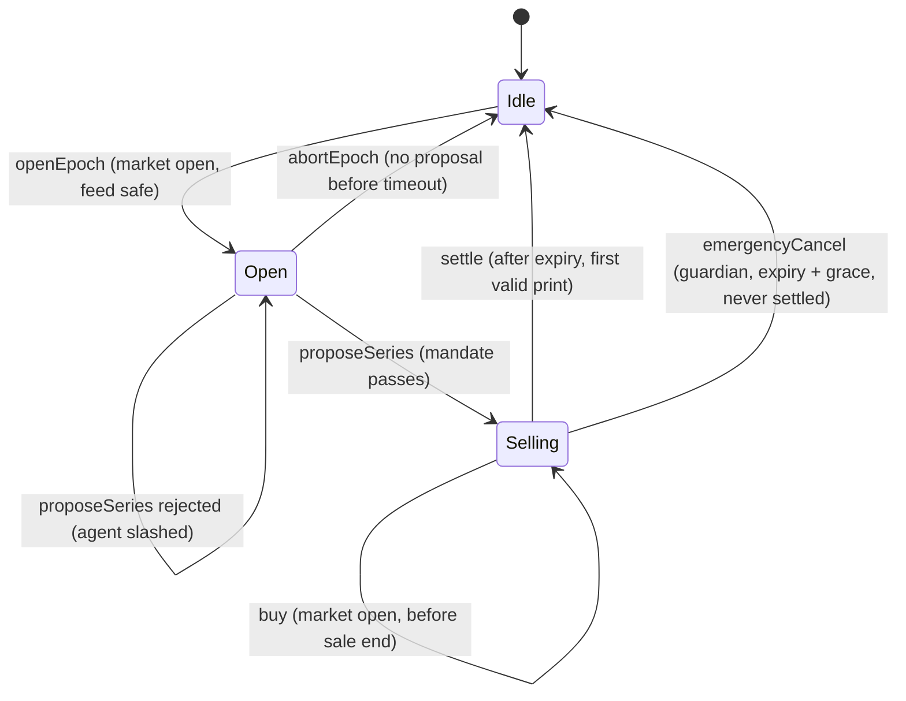

# Strike design

This document is the contract-level specification. [PLAN.md](PLAN.md) says what we build and why; this file says exactly how it behaves. Code, tests and this document must agree; when they disagree, fix the one that is wrong and log it in [decisions.md](decisions.md).

## 1. Actors and contracts

| Contract                           | Role                                                                                                                                                                                                |
| ---------------------------------- | --------------------------------------------------------------------------------------------------------------------------------------------------------------------------------------------------- |
| `StrikeVault`                      | ERC-4626 vault (EIP-1167 clone). Holds collateral: the stock token (call vault) or USDG (put vault). Queues deposits and redemptions while an epoch runs. Distributes USDG premium to shareholders. |
| `VaultFactory`                     | Deploys vault clones and registers them with the `EpochManager`.                                                                                                                                    |
| `EpochManager`                     | The state machine: opens epochs, checks proposals, sells options, settles, pays option holders. The only address a vault accepts collateral moves from.                                             |
| `OptionToken`                      | ERC-1155. One id per series. Only the `EpochManager` mints and burns.                                                                                                                               |
| `MandateGuard`                     | Library. Pure check of a proposal against a vault's mandate. Returns a reason code instead of reverting.                                                                                            |
| `AgentRegistry`                    | Agents, their signer and payout addresses, ERC-8004 identity link, USDG bond, strikes and slashing.                                                                                                 |
| `FeeManager`                       | Performance-fee parameters and fee balances (pull payments).                                                                                                                                        |
| `SafeStockFeed`                    | Library. Every price read goes through it: staleness, pauses, corporate actions, decimals.                                                                                                          |
| `MarketCalendar`                   | NYSE trading calendar: DST-aware open/close times plus an admin-maintained holiday list.                                                                                                            |
| `BlackScholesRef` / `StylusPricer` | `IPricer` implementations. Identical integer algorithm in Solidity and Rust.                                                                                                                        |

Roles (OpenZeppelin `AccessControl`): `DEFAULT_ADMIN_ROLE` (config, allow-list), `GUARDIAN_ROLE` (pause, emergency cancel), `KEEPER_ROLE` (volatility updates, opening epochs). Each vault also has a `curator` (who created it) who can change the vault's agent.

## 2. Units

| Quantity                             | Unit                                         | Notes                                                                      |
| ------------------------------------ | -------------------------------------------- | -------------------------------------------------------------------------- |
| Prices, strikes, premiums per option | WAD (1e18 = $1) per **raw** token            | Same unit as the Chainlink stock feed, normalised from the feed's decimals |
| Option amounts                       | Underlying token base units                  | `10^underlyingDecimals` = one option on one raw token                      |
| Call collateral                      | Underlying token                             | One raw token per option                                                   |
| Put collateral, premium, fees, bonds | USDG base units                              | Decimals read on-chain (6 on Robinhood testnet)                            |
| Volatility                           | WAD, annualised                              | Admin bounds per underlying                                                |
| Time                                 | Seconds; `T` in years = seconds / 31,536,000 |                                                                            |

USDG is treated as exactly $1. Conversions from WAD USD to USDG round **up** when the vault receives (collateral required, premium owed by a buyer) and **down** when the vault pays (payouts). Every rounding favours the vault.

### Why strikes are per raw token

ERC-8056 stock tokens keep raw balances fixed and express splits and dividends through `uiMultiplier` (UI balance = raw balance × multiplier). The Chainlink feed for a stock token already prices one raw token, multiplier included. Strikes, spot and payouts are therefore all per raw token, and a split changes neither the feed price nor the strike. **We never multiply a Chainlink price by `uiMultiplier`.** The app divides by the multiplier only to _display_ a per-share price.

## 3. Epoch lifecycle



| Phase                                                    | What happens                                                                                                                                                                                                                                                                                                                         | Who can call          |
| -------------------------------------------------------- | ------------------------------------------------------------------------------------------------------------------------------------------------------------------------------------------------------------------------------------------------------------------------------------------------------------------------------------ | --------------------- |
| Idle                                                     | Vault unlocked: ERC-4626 `deposit`/`mint`/`withdraw`/`redeem` work instantly, up to the TVL cap.                                                                                                                                                                                                                                     | anyone                |
| `openEpoch(vault)`                                       | Requires Idle, not paused, market open, feed safe. Locks the vault (**lock**): from now until settlement every deposit or redemption is queued.                                                                                                                                                                                      | vault agent or keeper |
| `proposeSeries(vault, strike, expiry, size, premiumBps)` | Checks the proposal with `MandateGuard` against spot and Black-Scholes fair value. Pass: creates the series, state Selling. Fail: emits `ProposalRejected(reason)`, slashes the agent's bond to the vault's depositors and adds a strike. It does not revert, so the slash sticks.                                                   | vault agent's signer  |
| `buy(seriesId, amount, maxPremium, to)`                  | Requires Selling, not paused, market open, feed safe, before sale end. Premium = fair value now × `premiumBps` (oracle-anchored, not a fixed price, so a moving spot cannot be arbitraged against a stale quote). Collateral for the new options is locked; the premium is escrowed in the manager until settlement. Mints ERC-1155. | anyone                |
| `settle(vault, roundId)`                                 | After expiry. Uses the first feed round at or after expiry (`roundId` is a hint the contract verifies). Computes the payout, moves it from the vault to the manager for option holders, pays the performance fee, sends the net premium to the vault, processes the queue, unlocks. With nothing sold it settles without a price.    | anyone                |
| `redeem(seriesId, amount, to)`                           | After settlement: burns options and pays `amount × payoutPerOption` (pull payment).                                                                                                                                                                                                                                                  | option holder         |
| `abortEpoch(vault)`                                      | Open state, no proposal after `proposalTimeout`: unlock and process the queue.                                                                                                                                                                                                                                                       | anyone                |
| `emergencyCancel(vault)`                                 | Selling, `expiry + settlementGrace` passed, still unsettled (feed dead). Collateral goes back to the vault; buyers redeem their premium instead of a payout.                                                                                                                                                                         | guardian              |

Expiry must be 16:00 New York time on an NYSE trading day, inside the vault's tenor limits. Sales stop `saleCutoff` before expiry.

## 4. Settlement formulas

Let `S` be the settlement price and `K` the strike (both WAD, per raw token), `n` the options sold (underlying base units), `u = 10^underlyingDecimals`.

**Call (covered, physically backed, cash-settled in the stock token)**

```
payoutPerOption (fraction of one token, WAD) = S > K ? (S − K) × 1e18 / S : 0      (rounded down)
payout (underlying base units)               = n × payoutPerOption / 1e18          (rounded down)
```

A holder of `a` options receives `a × payoutPerOption / 1e18` tokens, worth `a/u × (S − K)` dollars at `S`. Collateral locked is `n` tokens, and `(S − K)/S < 1`, so **payout < collateral always**.

**Put (cash-secured, settled in USDG)**

```
payoutPerOption (USDG per option, WAD USD) = K > S ? K − S : 0
payout (USDG base units) = n × payoutPerOption / u, converted WAD→USDG, rounded down
collateral locked        = n × K / u,              converted WAD→USDG, rounded up
```

Since `K − S ≤ K`, **payout ≤ collateral always**, even if `S = 0`.

**Premium and fee.** Premiums are held in the manager during the epoch. At settlement:

```
payoutValue (USDG) = call: payout × S converted to USDG ;  put: payout
pnl                = premium − payoutValue
fee                = pnl > 0 ? pnl × perfFeeBps / 10_000 : 0
agentFee           = fee × agentShareBps / 10_000        → agent's payout address
treasuryFee        = fee − agentFee                      → treasury
toDepositors       = premium − fee                       → vault premium accumulator
```

Depositors receive premium in USDG through a per-share accumulator (claimable at any time), in both vault types. The asset side (collateral) compounds or shrinks only with settlement payouts.

## 5. Vault accounting

- `totalAssets()` is internal accounting (`managedAssets`), never `balanceOf`, so donations cannot move the share price.
- Queued deposits (`requestDeposit`) are held outside `managedAssets` until the epoch settles; queued redemptions (`requestRedeem`) escrow shares in the vault.
- At settlement, in this order:
  1. payout leaves `managedAssets`;
  2. net premium is distributed over the current supply (escrowed redeem shares included, because they carried that epoch's risk);
  3. the price per share `(assets, supply)` is snapshotted for the epoch;
  4. escrowed redeem shares are burned and their assets moved to `reservedRedeemAssets`;
  5. queued deposits mint shares to the vault for their owners to claim;
  6. the vault unlocks.
- Claims are lazy: `claimDeposit` / `claimRedeem` use the snapshot of the epoch the request belonged to. A deposit claim also credits the premium those shares earned while held by the vault; a redeem claim adds the premium of the epoch it exited in.
- All conversions round in the vault's favour (OpenZeppelin `Math.mulDiv` with `Rounding.Floor` on the way out).

## 6. Invariants

These are the Foundry invariant suite (`contracts/test/invariant/`). Each must hold after any sequence of calls.

1. **Collateral covers payouts.** For every live series: `lockedCollateral ≥ maxPayout(sold)` (call: `sold`; put: `sold × K`), and `lockedCollateral ≤ managedAssets`.
2. **Share accounting.** `convertToAssets(totalSupply) ≤ totalAssets ≤ convertToAssets(totalSupply) + 1` (rounding only).
3. **No leakage while locked.** While a vault is locked, `managedAssets` changes only inside `settle`, and the asset balance of the vault is at least `managedAssets + pendingDeposits + reservedRedeemAssets` (+ premium owed, for put vaults).
4. **Single settlement.** A series settles at most once; `settled` never flips back; the settlement price for a (feed, expiry) pair never changes once set.
5. **Solvency to option holders.** Manager balance of each payout token ≥ Σ unredeemed payouts (and refundable premiums).
6. **Premium solvency.** Vault USDG balance ≥ Σ claimable and accrued premium of all holders.
7. **Rounding never lowers share price.** Deposits and withdrawals alone never decrease `totalAssets / totalSupply`.

## 7. SafeStockFeed rules

Every read returns a WAD price per raw token or reverts with a named error. There is also a non-reverting `status()` for the app and agents.

| #   | Rule                                                                                                                                     | Error                                                                             |
| --- | ---------------------------------------------------------------------------------------------------------------------------------------- | --------------------------------------------------------------------------------- |
| 1   | Answer must be positive                                                                                                                  | `InvalidPrice(answer)`                                                            |
| 2   | `updatedAt` must not be in the future                                                                                                    | `InvalidPrice`                                                                    |
| 3   | `block.timestamp − updatedAt ≤ maxPriceAge` (latest reads)                                                                               | `StalePrice(updatedAt, maxAge)`                                                   |
| 4   | Token not paused                                                                                                                         | `TokenPaused(token)`                                                              |
| 5   | Oracle side not paused                                                                                                                   | `FeedPaused(token)`                                                               |
| 6   | No corporate action in progress: if a new `uiMultiplier` is scheduled, block until `effectiveAt + corporateActionGrace`                  | `CorporateActionPending(effectiveAt)`                                             |
| 7   | Price used as-is: never multiplied by `uiMultiplier`                                                                                     | (by construction; fork test proves feed × raw balance = UI balance × share price) |
| 8   | Decimals normalised once from `feed.decimals()` to WAD                                                                                   | (by construction)                                                                 |
| 9   | Market-hours gate for opening and selling (`MarketCalendar.isMarketOpen`)                                                                | `MarketClosed(timestamp)`                                                         |
| 10  | Settlement uses the **first** round with `updatedAt ≥ expiry`: `round(hint).updatedAt ≥ expiry` and `round(hint − 1).updatedAt < expiry` | `InvalidSettlementRound(roundId)`                                                 |
| 11  | Optional L2 sequencer-uptime feed: sequencer up and past its grace period                                                                | `SequencerDown()`                                                                 |

## 8. Mandate

Set once at vault creation and immutable, so depositors know exactly what the agent may do.

| Field                        | Meaning                                                                                      | Rejection reason   |
| ---------------------------- | -------------------------------------------------------------------------------------------- | ------------------ |
| `minDeltaBps`, `maxDeltaBps` | Absolute Black-Scholes delta band at proposal time                                           | `DeltaOutOfBand`   |
| `minPremiumBps`              | `premiumBps` (price as % of fair value) must be at least this                                | `PremiumBelowFair` |
| `minYieldBps`                | Premium per option / collateral per option at proposal ≥ this (no selling worthless strikes) | `PremiumTooSmall`  |
| `maxShareSoldBps`            | `size ≤ capacity × maxShareSoldBps`                                                          | `SizeTooLarge`     |
| `minTenor`, `maxTenor`       | `expiry − now` within limits                                                                 | `TenorOutOfRange`  |
| —                            | Expiry must be an NYSE close                                                                 | `InvalidExpiry`    |
| —                            | Call strike above spot, put strike below spot (out of the money)                             | `StrikeWrongSide`  |

## 9. Agents

- Agents register with a signer, a payout address and optionally an ERC-8004 identity (verified with `ownerOf`).
- An agent is **active** only with bond ≥ `minBond`, status Active and strikes < `maxStrikes`.
- A rejected proposal slashes `slashAmount` (capped at the bond) to the vault's depositors and adds a strike. Reaching `maxStrikes` suspends the agent.
- Unbonding takes `unbondDelay` (longer than an epoch), so an agent cannot misbehave and withdraw in the same week.
- Agents never touch vault funds; the worst a compromised agent key can do is propose within the mandate or burn its own bond. The curator can switch the vault's agent at any time; admins can suspend an agent globally.

## 10. Failure modes

| Situation                               | Behaviour                                                                                               |
| --------------------------------------- | ------------------------------------------------------------------------------------------------------- |
| Weekend or holiday at expiry            | `settle` waits for the first print after expiry (Monday open)                                           |
| Feed stale or paused at settlement time | `settle` reverts; anyone retries later. Settlement is idempotent                                        |
| Token paused                            | Selling and settlement wait; idle (unlocked) withdrawals still work                                     |
| Split or dividend mid-epoch             | Strikes are per raw token, so nothing to adjust; sales and settlement pause until `effectiveAt` + grace |
| Feed dead after expiry                  | After `settlementGrace` the guardian can cancel: collateral back to the vault, premium back to buyers   |
| No proposal                             | Anyone aborts after `proposalTimeout`                                                                   |
| Nobody buys                             | Settles without a price                                                                                 |
| Sequencer filtering / failed tx         | Anyone can call `settle` again                                                                          |
