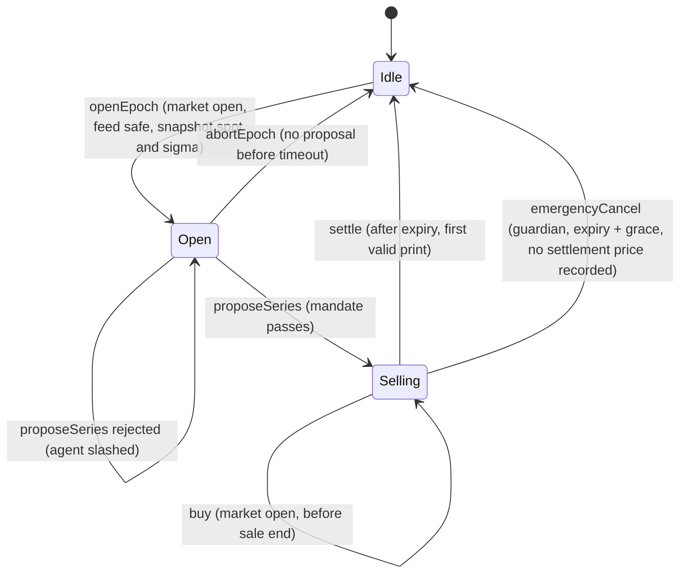

# Strike design

This document is the contract-level specification. [PLAN.md](PLAN.md) says what we build and why; this file says exactly how it behaves. Code, tests and this document must agree; when they disagree, fix the one that is wrong and log it in [decisions.md](decisions.md).

## 1. Actors and contracts

| Contract                           | Role                                                                                                                                                                                                |
| ---------------------------------- | --------------------------------------------------------------------------------------------------------------------------------------------------------------------------------------------------- |
| `StrikeVault`                      | ERC-4626 vault (EIP-1167 clone). Holds collateral: the stock token (call vault) or USDG (put vault). Queues deposits and redemptions while an epoch runs. Distributes USDG premium to shareholders. |
| `VaultFactory`                     | Deploys vault clones and registers them with the `EpochManager`.                                                                                                                                    |
| `EpochManager`                     | The state machine: opens epochs, checks proposals, sells options, settles, pays option holders. The only address a vault accepts collateral moves from.                                             |
| `OptionToken`                      | ERC-1155. One id per series. Only the `EpochManager` mints and burns.                                                                                                                               |
| `MandateGuard`                     | Library. Pure check of a proposal against a vault's mandate. Returns a reason code instead of reverting.                                                                                            |
| `AgentRegistry`                    | Agents, their signer and payout addresses, ERC-8004 identity link, USDG bond, strikes and slashing.                                                                                                 |
| `FeeManager`                       | Performance-fee parameters and fee balances (pull payments).                                                                                                                                        |
| `SafeStockFeed`                    | Library. Every price read goes through it: staleness, pauses, corporate actions, decimals.                                                                                                          |
| `MarketCalendar`                   | NYSE trading calendar: DST-aware open/close times plus an admin-maintained holiday list.                                                                                                            |
| `BlackScholesRef` / `StylusPricer` | `IPricer` implementations. Identical integer algorithm in Solidity and Rust.                                                                                                                        |

Roles (OpenZeppelin `AccessControl`): `DEFAULT_ADMIN_ROLE` (config, allow-list), `GUARDIAN_ROLE` (pause, emergency cancel), `KEEPER_ROLE` (volatility updates, opening epochs). Each vault also has a `curator` (who created it) who can change the vault's agent.

## 2. Units

| Quantity                             | Unit                                         | Notes                                                                                                  |
| ------------------------------------ | -------------------------------------------- | ------------------------------------------------------------------------------------------------------ |
| Prices, strikes, premiums per option | WAD (1e18 = $1) per **raw** token            | Same unit as the Chainlink stock feed, normalised from the feed's decimals                             |
| Option amounts                       | Underlying token base units                  | `10^underlyingDecimals` = one option on one raw token                                                  |
| Call collateral                      | Underlying token                             | One raw token per option                                                                               |
| Put collateral, premium, fees, bonds | USDG base units                              | Decimals read on-chain (6 on Robinhood testnet)                                                        |
| Volatility                           | WAD, annualised                              | Admin bounds per underlying; a keeper `setSigma` moves it at most 25% per update, at most once an hour |
| Time                                 | Seconds; `T` in years = seconds / 31,536,000 |                                                                                                        |

USDG is treated as exactly $1. Conversions from WAD USD to USDG round **up** when the vault receives (collateral required, premium owed by a buyer) and **down** when the vault pays (payouts). Every rounding favours the vault.

### Why strikes are per raw token

ERC-8056 stock tokens keep raw balances fixed and express splits and dividends through `uiMultiplier` (UI balance = raw balance × multiplier). The Chainlink feed for a stock token already prices one raw token, multiplier included. Strikes, spot and payouts are therefore all per raw token, and a split changes neither the feed price nor the strike. **We never multiply a Chainlink price by `uiMultiplier`.** The app divides by the multiplier only to _display_ a per-share price.

## 3. Epoch lifecycle



| Phase                                                             | What happens                                                                                                                                                                                                                                                                                                                                                                                                                                                                                                                                                                                                                                                                                                                  | Who can call          |
| ----------------------------------------------------------------- | ----------------------------------------------------------------------------------------------------------------------------------------------------------------------------------------------------------------------------------------------------------------------------------------------------------------------------------------------------------------------------------------------------------------------------------------------------------------------------------------------------------------------------------------------------------------------------------------------------------------------------------------------------------------------------------------------------------------------------- | --------------------- |
| Idle                                                              | Vault unlocked: ERC-4626 `deposit`/`mint`/`withdraw`/`redeem` work instantly, up to the TVL cap.                                                                                                                                                                                                                                                                                                                                                                                                                                                                                                                                                                                                                              | anyone                |
| `openEpoch(vault)`                                                | Requires Idle, not paused, market open, feed safe. Snapshots spot and the underlying's sigma (`epochs(vault)` returns `state, openedAt, seriesId, openSpot, openSigma`). Locks the vault (**lock**): from now until settlement every deposit or redemption is queued.                                                                                                                                                                                                                                                                                                                                                                                                                                                         | vault agent or keeper |
| `proposeSeries(vault, strike, expiry, size, premiumBps)`          | Checks the proposal with `MandateGuard` against the opening snapshot (spot and sigma) and Black-Scholes fair value, so a sigma update or a new print after `openEpoch` cannot change the verdict. The live feed must still be healthy (otherwise the call reverts). Pass: creates the series, state Selling, unless live spot has crossed the strike since the snapshot, in which case it reverts with `StrikeInTheMoney(strike, spot)` (no slash, nothing sold in the money). Fail: emits `ProposalRejected(reason)`, slashes the agent's bond to the vault's depositors and adds a strike. It does not revert, so the slash sticks. `previewProposal` gives the same verdict while the epoch is Open.                       | vault agent's signer  |
| `proposeByDelta(vault, targetDeltaBps, expiry, size, premiumBps)` | Solves the strike for the target delta (Stylus pricer) from the snapshot's spot and sigma and the tenor at execution, rounds it to a whole cent toward the middle of the mandate's delta band (target in the upper half of the band: calls round up, puts down; lower half: the opposite), then runs `proposeSeries`. A target inside the band, on the edges included, is never slashed for its delta. The SDK's `roundStrikeToCent` reproduces the rounding.                                                                                                                                                                                                                                                                 | vault agent's signer  |
| `buy(seriesId, amount, maxPremium, to)`                           | Requires Selling, not paused, market open, feed safe, before sale end. Premium per option = `max(fair × premiumBps, intrinsic)`, where fair value (current sigma) and intrinsic value use spot moved against the buyer by the token's `spotBufferBps` (calls: `S × (1 + b)`, puts: `S × (1 − b)`). The price is oracle-anchored, not fixed, so a moving spot cannot be arbitraged against a stale quote, and the buffer covers the lag between the market and the last feed print. Collateral for the new options is locked; the premium is escrowed in the manager until settlement. Mints ERC-1155.                                                                                                                         | anyone                |
| `settle(vault, roundId)`                                          | After expiry. Uses the price `StockOracle` has recorded for (token, expiry); if none is recorded yet, it records it from `roundId`, the first feed round at or after expiry, which the contract verifies (SafeStockFeed rule 10). When one round is not enough (round 1 of a new Chainlink phase, or a print inside a corporate-action window), anyone first calls `StockOracle.recordSettlementPriceWithHints(token, expiry, hints)`; `settle` then uses the recorded price and ignores `roundId`. Computes the payout, moves it from the vault to the manager for option holders, pays the performance fee, sends the net premium to the vault, processes the queue, unlocks. With nothing sold it settles without a price. | anyone                |
| `redeem(seriesId, amount, to)`                                    | After settlement: burns options and pays `amount × payoutPerOption` (pull payment).                                                                                                                                                                                                                                                                                                                                                                                                                                                                                                                                                                                                                                           | option holder         |
| `abortEpoch(vault)`                                               | Open state, no proposal after `proposalTimeout`: unlock and process the queue.                                                                                                                                                                                                                                                                                                                                                                                                                                                                                                                                                                                                                                                | anyone                |
| `emergencyCancel(vault)`                                          | Selling, `expiry + settlementGrace` passed, still unsettled (feed dead). Reverts with `SettlementAvailable(price)` if the oracle has a settlement price for (token, expiry): then `settle` works and must be used. Collateral goes back to the vault; buyers redeem their premium instead of a payout.                                                                                                                                                                                                                                                                                                                                                                                                                        | guardian              |

Expiry must be 16:00 New York time on an NYSE trading day, inside the vault's tenor limits. Sales stop `saleCutoff` before expiry.

## 4. Settlement formulas

Let `S` be the settlement price and `K` the strike (both WAD, per raw token), `n` the options sold (underlying base units), `u = 10^underlyingDecimals`.

**Call (covered, physically backed, cash-settled in the stock token)**

```
payoutPerOption (fraction of one token, WAD) = S > K ? (S − K) × 1e18 / S : 0      (rounded down)
payout (underlying base units)               = n × payoutPerOption / 1e18          (rounded down)
```

A holder of `a` options receives `a × payoutPerOption / 1e18` tokens, worth `a/u × (S − K)` dollars at `S`. Collateral locked is `n` tokens, and `(S − K)/S < 1`, so **payout < collateral always**.

**Put (cash-secured, settled in USDG)**

```
payoutPerOption (USDG per option, WAD USD) = K > S ? K − S : 0
payout (USDG base units) = n × payoutPerOption / u, converted WAD→USDG, rounded down
collateral locked        = n × K / u,              converted WAD→USDG, rounded up
```

Since `K − S ≤ K`, **payout ≤ collateral always**, even if `S = 0`.

**Premium and fee.** Premiums are held in the manager during the epoch. At settlement:

```
payoutValue (USDG) = call: payout × S converted to USDG ;  put: payout
pnl                = premium − payoutValue
fee                = pnl > 0 ? pnl × perfFeeBps / 10_000 : 0
agentFee           = fee × agentShareBps / 10_000        → agent's payout address
treasuryFee        = fee − agentFee                      → treasury
toDepositors       = premium − fee                       → vault premium accumulator
```

Depositors receive premium in USDG through a per-share accumulator (claimable at any time), in both vault types. The asset side (collateral) compounds or shrinks only with settlement payouts.

## 5. Vault accounting

- `totalAssets()` is internal accounting (`managedAssets`), never `balanceOf`, so donations cannot move the share price.
- Queued deposits (`requestDeposit`) are held outside `managedAssets` until the epoch settles; queued redemptions (`requestRedeem`) escrow shares in the vault.
- At settlement, in this order:
  1. payout leaves `managedAssets`;
  2. net premium is distributed over the current supply (escrowed redeem shares included, because they carried that epoch's risk);
  3. the price per share `(assets, supply)` is snapshotted for the epoch;
  4. escrowed redeem shares are burned and their assets moved to `reservedRedeemAssets`;
  5. queued deposits mint shares to the vault for their owners to claim;
  6. the vault unlocks.
- Claims are lazy: `claimDeposit` / `claimRedeem` use the snapshot of the epoch the request belonged to. A deposit claim also credits the premium those shares earned while held by the vault; a redeem claim adds the premium of the epoch it exited in.
- All conversions round in the vault's favour (OpenZeppelin `Math.mulDiv` with `Rounding.Floor` on the way out).
- **For integrators:** while an epoch runs, `totalAssets()` and `convertToAssets` ignore the open series. They do not subtract what the vault may owe option holders (a deep in-the-money call can already owe a large share of the collateral) and do not include the premium escrowed in the manager. Shares stay transferable while the vault is locked, so do not price them with `convertToAssets` alone during an epoch. To mark the open series, read `getSeries(seriesId)` on the `EpochManager` (`collateral` is what is locked, `sold` the options outstanding) and use `quoteBuy(seriesId, sold)` as an estimate of the liability's value.

## 6. Invariants

These are the Foundry invariant suite (`contracts/test/invariant/`). Each must hold after any sequence of calls.

1. **Collateral covers payouts.** For every live series: `lockedCollateral ≥ maxPayout(sold)` (call: `sold`; put: `sold × K`), and `lockedCollateral ≤ managedAssets`.
2. **Share accounting.** `convertToAssets(totalSupply) ≤ totalAssets ≤ convertToAssets(totalSupply) + 1` (rounding only).
3. **No leakage while locked.** While a vault is locked, `managedAssets` changes only inside `settle`, and the asset balance of the vault is at least `managedAssets + pendingDeposits + reservedRedeemAssets` (+ premium owed, for put vaults).
4. **Single settlement.** A series settles at most once; `settled` never flips back; the settlement price for a (feed, expiry) pair never changes once set.
5. **Solvency to option holders.** Manager balance of each payout token ≥ Σ unredeemed payouts (and refundable premiums).
6. **Premium solvency.** Vault USDG balance ≥ Σ claimable and accrued premium of all holders.
7. **Rounding never lowers share price.** Deposits and withdrawals alone never decrease `totalAssets / totalSupply`.

## 7. SafeStockFeed rules

Every read returns a WAD price per raw token or reverts with a named error. There is also a non-reverting `status()` for the app and agents.

| #   | Rule                                                                                                                                                                                                                                                                                                                                                                                                                                                                                                                                                                                                                                                                        | Error                                                                             |
| --- | --------------------------------------------------------------------------------------------------------------------------------------------------------------------------------------------------------------------------------------------------------------------------------------------------------------------------------------------------------------------------------------------------------------------------------------------------------------------------------------------------------------------------------------------------------------------------------------------------------------------------------------------------------------------------- | --------------------------------------------------------------------------------- |
| 1   | Answer must be positive                                                                                                                                                                                                                                                                                                                                                                                                                                                                                                                                                                                                                                                     | `InvalidPrice(answer)`                                                            |
| 2   | `updatedAt` must not be in the future                                                                                                                                                                                                                                                                                                                                                                                                                                                                                                                                                                                                                                       | `InvalidPrice`                                                                    |
| 3   | `block.timestamp − updatedAt ≤ maxPriceAge` (latest reads)                                                                                                                                                                                                                                                                                                                                                                                                                                                                                                                                                                                                                  | `StalePrice(updatedAt, maxAge)`                                                   |
| 4   | Token not paused                                                                                                                                                                                                                                                                                                                                                                                                                                                                                                                                                                                                                                                            | `TokenPaused(token)`                                                              |
| 5   | Oracle side not paused                                                                                                                                                                                                                                                                                                                                                                                                                                                                                                                                                                                                                                                      | `FeedPaused(token)`                                                               |
| 6   | No corporate action in progress (latest reads): if a new `uiMultiplier` is scheduled, block until `effectiveAt + corporateActionGrace`. Settlement: see rule 10                                                                                                                                                                                                                                                                                                                                                                                                                                                                                                             | `CorporateActionPending(effectiveAt)`                                             |
| 7   | Price used as-is: never multiplied by `uiMultiplier`                                                                                                                                                                                                                                                                                                                                                                                                                                                                                                                                                                                                                        | (by construction; fork test proves feed × raw balance = UI balance × share price) |
| 8   | Decimals normalised once from `feed.decimals()` to WAD                                                                                                                                                                                                                                                                                                                                                                                                                                                                                                                                                                                                                      | (by construction)                                                                 |
| 9   | Market-hours gate for opening and selling (`MarketCalendar.isMarketOpen`)                                                                                                                                                                                                                                                                                                                                                                                                                                                                                                                                                                                                   | `MarketClosed(timestamp)`                                                         |
| 10  | Settlement uses the **first** round with `updatedAt ≥ expiry`, proven by hints. `hints[0]`: `updatedAt ≥ expiry` and, inside a phase, `round(hints[0] − 1).updatedAt < expiry`. Round ids are `phase << 64 \| aggregatorRound`: for round 1 of phase p > 1 the next hint must be the last round of phase p − 1, which predates expiry and has no successor. Round 1 of the first phase has no predecessor and must be within `maxPriceAge` of expiry. If the chosen print is within `corporateActionGrace` of the token's ERC-8056 `effectiveAt`, the target moves to `effectiveAt + grace` and the remaining hints prove the first round at or after it, by the same rules | `InvalidSettlementRound(roundId)`, `MissingHint(index)`                           |
| 11  | Optional L2 sequencer-uptime feed: sequencer up and past its grace period                                                                                                                                                                                                                                                                                                                                                                                                                                                                                                                                                                                                   | `SequencerDown()`                                                                 |

## 8. Mandate

Set once at vault creation and immutable, so depositors know exactly what the agent may do. `MandateGuard.validate` rejects a mandate (`InvalidMandate`) outside the protocol limits: `minDeltaBps ≤ maxDeltaBps ≤ 10,000`, `0 < maxShareSoldBps ≤ 10,000`, `9,000 ≤ minPremiumBps ≤ 30,000`, `minYieldBps ≤ 10,000`, `0 < minTenor ≤ maxTenor ≤ 35 days`. The premium floor stops a curator from letting its own agent buy the vault's options for nothing.

Proposals are checked against the spot and sigma snapshotted at `openEpoch`; tenor is measured from the proposal's block.

| Field                        | Meaning                                                                                      | Rejection reason   |
| ---------------------------- | -------------------------------------------------------------------------------------------- | ------------------ |
| `minDeltaBps`, `maxDeltaBps` | Absolute Black-Scholes delta band (opening snapshot, tenor at proposal)                      | `DeltaOutOfBand`   |
| `minPremiumBps`              | `premiumBps` (price as % of fair value) must be at least this                                | `PremiumBelowFair` |
| `minYieldBps`                | Premium per option / collateral per option at proposal ≥ this (no selling worthless strikes) | `PremiumTooSmall`  |
| `maxShareSoldBps`            | `size ≤ capacity × maxShareSoldBps`                                                          | `SizeTooLarge`     |
| `minTenor`, `maxTenor`       | `expiry − now` within limits                                                                 | `TenorOutOfRange`  |
| —                            | Expiry must be an NYSE close                                                                 | `InvalidExpiry`    |
| —                            | Call strike above snapshot spot, put strike below it (out of the money)                      | `StrikeWrongSide`  |
| —                            | Premium factor at most 30,000 (3× fair value)                                                | `PremiumAboveCap`  |
| —                            | Size nonzero                                                                                 | `ZeroSize`         |

A proposal that passes these checks but whose strike live spot has crossed since the snapshot reverts with `StrikeInTheMoney`; it is not a rejection and nobody is slashed.

## 9. Agents

- Agents register with a signer, a payout address and optionally an ERC-8004 identity (verified with `ownerOf`). Reputation feedback (rejections and epoch PnL) is posted to ERC-8004 only while the agent's owner still holds that identity; after a transfer it is skipped (`ReputationFeedback` emits `posted = false`).
- An agent is **active** only with bond ≥ `minBond`, status Active and strikes < `maxStrikes`.
- A rejected proposal slashes `slashAmount` (capped at the bond) to the vault's depositors and adds a strike. Reaching `maxStrikes` suspends the agent.
- Unbonding takes `unbondDelay` (longer than an epoch), so an agent cannot misbehave and withdraw in the same week.
- Agents never touch vault funds; the worst a compromised agent key can do is propose within the mandate or burn its own bond. The curator can switch the vault's agent at any time; admins can suspend an agent globally.

## 10. Failure modes

| Situation                                | Behaviour                                                                                                                                                                                                                                                   |
| ---------------------------------------- | ----------------------------------------------------------------------------------------------------------------------------------------------------------------------------------------------------------------------------------------------------------- |
| Weekend or holiday at expiry             | `settle` waits for the first print after expiry (Monday open)                                                                                                                                                                                               |
| Chainlink aggregator upgrade (new phase) | Settlement still uses the first print at or after expiry, in whichever phase it is. Round 1 of a new phase needs the old phase's last round as a hint (`recordSettlementPriceWithHints`); the SDK finds it                                                  |
| Feed stale or paused at settlement time  | `settle` reverts; anyone retries later. Settlement is idempotent                                                                                                                                                                                            |
| Token paused                             | Selling and settlement wait; idle (unlocked) withdrawals still work                                                                                                                                                                                         |
| Split or dividend mid-epoch              | Strikes are per raw token, so nothing to adjust. Sales pause until `effectiveAt` + grace. If the first print after expiry is within grace of `effectiveAt`, settlement uses the first print at or after `effectiveAt + grace` instead (recorded with hints) |
| Feed dead after expiry                   | After `settlementGrace` the guardian can cancel: collateral back to the vault, premium back to buyers. Not possible once a settlement price is recorded (`SettlementAvailable`)                                                                             |
| No proposal                              | Anyone aborts after `proposalTimeout`                                                                                                                                                                                                                       |
| Nobody buys                              | Settles without a price                                                                                                                                                                                                                                     |
| Sequencer filtering / failed tx          | Anyone can call `settle` again                                                                                                                                                                                                                              |

## 11. v3 changes (branch `v3-contracts`, not deployed)

The live deployment runs the v2 contracts described above. The branch `v3-contracts` changes four things and adds a risk engine. They take effect only with a new deployment, because no contract is upgradeable.

### Performance fee high-water mark (D31)

`FeeManager` keeps `lossCarried[vault]`, in USDG. At each settlement, with `net = premium − payoutValue`:

| Epoch result        | Fee                                     | `lossCarried` after |
| ------------------- | --------------------------------------- | ------------------- |
| `net ≤ 0` (a loss)  | 0                                       | `carried + (−net)`  |
| `0 < net ≤ carried` | 0                                       | `carried − net`     |
| `net > carried`     | `(net − carried) × perfFeeBps / 10,000` | 0                   |

The agent's cut is `(net − carried) × perfFeeBps × agentShareBps / 10,000²`. Over any run of epochs, the fee base adds up to the highest cumulative net result the vault has reached, so total fees ≤ `perfFeeBps` × that high-water mark, and a fee is only charged in an epoch that ends at a new high. The 30% rate cap still applies to each epoch's own net premium.

- The carry belongs to the vault, not the agent. A new agent on a vault inherits the vault's unrecovered loss.
- Aborted and cancelled epochs call no fee function and leave the carry unchanged. Slashed bonds paid to depositors are not premium and do not reduce the carry.
- The carry lives in the `FeeManager`. If the admin points the `EpochManager` at a new `FeeManager` (`setFeeManager`), every vault starts again from zero.

Interface: `computeFee(vault, premium, payoutValue)` is the view. `chargeFee(vault, premium, payoutValue)` returns the same values and updates the carry; only `DEPOSITOR_ROLE` (the `EpochManager`) can call it, and `settle` calls it once per settled epoch. It emits `LossCarried(vault, lossCarried)` when the carry changes. The `fee` in `EpochSettled` is the fee actually charged.

A new invariant, `invariant_feeHighWaterMark`, checks that after any sequence of epochs, total fees ≤ `perfFeeBps` × max(0, highest cumulative net); each fee leaves total fees ≤ `perfFeeBps` × the cumulative net at that time; and `lossCarried` equals the high-water mark minus the cumulative net.

### Signer consent (D33)

A signer other than the caller must sign an EIP-712 consent, so nobody can bind someone else's address as a signer and block it. Domain: name `Strike AgentRegistry`, version `1`, the chain id and the registry address.

| Call                                                       | Signed struct                                                                             |
| ---------------------------------------------------------- | ----------------------------------------------------------------------------------------- |
| `register(signer, payout, erc8004Id, deadline, signature)` | `Register(address owner,address payout,uint256 erc8004Id,uint256 nonce,uint256 deadline)` |
| `setSigner(agentId, signer, deadline, signature)`          | `SetSigner(address owner,uint256 agentId,uint256 nonce,uint256 deadline)`                 |

`owner` is the caller. The nonce is the signer's (`nonces(signer)`) and is used up by a successful call, so a consent works once. A consent past its `deadline` reverts `ConsentExpired(deadline)`; a missing, malformed or wrong signature reverts `InvalidConsent(signer)`. When `signer == msg.sender` no signature is needed (pass `0` and empty bytes). Only EOA signers can consent (ECDSA). A contract can still be a signer by calling `register` itself, which also makes it the owner. `registerDigest` and `setSignerDigest` return the digest to sign at the signer's current nonce.

### Active agent for new vaults (D33)

`registerVault` (so `VaultFactory.createVault`) reverts `AgentNotActive(agentId)` unless the agent exists, has status Active, is bonded at least `minBond` and is under `maxStrikes`. `setVaultAgent` applies the same rule to any non-zero id. Id 0 stays allowed there: it detaches the vault so nobody can propose, which is the curator's stop switch when its agent's key leaks and no replacement agent is ready. Activity is checked when the agent is set, and every proposal checks it again, because a bond or status can change later. A vault may still use an agent its curator does not own (the open agent market).

### Mandate reason code (D33)

`MandateGuard.validate` reverts `InvalidMandate(uint8 reason)`, with the first rule broken in this order. The internal `MandateGuard.mandateError(m)` returns the same code without reverting.

| Code | Name                | Rule broken                 |
| ---- | ------------------- | --------------------------- |
| 1    | `DeltaBandInverted` | `minDeltaBps > maxDeltaBps` |
| 2    | `DeltaAboveOne`     | `maxDeltaBps > 10,000`      |
| 3    | `ShareSoldZero`     | `maxShareSoldBps == 0`      |
| 4    | `ShareSoldAboveOne` | `maxShareSoldBps > 10,000`  |
| 5    | `PremiumBelowFloor` | `minPremiumBps < 9,000`     |
| 6    | `PremiumAboveCap`   | `minPremiumBps > 30,000`    |
| 7    | `YieldAboveOne`     | `minYieldBps > 10,000`      |
| 8    | `TenorZero`         | `minTenor == 0`             |
| 9    | `TenorInverted`     | `minTenor > maxTenor`       |
| 10   | `TenorAboveCap`     | `maxTenor > 35 days`        |

### Risk engine

The pricer gains a risk engine: greeks, implied volatility and the vault's payout under spot shocks. It lives in the same Stylus contract as the pricer (`stylus/pricer/src/risk.rs`, new entry points on the one program) and in Solidity in `RiskLib` (used by `BlackScholesRef`). Both run the same WAD integer operations in the same order and return identical results. `IRiskEngine` extends `IPricer` with the three functions below, and `EpochManager.pricer` is now typed `IRiskEngine` (an address in the ABI, as before). Model as §4 and the pricer: European options, r = 0, a 365-day year, T = seconds / 31,536,000.

| Function                                                    | Returns (WAD)                                                                                                                                                                    |
| ----------------------------------------------------------- | -------------------------------------------------------------------------------------------------------------------------------------------------------------------------------- |
| `greeks(spot, strike, timeToExpiry, sigma, isCall)`         | `delta` = N(d1) (call) or N(d1) − 1 (put); `gamma` = φ(d1) / (S σ √T), per $1 of spot; `vega` = S φ(d1) √T, per 1.00 of volatility; `theta` = −S φ(d1) σ / (2 √T) / 365, per day |
| `impliedVol(price, spot, strike, timeToExpiry, isCall)`     | `sigma` in [5%, 500%] at which `quote` returns `price`                                                                                                                           |
| `scenarioLoss(isCall, strike, sold, spot, int256[] shocks)` | `losses[i]`: the payout's USD value at spot × (1 + shocks[i]); `worst`: the largest                                                                                              |

Inputs and input errors of `greeks` are those of `quote`. Gamma, vega and theta are each one integer expression with a single rounding (`phi * 1e36 / (spot * volSqrtT)`, `spot * phi * sqrtT / 1e36`, `spot * phi * sigma / (sqrtT * 730 * 1e18)`), so they keep full precision down to the smallest spot. They are the option holder's greeks; a vault that sold `n` options is exposed to minus `n` times them.

**Implied volatility.** Newton's method on sigma inside a bracket [lo, hi] = [5%, 500%]. Each round evaluates the premium and vega at sigma, moves `hi` down (premium too high) or `lo` up, and takes the Newton step if it lands strictly inside the bracket, else bisects. It starts from the larger of the at-the-money approximation (time value × √(2π) / (S √T)) and the premium's inflection point in sigma, √(2 |ln(S/K)| / T), from which Newton converges monotonically (Manaster and Koehler, 1982). It stops when a step moves sigma by at most 1e-12, the bracket is that narrow, the premium is within spot / 1e15 of the target (the CDF's own accuracy; the last Newton step is still applied), or after 64 rounds. Ordinary inputs take 3–8 rounds; premiums below about 1e-10 of spot, where sigma barely moves the price, take up to about 30. Errors, as `PricerInputOutOfRange(which)`: the spot, strike and time codes of `quote`; **6** if `price` is not strictly between intrinsic value and the no-arbitrage cap (S for a call, K for a put), because no volatility produces it; **7** if the price is possible but needs a sigma outside [5%, 500%] (checked by pricing at both ends first; a price exactly at an end returns that end).

**Scenario loss.** `sold` is in options, WAD (1e18 = one option on one token). Each shock is a relative spot move in WAD (−0.3e18 = −30%) and must lie in (−100%, +1000%], else error **8**; shocked spot = spot × (1e18 ± |shock|) / 1e18, rounded down. The payout follows §4 with its rounding: a call pays `(S' − K) × 1e18 / S'` tokens per option, `sold × that / 1e18` tokens in all, valued at `tokens × S' / 1e18`; a put pays `sold × (K − S') / 1e18`. Spot and strike must be in the pricer's range (errors 1 and 2). An empty grid returns 0 and an empty array.

**At proposal.** For every accepted series, `EpochManager` emits `SeriesRisk(seriesId, delta, gamma, vega, theta)` right after `SeriesProposed`, from the epoch's opening spot and sigma and the tenor at proposal, the inputs `SeriesProposed`'s fair value and delta use (so its delta equals that delta). A rejected proposal emits none. It costs one more pricer call per accepted proposal.

**`RiskLens`.** A separate read-only contract (no state, no roles) with the live view, because the view would not fit in `EpochManager`: `RiskLens` is 5,107 bytes of runtime code and `EpochManager` has 1,041 bytes left under the 24,576-byte limit (23,535 bytes, +325 for `SeriesRisk`).

- `seriesRisk(seriesId)` uses the current SafeStockFeed spot (`EpochManager.spot`, so it reverts while the feed is unsafe), the underlying's current sigma, the time left, and `defaultShocks()`: −30% to +30% in 5% steps.
- `seriesRiskAt(seriesId, spot, sigma, shocks)` takes any spot, sigma and grid.
- Both return `spot`, `sigma`, `tenor` (0 once expired, and the greeks are then 0), per-option `delta`, `gamma`, `vega`, `theta`, the series' `sold` and `collateral`, the `shocks` and `losses`, `worstLoss`, `worstShock` (the first shock with the largest payout) and `worstPayout`: the payout at that shock in collateral units (tokens for a call, USDG for a put), rounded exactly as `settle` rounds it. `sold` is converted to WAD options with the token's decimals before calling the engine. Unknown series revert `SeriesUnknown(seriesId)`.
- The pricer is whatever `EpochManager.pricer` is, Solidity or Stylus. `Deploy.s.sol` deploys the lens and writes `riskLens` to the deployment file.

**Guarantees and tests.** `worstPayout ≤ collateral` for any spot and grid: a call pays less than one token per option and a put at most K per option, and collateral is locked per option at those amounts (§4). A new invariant, `invariant_worstCaseScenarioWithinCollateral` (number 11 in [testing.md](testing.md)), checks after every step of the random action sequences, for both vault types, that the worst payout over −99.99% … +1000% at the current feed price fits in the locked collateral in collateral units, and its USD value fits in the collateral's value at the shocked spot. `seriesRiskAt` at the settlement price with a zero shock returns exactly the payout `settle` then records (fuzzed). Rust and Solidity agree exactly on 410 generated vectors (`contracts/test/vectors/risk.json`) and in FFI differential fuzzing (values, rejections and error codes); `research/risk_reference.py` checks the vectors against mpmath at 50 digits (the largest greek error is 1.3e-15 of its scale). Round trip: pricing at sigma and solving back returns sigma within 1e-8 whenever vega is at least 1e-6 of spot, and always reproduces the premium.

**Stylus size.** The one Stylus program with the pricer and the risk engine is 23,530 bytes compressed, 1,046 under the 24,576-byte limit (v2: 15,574). Two things keep it there: `mul_wad` and `div_wad` are not inlined (dozens of inlined copies pushed it past the limit), and `exp_neg` reads its shift from the low limb instead of `to::<usize>()`, which pulled in panic formatting code. The `int256[]` argument of `scenarioLoss` alone costs about 4 KB of ABI decoding. Gas: [gas.md](gas.md).

### Not in v3

The owner index of agents that D33 also lists is not included. `AgentRegistered` already has `owner` as an indexed topic, so tools find an owner's agents from the logs or the subgraph.
